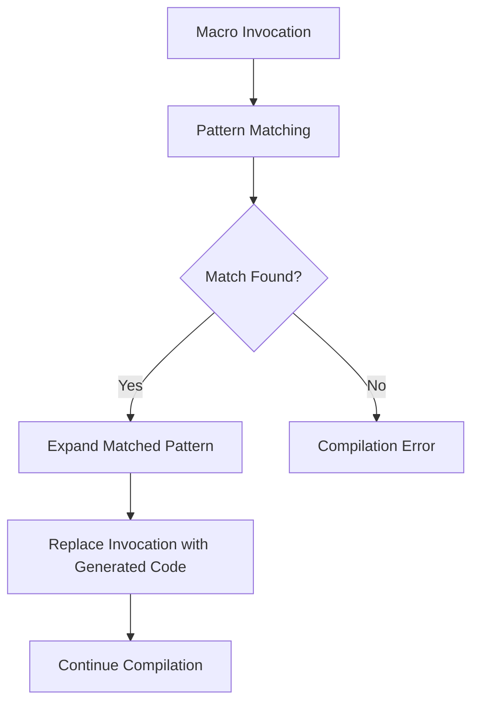

# Rust Declarative Macros

## Introduction

Have you ever found yourself writing similar code patterns over and over again in Rust? Wouldn't it be nice if you could define a pattern once and reuse it throughout your code? That's exactly what **declarative macros** allow you to do in Rust!

Declarative macros (sometimes called "macros by example" or simply "macros") are one of Rust's most powerful features. Unlike functions, which are executed at runtime, macros are expanded at compile time. They enable you to write code that writes code, a concept known as metaprogramming.

In this tutorial, we'll explore how to create and use declarative macros in Rust, starting with the basics and moving on to more advanced patterns.

## What Are Declarative Macros?

Declarative macros in Rust allow you to write code that generates other code. When you invoke a macro, the Rust compiler expands it into more code before compilation. You've probably already encountered macros like `println!`, `vec!`, and `assert!` in your Rust journey.

Declarative macros in Rust:
- Are defined using the `macro_rules!` construct
- Match against patterns and templates
- Generate code based on those patterns
- Are expanded at compile-time

Let's look at how they differ from functions:

| Functions | Declarative Macros |
|-----------|-------------------|
| Take a fixed number of parameters | Can take a variable number of parameters |
| Run at runtime | Expand at compile-time |
| Use strong type checking | Work with tokens and syntax patterns |
| Cannot generate new code | Generate code based on patterns |

## Basic Syntax of Declarative Macros

A declarative macro is defined using the `macro_rules!` construct. Here's the basic syntax:

```rust
macro_rules! macro_name {
    (pattern) => {
        // Code to generate when pattern matches
    };
    (another_pattern) => {
        // Alternative code to generate
    };
    // More patterns...
}
```

Let's create a simple "say_hello" macro to see this in action:

```rust
macro_rules! say_hello {
    () => {
        println!("Hello, World!");
    };
}

fn main() {
    say_hello!(); // Expands to println!("Hello, World!");
}
```

**Output:**
```
Hello, World!
```

In this example:
1. We define a macro called `say_hello` using `macro_rules!`
2. It matches an empty pattern `()`
3. When invoked, it expands to the code `println!("Hello, World!");`

## Macro Pattern Matching

The real power of declarative macros comes from their pattern-matching capabilities. Macros can match against different patterns and generate different code accordingly.

### Simple Parameters

Let's modify our `say_hello` macro to accept a name:

```rust
macro_rules! say_hello {
    () => {
        println!("Hello, World!");
    };
    ($name:expr) => {
        println!("Hello, {}!", $name);
    };
}

fn main() {
    say_hello!(); // Prints: Hello, World!
    say_hello!("Alice"); // Prints: Hello, Alice!
}
```

**Output:**
```
Hello, World!
Hello, Alice!
```

Here, `$name:expr` is a **matcher** that captures any Rust expression and binds it to the variable `$name`.

### Common Designators

Rust macros use designators to specify what kind of Rust syntax to match. Here are the most common ones:

- `expr`: Matches an expression (`2 + 2`, `"hello"`, `my_variable`)
- `ident`: Matches an identifier (variable or function name)
- `ty`: Matches a type (`i32`, `String`, `Vec<T>`)
- `path`: Matches a path (`std::vec::Vec`)
- `stmt`: Matches a statement
- `block`: Matches a block of code in braces `{}`
- `item`: Matches an item (function, struct, etc.)
- `pat`: Matches a pattern
- `meta`: Matches meta-information like attributes

Let's see an example using different designators:

```rust
macro_rules! create_function {
    ($func_name:ident) => {
        fn $func_name() {
            println!("You called {:?}()", stringify!($func_name));
        }
    };
}

create_function!(my_function);

fn main() {
    my_function();
}
```

**Output:**
```
You called "my_function"()
```

In this example, `$func_name:ident` captures an identifier, which we use to generate a function with that name.

## Repetition in Macros

One of the most powerful features of macros is the ability to handle repetition. This is done using the following syntax:

- `$(...)*` for matching zero or more repetitions
- `$(...)+` for matching one or more repetitions
- `$(...),*` for matching zero or more comma-separated repetitions
- `$(...),+` for matching one or more comma-separated repetitions

Let's implement a simplified version of the `vec!` macro:

```rust
macro_rules! my_vec {
    () => {
        Vec::new()
    };
    ($($element:expr),*) => {
        {
            let mut temp_vec = Vec::new();
            $(
                temp_vec.push($element);
            )*
            temp_vec
        }
    };
}

fn main() {
    let v1: Vec<i32> = my_vec![];
    let v2 = my_vec![1, 2, 3, 4, 5];
    
    println!("v1: {:?}", v1);
    println!("v2: {:?}", v2);
}
```

**Output:**
```
v1: []
v2: [1, 2, 3, 4, 5]
```

In this example:
1. `$($element:expr),*` matches zero or more comma-separated expressions
2. In the expansion, `$(temp_vec.push($element);)*` repeats the `push` call for each matched expression

## Real-World Examples

Let's look at some practical examples of how declarative macros can solve real-world problems.

### Example 1: Custom Debug Macro

This macro provides a more readable debug output:

```rust
macro_rules! debug_print {
    ($var:ident) => {
        println!("{} = {:?}", stringify!($var), $var);
    };
}

fn main() {
    let name = "Alice";
    let age = 30;
    let numbers = vec![1, 2, 3];
    
    debug_print!(name);
    debug_print!(age);
    debug_print!(numbers);
}
```

**Output:**
```
name = "Alice"
age = 30
numbers = [1, 2, 3]
```

### Example 2: SQL-like Query Builder

This more complex example shows how macros can create domain-specific languages:

```rust
macro_rules! sql_query {
    (SELECT $($field:ident),+ FROM $table:ident WHERE $condition:expr) => {
        {
            let query = format!(
                "SELECT {} FROM {} WHERE {}",
                stringify!($($field),+).replace(" ", ""),
                stringify!($table),
                stringify!($condition)
            );
            query
        }
    };
}

fn main() {
    let query = sql_query!(SELECT id, name, email FROM users WHERE id > 100);
    println!("Generated SQL: {}", query);
}
```

**Output:**
```
Generated SQL: SELECT id,name,email FROM users WHERE id > 100
```

### Example 3: Property Builder for Structs

This macro generates getter and setter methods for struct fields:

```rust
macro_rules! make_properties {
    ($struct_name:ident, $($field:ident: $type:ty),+) => {
        struct $struct_name {
            $(
                $field: $type,
            )+
        }
        
        impl $struct_name {
            $(
                pub fn $field(&self) -> &$type {
                    &self.$field
                }
                
                paste::paste! {
                    pub fn [<set_ $field>](&mut self, value: $type) {
                        self.$field = value;
                    }
                }
            )+
        }
    };
}

// Note: This example requires the paste crate. In a real project,
// you would add 'paste = "1.0"' to your Cargo.toml

fn main() {
    // This would work with the paste crate included
    /* 
    make_properties!(Person, name: String, age: u32);
    
    let mut person = Person { name: "Alice".to_string(), age: 30 };
    println!("Name: {}, Age: {}", person.name(), person.age());
    
    person.set_age(31);
    println!("Updated age: {}", person.age());
    */
    
    // For demonstration, here's what the expanded code would look like:
    struct Person {
        name: String,
        age: u32,
    }
    
    impl Person {
        pub fn name(&self) -> &String {
            &self.name
        }
        
        pub fn set_name(&mut self, value: String) {
            self.name = value;
        }
        
        pub fn age(&self) -> &u32 {
            &self.age
        }
        
        pub fn set_age(&mut self, value: u32) {
            self.age = value;
        }
    }
    
    let mut person = Person { name: "Alice".to_string(), age: 30 };
    println!("Name: {}, Age: {}", person.name(), person.age());
    
    person.set_age(31);
    println!("Updated age: {}", person.age());
}
```

**Output:**
```
Name: Alice, Age: 30
Updated age: 31
```

## Visualizing Macro Expansion

Let's visualize how a declarative macro expands using a diagram:



## Best Practices for Declarative Macros

When creating and using declarative macros, consider these best practices:

1. **Start Simple**: Begin with simple patterns and gradually add complexity.
2. **Use Clear Documentation**: Document what your macro does, its parameters, and examples.
3. **Follow the Naming Convention**: End public macro names with an exclamation mark (`!`).
4. **Keep Macros Focused**: Each macro should have a single, well-defined purpose.
5. **Consider Using Functions First**: If a function can do the job, prefer it over a macro.
6. **Use Hygiene Techniques**: Be careful about variable name collisions.
7. **Test Thoroughly**: Macros can be hard to debug, so test them extensively.

## Debugging Macros

Debugging macros can be challenging. Here are some techniques to help:

1. **Use the `trace_macros!` Feature**: Enable with `#![feature(trace_macros)]` (in nightly Rust) to see how macros expand.
2. **Use the Cargo Expand Tool**: Install with `cargo install cargo-expand` and run `cargo expand` to see the expanded code.
3. **Start with Small Test Cases**: Test your macro with simple inputs before using it in complex scenarios.

## Advanced Techniques

### Recursive Macros

Macros can be recursive, calling themselves during expansion:

```rust
macro_rules! countdown {
    (0) => {
        println!("Blast off!");
    };
    ($n:expr) => {
        println!("{}...", $n);
        countdown!($n - 1);
    };
}

fn main() {
    countdown!(3);
}
```

**Output:**
```
3...
2...
1...
Blast off!
```

### Hygiene in Macros

Rust macros are "hygienic," meaning variables defined inside a macro don't conflict with variables in the scope where the macro is used. However, you should still be careful with variable names:

```rust
macro_rules! create_counter {
    () => {
        let counter = 0;
        println!("Counter initialized to: {}", counter);
    };
}

fn main() {
    let counter = 5;
    println!("Before macro: counter = {}", counter);
    
    create_counter!();
    
    println!("After macro: counter = {}", counter);  // Still 5
}
```

**Output:**
```
Before macro: counter = 5
Counter initialized to: 0
After macro: counter = 5
```

## Summary

Declarative macros are a powerful feature in Rust that allow you to:

- Write code that generates other code
- Reduce repetition and boilerplate
- Create domain-specific abstractions
- Implement compile-time logic

In this tutorial, we've covered:
1. The basic syntax and pattern-matching capabilities of declarative macros
2. How to use various designators to match different Rust syntax elements
3. Techniques for handling repetition in macros
4. Real-world examples and applications
5. Best practices and debugging techniques

While declarative macros are powerful, they're just one of Rust's metaprogramming capabilities. For even more complex scenarios, Rust also offers procedural macros, which we'll cover in another tutorial.

## Exercises

1. Create a macro that generates a function to calculate the factorial of a number.
2. Implement a macro that creates a HashMap with specified keys and values.
3. Build a macro that generates test functions for a given set of inputs and expected outputs.
4. Create a logging macro that includes the file name and line number.
5. Extend the SQL query macro to support JOIN operations.

## Additional Resources

- [The Rust Book: Macros](https://doc.rust-lang.org/book/ch19-06-macros.html)
- [The Little Book of Rust Macros](https://danielkeep.github.io/tlborm/book/index.html)
- [Rust By Example: Macros](https://doc.rust-lang.org/rust-by-example/macros.html)
- [Crate: `proc-macro-workshop`](https://github.com/dtolnay/proc-macro-workshop) for hands-on macro exercises
- [The Rust Reference: Macros](https://doc.rust-lang.org/reference/macros.html) for comprehensive documentation