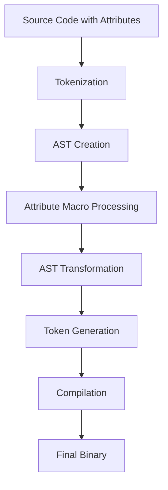

# Rust Attribute Macros

## Introduction

Attribute macros are a powerful feature in Rust's metaprogramming toolkit. They allow you to attach custom functionality to items in your code, such as functions, structs, or even entire modules. Unlike procedural macros that create new syntax, attribute macros modify existing code, making them perfect for adding boilerplate code, validation, or transformations without cluttering your codebase.

In this guide, we'll explore how attribute macros work, how to use existing ones, and even how to create your own. By the end, you'll have a solid understanding of this advanced Rust feature and be able to leverage it in your projects.

## What Are Attribute Macros?

Attribute macros in Rust are a type of procedural macro that allow you to create custom attributes. These attributes can be applied to various items in your code and can transform those items in powerful ways.

You might already be familiar with some built-in Rust attributes like `#[derive(Debug)]`, `#[cfg(test)]`, or `#[deprecated]`. Attribute macros allow you to create your own custom attributes with similar syntax: `#[my_custom_attribute]`.

Here's what makes them special:

1. **Code Transformation**: They can analyze and transform the item they're attached to
2. **Compile-Time Execution**: They run during compilation, not at runtime
3. **Custom Annotations**: They provide a clean way to add metadata or behavior to your code

## Using Existing Attribute Macros

Before diving into creating our own attribute macros, let's look at how to use some popular existing ones.

### Example: Using the `serde` Attribute Macros

The `serde` crate provides serialization and deserialization functionality, and it makes heavy use of attribute macros:

```rust
use serde::{Serialize, Deserialize};

#[derive(Serialize, Deserialize)]
struct Person {
    #[serde(rename = "firstName")]
    first_name: String,
    
    #[serde(rename = "lastName")]
    last_name: String,
    
    #[serde(default)]
    age: Option<u8>,
}

fn main() {
    let person = Person {
        first_name: "John".to_string(),
        last_name: "Doe".to_string(),
        age: Some(30),
    };
    
    // Serialize to JSON
    let json = serde_json::to_string(&person).unwrap();
    println!("Serialized: {}", json);
    
    // Deserialize from JSON
    let deserialized: Person = serde_json::from_str(&json).unwrap();
    println!("Deserialized: {} {}, age: {:?}", 
        deserialized.first_name, 
        deserialized.last_name, 
        deserialized.age);
}
```

Output:
```
Serialized: {"firstName":"John","lastName":"Doe","age":30}
Deserialized: John Doe, age: Some(30)
```

In this example:
- `#[derive(Serialize, Deserialize)]` is a derive macro that implements the `Serialize` and `Deserialize` traits
- `#[serde(rename = "firstName")]` is an attribute macro that renames the field in the serialized output
- `#[serde(default)]` is an attribute macro that makes the field use its default value when missing during deserialization

### Example: Using the `rocket` Framework's Attribute Macros

The Rocket web framework uses attribute macros extensively to define routes:

```rust
#[macro_use] extern crate rocket;

#[get("/hello/<name>")]
fn hello(name: &str) -> String {
    format!("Hello, {}!", name)
}

#[post("/submit", data = "<data>")]
fn submit(data: String) -> String {
    format!("Received: {}", data)
}

#[launch]
fn rocket() -> _ {
    rocket::build()
        .mount("/", routes![hello, submit])
}
```

In this example:
- `#[get("/hello/<name>")]` defines a GET route with a dynamic parameter
- `#[post("/submit", data = "<data>")]` defines a POST route that accepts data
- `#[launch]` is an attribute macro that handles the launch of the Rocket application

## Creating Your Own Attribute Macros

Now let's explore how to create your own attribute macros. This requires setting up a separate crate for your macro code.

### Step 1: Set Up Your Macro Project

First, create a new library crate for your macro:

```bash
cargo new log_time_macro --lib
cd log_time_macro
```

Update your `Cargo.toml` to include necessary dependencies:

```toml
[lib]
proc-macro = true

[dependencies]
proc-macro2 = "1.0"
quote = "1.0"
syn = { version = "1.0", features = ["full"] }
```

### Step 2: Define Your Attribute Macro

We'll create a `log_time` attribute that logs how long a function takes to execute. Here's the implementation:

```rust
use proc_macro::TokenStream;
use quote::{quote, format_ident};
use syn::{parse_macro_input, ItemFn};

#[proc_macro_attribute]
pub fn log_time(_attr: TokenStream, item: TokenStream) -> TokenStream {
    // Parse the input function
    let input_fn = parse_macro_input!(item as ItemFn);
    
    // Extract function name and body
    let fn_name = &input_fn.sig.ident;
    let fn_inputs = &input_fn.sig.inputs;
    let fn_output = &input_fn.sig.output;
    let fn_block = &input_fn.block;
    let fn_vis = &input_fn.vis;
    
    // Generate new function with timing code
    let output = quote! {
        #fn_vis fn #fn_name(#fn_inputs) #fn_output {
            let start = std::time::Instant::now();
            
            // Call the original function body
            let result = {
                #fn_block
            };
            
            let duration = start.elapsed();
            println!("Function '{}' executed in: {:?}", stringify!(#fn_name), duration);
            
            result
        }
    };
    
    output.into()
}
```

### Step 3: Use Your Custom Attribute Macro

Now, in another project, you can use your macro:

```rust
// In your main project's Cargo.toml, add:
// [dependencies]
// log_time_macro = { path = "../log_time_macro" }

use log_time_macro::log_time;

#[log_time]
fn fibonacci(n: u32) -> u64 {
    match n {
        0 => 0,
        1 => 1,
        _ => fibonacci(n - 1) + fibonacci(n - 2),
    }
}

fn main() {
    let result = fibonacci(30);
    println!("Result: {}", result);
}
```

Output:
```
Function 'fibonacci' executed in: 0.000010s
Function 'fibonacci' executed in: 0.000009s
...
Function 'fibonacci' executed in: 1.325847s
Result: 832040
```

## How Attribute Macros Work

To better understand attribute macros, let's explore how they work under the hood:

1. **Tokenization**: The Rust compiler converts your code into tokens
2. **AST Creation**: The tokens are parsed into an Abstract Syntax Tree (AST)
3. **Macro Expansion**: Your attribute macro receives the AST of the item it's attached to
4. **Transformation**: Your macro transforms the AST as needed
5. **Code Generation**: The transformed AST is converted back into tokens
6. **Compilation**: The compiler continues with the modified code

This flow can be visualized as follows:



## Practical Applications

Attribute macros are incredibly versatile. Here are some practical use cases:

### 1. Custom Validation

```rust
use validator_macro::validate;

#[validate]
struct User {
    #[length(min = 3, max = 50)]
    username: String,
    
    #[email]
    email: String,
    
    #[regex(pattern = r"^(?=.*[A-Za-z])(?=.*\d)[A-Za-z\d]{8,}$")]
    password: String,
}

fn main() {
    let user = User {
        username: "john".to_string(),
        email: "john@example.com".to_string(),
        password: "password123".to_string(),
    };
    
    if let Err(errors) = user.validate() {
        println!("Validation errors: {:?}", errors);
    } else {
        println!("User is valid!");
    }
}
```

### 2. Automatic Resource Management

```rust
use resource_macro::cleanup;

struct Database {
    connection_string: String,
}

impl Database {
    fn new(conn_str: &str) -> Self {
        println!("Opening database connection to {}", conn_str);
        Database {
            connection_string: conn_str.to_string(),
        }
    }
    
    fn query(&self, query: &str) -> Vec<String> {
        println!("Executing query: {}", query);
        vec!["result1".to_string(), "result2".to_string()]
    }
    
    fn close(&self) {
        println!("Closing database connection to {}", self.connection_string);
    }
}

#[cleanup]
fn process_data() {
    let db = Database::new("localhost:5432"); // Will be automatically closed
    let results = db.query("SELECT * FROM users");
    
    for result in results {
        println!("Result: {}", result);
    }
}

fn main() {
    process_data();
}
```

### 3. Conditional Compilation and Feature Flags

```rust
use feature_macro::feature;

#[feature(premium_only)]
fn advanced_analysis(data: &[u32]) -> u32 {
    println!("Running advanced analysis");
    data.iter().sum()
}

#[feature(basic)]
fn basic_analysis(data: &[u32]) -> u32 {
    println!("Running basic analysis");
    *data.iter().max().unwrap_or(&0)
}

fn main() {
    let data = vec![1, 5, 3, 9, 2];
    
    #[cfg(feature = "premium")]
    let result = advanced_analysis(&data);
    
    #[cfg(not(feature = "premium"))]
    let result = basic_analysis(&data);
    
    println!("Analysis result: {}", result);
}
```

## Best Practices for Using Attribute Macros

When working with attribute macros, keep these best practices in mind:

1. **Documentation**: Always document what your attribute macro does and how it transforms the code
2. **Error Messages**: Provide clear error messages when the macro cannot be applied correctly
3. **Minimize Magic**: Don't make your macros too magical; keep transformations predictable
4. **Testing**: Write tests for your macros to ensure they work as expected
5. **Compatibility**: Consider how your macro will work with other macros and features

## Common Challenges and Solutions

### Handling Different Item Types

Sometimes you want your attribute to work on different items (functions, structs, etc.):

```rust
#[proc_macro_attribute]
pub fn my_attribute(attr: TokenStream, item: TokenStream) -> TokenStream {
    let input = parse_macro_input!(item as syn::Item);
    
    match input {
        syn::Item::Fn(func) => handle_function(attr, func),
        syn::Item::Struct(struct_item) => handle_struct(attr, struct_item),
        _ => {
            let error = syn::Error::new_spanned(
                proc_macro2::TokenStream::from(item.clone()),
                "This attribute can only be applied to functions or structs"
            );
            return error.to_compile_error().into();
        }
    }
}
```

### Accessing Attributes of Fields

When working with structs, you might need to access field attributes:

```rust
fn handle_struct(attr: TokenStream, struct_item: syn::ItemStruct) -> TokenStream {
    let struct_name = &struct_item.ident;
    
    // Process each field
    for field in &struct_item.fields {
        for attr in &field.attrs {
            if attr.path.is_ident("custom_field_attr") {
                // Process the custom field attribute
            }
        }
    }
    
    // Generate new struct
    // ...
}
```

## Summary

Attribute macros are a powerful feature in Rust that allow you to add custom functionality to your code through annotations. They enable:

- Code transformation at compile time
- Custom annotations for functions, structs, and other items
- Cleaner, more maintainable code by separating concerns
- Advanced metaprogramming capabilities

By mastering attribute macros, you'll be able to write more expressive, DRY (Don't Repeat Yourself) code and create powerful abstractions tailored to your specific needs.

## Additional Resources

- [The Rust Book: Procedural Macros](https://doc.rust-lang.org/book/ch19-06-macros.html)
- [The Rust Reference: Procedural Macros](https://doc.rust-lang.org/reference/procedural-macros.html)
- [syn crate documentation](https://docs.rs/syn/latest/syn/)
- [quote crate documentation](https://docs.rs/quote/latest/quote/)

## Exercises

1. Create an attribute macro `#[debug_fields]` that prints all fields of a struct when instantiated
2. Extend the `#[log_time]` macro to accept parameters like a custom message format
3. Create an attribute macro that automatically implements builder pattern for a struct
4. Create an attribute macro that adds serialization methods to an enum
5. Create an attribute macro that can be applied to a function to automatically retry it a specified number of times when it returns an error

Happy coding with Rust attribute macros!