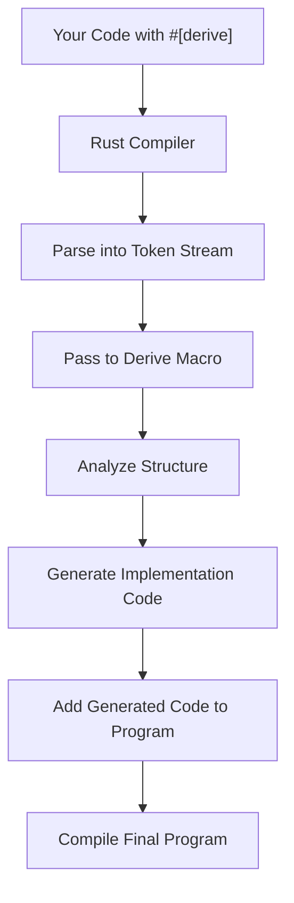

# Rust Derive Macros

## Introduction

If you've been coding in Rust for even a short time, you've likely encountered code like this:

```rust
#[derive(Debug, Clone, PartialEq)]
struct Point {
    x: i32,
    y: i32,
}
```

The `#[derive(...)]` attribute is one of Rust's most powerful features, allowing you to automatically implement traits for your data structures. But what exactly is happening behind the scenes? How do derive macros work, and how can you create your own?

In this tutorial, we'll explore Rust derive macros in detail - from using built-in derive macros to creating custom ones for your projects.

## What Are Derive Macros?

Derive macros are a special type of procedural macro in Rust that allow you to automatically implement traits for your custom data types. They work by generating code at compile time, saving you from writing boilerplate implementations.

The `#[derive(...)]` attribute is placed above a struct, enum, or union declaration and tells the Rust compiler to automatically implement the specified traits for that type.

### How Derive Macros Differ from Other Macros

Rust has several types of macros:

1. **Declarative macros** (`macro_rules!`) - Pattern-matching macros that look like function calls
2. **Procedural macros** - More powerful macros that operate on the token stream of Rust code
   - **Function-like macros** - Look like function calls but operate at compile time
   - **Attribute macros** - Define custom attributes to attach to items
   - **Derive macros** - Automatically implement traits for data structures

Derive macros are special because they focus specifically on implementing traits for data types, making them perfect for reducing repetitive code.

## Using Built-in Derive Macros

Rust's standard library provides many useful derive macros that you can use right away:

### Common Built-in Derive Macros

#### Debug

The `Debug` trait enables formatted debug output with the `{:?}` formatting specifier:

```rust
#[derive(Debug)]
struct Person {
    name: String,
    age: u8,
}

fn main() {
    let person = Person {
        name: String::from("Alice"),
        age: 30,
    };
    
    println!("{:?}", person); // Output: Person { name: "Alice", age: 30 }
}
```

#### Clone and Copy

These traits allow you to duplicate values:

```rust
#[derive(Debug, Clone, Copy)]
struct Point {
    x: i32,
    y: i32,
}

fn main() {
    let p1 = Point { x: 10, y: 20 };
    let p2 = p1; // Would move p1 without Copy
    
    println!("p1: {:?}", p1); // Still accessible because of Copy
    println!("p2: {:?}", p2);
    
    let p3 = p1.clone(); // Explicitly clone
    println!("p3: {:?}", p3);
}
```

> **Note:** `Copy` can only be derived if all fields are `Copy`. Types like `String` and `Vec` are not `Copy`.

#### PartialEq and Eq

These traits enable equality comparisons:

```rust
#[derive(Debug, PartialEq, Eq)]
struct Car {
    make: String,
    model: String,
    year: u16,
}

fn main() {
    let car1 = Car {
        make: String::from("Toyota"),
        model: String::from("Corolla"),
        year: 2020,
    };
    
    let car2 = Car {
        make: String::from("Toyota"),
        model: String::from("Corolla"),
        year: 2020,
    };
    
    let car3 = Car {
        make: String::from("Honda"),
        model: String::from("Civic"),
        year: 2021,
    };
    
    println!("car1 == car2: {}", car1 == car2); // true
    println!("car1 == car3: {}", car1 == car3); // false
}
```

#### Default

The `Default` trait provides default values for a type:

```rust
#[derive(Debug, Default)]
struct Configuration {
    hostname: String,
    port: u16,
    max_connections: usize,
    timeout_seconds: u64,
}

fn main() {
    // Use all defaults
    let config1 = Configuration::default();
    println!("Default config: {:?}", config1);
    
    // Use defaults for some fields
    let config2 = Configuration {
        port: 8080,
        ..Configuration::default()
    };
    println!("Custom port config: {:?}", config2);
}
```

#### Hash

The `Hash` trait enables hashing for use with `HashMap` and `HashSet`:

```rust
use std::collections::HashMap;

#[derive(Debug, PartialEq, Eq, Hash)]
struct Student {
    id: u32,
    name: String,
}

fn main() {
    let mut grades = HashMap::new();
    
    let alice = Student {
        id: 1,
        name: String::from("Alice"),
    };
    
    let bob = Student {
        id: 2,
        name: String::from("Bob"),
    };
    
    grades.insert(alice, 95);
    grades.insert(bob, 87);
    
    println!("Grades: {:?}", grades);
}
```

## How Derive Macros Work

When you use a derive macro, the Rust compiler:

1. Parses your struct or enum definition into a token stream
2. Passes this token stream to the derive macro implementation
3. The macro analyzes the structure and generates code to implement the trait
4. The generated code is included in your program at compile time

Let's see a simplified visualization of this process:



## Creating Custom Derive Macros

Creating your own derive macros requires a bit more setup, but it's incredibly powerful for reducing boilerplate in your codebase.

### Example: Creating a SimpleLogger Derive Macro

Let's create a `SimpleLogger` trait and a derive macro for it. Our trait will provide a simple `log()` method that prints the struct's fields.

#### Step 1: Project Setup

You'll need two crates:
1. A "proc-macro" crate that defines the macro
2. A main crate that exports the trait definition and re-exports the derive macro

First, create a new workspace:

```toml
# Cargo.toml
[workspace]
members = [
    "simple_logger",
    "simple_logger_derive",
]
```

#### Step 2: Create the Trait Definition Crate

```rust
// simple_logger/src/lib.rs
pub trait SimpleLogger {
    fn log(&self);
}

// Re-export the derive macro
pub use simple_logger_derive::SimpleLogger;
```

```toml
# simple_logger/Cargo.toml
[package]
name = "simple_logger"
version = "0.1.0"
edition = "2021"

[dependencies]
simple_logger_derive = { path = "../simple_logger_derive" }
```

#### Step 3: Create the Derive Macro Crate

```toml
# simple_logger_derive/Cargo.toml
[package]
name = "simple_logger_derive"
version = "0.1.0"
edition = "2021"

[lib]
proc-macro = true

[dependencies]
syn = "1.0"
quote = "1.0"
proc-macro2 = "1.0"
```

```rust
// simple_logger_derive/src/lib.rs
use proc_macro::TokenStream;
use quote::quote;
use syn::{parse_macro_input, Data, DeriveInput, Fields};

#[proc_macro_derive(SimpleLogger)]
pub fn derive_simple_logger(input: TokenStream) -> TokenStream {
    // Parse the input tokens into a syntax tree
    let input = parse_macro_input!(input as DeriveInput);
    let name = &input.ident;
    
    // Extract the fields from the struct
    let fields = match &input.data {
        Data::Struct(data) => {
            match &data.fields {
                Fields::Named(fields) => {
                    fields.named.iter().map(|f| {
                        let field_name = &f.ident;
                        quote! {
                            .field(stringify!(#field_name), &self.#field_name)
                        }
                    }).collect::<Vec<_>>()
                },
                _ => panic!("SimpleLogger only supports structs with named fields"),
            }
        },
        _ => panic!("SimpleLogger only supports structs with named fields"),
    };
    
    // Generate the implementation
    let expanded = quote! {
        impl SimpleLogger for #name {
            fn log(&self) {
                println!("{} {{", stringify!(#name));
                println!("  {}",
                    std::fmt::Debug::format(&self)
                        .to_string()
                        .trim_start_matches(stringify!(#name))
                        .trim_start_matches(" { ")
                        .trim_end_matches(" }")
                        .replace(", ", ",
  ")
                );
                println!("}}");
            }
        }
    };
    
    // Return the generated code as a token stream
    TokenStream::from(expanded)
}
```

#### Step 4: Using Your Custom Derive Macro

Now you can use your custom derive macro in your code:

```rust
use simple_logger::SimpleLogger;

#[derive(Debug, SimpleLogger)]
struct User {
    id: u32,
    name: String,
    email: String,
    active: bool,
}

fn main() {
    let user = User {
        id: 1,
        name: String::from("John Doe"),
        email: String::from("john@example.com"),
        active: true,
    };
    
    user.log();
}
```

Output:
```
User {
  id: 1,
  name: "John Doe",
  email: "john@example.com",
  active: true
}
```

## Advanced Derive Macro Techniques

### Attribute Parameters

You can enhance your derive macros with additional parameters:

```rust
#[derive(SimpleLogger)]
#[logger(prefix = "USER_LOG")]
struct User {
    // fields...
}
```

This requires additional parsing logic in your macro.

### Conditional Trait Implementation

Your derive macro can conditionally implement traits based on the fields or other attributes:

```rust
#[proc_macro_derive(MyTrait, attributes(option))]
pub fn derive_my_trait(input: TokenStream) -> TokenStream {
    // Parse input
    let input = parse_macro_input!(input as DeriveInput);
    
    // Check for specific attributes
    let has_special_option = input.attrs.iter()
        .any(|attr| attr.path.is_ident("option"));
    
    // Generate different implementations based on conditions
    if has_special_option {
        // Generate one implementation
    } else {
        // Generate another implementation
    }
    
    // Return the implementation
}
```

### Supporting Enums

To support enums in your derive macros, you'll need to handle variants:

```rust
#[proc_macro_derive(MyTrait)]
pub fn derive_my_trait(input: TokenStream) -> TokenStream {
    let input = parse_macro_input!(input as DeriveInput);
    
    match &input.data {
        Data::Struct(data) => {
            // Handle struct
        },
        Data::Enum(data) => {
            // Handle enum variants
            for variant in &data.variants {
                // Process each variant
            }
        },
        Data::Union(_) => {
            // Handle union
        }
    }
    
    // Generate and return implementation
}
```

## Real-World Applications

Derive macros are used extensively in the Rust ecosystem:

### Serde for Serialization and Deserialization

The Serde library uses derive macros for implementing serialization and deserialization:

```rust
use serde::{Serialize, Deserialize};

#[derive(Serialize, Deserialize, Debug)]
struct Config {
    server: String,
    port: u16,
    database: DatabaseConfig,
}

#[derive(Serialize, Deserialize, Debug)]
struct DatabaseConfig {
    url: String,
    username: String,
    password: String,
}

fn main() -> Result<(), Box<dyn std::error::Error>> {
    // Deserialize from JSON
    let json = r#"
        {
            "server": "127.0.0.1",
            "port": 8080,
            "database": {
                "url": "postgres://localhost/mydb",
                "username": "admin",
                "password": "password123"
            }
        }
    "#;
    
    let config: Config = serde_json::from_str(json)?;
    println!("Deserialized: {:?}", config);
    
    // Serialize back to JSON
    let serialized = serde_json::to_string_pretty(&config)?;
    println!("Serialized:
{}", serialized);
    
    Ok(())
}
```

### Builder Pattern with derive_builder

The `derive_builder` crate provides a derive macro for implementing the Builder pattern:

```rust
use derive_builder::Builder;

#[derive(Builder, Debug)]
#[builder(setter(into))]
struct HttpRequest {
    url: String,
    method: String,
    #[builder(default = "vec![]")]
    headers: Vec<(String, String)>,
    #[builder(default)]
    body: Option<String>,
    #[builder(default = "30")]
    timeout_seconds: u32,
}

fn main() -> Result<(), Box<dyn std::error::Error>> {
    let request = HttpRequestBuilder::default()
        .url("https://api.example.com/data")
        .method("GET")
        .header(("User-Agent", "MyClient/1.0"))
        .header(("Accept", "application/json"))
        .timeout_seconds(60)
        .build()?;
    
    println!("Request: {:?}", request);
    
    Ok(())
}
```

### Command-Line Arguments with clap

The `clap` crate uses derive macros to simplify command-line argument parsing:

```rust
use clap::Parser;

#[derive(Parser, Debug)]
#[clap(author, version, about)]
struct Args {
    /// Name of the person to greet
    #[clap(short, long)]
    name: String,
    
    /// Number of times to greet
    #[clap(short, long, default_value_t = 1)]
    count: u8,
    
    /// Whether to use loud greeting
    #[clap(long)]
    loud: bool,
}

fn main() {
    let args = Args::parse();
    
    let greeting = if args.loud {
        format!("HELLO, {}!", args.name.to_uppercase())
    } else {
        format!("Hello, {}", args.name)
    };
    
    for _ in 0..args.count {
        println!("{}", greeting);
    }
}
```

## Summary

Derive macros are one of Rust's most powerful features, enabling automatic trait implementation and drastically reducing boilerplate code. In this tutorial, we've explored:

- What derive macros are and how they differ from other macro types
- Using built-in derive macros like `Debug`, `Clone`, `PartialEq`, etc.
- How derive macros work behind the scenes
- Creating custom derive macros for your own traits
- Advanced techniques for more complex derive macros
- Real-world applications of derive macros in popular Rust crates

By understanding and leveraging derive macros, you can make your Rust code more concise, maintainable, and expressive.

## Additional Resources

- [The Rust Programming Language Book - Procedural Macros](https://doc.rust-lang.org/book/ch19-06-macros.html)
- [The syn crate documentation](https://docs.rs/syn/latest/syn/)
- [The quote crate documentation](https://docs.rs/quote/latest/quote/)
- [The proc-macro2 crate documentation](https://docs.rs/proc-macro2/latest/proc_macro2/)
- [Rust Reference - Procedural Macros](https://doc.rust-lang.org/reference/procedural-macros.html)

## Exercises

1. Modify the `SimpleLogger` derive macro to include the name of each field before its value in the output.

2. Create a `JsonSchema` derive macro that generates a JSON schema for a struct.

3. Implement a `NewType` derive macro that automatically implements common traits like `Deref`, `AsRef`, and `From` for newtype pattern structs.

4. Extend the `SimpleLogger` derive macro to support enums.

5. Create a `Validate` derive macro that generates validation methods based on field attributes like `#[validate(min = 0, max = 100)]`.