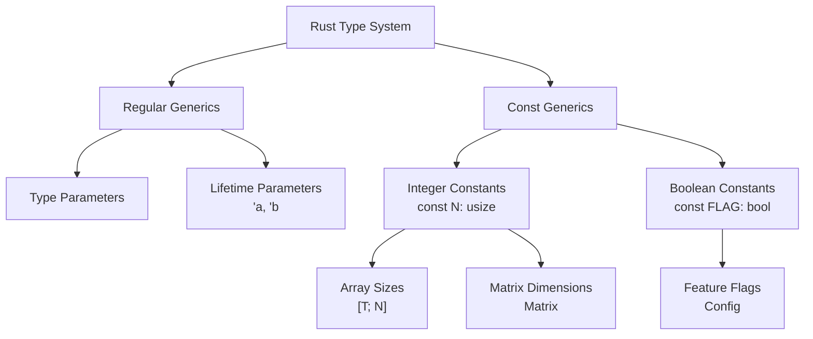

# Rust Const Generics

## Introduction

Const generics is a powerful Rust feature that allows you to parameterize types by compile-time constant values, not just by types. While regular generics let you write code that works with different types, const generics extend this concept to work with different constant values.

This feature was stabilized in Rust 1.51 and represents a significant enhancement to Rust's type system. It enables more expressive API designs, better performance through compile-time specialization, and helps eliminate runtime overhead for dimension-related calculations.

## Understanding Const Generics

### What Are Const Generics?

In simple terms, const generics allow you to use constant values as parameters in generic types, traits, and functions. This is particularly useful when working with fixed-size arrays, mathematical operations, or any situation where the size or dimension is important at compile time.

### Basic Syntax

The syntax for const generics extends Rust's existing generic syntax by allowing constants as parameters:

```rust
// Regular generic type parameter
fn process<T>(value: T) {}

// Const generic parameter
fn process_array<const N: usize>(array: [i32; N]) {}
```

In the second example, `N` is a const generic parameter that represents the size of the array. The function can now work with arrays of any size, but that size is known at compile time.

## Getting Started with Const Generics

### Basic Example: Fixed-Size Arrays

Let's start with a simple example that demonstrates how to use const generics with arrays:

```rust
fn print_array<const N: usize>(arr: [i32; N]) {
    println!("Array of length {}: {:?}", N, arr);
}

fn main() {
    let small = [1, 2, 3];
    let medium = [1, 2, 3, 4, 5];
    let large = [1, 2, 3, 4, 5, 6, 7, 8, 9, 10];
    
    print_array(small);
    print_array(medium);
    print_array(large);
}
```

**Output:**
```
Array of length 3: [1, 2, 3]
Array of length 5: [1, 2, 3, 4, 5]
Array of length 10: [1, 2, 3, 4, 5, 6, 7, 8, 9, 10]
```

Before const generics, you would need to create separate functions for different array sizes or use slices, which lose the size information at compile time.

### Creating Generic Data Structures

Let's create a simple Matrix type using const generics:

```rust
struct Matrix<const ROWS: usize, const COLS: usize> {
    data: [[f64; COLS]; ROWS],
}

impl<const ROWS: usize, const COLS: usize> Matrix<ROWS, COLS> {
    fn new() -> Self {
        Self {
            data: [[0.0; COLS]; ROWS],
        }
    }
    
    fn get(&self, row: usize, col: usize) -> Option<f64> {
        if row < ROWS && col < COLS {
            Some(self.data[row][col])
        } else {
            None
        }
    }
    
    fn set(&mut self, row: usize, col: usize, value: f64) -> bool {
        if row < ROWS && col < COLS {
            self.data[row][col] = value;
            true
        } else {
            false
        }
    }
    
    fn dimensions(&self) -> (usize, usize) {
        (ROWS, COLS)
    }
}

fn main() {
    // Create a 2x3 matrix
    let mut matrix = Matrix::<2, 3>::new();
    
    // Set some values
    matrix.set(0, 0, 1.0);
    matrix.set(0, 1, 2.0);
    matrix.set(0, 2, 3.0);
    matrix.set(1, 0, 4.0);
    matrix.set(1, 1, 5.0);
    matrix.set(1, 2, 6.0);
    
    // Get dimensions
    let (rows, cols) = matrix.dimensions();
    println!("Matrix dimensions: {}x{}", rows, cols);
    
    // Print the matrix
    for r in 0..rows {
        for c in 0..cols {
            print!("{:.1} ", matrix.get(r, c).unwrap());
        }
        println!();
    }
}
```

**Output:**
```
Matrix dimensions: 2x3
1.0 2.0 3.0 
4.0 5.0 6.0 
```

## Advanced Usage and Benefits

### Type-Level Integers

Const generics effectively bring type-level integers to Rust. This means the compiler knows about specific integer values at compile time, enabling more compile-time checks and optimizations.

### Memory Safety with Size Verification

Const generics provide a way to verify sizes and dimensions at compile time, reducing the risk of buffer overflows and other memory-related errors.

```rust
fn add_arrays<const N: usize>(a: [i32; N], b: [i32; N]) -> [i32; N] {
    let mut result = [0; N];
    for i in 0..N {
        result[i] = a[i] + b[i];
    }
    result
}

fn main() {
    let a = [1, 2, 3];
    let b = [4, 5, 6];
    let c = add_arrays(a, b);
    println!("{:?}", c);
    
    // This would cause a compile-time error
    // let d = [7, 8, 9, 10];
    // let e = add_arrays(a, d); // Error: arrays have different lengths
}
```

**Output:**
```
[5, 7, 9]
```

### Compile-Time Dimensional Analysis

In scientific or engineering applications, const generics can be used to enforce correct dimensional analysis at compile time:

```rust
enum Meter {}
enum Second {}
enum Kilogram {}

struct Unit<const M: i8, const S: i8, const KG: i8>;

type Length = Unit<1, 0, 0>;      // Meters
type Time = Unit<0, 1, 0>;        // Seconds
type Mass = Unit<0, 0, 1>;        // Kilograms
type Velocity = Unit<1, -1, 0>;   // Meters per second
type Acceleration = Unit<1, -2, 0>; // Meters per second squared
type Force = Unit<1, -2, 1>;      // Kilogram meters per second squared (Newton)

fn main() {
    // This is a simplified example for demonstration
    println!("In a physics system, we could use const generics to ensure:");
    println!("- Length: Unit<1, 0, 0>");
    println!("- Time: Unit<0, 1, 0>");
    println!("- Velocity: Unit<1, -1, 0>");
    println!("- Acceleration: Unit<1, -2, 0>");
    println!("- Force: Unit<1, -2, 1>");
}
```

## Real-World Applications

### Embedded Systems and No-Std Environments

Const generics are particularly valuable in embedded systems and no-std environments where heap allocation is limited or unavailable:

```rust
struct Buffer<const SIZE: usize> {
    data: [u8; SIZE],
    position: usize,
}

impl<const SIZE: usize> Buffer<SIZE> {
    fn new() -> Self {
        Self {
            data: [0; SIZE],
            position: 0,
        }
    }
    
    fn write(&mut self, bytes: &[u8]) -> Result<(), &'static str> {
        if self.position + bytes.len() > SIZE {
            return Err("Buffer overflow");
        }
        
        for (i, &byte) in bytes.iter().enumerate() {
            self.data[self.position + i] = byte;
        }
        
        self.position += bytes.len();
        Ok(())
    }
    
    fn read(&self) -> &[u8] {
        &self.data[0..self.position]
    }
    
    fn capacity(&self) -> usize {
        SIZE
    }
    
    fn used(&self) -> usize {
        self.position
    }
}

fn main() {
    // Create buffers of different sizes
    let mut small_buffer = Buffer::<16>::new();
    let mut large_buffer = Buffer::<1024>::new();
    
    small_buffer.write(b"Hello").unwrap();
    large_buffer.write(b"Hello, World!").unwrap();
    
    println!("Small buffer capacity: {}, used: {}", small_buffer.capacity(), small_buffer.used());
    println!("Large buffer capacity: {}, used: {}", large_buffer.capacity(), large_buffer.used());
}
```

**Output:**
```
Small buffer capacity: 16, used: 5
Large buffer capacity: 1024, used: 13
```

### Networking and Protocols

For networking code dealing with binary protocols and fixed-size headers:

```rust
struct IpHeader<const VERSION: u8> {
    // Fields common to both IPv4 and IPv6
    traffic_class: u8,
    flow_label: u32,
    payload_length: u16,
    next_header: u8,
    hop_limit: u8,
    
    // Version-specific fields would be handled differently
    // This is a simplified example
}

impl<const VERSION: u8> IpHeader<VERSION> {
    fn new() -> Self {
        // Ensure only valid IP versions are used
        assert!(VERSION == 4 || VERSION == 6, "Only IPv4 and IPv6 are supported");
        
        Self {
            traffic_class: 0,
            flow_label: 0,
            payload_length: 0,
            next_header: 0,
            hop_limit: 64,
        }
    }
    
    fn version(&self) -> u8 {
        VERSION
    }
    
    fn header_size(&self) -> usize {
        if VERSION == 4 {
            20 // IPv4 header size in bytes
        } else {
            40 // IPv6 header size in bytes
        }
    }
}

fn main() {
    let ipv4_header = IpHeader::<4>::new();
    let ipv6_header = IpHeader::<6>::new();
    
    println!("IPv4 header - version: {}, size: {} bytes", 
             ipv4_header.version(), ipv4_header.header_size());
    println!("IPv6 header - version: {}, size: {} bytes", 
             ipv6_header.version(), ipv6_header.header_size());
}
```

**Output:**
```
IPv4 header - version: 4, size: 20 bytes
IPv6 header - version: 6, size: 40 bytes
```

## Limitations and Considerations

### Currently Supported Types

As of Rust 1.51, const generics are only fully stabilized for the primitive integer types (`u8` through `u128`, `i8` through `i128`, and `usize`/`isize`), `bool`, and `char`.

More complex const generic expressions are gradually being stabilized in newer Rust versions.

### Min/Max Const Functions

Currently, there are some limitations on using functions like `min` and `max` in const generic expressions. These are being addressed in newer Rust versions.

### Const Generic Defaults

Rust 1.59 introduced the ability to specify default values for const generic parameters:

```rust
struct Array<T, const N: usize = 10> {
    data: [T; N],
}

fn main() {
    // Uses the default size of 10
    let default_array: Array<i32> = Array { data: [0; 10] };
    
    // Explicitly specifies a size of 5
    let small_array: Array<i32, 5> = Array { data: [0; 5] };
    
    println!("Default array size: {}", default_array.data.len());
    println!("Small array size: {}", small_array.data.len());
}
```

**Output:**
```
Default array size: 10
Small array size: 5
```

## Visual Representation of Const Generics

Here's a simple diagram showing how const generics fit into Rust's type system:



## Summary

Const generics are a powerful addition to Rust's type system that allow you to parameterize types, functions, and traits by constant values rather than just types. This enables more flexible APIs, better compile-time checks, and improved performance.

Key benefits include:
- Type-safe array operations with compile-time size checking
- Memory-efficient data structures for embedded systems
- Dimensional analysis in scientific computing
- Protocol handling in networking applications

While const generics started with support for basic integer types, the feature continues to evolve with more complex expressions and types being stabilized in newer Rust versions.

## Additional Resources and Exercises

### Resources
1. [The Rust Reference: Const Generics](https://doc.rust-lang.org/reference/items/generics.html#const-generics)
2. [Rust RFC 2000: Const Generics](https://rust-lang.github.io/rfcs/2000-const-generics.html)
3. [The Rust Programming Language Book](https://doc.rust-lang.org/book/)

### Exercises

1. **Array Transformation**: Create a function that takes an array of any size and returns a new array with each element doubled.

2. **Matrix Operations**: Extend the Matrix example to include methods for matrix addition, scalar multiplication, and (if you're up for a challenge) matrix multiplication.

3. **Static Ringbuffer**: Implement a fixed-size ring buffer using const generics that can store elements of any type.

4. **Compile-Time Validation**: Create a type that uses const generics to enforce that a value falls within a specific range at compile time.

5. **Dimensional Analysis**: Implement a more complete system for dimensional analysis using const generics to prevent physically meaningless operations.

Happy coding with const generics!