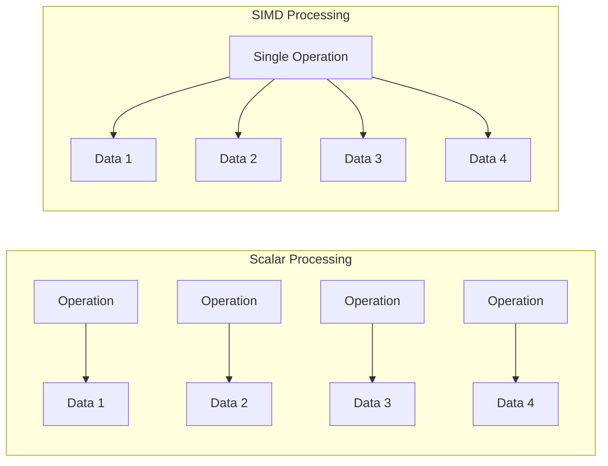

# Rust SIMD: Parallel Processing for Performance

## Introduction

Single Instruction, Multiple Data (SIMD) is a powerful technique for achieving high-performance computing in Rust applications. SIMD allows a single CPU instruction to operate on multiple data points simultaneously, significantly accelerating data-intensive operations that would otherwise process elements one at a time.

In this tutorial, we'll explore how to leverage SIMD instructions in Rust to optimize performance-critical code. SIMD is particularly valuable for applications in domains like:

- Graphics processing
- Scientific computing
- Audio/video encoding and decoding
- Machine learning
- Game development

By the end of this guide, you'll understand the fundamentals of SIMD programming in Rust and how to implement it in your own projects.

## What is SIMD?

SIMD stands for **Single Instruction, Multiple Data**. It's a form of parallel processing that allows one operation to be applied to multiple data elements simultaneously using special CPU vector registers.

Let's visualize how SIMD compares to regular scalar processing:



Modern CPUs include dedicated SIMD instruction sets such as:

- SSE (Streaming SIMD Extensions)
- AVX (Advanced Vector Extensions)
- NEON (for ARM processors)

These instruction sets operate on wide registers (128-bit, 256-bit, or even 512-bit) that can hold multiple values.

## SIMD in Rust

Rust provides several ways to use SIMD:

1. **Portable SIMD API** (`std::simd`) - An evolving standardized interface (still in development)
2. **Platform-specific intrinsics** - Low-level access to CPU SIMD instructions
3. **SIMD-focused crates** - Like `packed_simd` and `faster`

For this tutorial, we'll focus on the `std::simd` experimental API and the popular `packed_simd` crate.

## Using the Experimental Portable SIMD API

The standard library's portable SIMD API is still unstable, so you'll need to use the nightly compiler and enable the feature explicitly:

```rust
#![feature(portable_simd)]
use std::simd::{f32x4, u32x4, Simd};

fn main() {
    // Create two SIMD vectors, each containing 4 floats
    let a = f32x4::from_array([1.0, 2.0, 3.0, 4.0]);
    let b = f32x4::from_array([5.0, 6.0, 7.0, 8.0]);
    
    // Perform addition on all elements simultaneously
    let sum = a + b;
    
    // Extract results
    let result: [f32; 4] = sum.into();
    println!("SIMD Addition Result: {:?}", result);
    // Output: SIMD Addition Result: [6.0, 8.0, 10.0, 12.0]
}
```

In this example, we:
1. Created two SIMD vectors using `f32x4`
2. Added them together in a single operation
3. Converted the result back to a regular array

This allows us to perform four additions with a single CPU instruction!

## Using the packed_simd Crate

For a more stable and complete SIMD experience, you can use the `packed_simd` crate:

```toml
# Cargo.toml
[dependencies]
packed_simd = "0.3.8"
```

Now let's see it in action:

```rust
use packed_simd::{f32x8, u32x8};

fn main() {
    // Create two SIMD vectors, each containing 8 floats
    let a = f32x8::new(1.0, 2.0, 3.0, 4.0, 5.0, 6.0, 7.0, 8.0);
    let b = f32x8::new(8.0, 7.0, 6.0, 5.0, 4.0, 3.0, 2.0, 1.0);
    
    // Perform multiplication on all elements simultaneously
    let product = a * b;
    
    println!("SIMD Multiplication Result: {:?}", product);
    // Output: SIMD Multiplication Result: [8.0, 14.0, 18.0, 20.0, 20.0, 18.0, 14.0, 8.0]
    
    // Compute the maximum values between the two vectors
    let max_values = a.max(b);
    
    println!("SIMD Max Result: {:?}", max_values);
    // Output: SIMD Max Result: [8.0, 7.0, 6.0, 5.0, 5.0, 6.0, 7.0, 8.0]
}
```

The `packed_simd` crate provides various SIMD vector types for different data sizes and types, enabling more complex operations while abstracting away platform-specific details.

## Practical Example: Vector Normalization

Let's implement a practical example of vector normalization, comparing scalar and SIMD implementations:

```rust
use packed_simd::{f32x8, mask32x8};
use std::time::Instant;

// Scalar implementation
fn normalize_scalar(v: &mut [f32]) {
    // Calculate the magnitude (length) of the vector
    let mut magnitude = 0.0;
    for &x in v.iter() {
        magnitude += x * x;
    }
    magnitude = magnitude.sqrt();
    
    // Normalize each component
    for x in v.iter_mut() {
        *x /= magnitude;
    }
}

// SIMD implementation
fn normalize_simd(v: &mut [f32]) {
    assert!(v.len() % 8 == 0, "Vector length must be a multiple of 8");
    
    let mut magnitude_squared_sum = f32x8::splat(0.0);
    
    // Process in chunks of 8 elements
    for chunk in v.chunks_exact(8) {
        let chunk_vec = f32x8::from_slice_unaligned(chunk);
        // Square each element and add to sum
        magnitude_squared_sum += chunk_vec * chunk_vec;
    }
    
    // Horizontal sum of all elements in the SIMD vector
    let magnitude = (magnitude_squared_sum.sum_bits()).sqrt();
    
    // Normalize each chunk
    for chunk in v.chunks_exact_mut(8) {
        let chunk_vec = f32x8::from_slice_unaligned(chunk);
        let normalized = chunk_vec / f32x8::splat(magnitude);
        normalized.write_to_slice_unaligned(chunk);
    }
}

fn main() {
    // Create a large vector for testing
    let size = 8000000;
    let mut data_scalar = vec![1.0f32; size];
    let mut data_simd = data_scalar.clone();
    
    // Time the scalar version
    let start = Instant::now();
    normalize_scalar(&mut data_scalar);
    let scalar_time = start.elapsed().as_micros();
    println!("Scalar implementation: {} μs", scalar_time);
    
    // Time the SIMD version
    let start = Instant::now();
    normalize_simd(&mut data_simd);
    let simd_time = start.elapsed().as_micros();
    println!("SIMD implementation: {} μs", simd_time);
    
    println!("Speedup: {:.2}x", scalar_time as f64 / simd_time as f64);
    
    // Verify results match
    for (a, b) in data_scalar.iter().zip(data_simd.iter()) {
        assert!((a - b).abs() < 1e-6);
    }
    println!("Results match!");
}
```

When you run this program, you'll likely see the SIMD implementation running 4-8 times faster than the scalar version, depending on your CPU. This speed improvement comes from processing 8 elements at once instead of one at a time.

## Conditional Operations with SIMD

SIMD also supports conditional operations using masks. Here's an example that applies a condition to multiple data elements simultaneously:

```rust
use packed_simd::{f32x4, m32x4};

fn main() {
    let values = f32x4::new(1.0, 2.0, 3.0, 4.0);
    
    // Create a mask for values greater than 2.0
    let mask = values.gt(f32x4::splat(2.0));
    println!("Mask: {:?}", mask);
    // Output: Mask: [false, false, true, true]
    
    // Apply different operations based on the mask
    let result = mask.select(
        values * f32x4::splat(10.0),  // If mask is true
        values + f32x4::splat(100.0)  // If mask is false
    );
    
    println!("Result: {:?}", result);
    // Output: Result: [101.0, 102.0, 30.0, 40.0]
}
```

This enables complex branching logic to be applied efficiently across multiple data points.

## Real-World Example: Image Processing

Let's implement a simple image processing function that applies a brightness adjustment using SIMD:

```rust
use packed_simd::{u8x32, i16x16, i16x32};

// Adjust brightness of an RGB image using SIMD
fn adjust_brightness_simd(image: &mut [u8], brightness: i16) {
    // Process 32 bytes (pixels) at a time
    for chunk in image.chunks_exact_mut(32) {
        // Load 32 pixels
        let pixels = u8x32::from_slice_unaligned(chunk);
        
        // Convert to i16 for math operations (process in two halves)
        let pixels_low = i16x16::from_cast(pixels.extract_low());
        let pixels_high = i16x16::from_cast(pixels.extract_high());
        
        // Add brightness value to each pixel
        let adjusted_low = pixels_low + i16x16::splat(brightness);
        let adjusted_high = pixels_high + i16x16::splat(brightness);
        
        // Clamp values to 0-255 range
        let clamped_low = adjusted_low.max(i16x16::splat(0)).min(i16x16::splat(255));
        let clamped_high = adjusted_high.max(i16x16::splat(0)).min(i16x16::splat(255));
        
        // Convert back to u8
        let result_low = u8x32::from_cast(clamped_low);
        let result_high = u8x32::from_cast(clamped_high);
        
        // Combine results
        let result = u8x32::from_cast(
            i16x32::new(
                clamped_low.extract(0), clamped_low.extract(1), /* ... and so on */
                clamped_high.extract(0), clamped_high.extract(1), /* ... and so on */
            )
        );
        
        // Write result back to image
        result.write_to_slice_unaligned(chunk);
    }
    
    // Handle remaining pixels normally
    for i in (image.len() - (image.len() % 32))..image.len() {
        let adjusted = image[i] as i16 + brightness;
        image[i] = adjusted.clamp(0, 255) as u8;
    }
}

fn main() {
    // Example usage
    let mut image = vec![128u8; 1024]; // Example image data
    
    // Increase brightness by 50
    adjust_brightness_simd(&mut image, 50);
    
    // First few pixels should now be 178 (128 + 50)
    println!("First few pixels: {:?}", &image[0..5]);
    // Output: First few pixels: [178, 178, 178, 178, 178]
}
```

This SIMD-based function can process 32 pixels at once, significantly speeding up image processing operations.

## Best Practices and Considerations

When working with SIMD in Rust, keep these tips in mind:

1. **Align your data**: Many SIMD operations are faster with aligned memory. Use `aligned_alloc` crates or ensure your data is aligned.

2. **Benchmark**: Always measure performance gains, as SIMD isn't always faster due to overhead.

3. **Fallback paths**: Provide scalar implementations for CPUs without specific SIMD support.

4. **Mind the target architecture**: Different CPU architectures support different SIMD instructions.

5. **Use target features**: Specify SIMD capabilities in your `Cargo.toml`:

```toml
[target.'cfg(target_arch = "x86_64")'.dependencies]
# SIMD-related dependencies
```

6. **Understand auto-vectorization**: Modern compilers can automatically vectorize some code. Sometimes explicit SIMD isn't necessary.

## Cross-Platform Considerations

SIMD instructions vary across CPU architectures. To handle this, you can use conditional compilation:

```rust
// For X86/X86_64 platforms
#[cfg(any(target_arch = "x86", target_arch = "x86_64"))]
{
    #[cfg(target_arch = "x86")]
    use std::arch::x86::*;
    #[cfg(target_arch = "x86_64")]
    use std::arch::x86_64::*;
    
    // SSE implementation
    #[target_feature(enable = "sse2")]
    unsafe fn process_data_sse2(data: &mut [f32]) {
        // SSE2-specific code
    }
    
    // AVX implementation
    #[target_feature(enable = "avx")]
    unsafe fn process_data_avx(data: &mut [f32]) {
        // AVX-specific code
    }
}

// For ARM platforms
#[cfg(target_arch = "aarch64")]
{
    use std::arch::aarch64::*;
    
    // NEON implementation
    #[target_feature(enable = "neon")]
    unsafe fn process_data_neon(data: &mut [f32]) {
        // NEON-specific code
    }
}

// Generic fallback
fn process_data_generic(data: &mut [f32]) {
    // Scalar implementation for any CPU
}
```

## Debugging SIMD Code

Debugging SIMD code can be challenging. Here are some tips:

1. **Print vector contents**: Use `println!("{:?}", simd_vector)` to inspect values.

2. **Convert to arrays**: Extract values into regular arrays for easier debugging:
   ```rust
   let values: [f32; 4] = simd_vector.into();
   println!("{:?}", values);
   ```

3. **Start simple**: Begin with small, well-understood operations and build up complexity.

4. **Verify against scalar**: Always compare results with a scalar implementation to catch errors.

## Summary

SIMD programming in Rust offers significant performance improvements for data-parallel operations. In this tutorial, we've covered:

- The fundamental concept of SIMD processing
- How to use Rust's experimental SIMD API
- Working with the `packed_simd` crate
- Practical examples including vector normalization and image processing
- Best practices and cross-platform considerations

By applying SIMD techniques to your performance-critical code, you can achieve substantial speedups, especially in domains like multimedia processing, scientific computing, and games.

## Further Learning

To continue your journey with Rust SIMD:

1. Explore the [Rust SIMD Project](https://github.com/rust-lang/portable-simd)
2. Check out the [`packed_simd` crate documentation](https://docs.rs/packed_simd)
3. Read Intel's and AMD's SIMD programming guides
4. Experiment with different SIMD operations on your own data

## Exercises

1. Implement a SIMD-based function to compute the dot product of two vectors.
2. Create a simple audio processing function that uses SIMD to apply a gain effect.
3. Benchmark various SIMD vector widths (4, 8, 16, 32 elements) to find the optimal size for your specific hardware.
4. Implement a SIMD-accelerated RGB to grayscale image conversion function.
5. Add runtime feature detection to your code to select the optimal SIMD implementation based on the CPU's capabilities.