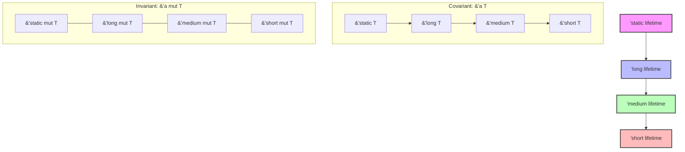

# Rust Lifetime Variance

## Introduction

When working with Rust, you'll eventually encounter situations where you need to understand how the compiler handles relationships between different lifetimes. This concept, known as **lifetime variance**, is a fundamental part of Rust's type system that enables safe memory management while providing flexibility in your code.

In this tutorial, we'll explore lifetime variance in Rust - a concept that affects how you can use references with different lifetimes in various contexts. By the end, you'll understand how Rust determines when one lifetime can be substituted for another, which will help you write more flexible and reusable code.

## Prerequisites

Before diving into lifetime variance, you should be familiar with:
- Basic Rust syntax and concepts
- Rust's ownership system
- Basic lifetime annotations

## Understanding Variance

### What is Variance?

In type theory, **variance** describes how subtyping relationships between complex types relate to subtyping relationships between their components.

For Rust lifetimes specifically, variance determines when a type with one lifetime can be used in a context that expects a type with a different lifetime.

To put it simply, variance answers the question: 

> "If lifetime `'a` is longer than lifetime `'b`, can I use a type containing `'a` where a type containing `'b` is expected?"

### Types of Variance

There are three main types of variance:

1. **Covariant**: If `'a` outlives `'b`, then `T<'a>` can be used where `T<'b>` is expected.
2. **Contravariant**: If `'a` outlives `'b`, then `T<'b>` can be used where `T<'a>` is expected (the opposite of covariance).
3. **Invariant**: Neither covariant nor contravariant - the lifetimes must match exactly.

## Lifetime Subtyping

Before diving deeper into variance, let's understand lifetime subtyping.

### Lifetime Relationships

In Rust, a lifetime `'a` is said to **outlive** another lifetime `'b` if `'a` lasts at least as long as `'b`. This is sometimes written as `'a: 'b` (read as "`'a` outlives `'b`").

Here's a simple example:

```rust
fn main() {
    let outer_scope = String::from("Hello");      // 'outer begins
    {                                            
        let inner_scope = String::from("World");   // 'inner begins
        
        // Both references are valid here
        
    }                                             // 'inner ends
    
    // Only 'outer is still valid here
}                                                 // 'outer ends
```

In this example, the lifetime `'outer` outlives the lifetime `'inner`. This relationship is the foundation for understanding variance.

## Variance in Rust's Type System

Let's explore how variance applies to different types in Rust:

### References and Variance

In Rust:
- Shared references `&'a T` are covariant over `'a`
- Mutable references `&'a mut T` are invariant over `'a`

Let's break down what this means with examples:

#### Shared References (Covariant)

```rust
fn example<'a, 'b>(x: &'a str, y: &'b str) -> &'a str
    where 'b: 'a  // 'b outlives 'a
{
    x  // Return the shorter-lived reference
}

fn main() {
    let long_lived = String::from("Long-lived string");
    
    let result;
    {
        let short_lived = String::from("Short-lived string");
        
        // Pass a long-lived reference where a short-lived one is expected
        result = example(&long_lived, &short_lived);
        
        // This works because &'a T is covariant over 'a
    }
    
    println!("Result: {}", result);
}
```

In this example, we can pass a long-lived reference where a shorter-lived one is expected because shared references are covariant.

#### Mutable References (Invariant)

```rust
fn example_mut<'a, 'b>(x: &'a mut Vec<i32>, y: &'b mut Vec<i32>) -> &'a mut Vec<i32>
    where 'b: 'a  // 'b outlives 'a
{
    x  // Return the shorter-lived reference
}

fn main() {
    let mut long_lived = vec![1, 2, 3];
    
    let result;
    {
        let mut short_lived = vec![4, 5, 6];
        
        // The following would NOT compile if uncommented:
        // result = example_mut(&mut long_lived, &mut short_lived);
        
        // This fails because &'a mut T is invariant over 'a
    }
}
```

Mutable references must match exactly because they're invariant over their lifetimes.

### Why Mutable References are Invariant

Rust makes mutable references invariant for safety reasons. If mutable references were covariant, you could create scenarios that violate memory safety.

Consider this theoretical (unsafe) example if mutable references were covariant:

```rust
fn unsafe_example<'a, 'b>(input: &'a mut &'b i32, value: &'b i32) {
    *input = value;  // This would be dangerous if allowed
}

fn main() {
    let mut x: &'static i32 = &10;  // 'static lifetime
    {
        let y = 20;                 // Shorter lifetime
        unsafe_example(&mut x, &y); // If this were allowed...
    }
    // Now x would point to invalid memory!
    println!("{}", *x);  // Disaster!
}
```

If mutable references were covariant, the above code could compile, leading to a dangling reference. Rust prevents this by making mutable references invariant.

## Generic Types and Variance

For generic types like `Vec<T>`, `Option<T>`, etc., the variance of the type depends on how the generic parameter is used:

```rust
// Vec<T> is covariant over T
let integers: Vec<i32> = vec![1, 2, 3];
let numbers: Vec<&dyn Any> = integers.iter().collect();  // Works because Vec is covariant

// Cell<T> is invariant over T
use std::cell::Cell;
let cell_integer: Cell<i32> = Cell::new(5);
// The following would NOT compile if uncommented:
// let cell_number: Cell<&dyn Any> = cell_integer;
```

## Practical Applications

### Function Design with Lifetime Variance

Understanding variance helps you design more flexible APIs:

```rust
// More flexible due to covariance
fn process_data<'a>(data: &'a [u8]) -> &'a [u8] {
    // Processing logic
    &data[..data.len()/2]
}

// Less flexible due to invariance
fn process_data_mut<'a>(data: &'a mut [u8]) -> &'a mut [u8] {
    // Processing logic
    &mut data[..data.len()/2]
}

fn main() {
    let long_lived_data = vec![1, 2, 3, 4];
    
    {
        let result;
        {
            // We can use a longer-lived reference where a shorter one is expected
            result = process_data(&long_lived_data);
        }
        println!("{:?}", result);
    }
}
```

### Working with Structs and Lifetimes

Variance also affects how you can use structs with lifetime parameters:

```rust
// A struct containing a reference
struct Container<'a> {
    data: &'a str,
}

// A struct containing a mutable reference
struct MutContainer<'a> {
    data: &'a mut String,
}

fn main() {
    let long_string = String::from("This is a long-lived string");
    
    let container;
    {
        // Container is covariant over 'a because &'a str is covariant
        container = Container { data: &long_string };
    }
    println!("Container data: {}", container.data);
    
    // MutContainer would be invariant over 'a because &'a mut String is invariant
}
```

### Creating a Custom Container with Different Variance Properties

Let's create a custom container that demonstrates different variance behaviors:

```rust
// Covariant container (default for references)
struct ReadContainer<'a, T: 'a> {
    data: &'a T,
}

// Invariant container (uses mutable reference)
struct WriteContainer<'a, T: 'a> {
    data: &'a mut T,
}

// Contravariant container (rare in Rust)
struct FnContainer<'a, T: 'a> {
    callback: Box<dyn Fn(&T) -> bool + 'a>,
}

fn main() {
    let value = 42;
    
    let read_container = ReadContainer { data: &value };
    
    let mut value2 = 100;
    let write_container = WriteContainer { data: &mut value2 };
    
    let fn_container = FnContainer {
        callback: Box::new(|x: &i32| *x > 0),
    };
}
```

## Visualizing Lifetime Relationships

Here's a diagram showing the relationship between different lifetimes and how variance affects them:



The diagram shows:
- The hierarchy of lifetimes (longer lifetimes at the top)
- Covariant relationships (can substitute a longer lifetime for a shorter one)
- Invariant relationships (no substitution allowed)

## Common Errors Related to Variance

Understanding variance helps you diagnose and fix common Rust errors:

```rust
// ERROR: Cannot return a reference with a shorter lifetime
fn wrong_return<'a, 'b>(x: &'a str, y: &'b str) -> &'b str {
    x  // Error: return type requires that 'a outlives 'b
}

// FIXED: Add lifetime bound to ensure safety
fn correct_return<'a, 'b>(x: &'a str, y: &'b str) -> &'b str 
    where 'a: 'b  // 'a outlives 'b
{
    x  // Now works
}
```

## Summary

Lifetime variance is a powerful concept in Rust that determines how lifetimes interact with the type system:

- **Covariant** types (like `&'a T`) allow you to use a longer-lived type where a shorter-lived one is expected
- **Invariant** types (like `&'a mut T`) require exact lifetime matches
- **Contravariant** types reverse the relationship (rare in Rust)

Understanding variance helps you:
- Design more flexible APIs
- Diagnose and fix lifetime-related errors
- Write safer code that fully utilizes Rust's type system

While lifetime variance might seem abstract at first, it's a key part of how Rust ensures memory safety without a garbage collector while still providing flexibility for developers.

## Exercises

1. Create a function that accepts two shared references with different lifetimes and returns the one with the longer string.
2. Design a struct that holds both a shared reference and a mutable reference, and explain its variance properties.
3. Try to identify the variance of common Rust types like `Option<&'a T>`, `Result<&'a T, E>`, and `Box<&'a T>`.

## Additional Resources

- [Rust Nomicon: Subtyping and Variance](https://doc.rust-lang.org/nomicon/subtyping.html)
- [Rust Reference: Lifetime Elision](https://doc.rust-lang.org/reference/lifetime-elision.html)
- [The Rust Programming Language Book: Advanced Lifetimes](https://doc.rust-lang.org/book/ch19-02-advanced-lifetimes.html)
- [Rust By Example: Lifetimes](https://doc.rust-lang.org/rust-by-example/scope/lifetime.html)