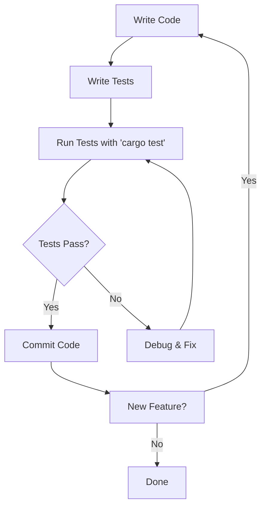

# Rust Unit Tests

## Introduction

Unit testing is a fundamental practice in modern software development that involves testing individual components or functions of your code in isolation. In Rust, unit testing is built directly into the language and its tooling, making it easy to ensure your code works as expected.

This guide will walk you through writing effective unit tests in Rust, from basic assertions to organizing complex test suites. By the end, you'll have a solid understanding of how to test your Rust code thoroughly and efficiently.

## What Are Unit Tests?

Unit tests are small, focused tests that verify the behavior of a specific function or component in isolation. The goal is to confirm that each piece of your code works correctly on its own before integrating it with other components.

In Rust, unit tests typically:
- Test a single function or method
- Verify expected outputs for given inputs
- Check error handling behavior
- Run quickly and deterministically

## Getting Started with Rust Unit Tests

Rust's built-in test framework requires no external dependencies. Tests are simply functions annotated with the `#[test]` attribute.

### Basic Test Structure

Here's a simple example of a Rust unit test:

```rust
// This function adds two numbers
fn add(a: i32, b: i32) -> i32 {
    a + b
}

#[cfg(test)]
mod tests {
    // Import symbols from the outer scope
    use super::*;
    
    #[test]
    fn test_add() {
        // Call the function with test values
        let result = add(2, 3);
        
        // Check if the result is what we expect
        assert_eq!(result, 5);
    }
}
```

Let's break down the key components:

1. The `#[cfg(test)]` attribute tells Rust that this module should only be compiled when running tests.
2. The `mod tests` creates a module to contain your tests.
3. `use super::*;` imports all items from the parent module (including our `add` function).
4. The `#[test]` attribute marks a function as a test.
5. The `assert_eq!` macro checks if two values are equal.

### Running Your Tests

To run your tests, use the `cargo test` command in your terminal:

```
$ cargo test
   Compiling myproject v0.1.0
    Finished test [unoptimized + debuginfo] target(s) in 0.57s
     Running target/debug/deps/myproject-a12b3c4d5e6f

running 1 test
test tests::test_add ... ok

test result: ok. 1 passed; 0 failed; 0 ignored; 0 measured; 0 filtered out
```

## Writing Effective Unit Tests

### Assertions

Rust provides several assertion macros for testing:

1. `assert!` - Verifies that a condition is true
2. `assert_eq!` - Checks if two values are equal
3. `assert_ne!` - Checks if two values are not equal
4. `panic!` - Causes a test to fail with a message

Let's see them in action:

```rust
#[cfg(test)]
mod tests {
    #[test]
    fn test_assertions() {
        // assert! checks if a condition is true
        let value = true;
        assert!(value);
        
        // assert_eq! checks if two values are equal
        let result = 2 + 2;
        assert_eq!(result, 4);
        
        // assert_ne! checks if two values are not equal
        assert_ne!(result, 5);
        
        // You can add custom error messages
        let name = "Rust";
        assert_eq!(name, "Rust", "Names should match!");
    }
}
```

### Testing for Errors

Sometimes you want to test that your function returns an error under certain conditions. Rust's `should_panic` attribute is perfect for this:

```rust
fn divide(a: i32, b: i32) -> Result<i32, &'static str> {
    if b == 0 {
        return Err("Cannot divide by zero");
    }
    Ok(a / b)
}

#[cfg(test)]
mod tests {
    use super::*;
    
    #[test]
    fn test_divide_success() {
        let result = divide(10, 2);
        assert_eq!(result, Ok(5));
    }
    
    #[test]
    fn test_divide_by_zero() {
        let result = divide(10, 0);
        assert_eq!(result, Err("Cannot divide by zero"));
    }
    
    // Alternative approach using should_panic
    #[test]
    #[should_panic(expected = "Cannot divide by zero")]
    fn test_divide_panic() {
        divide(10, 0).unwrap(); // This will unwrap an Err, causing a panic
    }
}
```

### Test Setup and Teardown

For tests that require some setup or cleanup, you can use Rust's module system and the `Drop` trait:

```rust
struct TestEnvironment {
    // Fields to hold test resources
    temp_file_path: String,
}

impl TestEnvironment {
    fn new() -> Self {
        // Setup code here (create temp files, etc.)
        println!("Setting up test environment");
        TestEnvironment {
            temp_file_path: String::from("/tmp/test_file.txt"),
        }
    }
}

impl Drop for TestEnvironment {
    fn drop(&mut self) {
        // Cleanup code here
        println!("Cleaning up test environment");
        // Delete temp files, close connections, etc.
    }
}

#[cfg(test)]
mod tests {
    use super::*;
    
    #[test]
    fn test_with_environment() {
        let env = TestEnvironment::new();
        
        // Test code using env.temp_file_path
        // ...
        
        // env will be automatically dropped when it goes out of scope
    }
}
```

## Organizing Test Suites

As your project grows, organizing your tests becomes increasingly important.

### Test Modules and Files

You can organize your tests in several ways:

1. **Inline tests**: Small tests right next to the code they're testing:

```rust
pub fn is_even(num: i32) -> bool {
    num % 2 == 0
}

#[cfg(test)]
mod tests {
    use super::*;
    
    #[test]
    fn test_is_even() {
        assert!(is_even(2));
        assert!(!is_even(3));
    }
}
```

2. **Separate test modules**: For more complex tests, create separate modules:

```rust
// src/math.rs
pub fn add(a: i32, b: i32) -> i32 {
    a + b
}

// src/math/tests.rs
#[cfg(test)]
mod tests {
    use super::*;
    
    #[test]
    fn test_add() {
        assert_eq!(add(2, 3), 5);
    }
}
```

3. **Integration tests**: Tests that verify multiple components work together, placed in the `tests/` directory:

```
my_project/
├── src/
│   └── lib.rs
└── tests/
    └── integration_test.rs
```

```rust
// tests/integration_test.rs
use my_project::math;

#[test]
fn test_math_functions() {
    assert_eq!(math::add(2, 3), 5);
    // Test other math functions
}
```

### Conditional Test Compilation

You can use conditional compilation to run specific tests only in certain environments:

```rust
#[cfg(test)]
mod tests {
    use super::*;
    
    #[test]
    fn always_runs() {
        // This test always runs
    }
    
    #[test]
    #[cfg(feature = "expensive_tests")]
    fn expensive_test() {
        // This test only runs when the "expensive_tests" feature is enabled
    }
}
```

Run with: `cargo test --features "expensive_tests"`

## Unit Testing Best Practices

### 1. Test the Public API

Focus on testing the public interface of your modules rather than implementation details. This allows you to refactor your code without breaking tests.

```rust
pub struct User {
    name: String,
    age: u8,
}

impl User {
    pub fn new(name: &str, age: u8) -> Self {
        User {
            name: name.to_string(),
            age,
        }
    }
    
    pub fn is_adult(&self) -> bool {
        self.age >= 18
    }
}

#[cfg(test)]
mod tests {
    use super::*;
    
    #[test]
    fn test_user_adult_status() {
        let minor = User::new("Alice", 15);
        let adult = User::new("Bob", 25);
        
        assert!(!minor.is_adult());
        assert!(adult.is_adult());
    }
}
```

### 2. Keep Tests Fast

Unit tests should run quickly to provide immediate feedback. Avoid network calls, file I/O, or database operations in unit tests.

### 3. Test Edge Cases

Make sure to test boundary conditions and edge cases:

```rust
fn factorial(n: u32) -> u64 {
    if n == 0 {
        return 1;
    }
    (1..=n).map(|i| i as u64).product()
}

#[cfg(test)]
mod tests {
    use super::*;
    
    #[test]
    fn test_factorial() {
        // Edge case: factorial of 0
        assert_eq!(factorial(0), 1);
        
        // Normal cases
        assert_eq!(factorial(1), 1);
        assert_eq!(factorial(5), 120);
    }
}
```

### 4. Test Error Conditions

Always test how your code handles errors and invalid inputs:

```rust
fn parse_positive_number(input: &str) -> Result<u32, String> {
    match input.parse::<u32>() {
        Ok(n) if n > 0 => Ok(n),
        Ok(_) => Err("Number must be positive".to_string()),
        Err(_) => Err("Invalid number format".to_string()),
    }
}

#[cfg(test)]
mod tests {
    use super::*;
    
    #[test]
    fn test_parse_valid_number() {
        assert_eq!(parse_positive_number("42"), Ok(42));
    }
    
    #[test]
    fn test_parse_zero() {
        assert_eq!(
            parse_positive_number("0"), 
            Err("Number must be positive".to_string())
        );
    }
    
    #[test]
    fn test_parse_invalid_format() {
        assert_eq!(
            parse_positive_number("abc"), 
            Err("Invalid number format".to_string())
        );
    }
}
```

## Real-World Example: Testing a Todo List Application

Let's apply unit testing to a more complex example - a simple Todo list manager:

```rust
pub struct Todo {
    id: usize,
    title: String,
    completed: bool,
}

pub struct TodoList {
    todos: Vec<Todo>,
    next_id: usize,
}

impl TodoList {
    pub fn new() -> Self {
        TodoList {
            todos: Vec::new(),
            next_id: 1,
        }
    }
    
    pub fn add(&mut self, title: &str) -> usize {
        let id = self.next_id;
        self.todos.push(Todo {
            id,
            title: title.to_string(),
            completed: false,
        });
        self.next_id += 1;
        id
    }
    
    pub fn toggle(&mut self, id: usize) -> Result<(), String> {
        if let Some(todo) = self.todos.iter_mut().find(|t| t.id == id) {
            todo.completed = !todo.completed;
            Ok(())
        } else {
            Err(format!("Todo with id {} not found", id))
        }
    }
    
    pub fn remove(&mut self, id: usize) -> Result<(), String> {
        let initial_len = self.todos.len();
        self.todos.retain(|t| t.id != id);
        
        if self.todos.len() < initial_len {
            Ok(())
        } else {
            Err(format!("Todo with id {} not found", id))
        }
    }
    
    pub fn list(&self) -> &[Todo] {
        &self.todos
    }
    
    pub fn list_completed(&self) -> Vec<&Todo> {
        self.todos.iter().filter(|t| t.completed).collect()
    }
}

#[cfg(test)]
mod tests {
    use super::*;
    
    #[test]
    fn test_add_todo() {
        let mut list = TodoList::new();
        let id = list.add("Learn Rust");
        
        assert_eq!(id, 1);
        assert_eq!(list.todos.len(), 1);
        assert_eq!(list.todos[0].title, "Learn Rust");
        assert_eq!(list.todos[0].completed, false);
    }
    
    #[test]
    fn test_toggle_todo() {
        let mut list = TodoList::new();
        let id = list.add("Write tests");
        
        // Initially not completed
        assert!(!list.todos[0].completed);
        
        // Toggle to completed
        let result = list.toggle(id);
        assert!(result.is_ok());
        assert!(list.todos[0].completed);
        
        // Toggle back to not completed
        let result = list.toggle(id);
        assert!(result.is_ok());
        assert!(!list.todos[0].completed);
    }
    
    #[test]
    fn test_toggle_nonexistent_todo() {
        let mut list = TodoList::new();
        let result = list.toggle(999);
        
        assert!(result.is_err());
        assert_eq!(result.unwrap_err(), "Todo with id 999 not found");
    }
    
    #[test]
    fn test_remove_todo() {
        let mut list = TodoList::new();
        let id = list.add("Delete me");
        
        assert_eq!(list.todos.len(), 1);
        
        let result = list.remove(id);
        assert!(result.is_ok());
        assert_eq!(list.todos.len(), 0);
    }
    
    #[test]
    fn test_list_completed() {
        let mut list = TodoList::new();
        list.add("Task 1");
        let id2 = list.add("Task 2");
        list.add("Task 3");
        let id4 = list.add("Task 4");
        
        // Mark two tasks as completed
        list.toggle(id2).unwrap();
        list.toggle(id4).unwrap();
        
        let completed = list.list_completed();
        assert_eq!(completed.len(), 2);
        assert_eq!(completed[0].id, id2);
        assert_eq!(completed[1].id, id4);
    }
}
```

This example demonstrates comprehensive testing of a simple Todo list application, covering all functionality including adding, toggling, removing, and listing todos.

## Test Workflow Visualization

Here's a visual representation of the Rust testing workflow:



## Summary

Unit testing in Rust is:
- Built into the language through the `#[test]` attribute and `cargo test` command
- Easy to set up with no external dependencies required
- Comprehensive, with support for assertions, error testing, and conditional compilation
- An essential practice for building reliable Rust applications

By writing effective unit tests for your Rust code, you can:
- Catch bugs early in the development process
- Document how your code is intended to work
- Refactor with confidence
- Build more reliable software

## Additional Resources

To deepen your understanding of Rust testing, explore these resources:

- [The Rust Book: Writing Automated Tests](https://doc.rust-lang.org/book/ch11-00-testing.html)
- [Rust By Example: Testing](https://doc.rust-lang.org/rust-by-example/testing.html)
- [Rustdoc: Module std::test](https://doc.rust-lang.org/std/test/index.html)

## Exercises

1. **Basic Testing**: Write unit tests for a function that calculates the factorial of a number.
2. **Error Handling**: Create a function that validates an email address and write tests for both valid and invalid inputs.
3. **Test Driven Development**: Implement a `Stack<T>` data structure (push, pop, peek) by writing the tests first, then implementing the functionality to make them pass.
4. **Advanced**: Add tests to a Rust project you're currently working on, or create tests for an open-source Rust project.