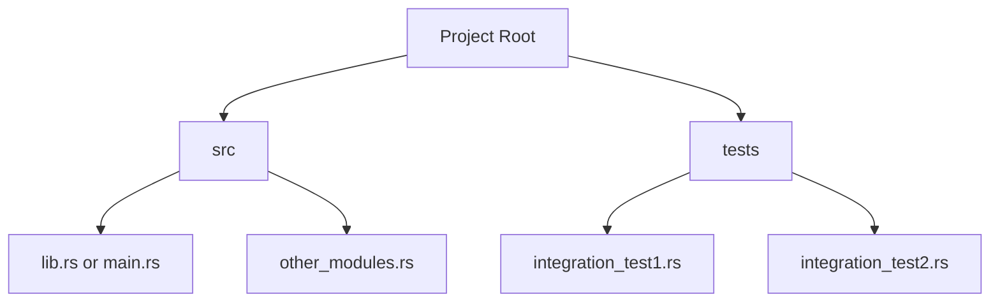

# Rust Integration Tests

## Introduction

Integration tests are a crucial part of testing your Rust applications. Unlike unit tests, which focus on testing individual functions and components in isolation, integration tests verify that different parts of your code work correctly **together**. They ensure that your modules, functions, and components interact as expected when combined.

In this guide, we'll explore how to set up, write, and run integration tests in Rust. You'll learn about the standard project structure for integration tests, how to organize test files, and best practices for effective integration testing.

## Integration Tests vs. Unit Tests

Before diving into implementation details, let's understand the key differences between integration tests and unit tests in Rust:

| Unit Tests | Integration Tests |
|------------|-------------------|
| Test single functions/modules in isolation | Test how multiple components work together |
| Live in the same file as the code they test | Live in a separate `tests` directory |
| Can access private functions and implementation details | Can only access public interfaces |
| Test internal behavior | Test external behavior |
| Run with `cargo test` | Run with `cargo test` |

## Setting Up Integration Tests

In Rust, integration tests follow a simple convention: they live in a `tests` directory at the same level as your `src` directory.



### Creating Your First Integration Test

Let's create a simple library with integration tests. First, let's look at our library code:

```rust
// src/lib.rs
pub fn add(a: i32, b: i32) -> i32 {
    a + b
}

pub fn subtract(a: i32, b: i32) -> i32 {
    a - b
}

pub struct Calculator {
    pub memory: i32,
}

impl Calculator {
    pub fn new() -> Self {
        Self { memory: 0 }
    }

    pub fn add(&mut self, value: i32) {
        self.memory += value;
    }

    pub fn subtract(&mut self, value: i32) {
        self.memory -= value;
    }

    pub fn get_result(&self) -> i32 {
        self.memory
    }
}
```

Now, let's write an integration test for this library:

```rust
// tests/calculator_test.rs
use my_calculator_lib::*; // Import everything from our library

#[test]
fn test_calculator_operations() {
    // Test basic functions
    assert_eq!(add(2, 3), 5);
    assert_eq!(subtract(5, 2), 3);
    
    // Test the Calculator struct's methods
    let mut calc = Calculator::new();
    assert_eq!(calc.get_result(), 0); // Initial value should be 0
    
    calc.add(5);
    assert_eq!(calc.get_result(), 5);
    
    calc.subtract(2);
    assert_eq!(calc.get_result(), 3);
}
```

### Running Your Integration Tests

To run your integration tests, simply use:

```bash
cargo test
```

This will run both your unit tests (in `src/`) and integration tests (in `tests/`). The output will look something like:

```
running 1 test
test test_calculator_operations ... ok

test result: ok. 1 passed; 0 failed; 0 ignored; 0 measured; 0 filtered out
```

If you want to run only the integration tests, you can specify the test file name:

```bash
cargo test --test calculator_test
```

## Organizing Integration Tests

As your project grows, you might need a better organization for your integration tests. Here are some strategies:

### Multiple Test Files

You can create multiple files in the `tests` directory, each focusing on testing different aspects of your library:

```
tests/
├── api_tests.rs     // Tests for your API endpoints
├── db_tests.rs      // Tests for database interactions
└── utils_tests.rs   // Tests for utility functions
```

### Using Modules in Test Files

For better organization within a single test file, you can use modules:

```rust
// tests/advanced_test.rs
use my_library::*;

mod calculation_tests {
    use super::*;
    
    #[test]
    fn test_addition() {
        assert_eq!(add(2, 3), 5);
    }
    
    #[test]
    fn test_subtraction() {
        assert_eq!(subtract(5, 2), 3);
    }
}

mod calculator_tests {
    use super::*;
    
    #[test]
    fn test_calculator_workflow() {
        let mut calc = Calculator::new();
        calc.add(10);
        calc.subtract(3);
        calc.add(5);
        assert_eq!(calc.get_result(), 12);
    }
}
```

### Common Test Utilities

If you need shared functionality across test files, create a module for common test utilities:

```rust
// tests/common/mod.rs
pub fn setup_test_calculator() -> Calculator {
    let mut calc = Calculator::new();
    calc.add(100); // Start with 100 in memory
    calc
}
```

Then use it in your test files:

```rust
// tests/calculator_extended_test.rs
use my_calculator_lib::*;

// Import the common module
mod common;

#[test]
fn test_with_preset_calculator() {
    let mut calc = common::setup_test_calculator();
    assert_eq!(calc.get_result(), 100); // Should start with 100
    
    calc.subtract(50);
    assert_eq!(calc.get_result(), 50);
}
```

## Real-World Example: Testing a Library API

Let's consider a more realistic example where we test a library that handles user authentication:

```rust
// src/lib.rs
pub struct User {
    pub username: String,
    password_hash: String,
    pub is_admin: bool,
}

pub struct AuthService {
    users: Vec<User>,
}

impl AuthService {
    pub fn new() -> Self {
        Self { users: Vec::new() }
    }
    
    pub fn register_user(&mut self, username: &str, password: &str) -> Result<(), String> {
        // Check if username already exists
        if self.users.iter().any(|u| u.username == username) {
            return Err("Username already exists".to_string());
        }
        
        // In a real app, we'd hash the password securely
        let password_hash = format!("hashed_{}", password);
        
        self.users.push(User {
            username: username.to_string(),
            password_hash,
            is_admin: false,
        });
        
        Ok(())
    }
    
    pub fn login(&self, username: &str, password: &str) -> Option<&User> {
        // In a real app, we'd hash the password and compare hashes
        let password_hash = format!("hashed_{}", password);
        
        self.users.iter().find(|u| {
            u.username == username && u.password_hash == password_hash
        })
    }
    
    pub fn promote_to_admin(&mut self, username: &str) -> Result<(), String> {
        match self.users.iter_mut().find(|u| u.username == username) {
            Some(user) => {
                user.is_admin = true;
                Ok(())
            },
            None => Err("User not found".to_string()),
        }
    }
}
```

Now, let's write integration tests to ensure the authentication flow works as expected:

```rust
// tests/auth_flow_test.rs
use my_auth_lib::*;

#[test]
fn test_user_registration_and_login() {
    let mut auth = AuthService::new();
    
    // Test user registration
    let result = auth.register_user("alice", "password123");
    assert!(result.is_ok());
    
    // Test duplicate username
    let result = auth.register_user("alice", "different_password");
    assert!(result.is_err());
    
    // Test successful login
    let user = auth.login("alice", "password123");
    assert!(user.is_some());
    assert_eq!(user.unwrap().username, "alice");
    assert_eq!(user.unwrap().is_admin, false);
    
    // Test failed login
    let user = auth.login("alice", "wrong_password");
    assert!(user.is_none());
}

#[test]
fn test_admin_promotion() {
    let mut auth = AuthService::new();
    
    // Register users
    auth.register_user("bob", "pass456").unwrap();
    
    // Test promotion
    let result = auth.promote_to_admin("bob");
    assert!(result.is_ok());
    
    // Verify promotion worked
    let user = auth.login("bob", "pass456").unwrap();
    assert!(user.is_admin);
    
    // Test promoting non-existent user
    let result = auth.promote_to_admin("charlie");
    assert!(result.is_err());
}
```

## Testing External Dependencies

In real-world applications, your code often interacts with external systems like databases, APIs, or file systems. Here are strategies for handling these in integration tests:

### Mocking External Dependencies

For external dependencies, you can use mock implementations:

```rust
// src/database.rs
pub trait Database {
    fn save_user(&self, username: &str, data: &str) -> Result<(), String>;
    fn get_user(&self, username: &str) -> Option<String>;
}

// Mock implementation for testing
pub struct MockDatabase {
    data: std::collections::HashMap<String, String>,
}

impl MockDatabase {
    pub fn new() -> Self {
        Self {
            data: std::collections::HashMap::new(),
        }
    }
}

impl Database for MockDatabase {
    fn save_user(&self, username: &str, data: &str) -> Result<(), String> {
        let mut db = self.data.clone();
        db.insert(username.to_string(), data.to_string());
        Ok(())
    }
    
    fn get_user(&self, username: &str) -> Option<String> {
        self.data.get(username).cloned()
    }
}

// The actual code using the database
pub struct UserRepository<T: Database> {
    db: T,
}

impl<T: Database> UserRepository<T> {
    pub fn new(db: T) -> Self {
        Self { db }
    }
    
    pub fn create_user(&self, username: &str, email: &str) -> Result<(), String> {
        let user_data = format!("{{\"email\":\"{}\"}}", email);
        self.db.save_user(username, &user_data)
    }
    
    pub fn get_user_email(&self, username: &str) -> Option<String> {
        // In a real app, we'd properly parse JSON
        self.db.get_user(username).map(|data| {
            data.split("\"email\":\"").nth(1)
                .unwrap_or("")
                .split("\"").next()
                .unwrap_or("")
                .to_string()
        })
    }
}
```

Now, test it:

```rust
// tests/user_repository_test.rs
use my_db_lib::*;

#[test]
fn test_user_repository() {
    // Create a mock database
    let mock_db = MockDatabase::new();
    
    // Create the repository with the mock
    let repo = UserRepository::new(mock_db);
    
    // Test creating a user
    let result = repo.create_user("dave", "dave@example.com");
    assert!(result.is_ok());
    
    // Test retrieving user email
    let email = repo.get_user_email("dave");
    assert_eq!(email, Some("dave@example.com".to_string()));
    
    // Test non-existent user
    let email = repo.get_user_email("nonexistent");
    assert_eq!(email, None);
}
```

## Testing Asynchronous Code

If your application uses asynchronous code, your integration tests will need to handle this as well:

```rust
// src/lib.rs
pub async fn fetch_data(url: &str) -> Result<String, String> {
    // In a real app, this would make an HTTP request
    if url.contains("valid") {
        Ok("valid data".to_string())
    } else {
        Err("failed to fetch data".to_string())
    }
}
```

Testing async code requires using the `tokio` test attribute:

```rust
// tests/async_test.rs
use my_async_lib::*;

#[tokio::test]
async fn test_fetch_data() {
    // Test successful fetch
    let result = fetch_data("https://valid-url.com").await;
    assert!(result.is_ok());
    assert_eq!(result.unwrap(), "valid data");
    
    // Test failed fetch
    let result = fetch_data("https://invalid-url.com").await;
    assert!(result.is_err());
}
```

Don't forget to add the `tokio` dependency with the `macros` feature in your `Cargo.toml`:

```toml
[dev-dependencies]
tokio = { version = "1", features = ["macros", "rt-multi-thread"] }
```

## Best Practices for Integration Tests

### 1. Test Real User Flows

Integration tests should test complete user flows rather than individual functions. Think about how users will interact with your system and test those scenarios.

### 2. Minimize Test Interdependence

Each test should be independent. Avoid situations where one test depends on the state set up by another test, as this can lead to flaky tests.

### 3. Set Up and Tear Down Test Data

For tests involving databases or file systems, ensure you have proper setup and cleanup routines:

```rust
#[test]
fn test_with_cleanup() {
    // Setup
    let test_file = "test_data.txt";
    std::fs::write(test_file, "test data").expect("Failed to write test file");
    
    // Test logic here
    // ...
    
    // Cleanup
    std::fs::remove_file(test_file).expect("Failed to remove test file");
}
```

### 4. Use Test Fixtures

For complex setups, create fixtures that can be reused across tests:

```rust
// tests/common/mod.rs
pub struct TestApp {
    pub auth_service: AuthService,
    pub test_users: Vec<(String, String)>, // (username, password) pairs
}

pub fn setup_test_app() -> TestApp {
    let mut auth = AuthService::new();
    
    // Create some test users
    let users = vec![
        ("test_user1", "password1"),
        ("test_admin", "admin_pass"),
    ];
    
    for (username, password) in &users {
        auth.register_user(username, password).unwrap();
    }
    
    // Make the admin user an actual admin
    auth.promote_to_admin("test_admin").unwrap();
    
    TestApp {
        auth_service: auth,
        test_users: users,
    }
}
```

### 5. Test Edge Cases

Don't just test the happy path. Test edge cases, error conditions, and boundary values.

### 6. Keep Tests Fast

Integration tests are typically slower than unit tests, but they should still be reasonably fast. If your tests are taking too long, consider if they can be refactored or if some tests should be moved to a separate test suite that isn't run as frequently.

## Summary

Integration tests are a vital part of ensuring your Rust application works correctly as a whole. They verify that different components interact as expected and catch issues that unit tests might miss.

Key points to remember:
- Integration tests live in the `tests/` directory at the root of your project
- They can only access your library's public API
- Use multiple files and modules to organize complex test suites
- Mock external dependencies when needed
- Test complete user flows rather than individual functions
- Maintain independence between tests

By following these principles, you'll create a robust integration test suite that helps ensure your Rust code is reliable and works as expected in real-world scenarios.

## Additional Resources

- [The Rust Book - Chapter on Testing](https://doc.rust-lang.org/book/ch11-00-testing.html)
- [Rust By Example - Testing](https://doc.rust-lang.org/rust-by-example/testing.html)
- [Rust Cookbook - Development Tools: Testing](https://rust-lang-nursery.github.io/rust-cookbook/development_tools/debugging/config_log.html)

## Exercises

1. **Basic Integration Test**: Create a library with at least two functions and write an integration test that verifies they work together correctly.

2. **Mock Dependencies**: Implement a function that depends on an external service (like a database or API), create a mock for testing, and write an integration test.

3. **Full User Flow**: Design a simple CLI application (e.g., a todo list) and write integration tests that verify complete user flows (adding items, listing items, etc.).

4. **Async Integration**: Create a small async Rust application and write integration tests for it using `tokio::test`.

5. **Test Organization**: For a library with at least five public functions, organize integration tests into a logical structure using multiple files and modules.