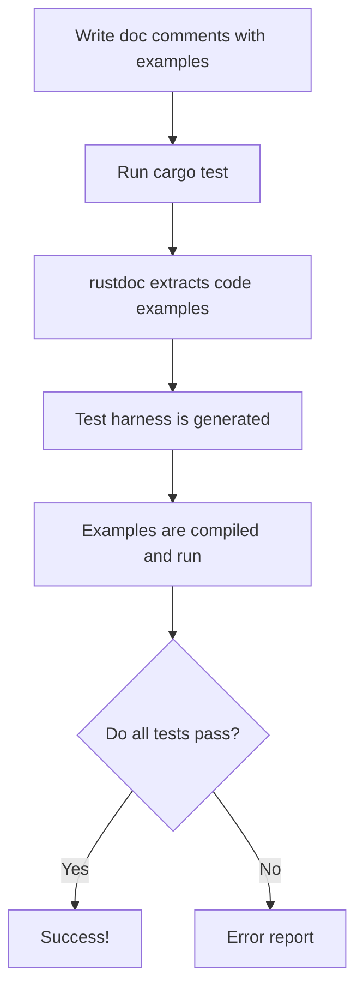

# Rust Doc Tests

## Introduction

Documentation is a crucial part of any programming language ecosystem, and Rust takes it to the next level with **doc tests**. Doc tests are a unique feature in Rust that allow you to write code examples in your documentation comments that are automatically executed as tests when you run your test suite.

This approach ensures that:
- Your documentation stays up-to-date with your code
- Code examples in your documentation actually work
- Your documentation serves as an additional layer of tests

In this guide, we'll explore how to write, run, and debug doc tests in Rust, making your documentation both more reliable and more useful to other developers.

## Writing Your First Doc Test

Doc tests are written inside documentation comments in Rust. These comments start with three slashes (`///`) for documenting items or with `//!` for documenting modules.

Let's write a simple function with a doc test:

```rust
/// Adds two numbers and returns the result.
///
/// # Examples
///
/// ```
/// let result = my_crate::add(2, 3);
/// assert_eq!(result, 5);
/// ```
pub fn add(a: i32, b: i32) -> i32 {
    a + b
}
```

The code block inside the documentation comment will be run as a test when you execute `cargo test`.

## How Doc Tests Work

When you run `cargo test`, Rust's documentation tool, `rustdoc`, performs the following steps:

1. Extracts code examples from your documentation comments
2. Generates a test harness that compiles and runs each example
3. Reports any failures just like regular tests



## Doc Test Structure and Syntax

### Basic Structure

Doc tests can be included in any documentation comment. The most common places to add them are:

```rust
/// Documentation for a function, struct, enum, etc.
/// 
/// # Examples
///
/// ```
/// // Your example code here
/// ```

//! Documentation for the current module
//!
//! ```
//! // Your example code here
//! ```
```

### Specifying Imports

In doc tests, Rust automatically adds some common imports and brings your crate into scope. However, you might need to add specific imports:

```rust
/// Returns the square of a number.
///
/// # Examples
///
/// ```
/// use my_crate::math::square;
/// 
/// assert_eq!(square(4), 16);
/// ```
pub fn square(x: i32) -> i32 {
    x * x
}
```

### Hiding Code Lines

Sometimes you need setup code in your examples that isn't relevant to the documentation. You can hide these lines using `# ` at the beginning:

```rust
/// Converts a string to uppercase.
///
/// # Examples
///
/// ```
/// # use my_crate::strings::to_uppercase;
/// let result = to_uppercase("hello");
/// assert_eq!(result, "HELLO");
/// ```
pub fn to_uppercase(s: &str) -> String {
    s.to_uppercase()
}
```

The line with `# ` will be executed but won't appear in the generated documentation.

## Advanced Doc Test Features

### Specifying Expected Errors

You can demonstrate how your code handles errors by showing examples that are expected to fail:

```rust
/// Divides two numbers.
///
/// # Examples
///
/// ```
/// let result = my_crate::divide(10, 2);
/// assert_eq!(result, Ok(5));
///
/// // Demonstrating error handling
/// let error = my_crate::divide(10, 0);
/// assert!(error.is_err());
/// ```
///
/// ```should_panic
/// // This will panic
/// my_crate::divide(10, 0).unwrap();
/// ```
pub fn divide(a: i32, b: i32) -> Result<i32, &'static str> {
    if b == 0 {
        Err("Cannot divide by zero")
    } else {
        Ok(a / b)
    }
}
```

The `should_panic` attribute tells rustdoc that the test is expected to panic.

### Ignoring Tests

If you need to include a code example that shouldn't be run as a test, you can use the `ignore` attribute:

```rust
/// This function makes an external API call.
///
/// # Examples
///
/// ```ignore
/// let response = my_crate::fetch_data("https://api.example.com/data");
/// println!("Received: {}", response);
/// ```
pub fn fetch_data(url: &str) -> String {
    // Implementation omitted
    String::new()
}
```

### No-Run Examples

For examples that should compile but not execute (useful for examples that take a long time or have external dependencies):

```rust
/// Processes a large dataset.
///
/// # Examples
///
/// ```no_run
/// let result = my_crate::process_large_dataset("path/to/large/file.csv");
/// println!("Processing complete: {} records", result.count);
/// ```
pub fn process_large_dataset(path: &str) -> ProcessResult {
    // Implementation omitted
    ProcessResult { count: 0 }
}

pub struct ProcessResult {
    pub count: usize,
}
```

### Compile-Fail Examples

To show examples of code that shouldn't compile:

```rust
/// This function only accepts positive numbers.
///
/// # Examples
///
/// ```
/// let result = my_crate::square_root(16.0);
/// assert_eq!(result, 4.0);
/// ```
///
/// ```compile_fail
/// // This won't compile because we're passing a negative number
/// let result = my_crate::square_root(-16.0);
/// ```
pub fn square_root(x: f64) -> f64 {
    assert!(x >= 0.0, "Cannot calculate square root of negative number");
    x.sqrt()
}
```

## Running Doc Tests

To run doc tests, use the standard `cargo test` command:

```bash
# Run all tests including doc tests
cargo test

# Run only the doc tests
cargo test --doc
```

## Debugging Doc Tests

When doc tests fail, the error message includes the line number in the documentation comment where the failure occurred. You can add debug prints to help troubleshoot:

```rust
/// Calculates the factorial of a number.
///
/// # Examples
///
/// ```
/// let result = my_crate::factorial(5);
/// println!("Factorial result: {}", result); // Debug print
/// assert_eq!(result, 120);
/// ```
pub fn factorial(n: u64) -> u64 {
    if n == 0 {
        1
    } else {
        n * factorial(n - 1)
    }
}
```

## Best Practices for Doc Tests

1. **Start simple**: Begin with basic examples that show the most common use cases
2. **Show complete examples**: Include all necessary imports and setup
3. **Cover edge cases**: Demonstrate how your code handles errors and special cases
4. **Use assertions**: Make sure your examples verify the expected behavior
5. **Keep examples relevant**: Focus on demonstrating the functionality being documented
6. **Test all public APIs**: Every public function, method, and type should have at least one doc test

## Real-World Applications

### Example 1: A Configuration Parser

Let's create a more complex example showing a configuration parser with doc tests:

```rust
/// A parser for configuration files.
pub struct ConfigParser {
    config_path: String,
}

impl ConfigParser {
    /// Creates a new ConfigParser with the given configuration file path.
    ///
    /// # Examples
    ///
    /// ```
    /// use my_crate::config::ConfigParser;
    ///
    /// let parser = ConfigParser::new("config.toml");
    /// assert_eq!(parser.get_path(), "config.toml");
    /// ```
    pub fn new(config_path: &str) -> Self {
        ConfigParser {
            config_path: config_path.to_string(),
        }
    }

    /// Returns the configuration file path.
    ///
    /// # Examples
    ///
    /// ```
    /// # use my_crate::config::ConfigParser;
    /// # let parser = ConfigParser::new("config.toml");
    /// let path = parser.get_path();
    /// assert_eq!(path, "config.toml");
    /// ```
    pub fn get_path(&self) -> &str {
        &self.config_path
    }

    /// Parses the configuration file and returns the configuration values.
    ///
    /// # Examples
    ///
    /// ```no_run
    /// # use my_crate::config::ConfigParser;
    /// let parser = ConfigParser::new("config.toml");
    /// let config = parser.parse().unwrap();
    ///
    /// // Access configuration values
    /// let server_port = config.get("server.port").unwrap();
    /// assert_eq!(server_port, "8080");
    /// ```
    ///
    /// # Errors
    ///
    /// Returns an error if the configuration file cannot be read or parsed.
    ///
    /// ```should_panic
    /// # use my_crate::config::ConfigParser;
    /// // This will fail because the file doesn't exist
    /// let parser = ConfigParser::new("nonexistent.toml");
    /// parser.parse().unwrap(); // This will panic
    /// ```
    pub fn parse(&self) -> Result<Config, &'static str> {
        // Implementation omitted
        Ok(Config {})
    }
}

/// Represents a parsed configuration.
pub struct Config {}

impl Config {
    /// Gets a configuration value.
    ///
    /// # Examples
    ///
    /// ```
    /// # use my_crate::config::{Config, ConfigParser};
    /// # let config = Config::default();
    /// let value = config.get("server.host").unwrap_or("localhost");
    /// assert_eq!(value, "localhost");
    /// ```
    pub fn get(&self, key: &str) -> Option<&str> {
        // Implementation omitted
        None
    }
}

impl Default for Config {
    fn default() -> Self {
        Config {}
    }
}
```

### Example 2: A Vector Utility Library

Here's another example showing a utility library for vector operations:

```rust
/// A utility library for vector operations.
pub mod vector {
    /// Calculates the dot product of two vectors.
    ///
    /// # Examples
    ///
    /// ```
    /// use my_crate::vector;
    ///
    /// let v1 = vec![1, 2, 3];
    /// let v2 = vec![4, 5, 6];
    ///
    /// let dot_product = vector::dot_product(&v1, &v2);
    /// assert_eq!(dot_product, 32); // 1*4 + 2*5 + 3*6 = 32
    /// ```
    ///
    /// # Panics
    ///
    /// Panics if the vectors have different lengths.
    ///
    /// ```should_panic
    /// # use my_crate::vector;
    /// let v1 = vec![1, 2, 3];
    /// let v2 = vec![4, 5];
    ///
    /// // This will panic because the vectors have different lengths
    /// vector::dot_product(&v1, &v2);
    /// ```
    pub fn dot_product(v1: &[i32], v2: &[i32]) -> i32 {
        assert_eq!(v1.len(), v2.len(), "Vectors must have the same length");
        
        v1.iter().zip(v2.iter()).map(|(a, b)| a * b).sum()
    }

    /// Normalizes a vector.
    ///
    /// # Examples
    ///
    /// ```
    /// use my_crate::vector;
    ///
    /// let v = vec![3.0, 4.0];
    /// let normalized = vector::normalize(&v);
    ///
    /// // The length of the normalized vector should be approximately 1
    /// let length = (normalized[0].powi(2) + normalized[1].powi(2)).sqrt();
    /// assert!((length - 1.0).abs() < 1e-10);
    ///
    /// // The direction should be preserved
    /// assert!((normalized[0] - 0.6).abs() < 1e-10); // 3/5
    /// assert!((normalized[1] - 0.8).abs() < 1e-10); // 4/5
    /// ```
    ///
    /// # Panics
    ///
    /// Panics if the vector has zero length or contains only zeros.
    ///
    /// ```should_panic
    /// # use my_crate::vector;
    /// // This will panic because the vector contains only zeros
    /// vector::normalize(&vec![0.0, 0.0]);
    /// ```
    pub fn normalize(v: &[f64]) -> Vec<f64> {
        let length: f64 = v.iter().map(|x| x.powi(2)).sum::<f64>().sqrt();
        assert!(length > 0.0, "Cannot normalize a zero vector");
        
        v.iter().map(|x| x / length).collect()
    }
}
```

## Summary

Doc tests are a powerful feature in Rust that allow you to:

1. Ensure your documentation is accurate and up-to-date
2. Provide working code examples to users of your library
3. Add an additional layer of testing to your codebase

By writing good doc tests, you make your code more reliable and more approachable for new users. The effort you put into documentation testing pays off both in code quality and in the user experience for developers using your code.

## Additional Resources

Here are some resources to help you learn more about doc tests in Rust:

- [The Rust Book: Documentation Tests](https://doc.rust-lang.org/book/ch14-02-publishing-to-crates-io.html#documentation-comments-as-tests)
- [Rust by Example: Documentation](https://doc.rust-lang.org/rust-by-example/meta/doc.html)
- [Rustdoc Book](https://doc.rust-lang.org/rustdoc/index.html)

## Exercises

1. **Basic Doc Test**: Create a simple function that converts Celsius to Fahrenheit and add a doc test to verify it works correctly.

2. **Error Handling**: Write a function that validates an email address and returns a `Result`. Include doc tests showing both successful validation and error cases.

3. **Complex Example**: Create a data structure (like a stack or queue) with multiple methods, and write doc tests for each method showing how they interact.

4. **Test Attributes**: Practice using different test attributes (`should_panic`, `no_run`, `ignore`) in your doc tests.

5. **Update Existing Code**: Take an existing Rust function or module and add comprehensive doc tests to improve its documentation.