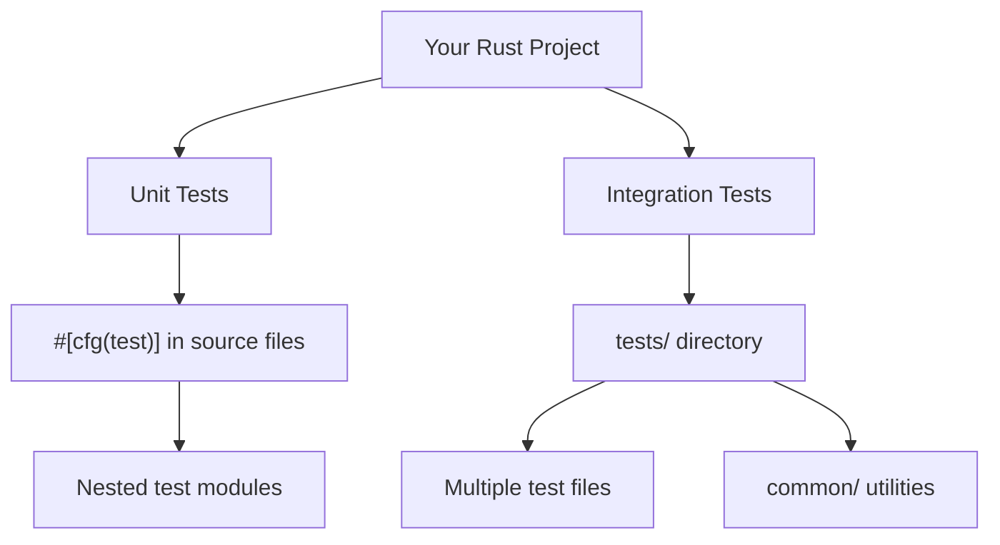

# Rust Test Organization

Testing is a crucial part of software development, and Rust provides a robust testing framework built right into the language. However, as your projects grow in complexity, organizing your tests becomes increasingly important. Well-organized tests are easier to maintain, understand, and expand upon.

## Introduction to Test Organization in Rust

When you first start writing tests in Rust, you might place them directly alongside your code using the `#[test]` attribute. This works well for small projects, but as your codebase grows, maintaining hundreds of scattered tests becomes challenging.

Rust offers several patterns and tools for organizing your tests effectively:

1. **Unit Tests**: Tests placed in the same file as the code they're testing
2. **Integration Tests**: Tests in a separate `tests` directory
3. **Test Modules**: Organizing tests within modules
4. **Test Utilities**: Shared testing code

Let's explore each of these approaches in detail.

## Unit Tests with `#[cfg(test)]`

Unit tests in Rust are typically placed in the same file as the code they test. This is made possible by using the `#[cfg(test)]` attribute, which tells the compiler to include the code only when running tests.

### Basic Example

```rust
// src/lib.rs
pub fn add(a: i32, b: i32) -> i32 {
    a + b
}

#[cfg(test)]
mod tests {
    use super::*;

    #[test]
    fn test_add() {
        assert_eq!(add(2, 3), 5);
        assert_eq!(add(-1, 1), 0);
        assert_eq!(add(0, 0), 0);
    }
}
```

When you run `cargo test`, Rust compiles and executes the test function, producing output like:

```
running 1 test
test tests::test_add ... ok

test result: ok. 1 passed; 0 failed; 0 ignored; 0 measured; 0 filtered out
```

### Organizing Multiple Unit Tests

As you add more tests, organize them by functionality:

```rust
// src/lib.rs
pub fn add(a: i32, b: i32) -> i32 {
    a + b
}

pub fn subtract(a: i32, b: i32) -> i32 {
    a - b
}

#[cfg(test)]
mod tests {
    use super::*;

    mod arithmetic {
        use super::*;

        #[test]
        fn test_add() {
            assert_eq!(add(2, 3), 5);
        }

        #[test]
        fn test_subtract() {
            assert_eq!(subtract(5, 2), 3);
        }
    }
}
```

This creates a clearer organization with tests grouped by functionality. Running tests now shows:

```
running 2 tests
test tests::arithmetic::test_add ... ok
test tests::arithmetic::test_subtract ... ok

test result: ok. 2 passed; 0 failed; 0 ignored; 0 measured; 0 filtered out
```

## Integration Tests in a Separate Directory

Integration tests verify that multiple parts of your library work together correctly. Unlike unit tests, integration tests are placed in a separate `tests` directory at the same level as `src`.

### Directory Structure

```
my_project/
├── Cargo.toml
├── src/
│   └── lib.rs
└── tests/
    ├── integration_test.rs
    └── common/
        └── mod.rs
```

### Basic Integration Test Example

```rust
// tests/integration_test.rs
use my_project; // This imports your crate

#[test]
fn test_add_and_double() {
    let sum = my_project::add(2, 3);
    let doubled = sum * 2;
    assert_eq!(doubled, 10);
}
```

Each file in the `tests` directory is compiled as a separate crate. Running `cargo test` now shows:

```
running 1 test
test test_add_and_double ... ok

test result: ok. 1 passed; 0 failed; 0 ignored; 0 measured; 0 filtered out
```

### Sharing Test Utilities

For shared test functionality, create a `common` module:

```rust
// tests/common/mod.rs
pub fn setup() -> String {
    // Common setup code
    String::from("test environment")
}
```

Use it in your tests:

```rust
// tests/another_test.rs
mod common;

#[test]
fn test_with_common_setup() {
    let env = common::setup();
    assert_eq!(env, "test environment");
}
```

## Test Organization Patterns

Here are some recommended patterns for organizing your tests:

### 1. Mirror Your Source Structure

```
src/
├── models/
│   ├── user.rs
│   └── product.rs
└── utils/
    └── math.rs

tests/
├── models/
│   ├── user_test.rs
│   └── product_test.rs
└── utils/
    └── math_test.rs
```

This pattern makes it easy to find tests related to specific components.

### 2. Group by Functionality

```rust
#[cfg(test)]
mod tests {
    use super::*;

    mod creation {
        use super::*;
        // Tests for object creation
    }

    mod validation {
        use super::*;
        // Tests for validation logic
    }

    mod conversion {
        use super::*;
        // Tests for type conversion
    }
}
```

### 3. Test Tables for Similar Test Cases

```rust
#[test]
fn test_addition_cases() {
    let test_cases = vec![
        (1, 1, 2),
        (5, -5, 0),
        (100, 50, 150),
        (-30, -20, -50),
    ];

    for (a, b, expected) in test_cases {
        assert_eq!(add(a, b), expected, "Testing add({}, {})", a, b);
    }
}
```

## Using Test Attributes for Organization

Rust provides several attributes to help organize and control test execution:

### `#[ignore]`

Mark tests that are slow or resource-intensive:

```rust
#[test]
#[ignore]
fn expensive_test() {
    // This test won't run unless specifically requested
}
```

Run ignored tests with:

```
cargo test -- --ignored
```

### `#[should_panic]`

Test that a function panics under certain conditions:

```rust
#[test]
#[should_panic(expected = "division by zero")]
fn test_divide_by_zero() {
    let _result = 5 / 0; // This should panic
}
```

### Test Organization Workflow

Here's a visual representation of how different test types are organized:



## Practical Example: Building a Math Library

Let's see a complete example of organizing tests for a simple math library:

```rust
// src/lib.rs
pub mod arithmetic {
    pub fn add(a: i32, b: i32) -> i32 {
        a + b
    }

    pub fn subtract(a: i32, b: i32) -> i32 {
        a - b
    }

    pub fn multiply(a: i32, b: i32) -> i32 {
        a * b
    }

    pub fn divide(a: i32, b: i32) -> Result<i32, String> {
        if b == 0 {
            return Err(String::from("Division by zero"));
        }
        Ok(a / b)
    }
}

#[cfg(test)]
mod unit_tests {
    use super::arithmetic::*;

    mod addition {
        use super::*;

        #[test]
        fn test_positive_numbers() {
            assert_eq!(add(2, 3), 5);
        }

        #[test]
        fn test_negative_numbers() {
            assert_eq!(add(-2, -3), -5);
        }

        #[test]
        fn test_mixed_numbers() {
            assert_eq!(add(-2, 5), 3);
        }
    }

    mod division {
        use super::*;

        #[test]
        fn test_valid_division() {
            assert_eq!(divide(10, 2), Ok(5));
        }

        #[test]
        fn test_division_by_zero() {
            assert_eq!(divide(10, 0), Err(String::from("Division by zero")));
        }
    }
}
```

And an integration test:

```rust
// tests/arithmetic_integration.rs
use math_library::arithmetic::{add, multiply};

#[test]
fn test_combined_operations() {
    // Test that we can combine operations
    let a = 5;
    let b = 10;
    
    let sum = add(a, b);
    let product = multiply(sum, 2);
    
    assert_eq!(product, 30);
}
```

## Running Specific Tests

As your test suite grows, you'll often want to run only specific tests:

```bash
# Run all tests
cargo test

# Run tests with names containing "addition"
cargo test addition

# Run a specific test
cargo test test_positive_numbers

# Run tests in a specific module
cargo test unit_tests::addition
```

## Best Practices for Test Organization

1. **Keep tests close to code**: Unit tests should be near the code they test
2. **Group related tests**: Use modules to organize tests by functionality
3. **Test file naming**: Use clear naming conventions like `feature_test.rs`
4. **Separate test utilities**: Move common test code to shared modules
5. **Use descriptive test names**: Names should describe what's being tested
6. **Independent tests**: Each test should be able to run in isolation
7. **Balance between unit and integration tests**: Use both for comprehensive coverage

## Summary

Organizing your Rust tests effectively is crucial for maintaining a healthy, testable codebase. By leveraging Rust's built-in testing features—including test modules, integration tests, and test attributes—you can create a test structure that scales with your project.

Remember these key points:
- Use `#[cfg(test)]` modules for unit tests within source files
- Create a `tests/` directory for integration tests
- Organize tests into logical groups using nested modules
- Share common test functionality through modules
- Use test attributes to control test behavior

## Additional Resources

- [Rust Book: Writing Tests](https://doc.rust-lang.org/book/ch11-01-writing-tests.html)
- [Rust By Example: Testing](https://doc.rust-lang.org/rust-by-example/testing.html)
- [Rust API Guidelines: Testing](https://rust-lang.github.io/api-guidelines/documentation.html#examples-use-cargo-test-t1)

## Exercises

1. Convert an existing project's tests to use nested test modules
2. Create shared test utilities for database setup in integration tests
3. Implement a test table pattern for a function with multiple edge cases
4. Set up an integration test that verifies multiple components working together
5. Use the `#[ignore]` attribute to mark resource-intensive tests and run them separately