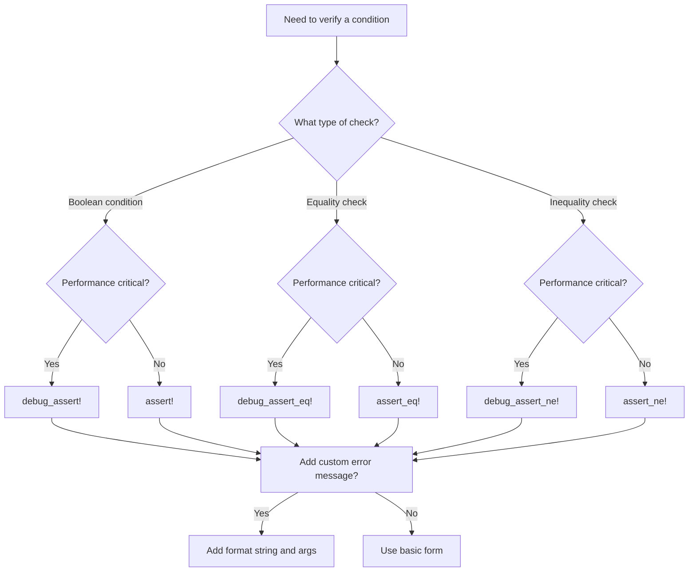

# Rust Assert Macros

## Introduction

Assertion macros are essential tools in the Rust programming ecosystem that help developers validate assumptions and verify code correctness. In Rust, assertions are implemented as macros that check if a given condition is true and panic if it's not, making them invaluable for both testing and debugging.

This guide will introduce you to Rust's assertion macros, explain how they work, and demonstrate their practical applications. By the end, you'll understand how to use these powerful tools to write more robust and reliable Rust code.

## What Are Assert Macros?

Assert macros in Rust are conditional checks that verify whether a specified condition evaluates to `true`. If the condition is `false`, the program will panic with an informative error message. These macros are primarily used for:

- Validating assumptions in your code
- Verifying function inputs and outputs
- Writing test cases to ensure code correctness
- Debugging to catch issues early

## Core Assert Macros in Rust

Rust provides several assertion macros, each serving a specific purpose:

### 1. `assert!` Macro

The most basic assertion macro that checks if a boolean expression is `true`.

```rust
fn main() {
    let x = 5;
    assert!(x < 10);  // This passes because 5 < 10 is true
    
    // This would panic:
    // assert!(x > 10);  // Panic: assertion failed: x > 10
}
```

When an assertion fails, Rust provides a helpful error message showing the expression that failed:

```
thread 'main' panicked at 'assertion failed: x > 10', src/main.rs:5:5
```

### 2. `assert_eq!` Macro

Compares two expressions for equality and panics if they aren't equal.

```rust
fn main() {
    let result = 2 + 2;
    assert_eq!(result, 4);  // Passes because 2 + 2 = 4
    
    // This would panic:
    // assert_eq!(result, 5);  // Panic: assertion failed: `(left == right)`
    //                        // left: `4`, right: `5`
}
```

Output when the assertion fails:

```
thread 'main' panicked at 'assertion failed: `(left == right)`
  left: `4`,
 right: `5`', src/main.rs:5:5
```

### 3. `assert_ne!` Macro

The opposite of `assert_eq!` - checks that two expressions are not equal.

```rust
fn main() {
    let result = calculate_value();
    assert_ne!(result, 0);  // Passes if result is not 0
}

fn calculate_value() -> i32 {
    // Some calculation that shouldn't return 0
    42
}
```

### 4. Custom Error Messages

All assert macros accept an optional format string and arguments that will be displayed if the assertion fails:

```rust
fn main() {
    let user_id = 0;
    assert!(user_id > 0, "User ID cannot be zero or negative! Got: {}", user_id);
}
```

When this fails, it produces a more helpful error message:

```
thread 'main' panicked at 'User ID cannot be zero or negative! Got: 0', src/main.rs:3:5
```

## Debug vs. Release Behavior

An important detail to understand about Rust's assert macros:

- `assert!`, `assert_eq!`, and `assert_ne!` are **always enabled** in both debug and release builds
- The `debug_assert!` family of macros is **only enabled in debug builds** (when not using the `--release` flag)

### Debug Assertions

Rust provides debug-only versions of all assertion macros:

```rust
fn process_data(data: &[i32]) {
    debug_assert!(!data.is_empty(), "Data slice cannot be empty!");
    
    // Processing code...
}
```

These are useful for checks that are important during development but might impact performance in production:

- `debug_assert!` - Debug-only version of `assert!`
- `debug_assert_eq!` - Debug-only version of `assert_eq!`
- `debug_assert_ne!` - Debug-only version of `assert_ne!`

## Using Assert Macros in Testing

Assert macros are fundamental to Rust's testing framework. Here's how to use them in test functions:

```rust
#[cfg(test)]
mod tests {
    #[test]
    fn test_addition() {
        let result = 2 + 2;
        assert_eq!(result, 4);
    }
    
    #[test]
    fn test_subtraction() {
        let result = 5 - 3;
        assert_eq!(result, 2, "Subtraction failed! 5 - 3 should be 2, got {}", result);
    }
}
```

## Practical Examples

Let's explore some real-world applications of assert macros:

### Example 1: Input Validation

```rust
fn calculate_percentage(value: f64, total: f64) -> f64 {
    // Validate inputs using assertions
    assert!(value >= 0.0, "Value must be non-negative: {}", value);
    assert!(total > 0.0, "Total must be positive: {}", total);
    assert!(value <= total, "Value ({}) cannot exceed total ({})", value, total);
    
    (value / total) * 100.0
}

fn main() {
    let percent = calculate_percentage(25.0, 100.0);
    println!("Percentage: {}%", percent);  // Outputs: Percentage: 25%
    
    // This would panic:
    // let invalid = calculate_percentage(150.0, 100.0);
}
```

### Example 2: Data Structure Invariants

```rust
struct Rectangle {
    width: u32,
    height: u32,
}

impl Rectangle {
    fn new(width: u32, height: u32) -> Self {
        // Ensure we don't create invalid rectangles
        assert!(width > 0, "Width must be positive, got {}", width);
        assert!(height > 0, "Height must be positive, got {}", height);
        
        Rectangle { width, height }
    }
    
    fn area(&self) -> u32 {
        // We can safely multiply because we've guaranteed
        // neither dimension is zero
        self.width * self.height
    }
}

fn main() {
    let rect = Rectangle::new(10, 5);
    println!("Rectangle area: {}", rect.area());  // Rectangle area: 50
    
    // This would panic:
    // let invalid_rect = Rectangle::new(0, 5);
}
```

### Example 3: Algorithm Preconditions

```rust
fn binary_search(sorted_array: &[i32], target: i32) -> Option<usize> {
    // Verify the array is sorted
    debug_assert!(sorted_array.windows(2).all(|w| w[0] <= w[1]), 
                 "Binary search requires a sorted array");
    
    // Binary search implementation...
    let mut low = 0;
    let mut high = sorted_array.len();
    
    while low < high {
        let mid = low + (high - low) / 2;
        let value = sorted_array[mid];
        
        if value == target {
            return Some(mid);
        } else if value < target {
            low = mid + 1;
        } else {
            high = mid;
        }
    }
    
    None
}

fn main() {
    let numbers = [1, 3, 5, 7, 9, 11, 13];
    if let Some(index) = binary_search(&numbers, 7) {
        println!("Found 7 at index {}", index);  // Found 7 at index 3
    }
}
```

## When to Use Each Macro

Here's a quick reference for choosing the right assert macro:

| Macro | Use When | Example |
|-------|----------|---------|
| `assert!` | You need to check a boolean condition | `assert!(age >= 18)` |
| `assert_eq!` | You need to verify two values are equal | `assert_eq!(sum, 10)` |
| `assert_ne!` | You need to ensure two values are different | `assert_ne!(user_id, 0)` |
| `debug_assert!` family | You want checks only during development | `debug_assert!(list.len() > 0)` |

## Assert Macro Decision Flow



## Best Practices

1. **Be Specific**: Write assertions with clear conditions that check exactly what you need.

2. **Add Custom Messages**: Include descriptive error messages to make debugging easier.

3. **Check Invariants**: Use assertions to verify critical assumptions and data structure invariants.

4. **Balance Performance**: Use `debug_assert!` for checks that might impact release performance.

5. **Don't Overuse**: Assertions are for checking exceptional conditions, not for normal control flow.

6. **Test Edge Cases**: Include assertions that verify boundary conditions and edge cases.

## Summary

Rust's assert macros are powerful tools that help you write more robust code by clearly expressing and verifying your assumptions. They provide immediate feedback when conditions aren't met, making bugs easier to find and fix.

Key takeaways:
- Use `assert!` for general boolean conditions
- Use `assert_eq!` and `assert_ne!` for equality checks 
- Add custom error messages to make debugging easier
- Use debug assertions (`debug_assert!` family) for performance-critical code
- Assertions help document your code by making assumptions explicit

## Exercises

1. Write a function that calculates the factorial of a number and uses assertions to verify the input is valid.

2. Create a `Stack` data structure with `push`, `pop`, and `peek` methods that use assertions to check for stack underflow and overflow.

3. Implement a function that finds the maximum value in an array, using assertions to handle edge cases (like empty arrays).

4. Write test cases for a simple calculator function that uses all three types of assert macros.

## Additional Resources

- [Rust Documentation on Assertions](https://doc.rust-lang.org/std/macro.assert.html)
- [The Rust Programming Language Book - Testing Chapter](https://doc.rust-lang.org/book/ch11-00-testing.html)
- [Rust By Example - Testing](https://doc.rust-lang.org/rust-by-example/testing.html)
- [Rust Design Patterns - Verifying Pre/Post Conditions](https://rust-unofficial.github.io/patterns/)