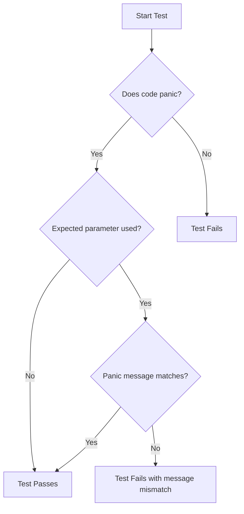

# Rust Should Panic

When developing robust applications, ensuring your code fails correctly is just as important as making sure it succeeds correctly. In Rust, the `panic!` mechanism provides a way for your program to terminate when it encounters an unrecoverable error. But how do you test that your code panics when it should? This is where the `should_panic` attribute comes in.

## Introduction to `should_panic`

In Rust's testing framework, the `should_panic` attribute allows you to verify that your code panics under specific conditions. This is particularly useful when you want to ensure that your error handling works correctly.

For example, if you're writing a function that divides two numbers, you might want to ensure it panics when the denominator is zero. The `should_panic` attribute allows you to write tests that verify this behavior.

## Basic Usage of `should_panic`

Let's start with a simple example. Imagine we have a function that verifies a user's age:

```rust
pub fn verify_age(age: u8) {
    if age < 18 {
        panic!("Age must be 18 or older");
    }
    println!("Age verification successful!");
}
```

To test that this function panics when the age is less than 18, we can write a test using the `should_panic` attribute:

```rust
#[cfg(test)]
mod tests {
    use super::*;

    #[test]
    #[should_panic]
    fn test_verify_age_too_young() {
        verify_age(16); // This should panic
    }

    #[test]
    fn test_verify_age_valid() {
        verify_age(18); // This should not panic
    }
}
```

In this example:
- `#[test]` marks a function as a test
- `#[should_panic]` indicates that we expect the test to panic
- The test passes if the code panics, and fails if it doesn't

When you run this test with `cargo test`, you'll see output like:

```
running 2 tests
test tests::test_verify_age_valid ... ok
test tests::test_verify_age_too_young ... ok

test result: ok. 2 passed; 0 failed; 0 ignored; 0 measured; 0 filtered out
```

Both tests pass: `test_verify_age_valid` because it doesn't panic, and `test_verify_age_too_young` because it panics as expected.

## Checking Panic Messages with `expected`

The basic `should_panic` attribute verifies that the code panics, but it doesn't check the panic message. To ensure your code is panicking for the right reason, you can use the `expected` parameter:

```rust
#[test]
#[should_panic(expected = "Age must be 18 or older")]
fn test_verify_age_too_young() {
    verify_age(16);
}
```

This test will pass only if:
1. The code panics
2. The panic message contains the specified text

If the code panics with a different message, the test will fail.

Let's see what happens if we change our function to use a different panic message:

```rust
pub fn verify_age(age: u8) {
    if age < 18 {
        panic!("User is underage!");
    }
    println!("Age verification successful!");
}
```

Now our test will fail because the panic message doesn't match the expected string:

```
running 2 tests
test tests::test_verify_age_valid ... ok
test tests::test_verify_age_too_young ... FAILED

failures:

---- tests::test_verify_age_too_young stdout ----
thread 'tests::test_verify_age_too_young' panicked at 'User is underage!', src/lib.rs:3:9
note: panic did not contain expected string
      expected: 'Age must be 18 or older'
       actual: 'User is underage!'
```

This helps ensure that your code is panicking for the exact reason you expect it to.

## Working with Complex Panic Conditions

Let's explore a more complex example. Imagine we're building a simple bank account application:

```rust
pub struct BankAccount {
    balance: i32,
}

impl BankAccount {
    pub fn new(initial_balance: i32) -> Result<Self, String> {
        if initial_balance < 0 {
            return Err("Initial balance cannot be negative".to_string());
        }
        Ok(Self { balance: initial_balance })
    }

    pub fn withdraw(&mut self, amount: i32) {
        if amount <= 0 {
            panic!("Withdrawal amount must be positive");
        }
        if amount > self.balance {
            panic!("Insufficient funds: tried to withdraw {} with balance of {}", amount, self.balance);
        }
        self.balance -= amount;
    }
}
```

We can test the panic conditions for our `withdraw` method:

```rust
#[cfg(test)]
mod tests {
    use super::*;

    #[test]
    #[should_panic(expected = "Withdrawal amount must be positive")]
    fn test_negative_withdrawal() {
        let mut account = BankAccount::new(100).unwrap();
        account.withdraw(-50);
    }

    #[test]
    #[should_panic(expected = "Insufficient funds")]
    fn test_excessive_withdrawal() {
        let mut account = BankAccount::new(100).unwrap();
        account.withdraw(150);
    }
}
```

Here we're testing two different panic conditions:
1. That attempting to withdraw a negative amount causes a panic
2. That attempting to withdraw more than the account balance causes a panic

Note that for the second test, we're only checking for the prefix "Insufficient funds" rather than the entire message, since the message includes variable values.

## When to Use `should_panic`

Use `should_panic` when:

1. **Validating error handling**: Ensure your code correctly panics for invalid input
2. **Testing boundary conditions**: Verify edge cases are handled properly
3. **Testing invariant violations**: Make sure your code maintains its integrity

It's particularly useful when:
- You're designing APIs and want to ensure they fail gracefully
- You're implementing critical functions where invalid states must be caught immediately
- You want to document expected failure behavior

## Real-World Example: Vector Access

Let's look at a real-world example involving vector access in Rust:

```rust
pub fn get_element(vec: &Vec<i32>, index: usize) -> i32 {
    // Using [] access which will panic if index is out of bounds
    vec[index]
}

pub fn get_element_safe(vec: &Vec<i32>, index: usize) -> Option<i32> {
    // Using get() which returns None if index is out of bounds
    vec.get(index).copied()
}
```

We can test both functions:

```rust
#[cfg(test)]
mod tests {
    use super::*;

    #[test]
    #[should_panic(expected = "index out of bounds")]
    fn test_get_element_out_of_bounds() {
        let vec = vec![1, 2, 3];
        get_element(&vec, 5);
    }

    #[test]
    fn test_get_element_safe_out_of_bounds() {
        let vec = vec![1, 2, 3];
        assert_eq!(get_element_safe(&vec, 5), None);
    }
}
```

This demonstrates two approaches to the same problem:
1. `get_element` uses direct indexing, which panics for invalid indices
2. `get_element_safe` returns an `Option`, which is a more "Rustic" way to handle potential errors

## Diagnosing Test Failures

If a `should_panic` test fails, it could be for two reasons:
1. The code didn't panic when it should have
2. The code panicked with a different message than expected

Let's visualize the test execution flow:



## Best Practices for `should_panic` Tests

1. **Be specific with expected messages**: Use the `expected` parameter to ensure your code is panicking for the right reason
2. **Keep panic messages consistent**: Don't change panic messages without updating tests
3. **Test one panic condition per test**: Each test should focus on one specific panic scenario
4. **Consider alternatives to panic**: In many cases, using `Result` or `Option` types is more appropriate than panicking
5. **Name your tests clearly**: The test name should describe the failing condition

## Alternative Approaches

While `should_panic` is useful, Rust offers other approaches for testing error conditions:

### Using `Result` instead of panic

```rust
pub fn divide(a: i32, b: i32) -> Result<i32, String> {
    if b == 0 {
        return Err("Division by zero".to_string());
    }
    Ok(a / b)
}

#[test]
fn test_divide_by_zero() {
    let result = divide(10, 0);
    assert!(result.is_err());
    assert_eq!(result.unwrap_err(), "Division by zero");
}
```

### Testing with `catch_unwind`

For more control, you can use `std::panic::catch_unwind`:

```rust
use std::panic::{catch_unwind, AssertUnwindSafe};

#[test]
fn test_panic_with_catch_unwind() {
    let result = catch_unwind(|| {
        let v = vec![1, 2, 3];
        v[5] // This should panic
    });
    
    assert!(result.is_err());
}
```

## Summary

The `should_panic` attribute is a powerful tool in Rust's testing arsenal that allows you to verify that your code panics when it should. By using this attribute, you can:

- Ensure your error handling works correctly
- Test boundary conditions and edge cases
- Verify that invariants are maintained
- Document expected failure behavior

Remember that while panicking is sometimes necessary, Rust's type system generally encourages using `Result` and `Option` types for error handling. The `should_panic` attribute is most useful for testing scenarios where panic is the appropriate response to an unrecoverable error.

## Additional Resources

- [Rust Official Documentation on Testing](https://doc.rust-lang.org/book/ch11-01-writing-tests.html)
- [Rust By Example: Testing](https://doc.rust-lang.org/rust-by-example/testing/unit_testing.html)
- [The Rust Programming Language (Book): Error Handling](https://doc.rust-lang.org/book/ch09-00-error-handling.html)

## Exercises

1. Write a function `create_array` that takes a size parameter and returns an array of that size. The function should panic if the size is greater than 100. Write tests to verify this behavior.

2. Implement a `Stack` struct with `push` and `pop` methods. The `pop` method should panic when the stack is empty. Write tests using `should_panic` to verify this behavior.

3. Modify the `BankAccount` example to add a `transfer` method that moves money between accounts. Ensure it panics appropriately for invalid operations, and write tests to verify this.

4. Create a function that processes a string containing JSON. It should panic if the JSON is invalid. Use `should_panic` to test various invalid JSON inputs.

5. Compare the use of `panic!` versus returning a `Result` for error handling in a small project. Write tests for both approaches and evaluate the pros and cons.