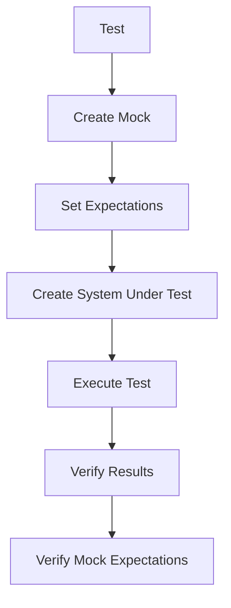

# Rust Test Mocking

## Introduction

When writing tests in Rust, you'll often need to test components that depend on other parts of your system. These dependencies might be:
- Complex to set up in a test environment
- Slow to execute (like database operations)
- Have side effects you want to avoid during testing
- Not yet implemented

This is where **mocking** comes in. Mocking is a technique where you replace real dependencies with simplified versions that you can control. These simplified versions (called "mocks") mimic the behavior of real components but in a way that's more suitable for testing.

In this guide, we'll explore how to implement mocking in Rust tests, from basic concepts to practical examples.

## Understanding Test Doubles

Before diving into implementation details, it's important to understand different types of test doubles:

1. **Dummy objects**: Placeholders that don't actually do anything
2. **Stubs**: Provide predetermined responses to calls
3. **Spies**: Record calls made to them for verification
4. **Mocks**: Verify that specific methods were called with expected parameters
5. **Fake objects**: Working implementations, but not suitable for production

For this guide, we'll focus primarily on mocks, but the techniques can be adapted for other types of test doubles.

## Rust's Approach to Mocking

Unlike some other languages, Rust doesn't have built-in mocking support. This is mainly because Rust's type system and ownership rules require a different approach to mocking.

There are several strategies for mocking in Rust:

1. Using trait objects and manual implementations
2. Using mocking libraries like `mockall` or `mockito`
3. Dependency injection through generic parameters
4. Using custom test configurations

Let's explore each of these approaches.

## Basic Mocking with Traits

Rust's trait system is perfect for implementing mocks. By defining interfaces as traits, we can create both real implementations and mock implementations.

### Example: Creating a Basic Mock

Let's start with a simple example. Imagine we have a `UserRepository` that fetches user data:

```rust
// The trait defining our interface
pub trait UserRepository {
    fn get_user_by_id(&self, id: u64) -> Option<User>;
    fn save_user(&self, user: &User) -> Result<(), String>;
}

// A User struct
#[derive(Debug, Clone, PartialEq)]
pub struct User {
    pub id: u64,
    pub name: String,
    pub email: String,
}

// A service that uses the repository
pub struct UserService<T: UserRepository> {
    repository: T,
}

impl<T: UserRepository> UserService<T> {
    pub fn new(repository: T) -> Self {
        Self { repository }
    }
    
    pub fn get_user_display_name(&self, id: u64) -> String {
        match self.repository.get_user_by_id(id) {
            Some(user) => user.name,
            None => "Unknown User".to_string(),
        }
    }
}
```

Now, let's create a mock implementation for testing:

```rust
// A mock implementation for testing
#[derive(Default)]
struct MockUserRepository {
    // We'll control what gets returned
    users: std::collections::HashMap<u64, User>,
}

impl MockUserRepository {
    fn new() -> Self {
        Self {
            users: std::collections::HashMap::new(),
        }
    }
    
    fn mock_user(&mut self, user: User) {
        self.users.insert(user.id, user);
    }
}

impl UserRepository for MockUserRepository {
    fn get_user_by_id(&self, id: u64) -> Option<User> {
        self.users.get(&id).cloned()
    }
    
    fn save_user(&self, _user: &User) -> Result<(), String> {
        // For this mock, we'll just return success
        Ok(())
    }
}
```

And finally, let's write a test that uses our mock:

```rust
#[cfg(test)]
mod tests {
    use super::*;
    
    #[test]
    fn test_get_user_display_name() {
        // Arrange
        let mut repository = MockUserRepository::new();
        repository.mock_user(User {
            id: 1,
            name: "Jane Doe".to_string(),
            email: "jane@example.com".to_string(),
        });
        
        let service = UserService::new(repository);
        
        // Act
        let name = service.get_user_display_name(1);
        
        // Assert
        assert_eq!(name, "Jane Doe");
    }
    
    #[test]
    fn test_unknown_user() {
        // Arrange
        let repository = MockUserRepository::new();
        let service = UserService::new(repository);
        
        // Act
        let name = service.get_user_display_name(999);
        
        // Assert
        assert_eq!(name, "Unknown User");
    }
}
```

This approach has several advantages:
- It uses Rust's standard features (no external dependencies)
- It creates type-safe mocks
- It provides compile-time verification

However, it can be verbose for complex interfaces.

## Using Mockall Library

For more complex scenarios, consider using a mocking library like `mockall`, which provides macros to automate mock creation.

First, add mockall to your `Cargo.toml`:

```toml
[dev-dependencies]
mockall = "0.11.3"
```

Here's how to use mockall to create mocks:

```rust
use mockall::predicate::*;
use mockall::*;

// First, we annotate our trait to auto-generate mocks
#[cfg_attr(test, automock)]
pub trait WeatherService {
    fn get_temperature(&self, city: &str) -> Result<f32, String>;
}

// Our component under test
pub struct WeatherReporter<T: WeatherService> {
    service: T,
}

impl<T: WeatherService> WeatherReporter<T> {
    pub fn new(service: T) -> Self {
        Self { service }
    }
    
    pub fn format_weather_report(&self, city: &str) -> String {
        match self.service.get_temperature(city) {
            Ok(temp) => format!("The temperature in {} is {} degrees Celsius", city, temp),
            Err(_) => format!("Unable to get temperature for {}", city),
        }
    }
}

#[cfg(test)]
mod tests {
    use super::*;
    
    #[test]
    fn test_successful_report() {
        // Arrange
        let mut mock_service = MockWeatherService::new();
        
        // Set expectations
        mock_service
            .expect_get_temperature()
            .with(eq("Berlin"))
            .times(1)
            .returning(|_| Ok(20.5));
        
        let reporter = WeatherReporter::new(mock_service);
        
        // Act
        let report = reporter.format_weather_report("Berlin");
        
        // Assert
        assert_eq!(report, "The temperature in Berlin is 20.5 degrees Celsius");
    }
    
    #[test]
    fn test_error_report() {
        // Arrange
        let mut mock_service = MockWeatherService::new();
        
        // Set expectations
        mock_service
            .expect_get_temperature()
            .with(eq("Unknown"))
            .times(1)
            .returning(|_| Err("City not found".to_string()));
        
        let reporter = WeatherReporter::new(mock_service);
        
        // Act
        let report = reporter.format_weather_report("Unknown");
        
        // Assert
        assert_eq!(report, "Unable to get temperature for Unknown");
    }
}
```

The `mockall` library provides several advantages:
- Reduces boilerplate code
- Supports expectations and verification
- Provides powerful matching for arguments
- Can mock both traits and structs

## Dependency Injection with Generics

Rust's generics provide an elegant way to inject dependencies, making your code more testable.

```rust
// Define a trait for the dependency
pub trait Logger {
    fn log(&self, message: &str);
}

// Our component using the dependency
pub struct OrderProcessor<L: Logger> {
    logger: L,
}

impl<L: Logger> OrderProcessor<L> {
    pub fn new(logger: L) -> Self {
        Self { logger }
    }
    
    pub fn process_order(&self, order_id: &str) -> Result<(), String> {
        self.logger.log(&format!("Processing order: {}", order_id));
        
        // Do some processing...
        
        self.logger.log(&format!("Order {} processed successfully", order_id));
        Ok(())
    }
}

// For testing, we create a mock logger
#[cfg(test)]
mod tests {
    use super::*;
    use std::cell::RefCell;
    
    struct MockLogger {
        log_messages: RefCell<Vec<String>>,
    }
    
    impl MockLogger {
        fn new() -> Self {
            Self {
                log_messages: RefCell::new(Vec::new()),
            }
        }
        
        fn get_logs(&self) -> Vec<String> {
            self.log_messages.borrow().clone()
        }
    }
    
    impl Logger for MockLogger {
        fn log(&self, message: &str) {
            self.log_messages.borrow_mut().push(message.to_string());
        }
    }
    
    #[test]
    fn test_process_order() {
        // Arrange
        let logger = MockLogger::new();
        let processor = OrderProcessor::new(logger);
        
        // Act
        let result = processor.process_order("12345");
        
        // Assert
        assert!(result.is_ok());
        let logs = processor.logger.get_logs();
        assert_eq!(logs.len(), 2);
        assert_eq!(logs[0], "Processing order: 12345");
        assert_eq!(logs[1], "Order 12345 processed successfully");
    }
}
```

This approach:
- Makes dependencies explicit in the type system
- Allows easy substitution of real implementations with mocks
- Works well with Rust's ownership model

## Mocking HTTP Services with mockito

For testing code that makes HTTP requests, the `mockito` crate is very useful:

```rust
// Add to Cargo.toml:
// [dev-dependencies]
// mockito = "0.31.0"
// reqwest = { version = "0.11", features = ["blocking"] }

pub struct UserClient {
    base_url: String,
}

impl UserClient {
    pub fn new(base_url: &str) -> Self {
        Self {
            base_url: base_url.to_string(),
        }
    }
    
    pub fn get_user(&self, id: u64) -> Result<User, String> {
        let url = format!("{}/users/{}", self.base_url, id);
        
        // Using reqwest for HTTP requests
        let response = reqwest::blocking::get(&url)
            .map_err(|e| format!("Request failed: {}", e))?;
            
        if !response.status().is_success() {
            return Err(format!("Request failed with status: {}", response.status()));
        }
        
        response.json::<User>()
            .map_err(|e| format!("Failed to parse response: {}", e))
    }
}

#[cfg(test)]
mod tests {
    use super::*;
    use mockito::mock;
    
    #[test]
    fn test_get_user() {
        // Arrange
        let mock_user = User {
            id: 42,
            name: "Test User".to_string(),
            email: "test@example.com".to_string(),
        };
        
        // Setup mock server
        let _m = mock("GET", "/users/42")
            .with_status(200)
            .with_header("content-type", "application/json")
            .with_body(serde_json::to_string(&mock_user).unwrap())
            .create();
            
        let client = UserClient::new(&mockito::server_url());
        
        // Act
        let result = client.get_user(42);
        
        // Assert
        assert!(result.is_ok());
        let user = result.unwrap();
        assert_eq!(user.id, 42);
        assert_eq!(user.name, "Test User");
        assert_eq!(user.email, "test@example.com");
    }
    
    #[test]
    fn test_user_not_found() {
        // Setup mock server to return 404
        let _m = mock("GET", "/users/999")
            .with_status(404)
            .create();
            
        let client = UserClient::new(&mockito::server_url());
        
        // Act
        let result = client.get_user(999);
        
        // Assert
        assert!(result.is_err());
        assert!(result.unwrap_err().contains("Request failed with status: 404"));
    }
}
```

This approach is ideal for testing components that interact with external services.

## Best Practices for Mocking in Rust

### 1. Design for Testability

- Use traits to define interfaces
- Keep functions small and focused
- Use dependency injection
- Avoid global state

### 2. Mock at the Right Level

- Mock at the boundaries of your system
- Don't mock everything - use real implementations when practical
- Mock IO, external services, and complex dependencies

### 3. Structure Your Tests

```rust
// Common pattern for tests
#[test]
fn test_something() {
    // Arrange: set up your mocks and test data
    let mock = ...;
    
    // Act: call the function you're testing
    let result = function_under_test();
    
    // Assert: verify the results and mock interactions
    assert_eq!(result, expected);
    mock.verify();
}
```

### 4. Mocking Flow Visualization

Here's a diagram showing the typical flow when using mocks in testing:



## Challenges and Solutions

### Challenge 1: Mocking Structs

Unlike traits, structs in Rust are concrete types and cannot be directly mocked. Solutions:

1. Use the façade pattern - wrap structs in traits
2. Use the `mockall::automock` macro for struct methods
3. Use dependency injection to pass mockable components

### Challenge 2: Mocking Static Methods

Static methods cannot be overridden in Rust. Solutions:

1. Wrap static methods in traits
2. Use function pointers or closures
3. Consider redesigning to avoid static methods

Example:

```rust
// Instead of:
struct Database {
    // fields...
}

impl Database {
    pub fn connect() -> Self {
        // Implementation...
    }
}

// Refactor to:
pub trait DatabaseConnector {
    fn connect(&self) -> Database;
}

struct RealDatabaseConnector;

impl DatabaseConnector for RealDatabaseConnector {
    fn connect(&self) -> Database {
        // Implementation...
    }
}

// Now can be mocked in tests
```

### Challenge 3: Mocking Standard Library Functions

Standard library functions cannot be directly mocked. Solutions:

1. Create wrapper traits for standard library functionality
2. Use libraries like `std-mock` for specific cases
3. Use conditional compilation for test-specific implementations

## Practical Example: A Complete Application

Let's tie everything together with a more complete example of a weather application:

```rust
use std::error::Error;

// Define our domain entities
#[derive(Debug, Clone, PartialEq)]
pub struct WeatherData {
    pub city: String,
    pub temperature: f32,
    pub conditions: String,
    pub timestamp: i64,
}

// Define our service interfaces
pub trait WeatherApi {
    fn fetch_current_weather(&self, city: &str) -> Result<WeatherData, Box<dyn Error>>;
}

pub trait CacheStorage {
    fn get(&self, key: &str) -> Option<WeatherData>;
    fn set(&self, key: &str, data: WeatherData);
}

// Our main service that we want to test
pub struct WeatherService<A: WeatherApi, C: CacheStorage> {
    api: A,
    cache: C,
    cache_duration_secs: i64,
}

impl<A: WeatherApi, C: CacheStorage> WeatherService<A, C> {
    pub fn new(api: A, cache: C, cache_duration_secs: i64) -> Self {
        Self {
            api,
            cache,
            cache_duration_secs,
        }
    }
    
    pub fn get_weather(&self, city: &str) -> Result<WeatherData, Box<dyn Error>> {
        // Check cache first
        if let Some(cached) = self.cache.get(city) {
            let current_time = chrono::Utc::now().timestamp();
            
            // Check if cache is still valid
            if current_time - cached.timestamp < self.cache_duration_secs {
                return Ok(cached);
            }
        }
        
        // If not in cache or expired, fetch from API
        let weather = self.api.fetch_current_weather(city)?;
        
        // Update cache
        self.cache.set(city, weather.clone());
        
        Ok(weather)
    }
}

// Now let's test this

#[cfg(test)]
mod tests {
    use super::*;
    use mockall::{predicate::*, *};
    use std::collections::HashMap;
    use std::sync::Mutex;
    
    // Mock the WeatherApi
    mock! {
        WeatherApi {}
        impl WeatherApi for WeatherApi {
            fn fetch_current_weather(&self, city: &str) -> Result<WeatherData, Box<dyn Error>>;
        }
    }
    
    // A simple implementation of CacheStorage for testing
    struct MockCache {
        data: Mutex<HashMap<String, WeatherData>>,
    }
    
    impl MockCache {
        fn new() -> Self {
            Self {
                data: Mutex::new(HashMap::new()),
            }
        }
    }
    
    impl CacheStorage for MockCache {
        fn get(&self, key: &str) -> Option<WeatherData> {
            self.data.lock().unwrap().get(key).cloned()
        }
        
        fn set(&self, key: &str, data: WeatherData) {
            self.data.lock().unwrap().insert(key.to_string(), data);
        }
    }
    
    #[test]
    fn test_get_weather_from_api() {
        // Arrange
        let mut mock_api = MockWeatherApi::new();
        let cache = MockCache::new();
        
        let test_data = WeatherData {
            city: "London".to_string(),
            temperature: 15.5,
            conditions: "Cloudy".to_string(),
            timestamp: chrono::Utc::now().timestamp(),
        };
        
        // Set expectations on the mock
        mock_api
            .expect_fetch_current_weather()
            .with(eq("London"))
            .times(1)
            .return_once(move |_| Ok(test_data.clone()));
        
        let service = WeatherService::new(mock_api, cache, 3600);
        
        // Act
        let result = service.get_weather("London");
        
        // Assert
        assert!(result.is_ok());
        let weather = result.unwrap();
        assert_eq!(weather.city, "London");
        assert_eq!(weather.temperature, 15.5);
        assert_eq!(weather.conditions, "Cloudy");
    }
    
    #[test]
    fn test_get_weather_from_cache() {
        // Arrange
        let mock_api = MockWeatherApi::new();
        let cache = MockCache::new();
        
        // Populate cache with test data
        let cached_data = WeatherData {
            city: "Paris".to_string(),
            temperature: 20.0,
            conditions: "Sunny".to_string(),
            timestamp: chrono::Utc::now().timestamp(),
        };
        
        cache.set("Paris", cached_data.clone());
        
        // Note: No expectations on the mock API because it shouldn't be called
        
        let service = WeatherService::new(mock_api, cache, 3600);
        
        // Act
        let result = service.get_weather("Paris");
        
        // Assert
        assert!(result.is_ok());
        let weather = result.unwrap();
        assert_eq!(weather.city, "Paris");
        assert_eq!(weather.temperature, 20.0);
        assert_eq!(weather.conditions, "Sunny");
    }
    
    #[test]
    fn test_expired_cache() {
        // Arrange
        let mut mock_api = MockWeatherApi::new();
        let cache = MockCache::new();
        
        // Add expired data to cache
        let expired_timestamp = chrono::Utc::now().timestamp() - 7200; // 2 hours old
        let cached_data = WeatherData {
            city: "Berlin".to_string(),
            temperature: 10.0,
            conditions: "Rainy".to_string(),
            timestamp: expired_timestamp,
        };
        
        cache.set("Berlin", cached_data);
        
        // New data from API
        let api_data = WeatherData {
            city: "Berlin".to_string(),
            temperature: 12.0,
            conditions: "Partly Cloudy".to_string(),
            timestamp: chrono::Utc::now().timestamp(),
        };
        
        // Set expectations on the mock - should be called since cache is expired
        mock_api
            .expect_fetch_current_weather()
            .with(eq("Berlin"))
            .times(1)
            .return_once(move |_| Ok(api_data.clone()));
        
        let service = WeatherService::new(mock_api, cache, 3600); // 1 hour cache
        
        // Act
        let result = service.get_weather("Berlin");
        
        // Assert
        assert!(result.is_ok());
        let weather = result.unwrap();
        assert_eq!(weather.temperature, 12.0); // Should be new data, not cached
        assert_eq!(weather.conditions, "Partly Cloudy");
    }
}
```

## Summary

Mocking is a powerful technique for writing effective unit tests in Rust. In this guide, we've explored:

1. **Basic concepts** of test doubles and mocking
2. **Manual mocking** using Rust's trait system
3. **Using mocking libraries** like `mockall` and `mockito`
4. **Dependency injection** with generics
5. **Best practices** for mocking in Rust
6. **Solutions to common challenges**
7. **Practical examples** showing mocking in real-world applications

By applying these techniques, you can create more isolated, reliable, and maintainable tests for your Rust applications.

## Additional Resources

- [mockall crate documentation](https://docs.rs/mockall/latest/mockall/)
- [mockito crate documentation](https://docs.rs/mockito/latest/mockito/)
- [The Rust Programming Language Book: Testing chapter](https://doc.rust-lang.org/book/ch11-00-testing.html)
- [Test-driven development in Rust](https://blog.logrocket.com/test-driven-development-rust/)

## Exercises

1. Create a mock for a database interface that has methods for `create`, `read`, `update`, and `delete` operations.
2. Implement a test for a service that sends email notifications, without actually sending emails during tests.
3. Write tests for a file system service using mocks to avoid actual file operations.
4. Create a mock for an authentication service and test a component that requires authentication.
5. Implement tests for an API client that makes HTTP requests, using `mockito` to avoid real network calls.