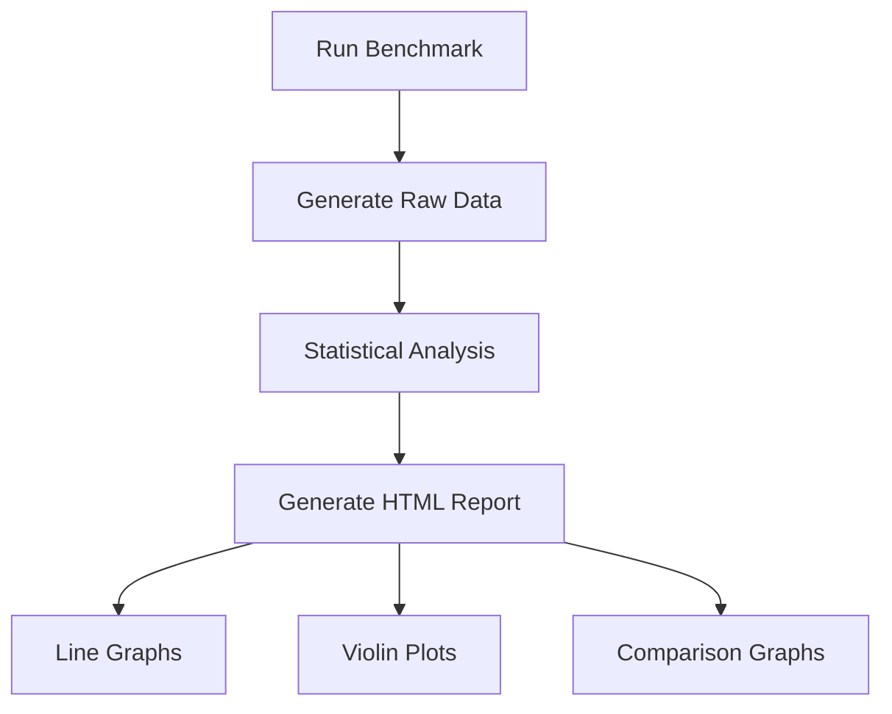

# Rust Benchmark Tests

## Introduction

Performance is often a critical aspect of software development, especially in systems programming languages like Rust. While functional correctness is verified through unit and integration tests, **benchmark tests** help us measure and optimize the performance of our code.

Benchmark tests in Rust allow developers to:
- Measure execution time of functions and code blocks
- Compare different implementations of the same functionality
- Detect performance regressions during development
- Make data-driven optimization decisions

In this guide, we'll explore how to write, run, and interpret benchmark tests in Rust, providing you with the tools to ensure your Rust code not only works correctly but also performs efficiently.

## Understanding Benchmark Tests

Benchmark tests measure the performance of your code, typically in terms of execution time. Unlike regular tests that verify functional correctness, benchmarks focus on how fast your code runs.

### Why Write Benchmark Tests?

- **Optimization**: Identify bottlenecks in your code
- **Comparison**: Compare different algorithms or implementations
- **Regression Detection**: Ensure code changes don't decrease performance
- **Decision Making**: Make informed choices based on actual performance metrics

## Setting Up Benchmark Tests in Rust

Rust's benchmark tests are currently only available in the nightly channel through the `test` feature. Let's set things up step by step.

### Prerequisites

1. Install Rust nightly:
```bash
rustup install nightly
```

2. Create a new Rust project or navigate to an existing one:
```bash
cargo new benchmark_example
cd benchmark_example
```

### Project Configuration

To enable benchmarks, update your `Cargo.toml` file:

```toml
[package]
name = "benchmark_example"
version = "0.1.0"
edition = "2021"

[dev-dependencies]
criterion = "0.5"

[[bench]]
name = "my_benchmark"
harness = false
```

This configuration:
- Adds [Criterion](https://github.com/bheisler/criterion.rs) as a development dependency (a popular benchmarking library for Rust)
- Creates a benchmark target named "my_benchmark" with the default test harness disabled

## Writing Your First Benchmark

Let's create a simple function to benchmark. Add this to your `src/lib.rs` file:

```rust
#[inline]
pub fn fibonacci(n: u64) -> u64 {
    match n {
        0 => 0,
        1 => 1,
        _ => fibonacci(n - 1) + fibonacci(n - 2),
    }
}

// Alternative implementation using iteration
#[inline]
pub fn fibonacci_iterative(n: u64) -> u64 {
    if n <= 1 {
        return n;
    }
    
    let mut a = 0;
    let mut b = 1;
    
    for _ in 2..=n {
        let temp = a + b;
        a = b;
        b = temp;
    }
    
    b
}
```

Now, create a `benches` directory and a file named `my_benchmark.rs` inside it:

```bash
mkdir -p benches
touch benches/my_benchmark.rs
```

Add the following code to `benches/my_benchmark.rs`:

```rust
use benchmark_example::*;
use criterion::{black_box, criterion_group, criterion_main, Criterion};

pub fn fibonacci_benchmark(c: &mut Criterion) {
    // Simple benchmark
    c.bench_function("fibonacci 10", |b| b.iter(|| fibonacci(black_box(10))));
    
    // Benchmark comparing two implementations
    let mut group = c.benchmark_group("fibonacci_comparison");
    group.bench_function("recursive", |b| b.iter(|| fibonacci(black_box(20))));
    group.bench_function("iterative", |b| b.iter(|| fibonacci_iterative(black_box(20))));
    group.finish();
}

criterion_group!(benches, fibonacci_benchmark);
criterion_main!(benches);
```

### Understanding the Code

1. `black_box` prevents the compiler from optimizing away the function call
2. `bench_function` runs a benchmarked function multiple times
3. `benchmark_group` groups related benchmarks for better comparison
4. `criterion_group` and `criterion_main` are macros for setting up the benchmark infrastructure

## Running Benchmark Tests

Run your benchmarks with:

```bash
cargo bench
```

Example output:

```
fibonacci 10          time:   [227.91 ns 229.39 ns 231.06 ns]
                        
fibonacci_comparison/recursive                                                            
                        time:   [27.518 µs 27.644 µs 27.791 µs]
fibonacci_comparison/iterative                                                           
                        time:   [12.839 ns 12.917 ns 12.998 ns]
```

### Interpreting the Results

The output shows:
- The benchmark name
- Time measurements in a [lower bound, estimate, upper bound] format
- Units (ns = nanoseconds, µs = microseconds, ms = milliseconds)

In our example, we can see that:
1. The recursive Fibonacci calculation for n=20 takes approximately 27.6 microseconds
2. The iterative implementation takes only 12.9 nanoseconds (about 2,000 times faster!)

## Advanced Benchmarking Techniques

### Parameterized Benchmarks

Test a function with multiple inputs:

```rust
pub fn parameterized_benchmark(c: &mut Criterion) {
    let mut group = c.benchmark_group("fibonacci_sizes");
    for size in [5, 10, 15, 20].iter() {
        group.bench_with_input(format!("iterative_{}", size), size, |b, &size| {
            b.iter(|| fibonacci_iterative(black_box(size)))
        });
    }
    group.finish();
}
```

### Throughput Benchmarks

Measure performance in terms of throughput:

```rust
use criterion::BenchmarkId;
use criterion::Throughput;

pub fn throughput_benchmark(c: &mut Criterion) {
    let mut group = c.benchmark_group("process_vector");
    
    for size in [1000, 10000, 100000].iter() {
        // Create input data
        let data = vec![1u64; *size];
        
        // Set throughput in bytes
        group.throughput(Throughput::Bytes(*size as u64 * std::mem::size_of::<u64>() as u64));
        
        group.bench_with_input(BenchmarkId::from_parameter(size), size, |b, &_| {
            b.iter(|| {
                // Example function that processes a vector
                black_box(data.iter().map(|&x| x * 2).sum::<u64>())
            })
        });
    }
    group.finish();
}
```

### Custom Measurements

Criterion allows for custom measurement types beyond just execution time:

```rust
pub fn memory_benchmark(c: &mut Criterion) {
    let mut group = c.benchmark_group("memory_usage");
    
    // This is a simplified example. In practice, measuring memory would require
    // custom measurement tools or libraries
    group.bench_function("allocation", |b| {
        b.iter(|| {
            // Allocate and use memory
            let v = black_box(vec![0u8; 1_000_000]);
            black_box(v.len())
        })
    });
    
    group.finish();
}
```

## Real-World Example: String Concatenation

Let's benchmark different ways to concatenate strings:

First, add these functions to `src/lib.rs`:

```rust
pub fn concat_with_push(strings: &[&str]) -> String {
    let mut result = String::new();
    for s in strings {
        result.push_str(s);
    }
    result
}

pub fn concat_with_format(strings: &[&str]) -> String {
    let mut result = String::new();
    for s in strings {
        result = format!("{}{}", result, s);
    }
    result
}

pub fn concat_with_join(strings: &[&str]) -> String {
    strings.join("")
}
```

Now, add this benchmark to `benches/my_benchmark.rs`:

```rust
pub fn string_concatenation_benchmark(c: &mut Criterion) {
    let strings = ["Hello", ", ", "World", "! ", "This", " ", "is", " ", "a", " ", "test"];
    
    let mut group = c.benchmark_group("string_concatenation");
    group.bench_function("push_str", |b| {
        b.iter(|| concat_with_push(black_box(&strings)))
    });
    group.bench_function("format", |b| {
        b.iter(|| concat_with_format(black_box(&strings)))
    });
    group.bench_function("join", |b| {
        b.iter(|| concat_with_join(black_box(&strings)))
    });
    group.finish();
}

// Update the criterion_group! macro
criterion_group!(benches, fibonacci_benchmark, string_concatenation_benchmark);
```

### Visualizing Results

Criterion automatically generates HTML reports with graphs in the `target/criterion` directory. These include:
- Line graphs showing performance over time
- Violin plots showing the distribution of measurements
- Comparison to previous runs



## Best Practices for Benchmark Tests

1. **Isolate Environment**: Run benchmarks on stable hardware with minimal background processes

2. **Multiple Iterations**: Run benchmarks multiple times to ensure consistency
   ```rust
   c.bench_function("my_function", |b| {
       b.iter_batched(
           || setup_test_data(),  // Setup code (not measured)
           |data| my_function(data),  // Benchmarked code
           criterion::BatchSize::SmallInput,
       )
   });
   ```

3. **Avoid Microbenchmarking Pitfalls**:
   - Be aware of compiler optimizations
   - Use `black_box` to prevent optimizations from invalidating results
   - Benchmark realistic use cases, not just isolated functions

4. **Compare Similar Things**: When comparing implementations, ensure they have the same inputs and outputs

5. **Version Control Benchmarks**: Keep benchmark code in version control to track performance over time

6. **Warm-up Runs**: Allow for warm-up iterations before measuring (Criterion handles this automatically)

## Other Benchmarking Libraries

While Criterion is the most popular benchmarking library for Rust, other options include:

1. **Built-in benchmark tests**: Require nightly Rust
   ```rust
   #![feature(test)]
   extern crate test;
   
   #[cfg(test)]
   mod tests {
       use super::*;
       use test::Bencher;
       
       #[bench]
       fn bench_fibonacci(b: &mut Bencher) {
           b.iter(|| fibonacci(20));
       }
   }
   ```

2. **test-bench**: A simpler alternative to Criterion
3. **iai**: Counts CPU instructions instead of measuring time (more stable across environments)

## Common Performance Bottlenecks in Rust

When using benchmark tests to optimize Rust code, look for these common issues:

1. **Excessive Allocation**: Creating too many objects on the heap
2. **Inefficient Algorithms**: Using O(n²) algorithms where O(n log n) would suffice
3. **Locks and Contention**: Synchronization overhead in multi-threaded code
4. **Inefficient I/O**: Blocking I/O operations or too many small operations
5. **Unnecessary Cloning**: Creating copies of data when references would suffice

## Summary

Benchmark tests are a powerful tool in the Rust developer's toolkit:

- They provide objective measurements of code performance
- They help identify bottlenecks and optimization opportunities
- They prevent performance regressions as code evolves
- They allow for data-driven decisions when choosing between implementations

By incorporating benchmark tests into your development workflow, you can ensure your Rust code not only functions correctly but also performs efficiently.

## Exercises

1. Write benchmark tests comparing different sorting algorithms (e.g., quicksort vs. mergesort) for various input sizes.

2. Create a benchmark to compare the performance of different data structures (Vec, LinkedList, HashSet) for your specific use case.

3. Benchmark the performance difference between using iterators and traditional for loops for a specific task.

4. Profile a function from one of your existing projects and use benchmark tests to measure the impact of your optimizations.

## Additional Resources

- [Criterion.rs Documentation](https://bheisler.github.io/criterion.rs/book/index.html)
- [Rust Performance Book](https://nnethercote.github.io/perf-book/)
- [The `test` crate documentation](https://doc.rust-lang.org/test/index.html)
- [Rust Cookbook: Benchmarking](https://rust-lang-nursery.github.io/rust-cookbook/development_tools/debugging/benchmarking.html)
- [Rust by Example: Benchmarking](https://doc.rust-lang.org/rust-by-example/testing/benchmark.html)