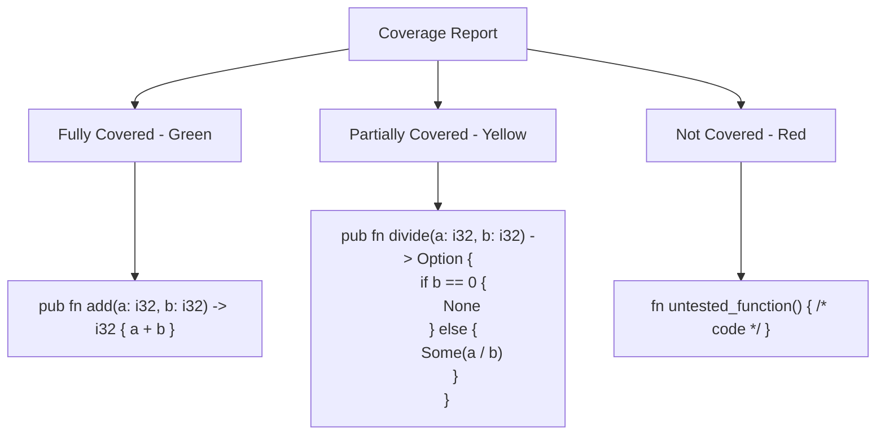

# Rust Test Coverage

## Introduction

Test coverage is a critical metric in software development that measures how much of your code is executed when your test suite runs. It helps you identify untested parts of your codebase, potentially revealing areas that might contain bugs or lack proper validation. In Rust programming, understanding and improving test coverage is essential for building reliable software.

This guide will walk you through the concept of test coverage in Rust, explain how to measure it, and provide practical techniques to improve your coverage. Whether you're new to Rust or looking to enhance your testing practices, this guide will help you ensure your code is thoroughly tested.

## Understanding Test Coverage

### What is Test Coverage?

Test coverage is a measurement that indicates what percentage of your code is executed when your tests run. It helps answer the question: "How much of my code is actually being tested?"

Coverage is typically measured across several dimensions:

- **Line coverage**: The percentage of code lines executed during testing
- **Branch coverage**: The percentage of decision branches (like if/else statements) that were executed
- **Function coverage**: The percentage of functions that were called during testing

### Why Test Coverage Matters in Rust

Rust's emphasis on safety and reliability makes test coverage particularly important. While Rust's compiler prevents many errors that would occur in other languages, it can't guarantee your code behaves as intended in all scenarios. That's where testing and coverage analysis come in.

Benefits of good test coverage in Rust:
- Identifies untested code paths that might contain logic errors
- Provides confidence when refactoring or adding new features
- Helps maintain Rust's promise of reliability
- Documents the expected behavior of your code

## Setting Up Test Coverage Tools

To measure test coverage in Rust, we need specialized tools. The most popular options are:

### 1. Grcov

[Grcov](https://github.com/mozilla/grcov) is a tool created by Mozilla that collects and aggregates code coverage data from various formats.

#### Installation

```bash
cargo install grcov
```

### 2. Tarpaulin

[Cargo-tarpaulin](https://github.com/xd009642/tarpaulin) is a code coverage tool specifically designed for Rust projects.

#### Installation

```bash
cargo install cargo-tarpaulin
```

For this guide, we'll focus on Tarpaulin as it's specifically designed for Rust and is easier to use for beginners.

## Measuring Test Coverage with Tarpaulin

Once you have Tarpaulin installed, measuring test coverage in your Rust project is straightforward.

### Basic Usage

Navigate to your Rust project directory and run:

```bash
cargo tarpaulin
```

This command will:
1. Compile your code with instrumentation for coverage monitoring
2. Run your tests
3. Generate a coverage report

### Example Output

```
Apr 12, 2023 15:27:33 Running cargo build
Apr 12, 2023 15:27:35 Running tests
Apr 12, 2023 15:27:36 Creating coverage report

|| Tested/Total Lines:
|| src/main.rs: 0/5
|| src/calculator.rs: 10/12
|| 
|| 10/17 (58.82%)
```

### Generating Different Report Formats

Tarpaulin supports multiple output formats:

```bash
# Generate an HTML report
cargo tarpaulin --out Html

# Generate XML reports (useful for CI systems)
cargo tarpaulin --out Xml

# Generate both HTML and XML reports
cargo tarpaulin --out Html --out Xml
```

The HTML report provides a visual representation of your code with coverage information, making it easy to identify untested lines.

## A Practical Example

Let's walk through a complete example to demonstrate test coverage in action. We'll create a simple calculator module and measure its test coverage.

### 1. Create a New Project

```bash
cargo new rust_coverage_demo
cd rust_coverage_demo
```

### 2. Implement a Calculator Module

Create a new file `src/calculator.rs`:

```rust
pub struct Calculator;

impl Calculator {
    pub fn add(a: i32, b: i32) -> i32 {
        a + b
    }

    pub fn subtract(a: i32, b: i32) -> i32 {
        a - b
    }

    pub fn multiply(a: i32, b: i32) -> i32 {
        a * b
    }

    pub fn divide(a: i32, b: i32) -> Option<i32> {
        if b == 0 {
            None
        } else {
            Some(a / b)
        }
    }
}
```

### 3. Update `src/main.rs` to Use the Calculator

```rust
mod calculator;

use calculator::Calculator;

fn main() {
    let a = 10;
    let b = 5;
    
    println!("{} + {} = {}", a, b, Calculator::add(a, b));
    println!("{} - {} = {}", a, b, Calculator::subtract(a, b));
    println!("{} * {} = {}", a, b, Calculator::multiply(a, b));
    
    match Calculator::divide(a, b) {
        Some(result) => println!("{} / {} = {}", a, b, result),
        None => println!("Cannot divide by zero"),
    }
}
```

### 4. Add Tests with Incomplete Coverage

Create tests in `src/calculator.rs`:

```rust
#[cfg(test)]
mod tests {
    use super::*;

    #[test]
    fn test_add() {
        assert_eq!(Calculator::add(2, 3), 5);
    }

    #[test]
    fn test_subtract() {
        assert_eq!(Calculator::subtract(5, 3), 2);
    }

    // Note: We're missing tests for multiply and divide!
}
```

### 5. Measure Initial Coverage

Run Tarpaulin to see the initial coverage:

```bash
cargo tarpaulin
```

Expected output (approximately):

```
|| Tested/Total Lines:
|| src/main.rs: 0/11
|| src/calculator.rs: 4/12
|| 
|| 4/23 (17.39%)
```

This shows we're only testing a small portion of our code.

### 6. Improve Coverage by Adding More Tests

Let's add tests for the remaining functions:

```rust
#[cfg(test)]
mod tests {
    use super::*;

    #[test]
    fn test_add() {
        assert_eq!(Calculator::add(2, 3), 5);
    }

    #[test]
    fn test_subtract() {
        assert_eq!(Calculator::subtract(5, 3), 2);
    }

    #[test]
    fn test_multiply() {
        assert_eq!(Calculator::multiply(2, 3), 6);
    }

    #[test]
    fn test_divide_valid() {
        assert_eq!(Calculator::divide(6, 3), Some(2));
    }

    #[test]
    fn test_divide_by_zero() {
        assert_eq!(Calculator::divide(6, 0), None);
    }
}
```

### 7. Measure Improved Coverage

Run Tarpaulin again:

```bash
cargo tarpaulin
```

Expected output (approximately):

```
|| Tested/Total Lines:
|| src/main.rs: 0/11
|| src/calculator.rs: 12/12
|| 
|| 12/23 (52.17%)
```

Now our `calculator.rs` has 100% coverage! The overall percentage is still low because we're not testing the `main.rs` file.

## Best Practices for Test Coverage in Rust

### 1. Focus on Logic, Not Just Lines

Don't obsess over reaching 100% line coverage. Instead, focus on testing:
- All logical branches in your code
- Edge cases and boundary conditions
- Error handling paths

### 2. Test Public APIs Thoroughly

Ensure all public functions and methods have comprehensive tests covering:
- Normal usage
- Edge cases
- Error conditions

### 3. Use Property-Based Testing

Tools like [proptest](https://github.com/AltSysrq/proptest) can automatically generate test cases, improving coverage by testing inputs you might not have considered.

```rust
use proptest::prelude::*;

proptest! {
    #[test]
    fn test_add_properties(a in -100..100, b in -100..100) {
        // Commutative property
        assert_eq!(Calculator::add(a, b), Calculator::add(b, a));
        
        // Identity property
        assert_eq!(Calculator::add(a, 0), a);
    }
}
```

### 4. Integrate Coverage in CI/CD Pipeline

Add test coverage to your continuous integration workflow:

```yaml
# .github/workflows/rust.yml
name: Rust

on: [push, pull_request]

jobs:
  test:
    runs-on: ubuntu-latest
    steps:
      - uses: actions/checkout@v3
      - name: Install Rust
        uses: actions-rs/toolchain@v1
        with:
          profile: minimal
          toolchain: stable
          override: true
      - name: Install cargo-tarpaulin
        run: cargo install cargo-tarpaulin
      - name: Run tests with coverage
        run: cargo tarpaulin --out Xml
      - name: Upload coverage to Codecov
        uses: codecov/codecov-action@v3
```

### 5. Write Testable Code

Design your Rust code with testability in mind:
- Separate logic from I/O
- Use dependency injection
- Create small, focused functions

## Understanding Coverage Reports

Let's look at how to interpret a coverage report. Here's a visual representation of what an HTML report might show:



Color coding in reports typically means:
- **Green**: Lines executed during tests
- **Yellow/Orange**: Branches partially covered
- **Red**: Code never executed during tests

## Common Issues and Solutions

### Issue: Main Function Not Covered

The `main()` function is typically not covered in test runs. This is normal, as the test harness doesn't execute it.

**Solution**: Extract logic from `main()` into testable functions:

```rust
// Before
fn main() {
    let args: Vec<String> = std::env::args().collect();
    // Complex logic here
}

// After
fn main() {
    let args: Vec<String> = std::env::args().collect();
    run_app(args);
}

pub fn run_app(args: Vec<String>) -> Result<(), String> {
    // Complex logic moved here, now testable
    Ok(())
}

#[cfg(test)]
mod tests {
    use super::*;
    
    #[test]
    fn test_run_app() {
        let args = vec!["program".to_string(), "arg1".to_string()];
        assert!(run_app(args).is_ok());
    }
}
```

### Issue: Conditional Compilation Blocks

Code within `#[cfg(feature = "...")]` blocks might not be covered if the feature isn't enabled during testing.

**Solution**: Set up separate test runs with different features enabled:

```bash
# Test with feature A enabled
cargo tarpaulin --features feature_a

# Test with feature B enabled
cargo tarpaulin --features feature_b
```

### Issue: Unsafe Code Coverage

Unsafe code blocks should be tested thoroughly, but you might be cautious about executing all paths.

**Solution**: Use careful testing of unsafe code:

```rust
unsafe fn potentially_dangerous_operation(ptr: *mut i32) -> i32 {
    if ptr.is_null() {
        return -1;
    }
    *ptr
}

#[cfg(test)]
mod tests {
    use super::*;
    
    #[test]
    fn test_null_ptr_handling() {
        let null_ptr: *mut i32 = std::ptr::null_mut();
        unsafe {
            assert_eq!(potentially_dangerous_operation(null_ptr), -1);
        }
    }
    
    #[test]
    fn test_valid_ptr() {
        let mut value = 42;
        let ptr = &mut value as *mut i32;
        unsafe {
            assert_eq!(potentially_dangerous_operation(ptr), 42);
        }
    }
}
```

## Improving Test Coverage

Once you've identified areas with poor coverage, here are strategies to improve it:

### 1. Use Table-Driven Tests

Create tables of inputs and expected outputs to test multiple scenarios concisely:

```rust
#[test]
fn test_calculator_operations() {
    let test_cases = vec![
        // (operation, a, b, expected_result)
        ("add", 5, 3, Ok(8)),
        ("subtract", 5, 3, Ok(2)),
        ("multiply", 5, 3, Ok(15)),
        ("divide", 6, 3, Ok(2)),
        ("divide", 6, 0, Err("Division by zero")),
    ];
    
    for (op, a, b, expected) in test_cases {
        let result = match op {
            "add" => Ok(Calculator::add(a, b)),
            "subtract" => Ok(Calculator::subtract(a, b)),
            "multiply" => Ok(Calculator::multiply(a, b)),
            "divide" => Calculator::divide(a, b)
                .ok_or("Division by zero"),
            _ => panic!("Unknown operation"),
        };
        
        assert_eq!(result, expected);
    }
}
```

### 2. Test Error Handling

Ensure you test error paths, not just the happy path:

```rust
pub fn parse_positive_number(input: &str) -> Result<u32, String> {
    match input.parse::<u32>() {
        Ok(n) if n > 0 => Ok(n),
        Ok(_) => Err("Number must be positive".to_string()),
        Err(_) => Err("Invalid number format".to_string()),
    }
}

#[cfg(test)]
mod tests {
    use super::*;
    
    #[test]
    fn test_parse_valid_positive() {
        assert_eq!(parse_positive_number("42"), Ok(42));
    }
    
    #[test]
    fn test_parse_zero() {
        assert_eq!(
            parse_positive_number("0"), 
            Err("Number must be positive".to_string())
        );
    }
    
    #[test]
    fn test_parse_invalid() {
        assert_eq!(
            parse_positive_number("not_a_number"), 
            Err("Invalid number format".to_string())
        );
    }
}
```

### 3. Refactor Complex Functions

Break down complex functions into smaller, more testable pieces:

```rust
// Before: Hard to test comprehensively
pub fn process_data(data: &[i32]) -> i32 {
    // complex logic with many branches and conditions
    // ...
}

// After: More testable
pub fn validate_data(data: &[i32]) -> Result<(), String> {
    // validation logic
    Ok(())
}

pub fn transform_data(data: &[i32]) -> Vec<i32> {
    // transformation logic
    data.iter().map(|&x| x * 2).collect()
}

pub fn aggregate_data(data: &[i32]) -> i32 {
    // aggregation logic
    data.iter().sum()
}

pub fn process_data(data: &[i32]) -> Result<i32, String> {
    validate_data(data)?;
    let transformed = transform_data(data);
    Ok(aggregate_data(&transformed))
}
```

## Summary

Test coverage is a valuable metric for ensuring the quality and reliability of your Rust code. By measuring and improving coverage, you can:

1. Identify untested code paths that might contain bugs
2. Gain confidence in your codebase's correctness
3. Make refactoring safer
4. Document expected behavior through tests

Remember that while high test coverage is desirable, the quality of tests matters more than the percentage. Focus on testing functionality and edge cases thoroughly, rather than just hitting every line of code.

## Additional Resources

- [Rust Testing Documentation](https://doc.rust-lang.org/book/ch11-00-testing.html) - Official Rust documentation on testing
- [Cargo Tarpaulin GitHub](https://github.com/xd009642/tarpaulin) - Documentation for the Tarpaulin coverage tool
- [Rust by Example: Testing](https://doc.rust-lang.org/rust-by-example/testing.html) - Examples of testing in Rust
- [proptest Crate](https://docs.rs/proptest) - Property-based testing in Rust
- [Code Coverage Best Practices](https://testing.googleblog.com/2020/08/code-coverage-best-practices.html) - Google Testing Blog's insights on code coverage

## Exercises

1. **Basic Coverage Analysis**:
   - Create a simple Rust project with at least three functions
   - Write tests for only two of them
   - Run Tarpaulin and identify the untested function
   - Add tests to achieve 100% coverage

2. **Branch Coverage Challenge**:
   - Implement a function with multiple if/else branches
   - Write tests that achieve line coverage but miss some branches
   - Run Tarpaulin with `--branch` flag
   - Improve your tests to cover all branches

3. **Refactoring for Testability**:
   - Take a complex function with poor test coverage
   - Refactor it into smaller, more focused functions
   - Write tests for each function
   - Verify improved coverage with Tarpaulin

4. **Integration with CI**:
   - Set up a GitHub repository for a Rust project
   - Configure GitHub Actions to run Tarpaulin on every push
   - Add a coverage badge to your README.md
   - Establish a minimum coverage threshold