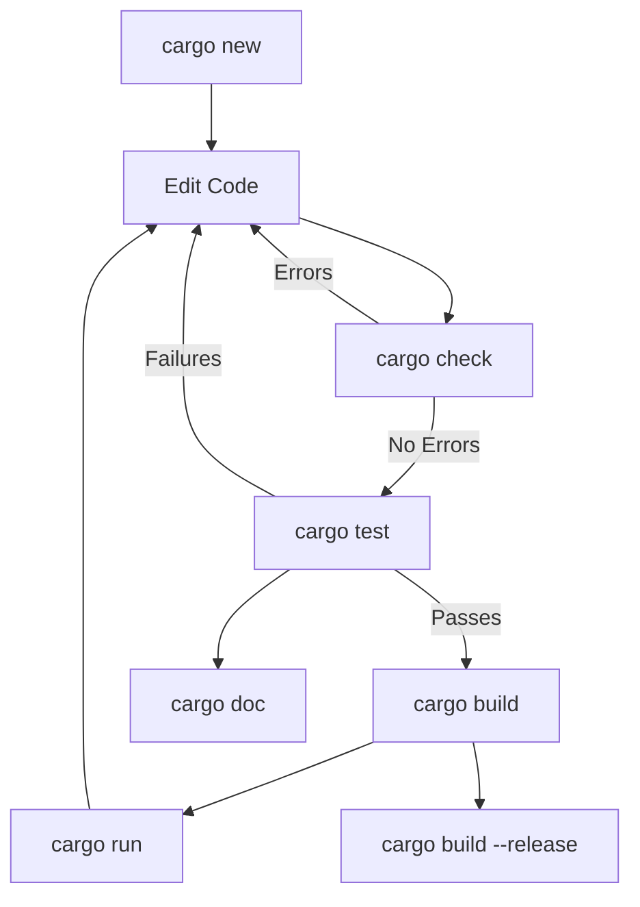

# Rust Cargo Commands

## Introduction

Cargo is Rust's built-in package manager and build system. Think of it as npm for JavaScript or pip for Python, but with additional features that make it central to the Rust development workflow. Cargo handles dependencies, compiles your code, runs tests, generates documentation, and more.

In this guide, we'll explore the most important Cargo commands that every Rust developer should know. Whether you're just starting with Rust or looking to level up your workflow, understanding these commands will significantly improve your development experience.

## Basic Cargo Commands

### Creating a New Project

To start a new Rust project, use the `cargo new` command:

```bash
$ cargo new hello_world
     Created binary (application) `hello_world` package
```

This creates a new directory called `hello_world` with the following structure:

```
hello_world/
├── Cargo.toml
└── src/
    └── main.rs
```

The `Cargo.toml` file is your project's manifest, containing metadata and dependencies. The `src/main.rs` file contains a simple "Hello, World!" program:

```rust
fn main() {
    println!("Hello, world!");
}
```

For a library project instead of a binary, use the `--lib` flag:

```bash
$ cargo new my_library --lib
     Created library `my_library` package
```

### Building Your Project

To compile your project, use:

```bash
$ cargo build
   Compiling hello_world v0.1.0 (/path/to/hello_world)
    Finished dev [unoptimized + debuginfo] target(s) in 0.72s
```

This creates an executable in the `target/debug` directory. For a release build with optimizations:

```bash
$ cargo build --release
   Compiling hello_world v0.1.0 (/path/to/hello_world)
    Finished release [optimized] target(s) in 1.21s
```

The release build is optimized for speed but takes longer to compile. The executable will be in `target/release`.

### Running Your Program

To build and run your program in one step:

```bash
$ cargo run
    Finished dev [unoptimized + debuginfo] target(s) in 0.02s
     Running `target/debug/hello_world`
Hello, world!
```

If your code hasn't changed since the last build, Cargo skips the compilation step. You can also run a specific binary in your project:

```bash
$ cargo run --bin my_other_binary
```

For release mode:

```bash
$ cargo run --release
```

### Checking Your Code Without Building

To check if your code compiles without producing an executable:

```bash
$ cargo check
    Checking hello_world v0.1.0 (/path/to/hello_world)
    Finished dev [unoptimized + debuginfo] target(s) in 0.11s
```

This is faster than `cargo build` and useful for catching errors during development.

## Managing Dependencies

### Adding Dependencies

To add a dependency, edit your `Cargo.toml` file:

```toml
[dependencies]
rand = "0.8.5"
```

Cargo will automatically download and compile the dependency when you next build.

### Updating Dependencies

To update dependencies to their latest compatible versions:

```bash
$ cargo update
    Updating crates.io index
    Updating rand v0.8.4 -> v0.8.5
```

You can also update a specific dependency:

```bash
$ cargo update -p rand
```

### Viewing Dependencies

To see a tree of dependencies:

```bash
$ cargo tree
hello_world v0.1.0 (/path/to/hello_world)
└── rand v0.8.5
    ├── libc v0.2.126
    ├── rand_chacha v0.3.1
    │   ├── ppv-lite86 v0.2.16
    │   └── rand_core v0.6.3
    └── rand_core v0.6.3
        └── getrandom v0.2.7
            ├── cfg-if v1.0.0
            └── libc v0.2.126
```

## Testing with Cargo

### Running Tests

Cargo makes testing straightforward:

```bash
$ cargo test
   Compiling hello_world v0.1.0 (/path/to/hello_world)
    Finished test [unoptimized + debuginfo] target(s) in 0.75s
     Running unittests src/main.rs (target/debug/deps/hello_world-16d8ec76a9e083cf)

running 1 test
test tests::it_works ... ok

test result: ok. 1 passed; 0 failed; 0 ignored; 0 measured; 0 filtered out; finished in 0.00s
```

Here's an example of a simple test in Rust:

```rust
#[cfg(test)]
mod tests {
    #[test]
    fn it_works() {
        assert_eq!(2 + 2, 4);
    }
}
```

### Running Specific Tests

To run tests containing a specific string in their name:

```bash
$ cargo test it_works
```

### Documentation Tests

Rust code in documentation is automatically tested:

```rust
/// Adds two numbers
///
/// # Examples
///
/// ```
/// let result = my_crate::add(2, 3);
/// assert_eq!(result, 5);
/// ```
pub fn add(a: i32, b: i32) -> i32 {
    a + b
}
```

Run them with:

```bash
$ cargo test --doc
```

## Documentation

### Generating Documentation

To build documentation for your project and its dependencies:

```bash
$ cargo doc
 Documenting hello_world v0.1.0 (/path/to/hello_world)
  Finished dev [unoptimized + debuginfo] target(s) in 1.21s
```

To open the documentation in a browser:

```bash
$ cargo doc --open
```

## Advanced Cargo Commands

### Cargo Clippy - The Rust Linter

Clippy provides additional linting and code improvement suggestions:

```bash
$ cargo clippy
    Checking hello_world v0.1.0 (/path/to/hello_world)
    Finished dev [unoptimized + debuginfo] target(s) in 0.27s
```

Example output for code that could be improved:

```
warning: this `if` has the same condition as a previous `if`
  --> src/main.rs:10:15
   |
7  |     if x == 10 {
   |     ---------- first `if` condition
...
10 |     } else if x == 10 {
   |               ^^^^^^ this condition is a duplicate
   |
   = note: `#[warn(clippy::duplicate_condition)]` on by default
   = help: consider joining the bodies of the `if`s
```

### Cargo Fmt - Code Formatting

Format your code according to Rust style guidelines:

```bash
$ cargo fmt
```

### Publishing to crates.io

Before publishing:

```bash
$ cargo publish --dry-run
```

To actually publish:

```bash
$ cargo publish
```

### Check for Outdated Dependencies

```bash
$ cargo outdated
Name   Project  Compat  Latest   Kind         Platform
-----  -------  ------  -------  -----------  --------
rand   0.8.4    0.8.5   0.8.5    Normal       ---
```

## Project Workflow Visualization

Here's a visual representation of a typical Rust development workflow using Cargo:



## Cargo Workspaces

For managing multiple related packages:

```toml
# Cargo.toml
[workspace]
members = [
    "package1",
    "package2",
]
```

Build all workspace packages:

```bash
$ cargo build --workspace
```

## Environment Variables and Profiles

Cargo uses profiles to customize builds:

```toml
[profile.dev]
opt-level = 0

[profile.release]
opt-level = 3
```

## Practical Example: Building a Todo CLI

Let's build a simple command-line todo app to demonstrate Cargo in action:

1. Create a new project:

```bash
$ cargo new todo_cli
     Created binary (application) `todo_cli` package
$ cd todo_cli
```

2. Add dependencies to Cargo.toml:

```toml
[dependencies]
clap = { version = "4.0", features = ["derive"] }
serde = { version = "1.0", features = ["derive"] }
serde_json = "1.0"
```

3. Build the project:

```bash
$ cargo build
    Updating crates.io index
   Compiling proc-macro2 v1.0.47
   Compiling unicode-ident v1.0.5
   ...
   Compiling todo_cli v0.1.0 (/path/to/todo_cli)
    Finished dev [unoptimized + debuginfo] target(s) in 25.34s
```

4. Run the program:

```bash
$ cargo run -- add "Learn Rust"
Added todo: "Learn Rust"

$ cargo run -- list
Todo List:
1. Learn Rust
```

## Summary

Cargo is much more than just a package manager—it's a complete build system that makes Rust development productive and enjoyable. The commands we've covered in this guide will handle most of your day-to-day Rust development tasks:

- `cargo new` and `cargo init` for creating projects
- `cargo build` and `cargo run` for building and running
- `cargo check` for quick compilation checks
- `cargo test` for testing your code
- `cargo doc` for generating documentation
- `cargo update` and dependency management
- Advanced tools like `cargo clippy` and `cargo fmt`

As you grow more comfortable with Rust, you'll discover even more Cargo features and third-party subcommands that can further enhance your workflow.

## Additional Resources

- [The Cargo Book](https://doc.rust-lang.org/cargo/) - Official documentation
- [Rust by Example](https://doc.rust-lang.org/rust-by-example/) - Learn Rust with examples
- [crates.io](https://crates.io/) - The Rust package registry

## Exercises

1. Create a new Rust project and add at least two dependencies.
2. Write a simple program with tests and run them with `cargo test`.
3. Use `cargo doc` to generate documentation and explore it in your browser.
4. Try using `cargo clippy` on an existing project and fix any warnings.
5. Create a workspace with two related packages and build them together.

By mastering these Cargo commands, you'll have a solid foundation for developing Rust projects efficiently and following best practices from the start.