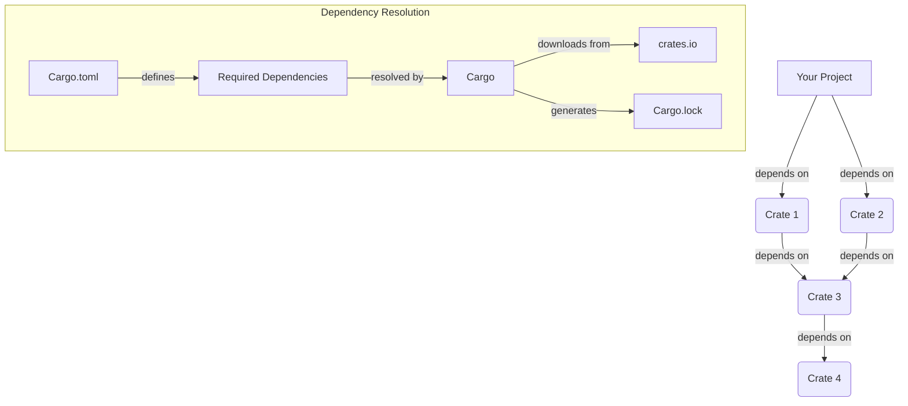

# Rust Package Management

## Introduction

Package management is a fundamental aspect of modern software development. In Rust, package management is handled by Cargo, Rust's official build system and package manager. Cargo makes it easy to download and use existing libraries (called "crates" in Rust), manage dependencies, build your code, and publish your own packages.

This guide introduces you to Rust's package management system and shows you how to effectively use Cargo to manage your Rust projects. By the end, you'll understand how to create new projects, add dependencies, organize your code, and share your work with the Rust community.

## Understanding Cargo

Cargo is Rust's built-in package manager and build system. It handles many tasks, including:

- Creating new projects with a standard structure
- Building your code
- Downloading and compiling dependencies
- Running tests and benchmarks
- Publishing libraries to [crates.io](https://crates.io)

When you install Rust using rustup, Cargo is included by default.

### Key Cargo Concepts

Before diving into usage examples, let's understand some key concepts:

- **Crate**: A package of Rust code. A crate can be a binary (executable) or a library.
- **crates.io**: The official Rust package registry where developers publish and share crates.
- **Cargo.toml**: The manifest file that contains metadata about your project and its dependencies.
- **Cargo.lock**: A file that locks specific versions of dependencies to ensure reproducible builds.
- **Workspace**: A collection of multiple related packages that are developed together.

## Getting Started with Cargo

### Creating a New Project

To create a new Rust project, use the `cargo new` command:

```bash
cargo new hello_world
```

This creates a new binary project (an executable). If you want to create a library instead, add the `--lib` flag:

```bash
cargo new hello_library --lib
```

Let's examine the structure created by `cargo new hello_world`:

```
hello_world/
├── Cargo.toml
└── src/
    └── main.rs
```

The `Cargo.toml` file contains metadata about your project:

```toml
[package]
name = "hello_world"
version = "0.1.0"
edition = "2021"

[dependencies]
```

And `src/main.rs` contains a simple "Hello, world!" program:

```rust
fn main() {
    println!("Hello, world!");
}
```

### Building and Running Projects

To build your project, navigate to the project directory and run:

```bash
cargo build
```

This compiles your code and its dependencies, placing the executable in the `target/debug` directory.

For a release build with optimizations, use:

```bash
cargo build --release
```

To build and run your project in one step:

```bash
cargo run
```

**Output:**
```
Hello, world!
```

### Checking Your Code

To check if your code compiles without producing an executable:

```bash
cargo check
```

This is faster than `cargo build` and is useful during development to quickly verify your code.

## Managing Dependencies

One of Cargo's most powerful features is dependency management.

### Adding Dependencies

To add a dependency, edit your `Cargo.toml` file and add entries under the `[dependencies]` section:

```toml
[package]
name = "hello_world"
version = "0.1.0"
edition = "2021"

[dependencies]
rand = "0.8.5"
serde = { version = "1.0", features = ["derive"] }
```

The next time you run `cargo build` or `cargo run`, Cargo will download and compile these dependencies automatically.

### Using Dependencies in Your Code

Let's modify our `main.rs` to use the `rand` crate for generating random numbers:

```rust
use rand::Rng;

fn main() {
    let secret_number = rand::thread_rng().gen_range(1..=100);
    println!("The random number is: {}", secret_number);
}
```

**Output (will vary):**
```
The random number is: 42
```

### Specifying Dependency Versions

Cargo uses Semantic Versioning (SemVer) for specifying dependency versions:

- `0.8.5`: Exactly version 0.8.5
- `^0.8.5` or `0.8.5`: Any compatible version (same as `>=0.8.5, <0.9.0`)
- `~0.8.5`: Any minor compatible version (same as `>=0.8.5, <0.8.6`)
- `*`: Latest version available
- `>=0.8.5, <0.9.0`: Version range

### Development Dependencies

For dependencies only needed during development (like testing frameworks), use the `[dev-dependencies]` section:

```toml
[dev-dependencies]
pretty_assertions = "1.0"
```

These dependencies won't be included when someone depends on your crate.

## Cargo.lock File

When you first build a project, Cargo creates a `Cargo.lock` file that records the exact versions of all dependencies. This ensures that future builds use the same versions, making builds reproducible.

- For executables, you should commit this file to version control.
- For libraries, you generally should not commit it, allowing each project that uses your library to determine its own dependency versions.

## Creating and Publishing Packages

### Package Structure

A typical Rust package structure looks like this:

```
my_package/
├── Cargo.toml
├── Cargo.lock
├── src/
│   ├── main.rs      # Binary entry point
│   ├── lib.rs       # Library entry point
│   └── bin/         # Additional binaries
├── examples/        # Example code
├── tests/           # Integration tests
├── benches/         # Benchmarks
└── README.md
```

### Publishing to crates.io

To publish your crate to crates.io, first create an account and login:

```bash
cargo login
```

Make sure your `Cargo.toml` includes all necessary metadata:

```toml
[package]
name = "my_package"
version = "0.1.0"
edition = "2021"
description = "A brief description of my package"
license = "MIT OR Apache-2.0"
repository = "https://github.com/username/my_package"
documentation = "https://docs.rs/my_package"
```

Then publish:

```bash
cargo publish
```

### Versioning Your Package

When updating your package, increment the version according to Semantic Versioning:

- Increment the **major** version (1.0.0 → 2.0.0) for incompatible API changes
- Increment the **minor** version (1.0.0 → 1.1.0) for backward-compatible functionality
- Increment the **patch** version (1.0.0 → 1.0.1) for backward-compatible bug fixes

## Working with Workspaces

For larger projects with multiple related crates, Cargo supports workspaces.

Create a top-level `Cargo.toml` with a `[workspace]` section:

```toml
[workspace]
members = [
    "my_library",
    "my_binary",
    "my_utils",
]
```

Each member is a separate package with its own `Cargo.toml`.

Benefits of workspaces include:
- Shared target directory, reducing compilation time
- Ability to develop and test multiple packages together
- Managing related packages with a single command

Example workspace structure:

```
my_project/
├── Cargo.toml
├─��� my_library/
│   ├── Cargo.toml
│   └── src/
│       └── lib.rs
├── my_binary/
│   ├── Cargo.toml
│   └── src/
│       └── main.rs
└── my_utils/
    ├── Cargo.toml
    └── src/
        └── lib.rs
```

### Workspace Dependency Management

To have all workspace members share the same version of a dependency, you can specify it in the root `Cargo.toml`:

```toml
[workspace]
members = ["my_library", "my_binary", "my_utils"]

[workspace.dependencies]
serde = { version = "1.0", features = ["derive"] }
```

Then in each member's `Cargo.toml`:

```toml
[dependencies]
serde = { workspace = true }
```

## Advanced Cargo Features

### Cargo Profiles

Cargo has built-in profiles for different build scenarios. You can customize these in your `Cargo.toml`:

```toml
[profile.dev]
opt-level = 0

[profile.release]
opt-level = 3
lto = true
```

### Feature Flags

Feature flags let you compile your crate with different features enabled:

```toml
[features]
default = ["feature1"]
feature1 = []
feature2 = ["dep:optional_dependency"]

[dependencies]
optional_dependency = { version = "1.0", optional = true }
```

Use features in your code with conditional compilation:

```rust
#[cfg(feature = "feature1")]
fn feature1_function() {
    println!("Feature 1 is enabled!");
}
```

To build with specific features:

```bash
cargo build --features "feature1 feature2"
```

### Cargo Commands

Here are some useful Cargo commands:

| Command | Description |
|---------|-------------|
| `cargo build` | Build the project |
| `cargo run` | Build and run the project |
| `cargo test` | Run tests |
| `cargo bench` | Run benchmarks |
| `cargo doc` | Generate documentation |
| `cargo clean` | Remove build artifacts |
| `cargo update` | Update dependencies |
| `cargo search` | Search for crates |
| `cargo install` | Install a binary crate |

## Visualizing Dependency Management

Below is a diagram showing how Cargo manages dependencies:



## Summary

Rust's package management system, powered by Cargo, provides a robust and convenient way to manage your Rust projects and dependencies. In this guide, we've covered:

- Creating new projects with Cargo
- Building and running Rust code
- Managing dependencies
- Understanding versioning
- Publishing packages to crates.io
- Working with workspaces
- Using advanced Cargo features

With these tools, you can efficiently organize, develop, and share your Rust code while leveraging the rich ecosystem of existing crates.

## Additional Resources

- [The Cargo Book](https://doc.rust-lang.org/cargo/) - The official documentation for Cargo
- [crates.io](https://crates.io) - The Rust community's crate registry
- [Rust By Example](https://doc.rust-lang.org/rust-by-example/) - Learn Rust with examples
- [Rust Cookbook](https://rust-lang-nursery.github.io/rust-cookbook/) - Practical examples using various crates

## Exercises

1. Create a new Rust project and add at least two dependencies.
2. Modify your project to conditionally compile code based on feature flags.
3. Create a workspace with at least two member crates, where one depends on the other.
4. Write a small utility and publish it to crates.io (or prepare it for publishing).
5. Explore the dependency graph of a popular Rust project using `cargo tree`.