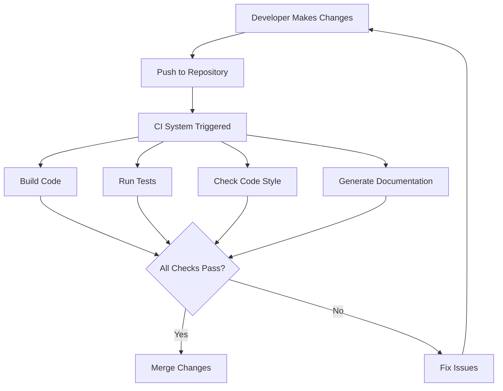

# Rust Continuous Integration

## Introduction

Continuous Integration (CI) is a development practice where code changes are automatically tested and validated to detect problems early. For Rust projects, CI is essential to ensure your code builds correctly, passes tests, and maintains quality across different platforms.

In this tutorial, you'll learn how to:
- Understand the benefits of CI for Rust projects
- Set up CI pipelines using popular tools
- Configure automated testing, linting, and documentation generation
- Implement advanced CI strategies for Rust projects

## What is Continuous Integration?

Continuous Integration is the practice of frequently merging code changes into a shared repository, with automated systems verifying each change. For Rust developers, this means:

- Automatically running `cargo test` on every code change
- Verifying that your code builds on different operating systems
- Checking code style with tools like `clippy`
- Generating and deploying documentation
- Building release binaries when needed



## Setting Up CI for Rust Projects

Let's explore the most popular CI systems for Rust projects:

### GitHub Actions

GitHub Actions is one of the most popular CI tools for Rust projects due to its tight integration with GitHub and robust feature set.

#### Basic GitHub Actions Configuration

Create a file at `.github/workflows/rust.yml`:

```yaml
name: Rust CI

on:
  push:
    branches: [ main ]
  pull_request:
    branches: [ main ]

env:
  CARGO_TERM_COLOR: always

jobs:
  build:
    runs-on: ubuntu-latest
    steps:
    - uses: actions/checkout@v2
    - name: Build
      run: cargo build --verbose
    - name: Run tests
      run: cargo test --verbose
```

This configuration:
1. Triggers the workflow on pushes to the main branch and pull requests
2. Sets up a Rust environment
3. Builds your project
4. Runs all tests

#### Example Output

When this workflow runs, you'll see something like this in your GitHub repository:

```
✓ Build - 45s
✓ Run tests - 32s
```

### Cross-Platform Testing

A great feature of CI is testing your code on multiple operating systems:

```yaml
jobs:
  test:
    name: Test on ${{ matrix.os }}
    runs-on: ${{ matrix.os }}
    strategy:
      matrix:
        os: [ubuntu-latest, windows-latest, macOS-latest]
    steps:
    - uses: actions/checkout@v2
    - name: Build
      run: cargo build --verbose
    - name: Run tests
      run: cargo test --verbose
```

This configuration runs your tests on Linux, Windows, and macOS simultaneously.

### Adding Rust Linting with Clippy

Clippy is a collection of lints to catch common mistakes in Rust code. Add it to your CI:

```yaml
- name: Install clippy
  run: rustup component add clippy
- name: Clippy check
  run: cargo clippy -- -D warnings
```

## Advanced CI Techniques for Rust

### Caching Dependencies

Speed up your CI by caching Rust dependencies:

```yaml
- uses: actions/cache@v2
  with:
    path: |
      ~/.cargo/registry
      ~/.cargo/git
      target
    key: ${{ runner.os }}-cargo-${{ hashFiles('**/Cargo.lock') }}
```

### Code Coverage with Tarpaulin

Track test coverage with cargo-tarpaulin:

```yaml
- name: Install tarpaulin
  run: cargo install cargo-tarpaulin
- name: Run tarpaulin
  run: cargo tarpaulin --out Xml
- name: Upload to codecov.io
  uses: codecov/codecov-action@v1
```

### Automatic Documentation Generation

Generate and deploy documentation to GitHub Pages:

```yaml
name: Deploy Docs

on:
  push:
    branches: [ main ]

jobs:
  deploy:
    runs-on: ubuntu-latest
    steps:
    - uses: actions/checkout@v2
    - name: Build docs
      run: cargo doc --no-deps
    - name: Deploy to GitHub Pages
      uses: peaceiris/actions-gh-pages@v3
      with:
        github_token: ${{ secrets.GITHUB_TOKEN }}
        publish_dir: ./target/doc
```

## Real-World Example: Complete CI Pipeline

Let's create a comprehensive CI workflow that:
1. Tests on multiple platforms
2. Checks code style
3. Calculates test coverage
4. Builds and publishes documentation
5. Creates release artifacts

```yaml
name: Comprehensive Rust CI

on:
  push:
    branches: [ main ]
  pull_request:
    branches: [ main ]

jobs:
  test:
    name: Test on ${{ matrix.os }}
    runs-on: ${{ matrix.os }}
    strategy:
      matrix:
        os: [ubuntu-latest, windows-latest, macOS-latest]
        rust: [stable, beta]
    steps:
    - uses: actions/checkout@v2
    
    - name: Install Rust
      uses: actions-rs/toolchain@v1
      with:
        profile: minimal
        toolchain: ${{ matrix.rust }}
        override: true
        components: rustfmt, clippy
    
    - name: Cache dependencies
      uses: actions/cache@v2
      with:
        path: |
          ~/.cargo/registry
          ~/.cargo/git
          target
        key: ${{ runner.os }}-cargo-${{ hashFiles('**/Cargo.lock') }}
    
    - name: Build
      run: cargo build --verbose
    
    - name: Run tests
      run: cargo test --verbose
    
    - name: Check formatting
      run: cargo fmt -- --check
    
    - name: Clippy check
      run: cargo clippy -- -D warnings

  coverage:
    name: Code coverage
    runs-on: ubuntu-latest
    steps:
    - uses: actions/checkout@v2
    
    - name: Install Rust
      uses: actions-rs/toolchain@v1
      with:
        profile: minimal
        toolchain: stable
        override: true
    
    - name: Install tarpaulin
      run: cargo install cargo-tarpaulin
    
    - name: Run tarpaulin
      run: cargo tarpaulin --out Xml
    
    - name: Upload to codecov.io
      uses: codecov/codecov-action@v1

  docs:
    name: Build and deploy docs
    runs-on: ubuntu-latest
    needs: [test]
    if: github.event_name == 'push' && github.ref == 'refs/heads/main'
    steps:
    - uses: actions/checkout@v2
    
    - name: Install Rust
      uses: actions-rs/toolchain@v1
      with:
        profile: minimal
        toolchain: stable
        override: true
    
    - name: Build documentation
      run: cargo doc --no-deps
    
    - name: Deploy to GitHub Pages
      uses: peaceiris/actions-gh-pages@v3
      with:
        github_token: ${{ secrets.GITHUB_TOKEN }}
        publish_dir: ./target/doc
```

## Practical Example: Setting Up CI for a Simple Rust Project

Let's walk through setting up CI for a simple Rust project:

1. Create a new Rust project:

```bash
cargo new hello_ci
cd hello_ci
```

2. Add a simple function to `src/main.rs`:

```rust
fn add(a: i32, b: i32) -> i32 {
    a + b
}

fn main() {
    let result = add(2, 3);
    println!("2 + 3 = {}", result);
}

#[cfg(test)]
mod tests {
    use super::*;

    #[test]
    fn test_add() {
        assert_eq!(add(2, 3), 5);
    }
}
```

3. Create a GitHub repository and push your code:

```bash
git init
git add .
git commit -m "Initial commit"
git remote add origin https://github.com/yourusername/hello_ci.git
git push -u origin main
```

4. Create the file `.github/workflows/rust.yml` with the basic configuration we showed earlier.

5. Push the workflow file:

```bash
git add .github/workflows/rust.yml
git commit -m "Add CI workflow"
git push
```

6. Visit your GitHub repository to see the CI in action!

## Using GitLab CI for Rust Projects

If you're using GitLab instead of GitHub, here's a basic `.gitlab-ci.yml` file:

```yaml
image: rust:latest

stages:
  - test
  - build

variables:
  CARGO_HOME: $CI_PROJECT_DIR/cargo
  
cache:
  paths:
    - target/
    - cargo/

test:
  stage: test
  script:
    - cargo test --verbose

build:
  stage: build
  script:
    - cargo build --release
  artifacts:
    paths:
      - target/release/your_project_name
```

## Continuous Deployment for Rust Applications

You can extend your CI pipeline to deploy your Rust application automatically:

```yaml
deploy:
  name: Deploy
  runs-on: ubuntu-latest
  needs: [test]
  if: github.event_name == 'push' && github.ref == 'refs/heads/main'
  steps:
    - uses: actions/checkout@v2
    
    - name: Build release binary
      run: cargo build --release
    
    - name: Deploy to server
      uses: appleboy/scp-action@master
      with:
        host: ${{ secrets.HOST }}
        username: ${{ secrets.USERNAME }}
        key: ${{ secrets.SSH_KEY }}
        source: "target/release/your_application"
        target: "/var/www/app"
    
    - name: Restart service
      uses: appleboy/ssh-action@master
      with:
        host: ${{ secrets.HOST }}
        username: ${{ secrets.USERNAME }}
        key: ${{ secrets.SSH_KEY }}
        script: systemctl restart your_application
```

## Summary

Continuous Integration is essential for modern Rust development. By implementing CI in your projects, you can:

- Catch errors and bugs early
- Ensure code quality across multiple platforms
- Automate repetitive tasks like testing and documentation generation
- Streamline the release process
- Maintain a high-quality codebase

The most popular CI solutions for Rust projects are GitHub Actions, GitLab CI, and Travis CI. Each offers similar capabilities, and your choice will likely depend on where your code is hosted.

## Additional Resources

- [GitHub Actions documentation](https://docs.github.com/en/actions)
- [The Rust Programming Language book chapter on testing](https://doc.rust-lang.org/book/ch11-00-testing.html)
- [Cargo Book section on continuous integration](https://doc.rust-lang.org/cargo/guide/continuous-integration.html)
- [Clippy documentation](https://github.com/rust-lang/rust-clippy)

## Exercises

1. Create a simple Rust project and set up a GitHub Actions workflow to run tests
2. Modify your workflow to run on multiple operating systems
3. Add Clippy checks to your CI pipeline
4. Set up automatic documentation generation
5. Create a release workflow that builds binaries for multiple platforms

By completing these exercises, you'll gain practical experience with CI for Rust projects and be well-prepared to implement these practices in your own work.