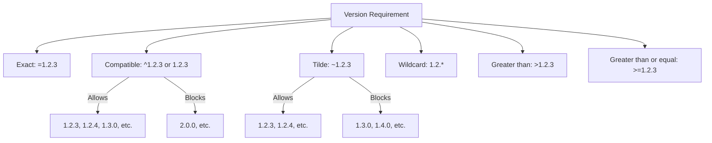

# Rust Dependencies

## Introduction

When building applications in Rust, you'll rarely write everything from scratch. Instead, you'll leverage the Rust ecosystem's rich collection of libraries (called "crates") to add functionality to your projects. Managing these external dependencies is a crucial skill for any Rust developer.

In this guide, you'll learn how Rust's package manager, Cargo, handles dependencies. We'll cover how to add, update, and manage dependencies in your Rust projects, understand semantic versioning, and explore best practices for dependency management.

## Understanding the Cargo.toml File

At the heart of dependency management in Rust is the `Cargo.toml` file. This file, written in [TOML](https://toml.io/) (Tom's Obvious, Minimal Language) format, defines your project's metadata and dependencies.

A basic `Cargo.toml` file looks like this:

```toml
[package]
name = "my_project"
version = "0.1.0"
edition = "2021"
authors = ["Your Name <your.email@example.com>"]
description = "A simple Rust project"

[dependencies]
```

The `[dependencies]` section is where we specify which external crates our project needs.

## Adding Dependencies

### Basic Dependencies

To add a dependency to your project, you need to specify it in the `[dependencies]` section of your `Cargo.toml` file:

```toml
[dependencies]
rand = "0.8.5"
```

This tells Cargo that your project depends on the `rand` crate, version 0.8.5 or compatible.

After adding a dependency to your `Cargo.toml` file, run:

```bash
cargo build
```

Cargo will download and compile the specified crate and its dependencies.

### Using Dependencies in Your Code

Once you've added a dependency, you can use it in your code:

```rust
use rand::Rng;

fn main() {
    let mut rng = rand::thread_rng();
    let random_number: u32 = rng.gen_range(1..101);
    println!("Random number: {}", random_number);
}
```

Output:
```
Random number: 42
```

(Note: The actual number will vary each time you run the program)

## Understanding Versioning

Rust uses [Semantic Versioning](https://semver.org/) (SemVer) for dependency management. A version number is formatted as `MAJOR.MINOR.PATCH`:

1. `MAJOR`: Incremented for incompatible API changes
2. `MINOR`: Incremented for backward-compatible new features
3. `PATCH`: Incremented for backward-compatible bug fixes

### Version Requirements

Cargo provides several ways to specify version requirements:

```toml
[dependencies]
# Exact version
exact_version = "=1.0.1"

# Greater than or equal to 
minimum_version = ">=1.0.0"

# Compatible updates (same as ^1.2.3)
compatible_updates = "1.2.3"

# Tilde requirements
minor_updates_only = "~1.2.3"  # any 1.2.x version, but not 1.3.0

# Wildcard requirements
any_patch = "1.2.*"  # any 1.2.x version
any_minor = "1.*"    # any 1.x.y version
```

The most common form is simply specifying a version like `"0.8.5"`, which is equivalent to `^0.8.5` and means "any version that's compatible with 0.8.5".



## Dependency Sources

Cargo can fetch dependencies from different sources:

### From crates.io

The most common source is [crates.io](https://crates.io/), Rust's official package registry:

```toml
[dependencies]
serde = "1.0.152"
```

### From Git Repositories

You can also specify a Git repository:

```toml
[dependencies]
regex = { git = "https://github.com/rust-lang/regex.git" }
```

To use a specific branch, tag, or commit:

```toml
[dependencies]
regex = { git = "https://github.com/rust-lang/regex.git", branch = "next" }
# or
regex = { git = "https://github.com/rust-lang/regex.git", tag = "v1.5.0" }
# or
regex = { git = "https://github.com/rust-lang/regex.git", rev = "9f9f693" }
```

### From Local Paths

For local development, you can specify a path to a local directory:

```toml
[dependencies]
my_local_crate = { path = "../my_local_crate" }
```

## Dependency Features

Many Rust crates offer optional features that you can enable or disable. This helps keep dependencies lightweight by only including what you need.

```toml
[dependencies]
serde = { version = "1.0", features = ["derive"] }
tokio = { version = "1.0", features = ["full"] }
```

You can also disable default features:

```toml
[dependencies]
some_crate = { version = "1.0", default-features = false, features = ["specific-feature"] }
```

## Managing Dependencies

### Viewing Your Dependency Tree

To see your project's dependency tree:

```bash
cargo tree
```

Output:
```
my_project v0.1.0
└── rand v0.8.5
    ├── rand_chacha v0.3.1
    │   ├── ppv-lite86 v0.2.17
    │   └── rand_core v0.6.4
    │       └── getrandom v0.2.8
    │           ├── cfg-if v1.0.0
    │           └── libc v0.2.139
    └── rand_core v0.6.4 (*)
```

### Updating Dependencies

To update all dependencies to their latest compatible versions:

```bash
cargo update
```

To update a specific crate:

```bash
cargo update -p rand
```

### Locking Dependencies

When you run `cargo build` for the first time, Cargo creates a `Cargo.lock` file. This file contains the exact versions of all dependencies that were resolved. Committing this file to version control ensures that everyone working on the project uses the same dependency versions.

- For libraries: Generally, don't commit `Cargo.lock`
- For applications: Always commit `Cargo.lock`

## Development vs. Build Dependencies

Cargo distinguishes between different types of dependencies:

### Regular Dependencies

These are required for your code to compile and run:

```toml
[dependencies]
serde = "1.0"
```

### Development Dependencies

These are only needed for development tasks like testing:

```toml
[dev-dependencies]
pretty_assertions = "1.3.0"
```

### Build Dependencies

These are needed only during the build process:

```toml
[build-dependencies]
cc = "1.0"
```

## Practical Example: Building a Weather CLI

Let's create a simple command-line application that fetches weather data. We'll use multiple dependencies to demonstrate dependency management in a real-world scenario.

First, create a new project:

```bash
cargo new weather_cli
cd weather_cli
```

Update the `Cargo.toml` file:

```toml
[package]
name = "weather_cli"
version = "0.1.0"
edition = "2021"

[dependencies]
reqwest = { version = "0.11", features = ["json", "blocking"] }
serde = { version = "1.0", features = ["derive"] }
serde_json = "1.0"
clap = { version = "4.1", features = ["derive"] }
```

Now, let's write our application code in `src/main.rs`:

```rust
use clap::Parser;
use reqwest::blocking::Client;
use serde::{Deserialize, Serialize};

#[derive(Parser, Debug)]
#[command(author, version, about, long_about = None)]
struct Args {
    /// City name for weather lookup
    #[arg(short, long)]
    city: String,

    /// Display temperature in Celsius
    #[arg(short, long, default_value_t = false)]
    celsius: bool,
}

#[derive(Debug, Serialize, Deserialize)]
struct WeatherResponse {
    main: Main,
    name: String,
}

#[derive(Debug, Serialize, Deserialize)]
struct Main {
    temp: f64,
    humidity: i32,
}

fn main() -> Result<(), Box<dyn std::error::Error>> {
    let args = Args::parse();
    let city = &args.city;
    
    // Note: In a real application, you would need a valid API key
    let url = format!("https://api.openweathermap.org/data/2.5/weather?q={}&appid=YOUR_API_KEY", city);
    
    let client = Client::new();
    let resp = client.get(url).send()?;
    
    if resp.status().is_success() {
        let weather: WeatherResponse = resp.json()?;
        let temp = if args.celsius {
            weather.main.temp - 273.15 // Convert from Kelvin to Celsius
        } else {
            (weather.main.temp - 273.15) * 9.0/5.0 + 32.0 // Convert from Kelvin to Fahrenheit
        };
        
        let unit = if args.celsius { "°C" } else { "°F" };
        
        println!("Weather in {}:", weather.name);
        println!("Temperature: {:.1}{}", temp, unit);
        println!("Humidity: {}%", weather.main.humidity);
    } else {
        println!("Error fetching weather data: {}", resp.status());
    }
    
    Ok(())
}
```

This example shows how different dependencies work together:
- `reqwest`: For making HTTP requests
- `serde` and `serde_json`: For parsing JSON responses
- `clap`: For parsing command-line arguments

To run this application (after replacing `YOUR_API_KEY` with a real OpenWeather API key):

```bash
cargo run -- --city London
```

Output:
```
Weather in London:
Temperature: 53.6°F
Humidity: 81%
```

Or in Celsius:

```bash
cargo run -- --city London --celsius
```

Output:
```
Weather in London:
Temperature: 12.0°C
Humidity: 81%
```

## Common Dependency Issues and Solutions

### Dependency Hell

When multiple dependencies rely on different versions of the same crate, you might encounter conflicts. Cargo tries to resolve these automatically, but sometimes you need to intervene.

**Solution**: Use the `cargo tree -d` command to identify duplicate dependencies and then update your dependencies to resolve conflicts.

### Dependency Bloat

Including too many dependencies can increase compile times and binary size.

**Solution**:
- Use `cargo bloat` (an external tool) to analyze your dependencies
- Consider enabling only the features you need
- Look for lighter alternative crates

### Yanked Versions

Sometimes crate versions are yanked from crates.io due to critical bugs or security issues.

**Solution**: Regularly update your dependencies with `cargo update` and stay informed about security advisories.

## Best Practices for Dependency Management

1. **Keep dependencies minimal**: Only include what you actually need
2. **Pin versions appropriately**: 
   - For applications: Use `=` for critical dependencies
   - For libraries: Use `^` (the default) for flexibility
3. **Regularly update dependencies**: Run `cargo update` periodically
4. **Audit your dependencies**: Use `cargo audit` to check for security vulnerabilities
5. **Read documentation**: Understand what features are available and which you need
6. **Consider vendoring**: For critical applications, consider vendoring dependencies
7. **Test after updates**: Always run your test suite after updating dependencies

## Summary

In this guide, we've explored how to manage dependencies in Rust using Cargo. We covered:

- Adding and using dependencies in your projects
- Understanding semantic versioning and version requirements
- Specifying dependencies from different sources
- Working with features to customize dependencies
- Managing and updating your dependency tree
- Common dependency issues and their solutions
- Best practices for dependency management

Effective dependency management is crucial for building robust, maintainable Rust applications. By understanding how Cargo handles dependencies, you can leverage the rich ecosystem of Rust crates while avoiding common pitfalls.

## Additional Resources

- [The Cargo Book](https://doc.rust-lang.org/cargo/): Official documentation for Cargo
- [crates.io](https://crates.io/): Browse available crates
- [lib.rs](https://lib.rs/): Alternative crate index with additional metrics
- [deps.rs](https://deps.rs/): Check your dependencies for updates
- [cargo-edit](https://github.com/killercup/cargo-edit): A tool to add, remove, and upgrade dependencies from the command line

## Exercises

1. Create a new Rust project and add at least three dependencies with different version requirements.
2. Modify an existing project to use features for one of its dependencies.
3. Use `cargo tree` to analyze your project's dependency tree and identify potential improvements.
4. Add a Git repository as a dependency and specify a particular branch or tag.
5. Create a project with both regular and development dependencies, and demonstrate how to use each.