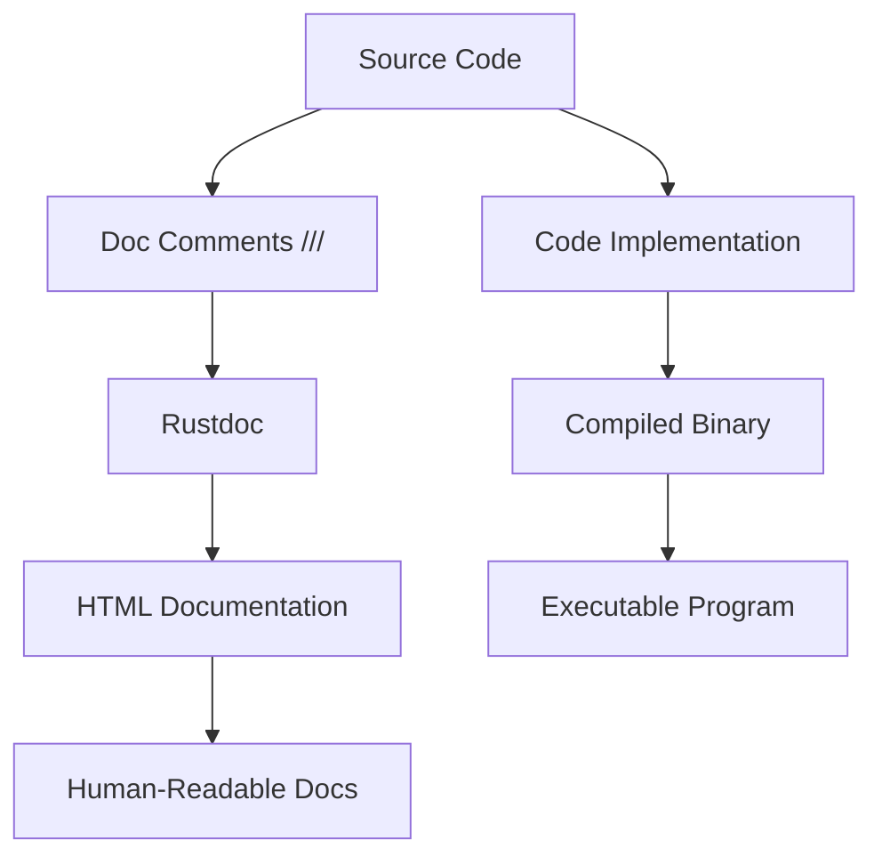

# Rust Documentation

## Introduction

Documentation is a crucial aspect of software development that often gets overlooked by beginners. In the Rust ecosystem, documentation isn't just an afterthought—it's built into the language's design philosophy. Rust's documentation system is powerful, accessible, and considered one of the language's greatest strengths.

This guide explores how Rust's documentation tools work, how to read existing documentation effectively, and how to write your own documentation for Rust projects. By the end, you'll understand why the Rust community proudly emphasizes their "documentation culture" and how you can contribute to it.

## Understanding Rust Documentation

### The Rust Documentation Ecosystem

Rust's documentation ecosystem consists of several key components:

1. **Official Documentation** - The Rust Programming Language Book, Rust by Example, and API documentation
2. **Rustdoc** - Rust's built-in documentation generator
3. **Doc Comments** - Special comments in your code that Rustdoc converts to documentation
4. **Cargo Doc** - A Cargo subcommand that builds documentation for your project

Let's explore each of these components to understand how they work together.

## Reading Rust Documentation

### The Rust Standard Library Documentation

One of the first places you'll encounter Rust documentation is the [Standard Library documentation](https://doc.rust-lang.org/std/). This is a comprehensive reference for all the types, traits, functions, and macros that come with Rust.

Here's how to navigate it effectively:

1. Use the search function to find specific items
2. Browse modules to discover related functionality
3. Look for examples that demonstrate usage
4. Pay attention to trait implementations to understand what operations are available

For example, if you're looking up the `String` type, you'll find information about its methods, the traits it implements, and examples of how to use it.

### Understanding Crate Documentation

When you use external crates (Rust's term for libraries), you'll often refer to their documentation. You can find most crate documentation on [docs.rs](https://docs.rs), a website that automatically builds and hosts documentation for all crates published on crates.io.

Let's say you're using the popular `serde` crate for serialization. You can visit `docs.rs/serde` to see its documentation, which follows the same format as the standard library docs.

## Writing Documentation in Rust

### Doc Comments

Rust has a special type of comment called a "doc comment" that Rustdoc uses to generate documentation. There are two types:

1. `///` - Outer doc comments (document the item following them)
2. `//!` - Inner doc comments (document the item containing them)

Let's see how these work:

```rust
/// This is a documentation comment for the function below
/// It can span multiple lines and supports Markdown formatting
///
/// # Examples
///
/// ```
/// let result = my_function(42);
/// assert_eq!(result, 84);
/// ```
fn my_function(value: i32) -> i32 {
    value * 2
}

//! This is a module-level documentation comment
//! It documents the module itself rather than an item within the module
```

### Documentation Best Practices

When writing documentation in Rust, follow these best practices:

1. **Document all public items** - Functions, structs, enums, traits, etc.
2. **Include examples** - Show how to use your code
3. **Explain the purpose** - What does this item do and why?
4. **Mention edge cases** - What should users be aware of?
5. **Use sections** - Organize content with Markdown headings

#### Common Documentation Sections

Rust's documentation convention includes several standard sections:

```rust
/// # Examples
/// 
/// ```
/// // Code examples go here
/// ```
/// 
/// # Panics
/// 
/// Describes when the function might panic
/// 
/// # Errors
/// 
/// Describes what errors might be returned
/// 
/// # Safety
/// 
/// Explains safety considerations for unsafe functions
```

## Using Rustdoc

### Generating Documentation

To generate documentation for your project, use the `cargo doc` command:

```bash
$ cargo doc --open
```

This command:
1. Compiles your code
2. Extracts documentation comments
3. Generates HTML documentation
4. Opens it in your default web browser

The `--open` flag automatically opens the documentation in your browser.

### Rustdoc Features

Rustdoc has several powerful features:

1. **Code examples are tested** - Examples in your documentation are compiled and tested during `cargo test`
2. **Automatic linking** - References to other types, functions, etc. are automatically linked
3. **Markdown support** - Use Markdown to format your documentation
4. **Customizable output** - Configure documentation appearance with options

Let's look at how code example testing works:

```rust
/// Adds two numbers together
///
/// # Examples
///
/// ```
/// let result = add(2, 3);
/// assert_eq!(result, 5);
/// ```
pub fn add(a: i32, b: i32) -> i32 {
    a + b
}
```

When you run `cargo test`, Rust will extract the code example, compile it, and run it as a test. If the assertion fails, the test fails, ensuring your documentation stays accurate.

## Documentation Workflow

Let's put together a practical workflow for documenting a Rust project:

1. **Start with module documentation** - Use `//!` comments at the top of each file to explain its purpose
2. **Document public items** - Add `///` comments to all public functions, types, etc.
3. **Include examples** - Demonstrate how to use your code
4. **Generate documentation** - Run `cargo doc --open` to preview
5. **Review and improve** - Look for missing information or unclear explanations

### Real-World Example: Documenting a Weather Library

Let's imagine we're building a weather forecasting library. Here's how we might document it:

```rust
//! # Weather Forecast Library
//! 
//! This library provides functionality for fetching and analyzing weather data.
//! 
//! ## Features
//! 
//! - Fetch weather data from multiple providers
//! - Parse and analyze temperature trends
//! - Generate weather forecasts

/// Represents a weather reading at a specific time and location
#[derive(Debug, Clone)]
pub struct WeatherReading {
    /// Temperature in Celsius
    pub temperature: f32,
    /// Humidity percentage (0-100)
    pub humidity: f32,
    /// Wind speed in km/h
    pub wind_speed: f32,
    /// Timestamp of the reading (seconds since Unix epoch)
    pub timestamp: u64,
}

impl WeatherReading {
    /// Creates a new weather reading with the given parameters
    ///
    /// # Examples
    ///
    /// ```
    /// use weather_lib::WeatherReading;
    /// 
    /// let reading = WeatherReading::new(23.5, 65.0, 10.2, 1634567890);
    /// assert_eq!(reading.temperature, 23.5);
    /// ```
    pub fn new(temperature: f32, humidity: f32, wind_speed: f32, timestamp: u64) -> Self {
        Self {
            temperature,
            humidity,
            wind_speed,
            timestamp,
        }
    }
    
    /// Converts the temperature from Celsius to Fahrenheit
    ///
    /// # Examples
    ///
    /// ```
    /// use weather_lib::WeatherReading;
    /// 
    /// let reading = WeatherReading::new(0.0, 65.0, 10.2, 1634567890);
    /// assert_eq!(reading.temperature_fahrenheit(), 32.0);
    /// ```
    pub fn temperature_fahrenheit(&self) -> f32 {
        (self.temperature * 9.0 / 5.0) + 32.0
    }
}
```

## Documentation Visualization

Understanding how documentation relates to code structure can be helpful. Here's a simple diagram showing this relationship:



This diagram illustrates how documentation and code follow parallel paths from source to their respective outputs.

## Advanced Documentation Techniques

### Documenting Complex Examples

For more complex examples that might span multiple functions or files, Rustdoc supports a feature called "documentation tests with external files":

```rust
/// See the [examples directory](../examples/complex_example.rs) for a complete example.
pub fn complex_function() {
    // Function implementation
}
```

### Conditional Documentation

You can use conditional compilation attributes to include documentation only in certain configurations:

```rust
#[cfg(feature = "advanced")]
/// This function is only available when the "advanced" feature is enabled.
pub fn advanced_feature() {
    // Function implementation
}
```

### Intra-Doc Links

You can link to other items in your documentation using the `[`item`]` syntax:

```rust
/// Uses [`WeatherReading`] to analyze temperature patterns
pub fn analyze_temperature(readings: &[WeatherReading]) -> TemperatureAnalysis {
    // Function implementation
}
```

## Summary

Rust's documentation system is a powerful tool that helps make your code more accessible and easier to use. By understanding how to read and write documentation effectively, you'll become a more productive Rust programmer and contribute to the language's culture of excellent documentation.

In this guide, we've covered:

1. Understanding the components of Rust's documentation ecosystem
2. Reading standard library and crate documentation
3. Writing documentation with doc comments
4. Using Rustdoc to generate HTML documentation
5. Following best practices for documentation
6. Advanced documentation techniques

## Additional Resources

To further improve your understanding of Rust documentation:

1. [Official Rustdoc Book](https://doc.rust-lang.org/rustdoc/)
2. [Rust API Guidelines - Documentation](https://rust-lang.github.io/api-guidelines/documentation.html)
3. [Standard Library Documentation](https://doc.rust-lang.org/std/) (as a reference example)

## Exercises

1. **Document a Simple Function**: Write a well-documented function that calculates the factorial of a number
2. **Explore a Crate's Documentation**: Choose a popular crate and explore its documentation. Note what makes it effective or what could be improved
3. **Create a Small Library**: Build a small library with 2-3 functions and document it thoroughly
4. **Contribute Documentation**: Find an open-source Rust project and contribute by improving its documentation

By practicing these skills, you'll become proficient at both consuming and creating high-quality documentation in Rust, making you a more effective programmer and a valuable contributor to the Rust ecosystem.