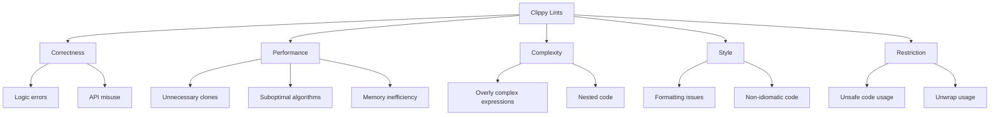

# Rust Clippy: Your Code Quality Assistant

## Introduction

Have you ever wished for a friendly companion who would look over your code and gently point out mistakes or suggest better ways to write something? In the Rust ecosystem, that companion exists, and it's called **Clippy**!

Clippy is a powerful linting tool that analyzes your Rust code to catch common mistakes, enforce style guidelines, and suggest improvements. Think of it as a helpful mentor who has seen thousands of Rust programs and knows exactly what patterns lead to bugs, performance issues, or just code that's harder to maintain.

In this guide, we'll explore:
- What Clippy is and why you should use it
- How to install and run Clippy
- Understanding and fixing Clippy warnings
- Configuring Clippy for your project
- Using Clippy to level up your Rust skills

## What is Clippy and Why Use It?

Clippy is an official Rust project that provides over 550 "lints" (code checks) that analyze your code for:

- **Common mistakes**: Catching logical errors that will cause bugs
- **Style issues**: Enforcing consistent and idiomatic Rust code
- **Performance improvements**: Suggesting faster alternatives
- **Complexity reduction**: Identifying code that could be simplified

### Benefits of Using Clippy

1. **Catch bugs early**: Identify potential problems before they cause issues
2. **Learn Rust idioms**: Discover more idiomatic ways to write your code
3. **Performance optimization**: Find opportunities to make your code faster
4. **Consistency**: Maintain a consistent coding style across your project

## Installing and Running Clippy

Clippy comes with Rust but needs to be installed explicitly.

### Installation

If you're using `rustup` (which most Rust developers do), installing Clippy is simple:

```bash
rustup component add clippy
```

### Running Clippy

Once installed, you can run Clippy on your project with:

```bash
cargo clippy
```

This will analyze your code and print any warnings or suggestions. Here's what the output might look like:

```
warning: this comparison might be inefficient
  --> src/main.rs:10:8
   |
10 |     if some_string == "literal" {
   |        ^^^^^^^^^^^^^^^^^^^^^^^^ help: consider using: `some_string == "literal"`
   |
   = note: `#[warn(clippy::inefficient_string_operations)]` on by default
   = help: for further information visit https://rust-lang.github.io/rust-clippy/master/index.html#inefficient_string_operations
```

## Understanding Clippy Lints

Clippy organizes its lints into different categories:

1. **Error lints**: Issues that are likely to be bugs
2. **Warn lints**: Issues that might be bugs or inefficient code
3. **Style lints**: Code that works but could be more idiomatic
4. **Complexity lints**: Code that's unnecessarily complex
5. **Pedantic lints**: Extra-strict checks for those who want perfect code
6. **Nursery lints**: New lints that are still being refined

Let's explore some common lints with examples.

### Common Clippy Lints with Examples

#### 1. Redundant Cloning

```rust
fn main() {
    let original = String::from("hello");
    
    // Inefficient way
    let copied = original.clone();
    process_string(copied);
    
    // Better way (no clone needed)
    process_string(original);
}

fn process_string(s: String) {
    println!("Processing: {}", s);
}
```

Clippy will warn about the unnecessary clone operation.

#### 2. Inefficient Iterator Usage

```rust
fn main() {
    let numbers = vec![1, 2, 3, 4, 5];
    
    // Inefficient way
    let mut sum = 0;
    for i in 0..numbers.len() {
        sum += numbers[i];
    }
    
    // Better way
    let better_sum: i32 = numbers.iter().sum();
    
    println!("Sum: {}", better_sum);
}
```

Clippy will suggest using the iterator methods directly instead of indexing.

#### 3. Using `unwrap()` in Production Code

```rust
fn main() {
    let result = "123".parse::<i32>();
    
    // Risky way - could panic!
    let number = result.unwrap();
    
    // Better ways
    let safe_number = result.unwrap_or(0); // Provide a default
    // Or handle the error explicitly
    let handled_number = match result {
        Ok(num) => num,
        Err(_) => {
            println!("Failed to parse number, using default");
            0
        }
    };
    
    println!("Number: {}", number);
}
```

Clippy warns about `unwrap()` calls that could cause your program to crash.

## Practical Examples: Fixing Clippy Warnings

Let's walk through a more complete example of how Clippy can help improve your code.

### Example: Before Clippy

```rust
fn main() {
    let mut values = Vec::new();
    values.push(1);
    values.push(2);
    values.push(3);
    
    let mut sum = 0;
    for i in 0..values.len() {
        sum = sum + values[i];
    }
    
    if sum == 6 {
        println!("Sum equals 6!");
    } else if sum != 6 {
        println!("Sum does not equal 6!");
    }
    
    let result = if sum > 5 { "big" } else { "small" };
    let result_string = result.to_string();
    println!("The sum is {}", result_string);
}
```

### Running Clippy

If we run `cargo clippy` on this code, we'll get several warnings. Let's address them one by one.

### Example: After Clippy

```rust
fn main() {
    // Improved: Use vec! macro for initialization
    let values = vec![1, 2, 3];
    
    // Improved: Use iterator method sum()
    let sum: i32 = values.iter().sum();
    
    // Improved: Removed redundant else if
    if sum == 6 {
        println!("Sum equals 6!");
    } else {
        println!("Sum does not equal 6!");
    }
    
    // Improved: No need for intermediate string conversion
    let result = if sum > 5 { "big" } else { "small" };
    println!("The sum is {}", result);
}
```

Notice how much cleaner and more efficient the code has become!

## Configuring Clippy

You can configure which lints Clippy checks by:

1. **Command-line flags**:
```bash
cargo clippy -- -W clippy::pedantic
```

2. **Project configuration** in `clippy.toml` file:
```toml
# Allow or warn about specific lints
disallowed-methods = ["std::thread::sleep"]
```

3. **In your code** with attributes:
```rust
// Disable a specific lint for a function
#[allow(clippy::too_many_arguments)]
fn my_function(a: i32, b: i32, c: i32, d: i32, e: i32, f: i32, g: i32) {
    // ...
}
```

## Using Clippy in Your Development Workflow

Here are some best practices for integrating Clippy into your workflow:

1. **Run regularly**: Execute `cargo clippy` before committing code
2. **CI integration**: Add Clippy to your continuous integration pipeline
3. **Fix warnings incrementally**: For legacy codebases, tackle warnings gradually
4. **Enable pedantic mode** for extra-clean code: `cargo clippy -- -W clippy::pedantic`

### Example CI Setup (GitHub Actions)

```yaml
name: Clippy Check

on:
  push:
    branches: [ main ]
  pull_request:
    branches: [ main ]

jobs:
  clippy_check:
    runs-on: ubuntu-latest
    steps:
      - uses: actions/checkout@v2
      - uses: actions-rs/toolchain@v1
        with:
          toolchain: stable
          components: clippy
      - uses: actions-rs/clippy-check@v1
        with:
          token: ${{ secrets.GITHUB_TOKEN }}
          args: -- -D warnings
```

## Using Clippy to Learn Rust

One of the best features of Clippy is that it teaches you Rust best practices. Each time Clippy gives you a warning, it's an opportunity to learn a better way to write Rust.

For example, if you write:

```rust
fn main() {
    let mut vec = Vec::new();
    for i in 0..10 {
        vec.push(i);
    }
    println!("{:?}", vec);
}
```

Clippy will suggest:

```rust
fn main() {
    let vec: Vec<_> = (0..10).collect();
    println!("{:?}", vec);
}
```

Every Clippy suggestion comes with an explanation, helping you understand the "why" behind Rust idioms.

## Common Lint Categories

Clippy organizes its lints into various categories. Here are some important ones:



## Summary

Clippy is an invaluable tool for Rust programmers of all skill levels:

- For beginners, it helps you learn idiomatic Rust
- For experienced developers, it catches subtle bugs and performance issues
- For teams, it ensures consistent code style and quality

By integrating Clippy into your development workflow, you'll write better, more efficient, and more maintainable Rust code. The small investment in setting up and addressing Clippy's suggestions pays off in higher code quality and fewer bugs.

## Additional Resources

- [Official Clippy Documentation](https://github.com/rust-lang/rust-clippy)
- [Complete List of Clippy Lints](https://rust-lang.github.io/rust-clippy/master/index.html)
- [Clippy Configuration Guide](https://github.com/rust-lang/rust-clippy#configuration)

## Exercises

1. **Lint Hunter**: Take an existing Rust project and run Clippy on it. How many warnings do you get? Try to fix them all.

2. **Pedantic Mode**: Run Clippy in pedantic mode (`cargo clippy -- -W clippy::pedantic`) on a project. What additional suggestions do you get?

3. **Custom Configuration**: Create a `clippy.toml` file for a project that enables some lints and disables others according to your team's coding standards.

4. **Continuous Integration**: Set up a CI pipeline that runs Clippy on your Rust project and fails if there are any warnings.