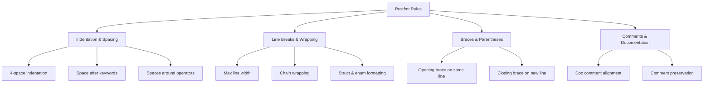

# Rust Rustfmt

## Introduction

When collaborating on software projects, consistent code formatting is essential. Different developers may have different preferences for indentation, spacing, and other style elements. Without a standardized approach, code can become inconsistent and harder to read.

**Rustfmt** is Rust's official code formatting tool that solves this problem. It automatically formats your Rust code according to a standardized style guide, ensuring consistency across your entire codebase. This tool is part of the Rust ecosystem and integrates seamlessly with other Rust tools.

By the end of this guide, you'll understand:
- Why code formatting matters
- How to install and use Rustfmt
- How to configure Rustfmt to suit your project's needs
- How to integrate Rustfmt into your workflow

## Why Use a Code Formatter?

Before diving into Rustfmt specifically, let's understand why automatic code formatting is valuable:

1. **Consistency**: Ensures all code follows the same style
2. **Saves time**: Eliminates debates about style preferences
3. **Improved readability**: Makes code easier to understand
4. **Focus on logic**: Developers can focus on writing logic, not formatting
5. **Easier reviews**: Makes code reviews focus on substance, not style

## Installing Rustfmt

If you've installed Rust using rustup (the recommended way), you likely already have Rustfmt installed. If not, you can install it with:

```bash
rustup component add rustfmt
```

To verify the installation, run:

```bash
rustfmt --version
```

You should see output similar to:

```
rustfmt 1.5.1-stable (103a7fc 2023-02-16)
```

## Basic Usage

### Formatting a Single File

To format a single Rust file, use:

```bash
rustfmt path/to/your/file.rs
```

By default, this will modify the file in place. If you want to see what changes would be made without actually changing the file, use:

```bash
rustfmt --check path/to/your/file.rs
```

### Formatting Your Entire Project

To format all Rust files in your project:

```bash
cargo fmt
```

This command formats all `.rs` files in your current package.

### Example: Before and After Formatting

Let's look at an example of unformatted code and how Rustfmt would improve it:

**Before formatting:**

```rust
fn main(){
    let mut   x=5;
    if x>0{
    println!("x is positive");
        x-=1;
    } else{println!("x is not positive");}
    
    let items   = vec![
    1,
    2,
        3,
    4
    ];
    for i in items{println!("item: {}",i);}
}
```

**After running `rustfmt`:**

```rust
fn main() {
    let mut x = 5;
    if x > 0 {
        println!("x is positive");
        x -= 1;
    } else {
        println!("x is not positive");
    }

    let items = vec![1, 2, 3, 4];
    for i in items {
        println!("item: {}", i);
    }
}
```

Notice how Rustfmt:
- Added proper spacing around operators
- Applied consistent indentation
- Added spaces after keywords
- Reformatted the vector declaration
- Applied consistent bracing style

## Configuration

While Rustfmt provides sensible defaults based on the Rust style guide, you might want to customize its behavior for your project.

### Using rustfmt.toml

You can configure Rustfmt by creating a `rustfmt.toml` file in your project's root directory. Here's an example configuration:

```toml
# Maximum width of each line
max_width = 100
# Use tabs instead of spaces
hard_tabs = false
# Number of spaces per tab
tab_spaces = 4
# Add a newline at the end of the file if not already present
newline_style = "Auto"
# Format imports
imports_layout = "HorizontalVertical"
# Format method chains
chain_width = 60
```

### Common Configuration Options

Here are some commonly used configuration options:

| Option | Default | Description |
|--------|---------|-------------|
| `max_width` | 100 | Maximum width of each line |
| `hard_tabs` | false | Use tabs instead of spaces |
| `tab_spaces` | 4 | Number of spaces per tab |
| `newline_style` | "Auto" | Line ending style (
 or \r
) |
| `imports_layout` | "Mixed" | Control how imports are formatted |
| `edition` | "2021" | Edition of Rust to use for formatting |

For a complete list of options, check the [Rustfmt documentation](https://rust-lang.github.io/rustfmt/).

## Integration with Development Environments

Rustfmt works great on its own, but it's even better when integrated with your development environment.

### VS Code

If you're using Visual Studio Code with the "rust-analyzer" extension, Rustfmt integration is built-in. You can enable format-on-save by adding this to your settings.json:

```json
{
    "[rust]": {
        "editor.formatOnSave": true
    }
}
```

### IntelliJ / CLion / Rust Rover

IntelliJ-based IDEs with the Rust plugin have Rustfmt integration. You can enable it in:
Preferences > Languages & Frameworks > Rust > Rustfmt

### Vim / Neovim

For Vim users, you can use the rust.vim plugin which provides `:RustFmt` command.

### Emacs

Emacs users can use rustic mode which provides Rustfmt integration.

## Real-World Example: Project Setup

Let's look at how you might set up a new Rust project with Rustfmt integration:

```bash
# Create a new project
cargo new formatting_example
cd formatting_example

# Add a rustfmt.toml configuration file
cat > rustfmt.toml << EOF
max_width = 100
hard_tabs = false
tab_spaces = 4
newline_style = "Unix"
use_small_heuristics = "Max"
EOF

# Create a git pre-commit hook to ensure formatting
mkdir -p .git/hooks
cat > .git/hooks/pre-commit << EOF
#!/bin/sh
cargo fmt -- --check
EOF
chmod +x .git/hooks/pre-commit

# Write some code and format it
cargo fmt
```

This setup ensures that:
1. All developers use the same formatting settings
2. Code cannot be committed without being properly formatted
3. The project maintains consistent style

## Continuous Integration

For team projects, you can add Rustfmt checks to your CI pipeline:

```yaml
# Example GitHub Actions workflow
name: Rust

on: [push, pull_request]

jobs:
  format:
    runs-on: ubuntu-latest
    steps:
      - uses: actions/checkout@v3
      - name: Install Rust
        uses: actions-rs/toolchain@v1
        with:
          profile: minimal
          toolchain: stable
          components: rustfmt
      - name: Check formatting
        run: cargo fmt -- --check
```

This prevents improperly formatted code from being merged.

## Handling Special Cases

Sometimes you might want to prevent Rustfmt from formatting certain code sections. You can use attributes to control this:

```rust
// This function will be formatted normally
fn formatted_function() {
    let x = 5;
    println!("x: {}", x);
}

#[rustfmt::skip]
// This function won't be formatted by rustfmt
fn unformatted_function() {
    let x=5;
    println!("x: {}",x);
}

fn partially_formatted() {
    let formatted = true;
    
    #[rustfmt::skip]
    let unformatted=false;
    
    println!("Status: {}, {}", formatted, unformatted);
}
```

## Common Issues and Troubleshooting

### Rustfmt Doesn't Format My Code

Check if you have any `#[rustfmt::skip]` attributes that might be preventing formatting.

### Formatting Conflicts with Editor Settings

Make sure your editor's settings don't conflict with Rustfmt. For instance, if your editor uses 2 spaces for indentation but Rustfmt is configured for 4, you might see constant reformatting.

### Code Looks Different After Upgrading Rustfmt

Rustfmt can change its defaults between versions. To ensure consistent formatting regardless of version:
1. Specify a version in your CI
2. Create a comprehensive rustfmt.toml with all settings explicitly defined

## Understanding the Formatting Rules

Rustfmt follows the official Rust style guide. Here's a diagram showing the key formatting rules:



## Summary

Rustfmt is an essential tool in the Rust developer's toolkit. By automatically formatting your code according to standardized guidelines, it helps maintain consistency, improves readability, and eliminates style debates among team members.

Key takeaways:
- Rustfmt enforces the official Rust style guidelines
- It's easy to install and use (`cargo fmt`)
- It can be configured with `rustfmt.toml`
- Integration with IDEs and CI systems ensures consistent formatting across your project

## Exercises

1. Install Rustfmt and format an existing Rust project
2. Create a custom `rustfmt.toml` configuration with at least three custom settings
3. Set up a pre-commit hook that runs Rustfmt before allowing a commit
4. Compare the output of different Rustfmt configurations on the same input file
5. Integrate Rustfmt into your preferred IDE

## Additional Resources

- [Official Rustfmt Documentation](https://github.com/rust-lang/rustfmt)
- [Rust Style Guide](https://rust-lang.github.io/api-guidelines/about.html)
- [Configuring Rustfmt](https://rust-lang.github.io/rustfmt/)
- [Rust API Guidelines](https://rust-lang.github.io/api-guidelines/) (covers style recommendations)
- [Rust by Example](https://doc.rust-lang.org/rust-by-example/) (shows properly formatted Rust code)