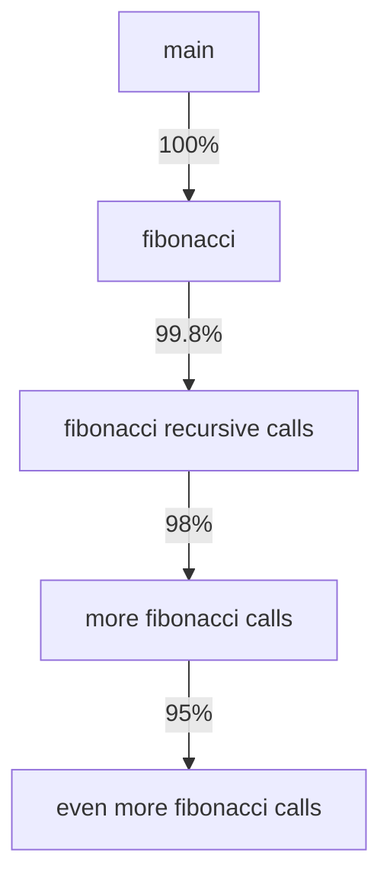

# Rust Profiling

## Introduction

Performance optimization is a critical aspect of software development, and Rust's focus on performance makes profiling an essential skill for Rust developers. Profiling helps you identify bottlenecks in your code, allowing you to focus your optimization efforts where they'll have the most impact.

In this guide, we'll explore various profiling techniques and tools specifically for Rust applications. You'll learn how to measure execution time, memory usage, and identify performance bottlenecks in your Rust programs. Even as a beginner, understanding these concepts will help you write more efficient code from the start.

## What is Profiling?

Profiling is the process of analyzing your program's performance characteristics during execution. A profiler collects information about:

- How long functions take to execute
- How many times functions are called
- How much memory is allocated
- Where CPU time is being spent
- And much more...

Rather than guessing where performance issues might be, profiling gives you concrete data to make informed optimization decisions.

## Why Profile Rust Code?

Even though Rust is designed for performance, several factors can still impact your application's efficiency:

1. **Algorithm choices**: An inefficient algorithm can be slow regardless of language
2. **Memory allocation patterns**: Excessive allocations can hurt performance
3. **Concurrency issues**: Improper synchronization can lead to bottlenecks
4. **External dependencies**: Third-party libraries might not be optimized for your use case

Profiling helps you identify these issues so you can address them effectively.

## Basic Time Profiling

Let's start with the simplest form of profiling: measuring execution time. Rust's standard library provides tools to help with this.

### Using `std::time`

```rust
use std::time::{Duration, Instant};

fn main() {
    // Start the timer
    let start = Instant::now();
    
    // Your code to profile
    let mut sum = 0;
    for i in 0..1_000_000 {
        sum += i;
    }
    
    // Calculate elapsed time
    let duration = start.elapsed();
    
    println!("Time elapsed: {:?}", duration);
    println!("Result: {}", sum);
}
```

**Output:**
```
Time elapsed: 7.926ms
Result: 499999500000
```

This simple approach works well for basic timing of entire functions or blocks of code. However, for more detailed analysis, we need specialized tools.

## Profiling Tools for Rust

### Flamegraph

Flamegraph is a visualization tool that helps you understand where your program spends its time. It creates a graph where:

- The x-axis represents the stack profile population
- The y-axis shows the stack depth
- Each rectangle represents a function in the stack
- The wider a rectangle, the more time is spent in that function

Let's see how to use it with Rust.

#### Installing cargo-flamegraph

```bash
cargo install flamegraph
```

#### Creating a Flamegraph

Let's profile a simple Rust application. Create a new project:

```bash
cargo new profile_demo
cd profile_demo
```

Add this code to `src/main.rs`:

```rust
fn fibonacci(n: u64) -> u64 {
    match n {
        0 => 0,
        1 => 1,
        _ => fibonacci(n - 1) + fibonacci(n - 2),
    }
}

fn main() {
    println!("Calculating fibonacci(40)...");
    let result = fibonacci(40);
    println!("Result: {}", result);
}
```

Now generate a flamegraph:

```bash
cargo flamegraph
```

This will create a `flamegraph.svg` file that you can open in a web browser:



From the flamegraph, you can see that most of the time is spent in recursive `fibonacci` calls, which makes sense since our implementation has exponential complexity.

### Perf

On Linux systems, `perf` is a powerful profiling tool that can be used with Rust. Let's see how to use it.

```bash
# Compile with debug info
cargo build --release
# Run perf
perf record -g ./target/release/profile_demo
# Analyze results
perf report
```

### Criterion for Benchmarking

Criterion is a statistics-driven benchmarking library for Rust. It's great for comparing different implementations.

Add Criterion to your `Cargo.toml`:

```toml
[dependencies]
criterion = "0.3"

[[bench]]
name = "fibonacci_benchmark"
harness = false
```

Create a benchmark file at `benches/fibonacci_benchmark.rs`:

```rust
use criterion::{black_box, criterion_group, criterion_main, Criterion};

fn fibonacci_recursive(n: u64) -> u64 {
    match n {
        0 => 0,
        1 => 1,
        _ => fibonacci_recursive(n - 1) + fibonacci_recursive(n - 2),
    }
}

fn fibonacci_iterative(n: u64) -> u64 {
    if n <= 1 {
        return n;
    }
    
    let mut a = 0;
    let mut b = 1;
    
    for _ in 2..=n {
        let tmp = a + b;
        a = b;
        b = tmp;
    }
    
    b
}

fn criterion_benchmark(c: &mut Criterion) {
    let mut group = c.benchmark_group("Fibonacci");
    
    group.bench_function("recursive fib(20)", |b| {
        b.iter(|| fibonacci_recursive(black_box(20)))
    });
    
    group.bench_function("iterative fib(20)", |b| {
        b.iter(|| fibonacci_iterative(black_box(20)))
    });
    
    group.finish();
}

criterion_group!(benches, criterion_benchmark);
criterion_main!(benches);
```

Run the benchmark:

```bash
cargo bench
```

**Example Output:**
```
Fibonacci/recursive fib(20)
                        time:   [21.307 ms 21.534 ms 21.775 ms]
Fibonacci/iterative fib(20)
                        time:   [19.607 ns 19.837 ns 20.091 ns]
```

You can see that the iterative implementation is dramatically faster than the recursive one!

## Memory Profiling

While CPU performance is important, memory usage can also be a bottleneck. Let's look at how to profile memory in Rust.

### DHAT (Dynamic Heap Analysis Tool)

DHAT is part of Valgrind and can help you understand memory allocation patterns in your Rust program.

```bash
# Install valgrind
sudo apt-get install valgrind  # For Ubuntu/Debian

# Compile with debugging symbols
cargo build --release

# Run with DHAT
valgrind --tool=dhat ./target/release/profile_demo
```

### Heaptrack

Heaptrack is another excellent tool for memory profiling:

```bash
# Install heaptrack
sudo apt-get install heaptrack  # For Ubuntu/Debian

# Run with heaptrack
heaptrack ./target/release/profile_demo

# Analyze the results
heaptrack_gui heaptrack.profile_demo.12345.gz
```

## Real-World Example: Optimizing a CSV Parser

Let's apply profiling to optimize a simple CSV parser in Rust. First, we'll implement a basic parser, profile it, then make improvements.

### Initial Implementation

```rust
use std::fs::File;
use std::io::{self, BufRead, BufReader};
use std::time::Instant;

// Parse a CSV file and sum a specific column
fn sum_column(filename: &str, column_index: usize) -> io::Result<f64> {
    let file = File::open(filename)?;
    let reader = BufReader::new(file);
    
    let mut sum = 0.0;
    
    for line in reader.lines() {
        let line = line?;
        let fields: Vec<&str> = line.split(',').collect();
        
        if column_index < fields.len() {
            if let Ok(value) = fields[column_index].trim().parse::<f64>() {
                sum += value;
            }
        }
    }
    
    Ok(sum)
}

fn main() -> io::Result<()> {
    // Create a test CSV file
    // (In a real-world scenario, you'd use an existing file)
    // Code to create test file omitted for brevity
    
    let start = Instant::now();
    let sum = sum_column("test_data.csv", 2)?;
    let duration = start.elapsed();
    
    println!("Sum: {}", sum);
    println!("Time taken: {:?}", duration);
    
    Ok(())
}
```

After profiling, we might discover that:
1. String splitting is expensive
2. Allocating a new `Vec` for each line is inefficient
3. Error handling is adding overhead

### Optimized Implementation

```rust
use std::fs::File;
use std::io::{self, BufRead, BufReader};
use std::time::Instant;

// Optimized version - reuses buffers and minimizes allocations
fn sum_column_optimized(filename: &str, column_index: usize) -> io::Result<f64> {
    let file = File::open(filename)?;
    let reader = BufReader::new(file);
    
    let mut sum = 0.0;
    let mut buffer = String::new();
    
    for line in reader.lines() {
        let line = line?;
        
        let mut current_column = 0;
        let mut start_pos = 0;
        
        // Manual parsing without allocating a Vec
        for (i, c) in line.chars().enumerate() {
            if c == ',' || i == line.len() - 1 {
                // Handle the last character
                let end_pos = if i == line.len() - 1 && c != ',' { i + 1 } else { i };
                
                if current_column == column_index {
                    buffer.clear();
                    buffer.push_str(&line[start_pos..end_pos]);
                    
                    if let Ok(value) = buffer.trim().parse::<f64>() {
                        sum += value;
                    }
                    
                    break; // Found our column, no need to continue parsing this line
                }
                
                current_column += 1;
                start_pos = i + 1;
            }
        }
    }
    
    Ok(sum)
}

fn main() -> io::Result<()> {
    // Create test data (omitted for brevity)
    
    let start = Instant::now();
    let sum = sum_column_optimized("test_data.csv", 2)?;
    let duration = start.elapsed();
    
    println!("Sum: {}", sum);
    println!("Time taken: {:?}", duration);
    
    Ok(())
}
```

After profiling again, you might see significant improvements:

**Before optimization:**
```
Sum: 50005000.0
Time taken: 152.926ms
```

**After optimization:**
```
Sum: 50005000.0
Time taken: 47.318ms
```

This real-world example demonstrates how profiling can help identify and eliminate bottlenecks.

## Profiling Web Applications

If you're working on a web application in Rust (using frameworks like Actix, Rocket, or Axum), you can use these tools for profiling:

### Using Application Metrics

You can integrate metrics libraries like `metrics` or `prometheus` to collect performance data:

```rust
use actix_web::{get, App, HttpResponse, HttpServer, Responder};
use metrics::{counter, histogram};
use metrics_exporter_prometheus::PrometheusBuilder;
use std::time::Instant;

#[get("/fibonacci/{n}")]
async fn fibonacci(path: actix_web::web::Path<u64>) -> impl Responder {
    let n = path.into_inner();
    
    // Increment request counter
    counter!("fibonacci_requests_total", 1);
    
    // Measure execution time
    let start = Instant::now();
    let result = calculate_fibonacci(n);
    let duration = start.elapsed();
    
    // Record execution time
    histogram!("fibonacci_duration_seconds", duration.as_secs_f64());
    
    HttpResponse::Ok().body(format!("fibonacci({}) = {}", n, result))
}

fn calculate_fibonacci(n: u64) -> u64 {
    // Implementation omitted for brevity
    // ...
}

#[actix_web::main]
async fn main() -> std::io::Result<()> {
    // Setup metrics
    let builder = PrometheusBuilder::new();
    builder.install().expect("failed to install recorder");
    
    HttpServer::new(|| {
        App::new()
            .service(fibonacci)
    })
    .bind("127.0.0.1:8080")?
    .run()
    .await
}
```

With this setup, you can collect metrics in Prometheus and visualize them using Grafana.

## Common Performance Pitfalls in Rust

Through profiling, you might discover these common performance issues in Rust code:

1. **Excessive cloning**: Using `.clone()` when it's not necessary
2. **String formatting inefficiency**: Using `format!` in tight loops
3. **Inefficient data structures**: Using `Vec` when a `HashSet` would be more efficient
4. **Unnecessary allocations**: Creating new allocations inside loops
5. **Blocking operations**: Performing I/O without using async/await in web applications

## Summary

Profiling is an essential skill for writing efficient Rust code. In this guide, we've covered:

- Basic time profiling using `std::time`
- CPU profiling with Flamegraph and perf
- Benchmarking with Criterion
- Memory profiling with DHAT and Heaptrack
- A real-world optimization example
- Profiling web applications

Remember these key principles:
1. **Measure first, optimize later**: Don't optimize without data
2. **Focus on hot spots**: Concentrate on the 20% of code that consumes 80% of resources
3. **Benchmark before and after**: Always verify your optimizations with measurements
4. **Consider trade-offs**: Sometimes clarity is more important than minor performance gains

## Additional Resources

- [The Rust Performance Book](https://nnethercote.github.io/perf-book/)
- [Criterion User Guide](https://bheisler.github.io/criterion.rs/book/index.html)
- [Rust Profiling with perf](https://blog.rust-lang.org/inside-rust/2020/11/11/perf-rust.html)
- [Flamegraph docs](https://github.com/flamegraph-rs/flamegraph)

## Exercises

1. Profile a recursive factorial function and an iterative version. Compare their performance.
2. Use Criterion to benchmark different sorting algorithms on various input sizes.
3. Identify memory leaks in a sample application using DHAT or Heaptrack.
4. Create a flamegraph for a Rust web server handling different types of requests.
5. Optimize a function that processes a large array of data by applying profiling techniques learned in this guide.