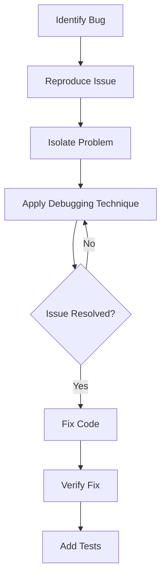

# Rust Debugging

## Introduction

Debugging is an essential skill in software development that helps identify and resolve issues in your code. In the Rust ecosystem, there are several powerful tools and techniques available to make the debugging process more efficient and effective. This guide will introduce you to various debugging approaches in Rust, from simple print statements to sophisticated debugging tools, helping you develop the skills needed to troubleshoot your Rust programs with confidence.

Whether you're facing unexplained crashes, incorrect behavior, or performance issues, the debugging techniques covered in this guide will equip you with the knowledge to tackle these challenges methodically. Let's explore how to become a more effective Rust developer through mastering the art of debugging.

## Basic Debugging Techniques

### Print Debugging

One of the simplest ways to debug Rust code is by using print statements to display values during program execution. Rust provides several macros for this purpose:

```rust
fn main() {
    let x = 42;
    
    // Basic printing
    println!("The value of x is: {}", x);
    
    // Debug formatting for more complex types
    let point = (3, 4);
    println!("Point coordinates: {:?}", point);
    
    // Pretty printing for more readable output of complex structures
    let complex_data = vec![1, 2, 3, 4, 5];
    println!("Data: {:#?}", complex_data);
}
```

Output:
```
The value of x is: 42
Point coordinates: (3, 4)
Data: [
    1,
    2,
    3,
    4,
    5,
]
```

The `{:?}` format specifier uses the `Debug` trait for displaying values, while `{:#?}` provides a prettier, more readable format for complex data structures.

### Using `dbg!` Macro

The `dbg!` macro is a more powerful alternative to `println!` for debugging:

```rust
fn main() {
    let x = 5;
    let y = dbg!(x * 2) + 1;
    
    // dbg! returns the value, allowing it to be used in expressions
    dbg!(y);
    
    // It also works with more complex expressions
    let numbers = vec![1, 2, 3];
    dbg!(&numbers[1..]);
}
```

Output:
```
[src/main.rs:3] x * 2 = 10
[src/main.rs:6] y = 11
[src/main.rs:10] &numbers[1..] = [
    2,
    3,
]
```

The `dbg!` macro:
- Shows the file and line where it was called
- Displays the expression being debugged
- Shows the resulting value
- Returns the value (unlike `println!`)

### Logging with `log` Crate

For more sophisticated logging, Rust's `log` crate provides a flexible logging framework:

```rust
use log::{debug, error, info, warn};

fn main() {
    // Initialize a logger (simple_logger for this example)
    simple_logger::init_with_level(log::Level::Debug).unwrap();
    
    info!("Application started");
    
    let calculation_result = perform_calculation(10);
    
    debug!("Calculation result: {}", calculation_result);
    
    if calculation_result < 0 {
        warn!("Negative result detected: {}", calculation_result);
    }
}

fn perform_calculation(input: i32) -> i32 {
    if input == 0 {
        error!("Cannot perform calculation with input 0");
        return -1;
    }
    
    info!("Performing calculation with input: {}", input);
    input * 2
}
```

Output:
```
2023-11-10T14:30:45Z INFO  [rust_debugging] Application started
2023-11-10T14:30:45Z INFO  [rust_debugging] Performing calculation with input: 10
2023-11-10T14:30:45Z DEBUG [rust_debugging] Calculation result: 20
```

To use logging, add these dependencies to your `Cargo.toml`:

```toml
[dependencies]
log = "0.4"
simple_logger = "4.2"
```

## Using the Rust Debugger (LLDB/GDB)

Rust programs can be debugged using standard debuggers such as LLDB (on macOS and sometimes Linux) or GDB (primarily on Linux). These tools allow you to:

1. Set breakpoints in your code
2. Step through execution line by line
3. Inspect variable values
4. Analyze the call stack

### Setting Up for Debugging

To enable effective debugging with these tools, compile your code with debug symbols:

```bash
# Compile with debug symbols (default for development builds)
cargo build

# Or explicitly specify:
cargo build --debug
```

### Basic GDB Example

Here's how to debug a simple Rust program with GDB:

```rust
// main.rs
fn main() {
    let mut sum = 0;
    
    for i in 1..=10 {
        sum += i;
        println!("Current sum: {}", sum);
    }
    
    println!("Final sum: {}", sum);
}
```

To debug with GDB:

```bash
# Compile the program
cargo build

# Start GDB with your program
gdb target/debug/your_program_name

# Inside GDB, set a breakpoint at main.rs line 5
(gdb) break main.rs:5

# Run the program
(gdb) run

# Once execution stops at the breakpoint, examine variables
(gdb) print sum
(gdb) print i

# Step to the next line
(gdb) next

# Continue running until the next breakpoint
(gdb) continue

# Quit GDB
(gdb) quit
```

### Common GDB/LLDB Commands

| Command | Description |
|---------|-------------|
| `break file.rs:line` | Set a breakpoint |
| `run` | Start program execution |
| `next` | Execute next line (step over) |
| `step` | Step into a function call |
| `continue` | Continue execution until next breakpoint |
| `print variable` | Display variable value |
| `backtrace` | Show call stack |
| `info locals` | Show local variables |
| `watch variable` | Stop when variable changes |

## Debugging with VS Code

Visual Studio Code provides excellent Rust debugging support through extensions.

### Setup

1. Install the "Rust Analyzer" extension for Rust language support
2. Install the "CodeLLDB" extension for debugging support
3. Configure your `.vscode/launch.json` file:

```json
{
    "version": "0.2.0",
    "configurations": [
        {
            "type": "lldb",
            "request": "launch",
            "name": "Debug executable",
            "cargo": {
                "args": [
                    "build",
                    "--bin=your_binary_name",
                    "--package=your_package_name"
                ],
                "filter": {
                    "name": "your_binary_name",
                    "kind": "bin"
                }
            },
            "args": [],
            "cwd": "${workspaceFolder}"
        }
    ]
}
```

### Debugging Features in VS Code

With this setup, you can:
- Set breakpoints by clicking in the gutter next to line numbers
- Use the debug toolbar to control execution (step over, step into, continue)
- View variables in the Variables panel
- See the call stack in the Call Stack panel
- Add watch expressions to monitor specific values

## Memory and Performance Debugging

### Using MIRI for Undefined Behavior Detection

The Miri interpreter can help detect undefined behavior in your Rust code:

```bash
# Install miri
rustup component add miri

# Run your tests with miri
cargo miri test
```

Miri will detect issues like:
- Invalid memory access
- Use of uninitialized memory
- Data races

### Heap Profiling with `dhat`

For memory profiling, the `dhat` crate provides insights into heap usage:

```rust
use dhat::{Dhat, DhatAlloc};

#[global_allocator]
static ALLOCATOR: DhatAlloc = DhatAlloc;

fn main() {
    let _dhat = Dhat::start_heap_profiling();
    
    // Your code here
    let v = vec![1, 2, 3, 4, 5];
    println!("Vector: {:?}", v);
    
    // More code...
}
```

Add the dependency in `Cargo.toml`:

```toml
[dependencies]
dhat = "0.3"
```

Run your program to generate a heap profile:

```bash
cargo run
```

### Flamegraph for Performance Profiling

To identify performance bottlenecks, you can use flamegraphs:

```bash
# Install cargo-flamegraph
cargo install flamegraph

# Run your program with flamegraph
cargo flamegraph -- --your-program-args
```

This generates a flamegraph SVG file showing where your program spends time.

## Debug Visualizations with Mermaid

The debugging process typically follows this workflow:



## Debugging Common Rust Issues

### Ownership and Borrowing Errors

One of the most common challenges in Rust is dealing with ownership issues:

```rust
fn main() {
    let s1 = String::from("hello");
    let s2 = s1;  // Ownership moved here
    
    // This will fail - s1 is no longer valid
    println!("s1: {}", s1);
}
```

Compiler error:
```
error[E0382]: borrow of moved value: `s1`
 --> src/main.rs:5:22
  |
2 |     let s1 = String::from("hello");
  |         -- move occurs because `s1` has type `String`, which does not implement the `Copy` trait
3 |     let s2 = s1;  // Ownership moved here
  |              -- value moved here
4 |     
5 |     println!("s1: {}", s1);
  |                      ^^ value borrowed here after move
```

Debugging approach:
1. Read compiler errors carefully - they often tell you exactly what's wrong
2. Use `clone()` if you need two independent copies of the data
3. Use references (`&`) to borrow data instead of transferring ownership

Fixed code:
```rust
fn main() {
    let s1 = String::from("hello");
    let s2 = s1.clone();  // Create a separate copy
    
    // Now this works
    println!("s1: {}, s2: {}", s1, s2);
}
```

### Lifetime Issues

Lifetime problems can be tricky to debug:

```rust
fn main() {
    let result;
    {
        let x = 5;
        result = get_ref(&x);
    }
    // `x` no longer exists here, but `result` still references it
    println!("Result: {}", result);
}

fn get_ref(val: &i32) -> &i32 {
    val
}
```

Debugging approach:
1. Ensure referenced data lives at least as long as the reference
2. Use the compiler errors to identify scope issues
3. Consider restructuring your code to avoid problematic lifetime requirements

### Panics and Unwrapping

Unwrapping results or options can lead to runtime panics:

```rust
fn main() {
    let numbers = vec![1, 2, 3];
    
    // This will panic if the index is out of bounds
    let item = numbers.get(5).unwrap();
    
    println!("Item: {}", item);
}
```

Safer approaches:
```rust
fn main() {
    let numbers = vec![1, 2, 3];
    
    // Using match for explicit handling
    match numbers.get(5) {
        Some(item) => println!("Item: {}", item),
        None => println!("Index out of bounds"),
    }
    
    // Or using if let
    if let Some(item) = numbers.get(1) {
        println!("Item: {}", item);
    }
}
```

## Advanced Debugging Tools

### Rust Backtrace

Set the `RUST_BACKTRACE` environment variable to get detailed backtraces when panics occur:

```bash
RUST_BACKTRACE=1 cargo run
```

Example output:
```
thread 'main' panicked at 'index out of bounds: the len is 3 but the index is 5', src/main.rs:4:19
stack backtrace:
   0: rust_begin_unwind
   1: core::panicking::panic_fmt
   2: core::panicking::panic_bounds_check
   3: <usize as core::slice::index::SliceIndex<[T]>>::index
   4: core::slice::index::<impl core::ops::index::Index<I> for [T]>::index
   5: <alloc::vec::Vec<T,A> as core::ops::index::Index<I>>::index
   6: my_program::main
   7: core::ops::function::FnOnce::call_once
   ...
```

### Conditional Compilation for Debug Code

Use conditional compilation to include debugging code only in debug builds:

```rust
fn main() {
    let result = perform_calculation(10);
    println!("Result: {}", result);
}

fn perform_calculation(input: i32) -> i32 {
    #[cfg(debug_assertions)]
    println!("Debug: calculating with input = {}", input);
    
    let intermediate = input * 2;
    
    #[cfg(debug_assertions)]
    println!("Debug: intermediate value = {}", intermediate);
    
    intermediate + 5
}
```

### Remote Debugging

For debugging applications running on remote systems or embedded devices:

1. Compile with debug symbols:
   ```bash
   cargo build --target <target-triple>
   ```

2. Set up the debugger on the remote system or use remote debugging features of GDB:
   ```bash
   gdb -ex "target remote <ip-address>:<port>" ./target/debug/your_program
   ```

## Practical Debugging Examples

### Example 1: Fixing a Logic Error

Original code with bug:
```rust
fn calculate_average(numbers: &[i32]) -> f64 {
    let sum: i32 = numbers.iter().sum();
    let count = numbers.len();
    
    // Bug: division may cause integer truncation before conversion to f64
    (sum / count) as f64
}

fn main() {
    let values = vec![1, 2, 3, 4, 5];
    let avg = calculate_average(&values);
    println!("Average: {}", avg);  // Should be 3.0
    
    let small_values = vec![1, 2];
    let small_avg = calculate_average(&small_values);
    println!("Small average: {}", small_avg);  // Should be 1.5, but gets 1.0 due to bug
}
```

Fixed code after debugging:
```rust
fn calculate_average(numbers: &[i32]) -> f64 {
    if numbers.is_empty() {
        return 0.0;
    }
    
    let sum: i32 = numbers.iter().sum();
    let count = numbers.len();
    
    // Fix: convert to f64 before division to avoid integer truncation
    sum as f64 / count as f64
}

fn main() {
    let values = vec![1, 2, 3, 4, 5];
    let avg = calculate_average(&values);
    println!("Average: {}", avg);  // Now correctly outputs 3.0
    
    let small_values = vec![1, 2];
    let small_avg = calculate_average(&small_values);
    println!("Small average: {}", small_avg);  // Now correctly outputs 1.5
}
```

### Example 2: Debugging Concurrency Issues

Code with potential data race:
```rust
use std::thread;
use std::sync::Arc;

fn main() {
    let counter = Arc::new(0);  // Missing Mutex - will cause compilation error
    
    let mut handles = vec![];
    
    for _ in 0..10 {
        let counter_clone = Arc::clone(&counter);
        
        let handle = thread::spawn(move || {
            // Attempt to modify the shared value - not possible with immutable Arc
            *counter_clone += 1;
        });
        
        handles.push(handle);
    }
    
    for handle in handles {
        handle.join().unwrap();
    }
    
    println!("Final count: {}", *counter);
}
```

Fixed code with proper synchronization:
```rust
use std::thread;
use std::sync::{Arc, Mutex};

fn main() {
    let counter = Arc::new(Mutex::new(0));
    
    let mut handles = vec![];
    
    for _ in 0..10 {
        let counter_clone = Arc::clone(&counter);
        
        let handle = thread::spawn(move || {
            // Properly acquire lock before modifying
            let mut num = counter_clone.lock().unwrap();
            *num += 1;
        });
        
        handles.push(handle);
    }
    
    for handle in handles {
        handle.join().unwrap();
    }
    
    println!("Final count: {}", *counter.lock().unwrap());
}
```

## Summary

Debugging is an essential skill for Rust developers. This guide has introduced various techniques and tools to help you effectively identify and resolve issues in your Rust code:

- Basic techniques like print debugging and the `dbg!` macro for quick visibility
- Structured logging with the `log` crate for organized output
- Using GDB/LLDB for interactive debugging sessions
- IDE integration with VS Code for a visual debugging experience
- Memory and performance analysis tools to identify inefficiencies
- Strategies for handling common Rust-specific issues

Remember that debugging is both a science and an art. The more you practice these techniques, the more intuitive debugging will become. Start with simple methods and gradually incorporate more advanced tools as you gain experience.

## Additional Resources

- [The Rust Programming Language Book - Error Handling Chapter](https://doc.rust-lang.org/book/ch09-00-error-handling.html)
- [Rust By Example - Debug](https://doc.rust-lang.org/rust-by-example/hello/print/print_debug.html)
- [GDB to LLDB Command Map](https://lldb.llvm.org/use/map.html)
- [Visual Studio Code Rust Debugging Documentation](https://code.visualstudio.com/docs/languages/rust)
- [Miri Interpreter Documentation](https://github.com/rust-lang/miri)

## Exercises

1. **Debug Practice**: Fix the following code that has an ownership issue:
   ```rust
   fn main() {
       let s = String::from("hello");
       print_and_modify(s);
       println!("After modification: {}", s);
   }
   
   fn print_and_modify(mut s: String) {
       println!("Original: {}", s);
       s.push_str(", world!");
   }
   ```

2. **Logging Implementation**: Add structured logging to a simple Rust program using the `log` crate and `env_logger`.

3. **Debugger Navigation**: Use GDB or LLDB to debug a program with a loop, practicing:
   - Setting breakpoints inside the loop
   - Examining variables each iteration
   - Continuing execution until a condition is met

4. **Memory Leak Detection**: Use tools like `dhat` to identify and fix a memory leak in a Rust program that repeatedly allocates strings.

5. **Visual Debugging**: Configure VS Code for debugging a Rust project and use the visual debugger to step through a recursive function.