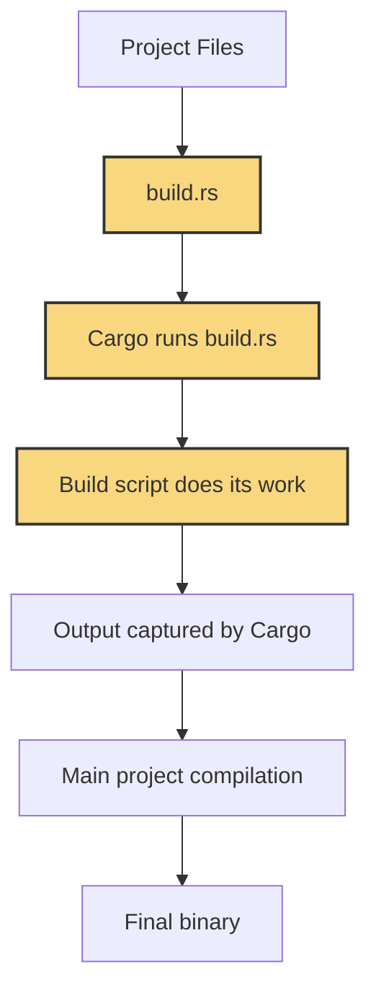

# Rust Build Scripts

## Introduction

Build scripts are a powerful feature in Rust's build system, Cargo. They allow you to run custom code before your project is compiled, making them essential for complex projects that need custom build configurations. Build scripts can generate code, compile native libraries, or set up your build environment in ways that aren't handled automatically by Cargo.

In this guide, we'll explore how build scripts work, when to use them, and how to implement them effectively in your Rust projects.

## What Are Build Scripts?

A build script is simply a Rust file named `build.rs` placed in the root of your project. Cargo automatically detects and runs this file before building your project, allowing you to:

- Generate Rust code programmatically
- Configure build settings based on the environment
- Compile and link C/C++ libraries 
- Ensure dependencies are properly set up
- Define build-time constants

Let's look at how build scripts fit into the Rust compilation process:



## Setting Up Your First Build Script

Let's create a simple build script that prints a message and sets a compile-time environment variable:

1. Create a new Rust project:
```bash
cargo new build_script_demo
cd build_script_demo
```

2. Add a `build.rs` file in the project root with this content:
```rust
fn main() {
    // Print a message (appears in build output)
    println!("cargo:warning=Build script is running!");
    
    // Set an environment variable for the build
    println!("cargo:rustc-env=VERSION=1.0.0");
}
```

3. Update your `src/main.rs` to use the environment variable:
```rust
fn main() {
    // Access the environment variable set by the build script
    let version = env!("VERSION");
    println!("Application version: {}", version);
}
```

4. Run your project:
```bash
cargo run
```

**Output:**
```
   Compiling build_script_demo v0.1.0 (/path/to/build_script_demo)
warning: Build script is running!
    Finished dev [unoptimized + debuginfo] target(s) in 1.45s
     Running `target/debug/build_script_demo`
Application version: 1.0.0
```

This example demonstrates the basic pattern of build scripts:
1. The build script runs and prints specially formatted `cargo:` prefixed messages
2. Cargo captures these messages and acts accordingly
3. Your main code can access any values provided by the build script

## Important Build Script Directives

Build scripts communicate with Cargo through special `println!()` statements with the `cargo:` prefix:

| Directive | Purpose | Example |
|-----------|---------|---------|
| `cargo:warning=` | Display a warning message | `println!("cargo:warning=Check your configuration")` |
| `cargo:rustc-env=` | Set an environment variable | `println!("cargo:rustc-env=KEY=VALUE")` |
| `cargo:rustc-link-lib=` | Link a native library | `println!("cargo:rustc-link-lib=sqlite3")` |
| `cargo:rustc-link-search=` | Add a library search path | `println!("cargo:rustc-link-search=/usr/local/lib")` |
| `cargo:rustc-cfg=` | Set a conditional compilation flag | `println!("cargo:rustc-cfg=feature=\"custom\"")` |
| `cargo:rerun-if-changed=` | Specify file dependency | `println!("cargo:rerun-if-changed=src/config.json")` |

## When to Use Build Scripts

Build scripts are particularly useful in these scenarios:

1. **Integrating with C libraries**: When your Rust code needs to interact with C libraries not available as Rust crates
2. **Code generation**: Automatically generating Rust code from other formats (like protobuf)
3. **Platform-specific configuration**: Detecting OS features and configuring the build accordingly
4. **Version information**: Embedding Git commit hashes or build timestamps into your binary
5. **Custom compilation flags**: Setting compiler options based on build conditions

## Real-World Example: FFI with C Library

Let's create a more practical example by binding to a simple C library:

1. First, create a C file `hello.c` in your project root:
```c
#include <stdio.h>

void print_hello() {
    printf("Hello from C!
");
}
```

2. Create a header file `hello.h`:
```c
#ifndef HELLO_H
#define HELLO_H

void print_hello();

#endif
```

3. Update your `build.rs` to compile this C code:
```rust
use std::process::Command;
use std::env;
use std::path::Path;

fn main() {
    // Get output directory from Cargo
    let out_dir = env::var("OUT_DIR").unwrap();
    
    // Compile the C code
    Command::new("gcc")
        .args(&["hello.c", "-c", "-fPIC", "-o"])
        .arg(&format!("{}/hello.o", out_dir))
        .status()
        .unwrap();
    
    // Create a static library
    Command::new("ar")
        .args(&["crus", "libhello.a", "hello.o"])
        .current_dir(&Path::new(&out_dir))
        .status()
        .unwrap();
    
    // Tell Cargo where to look for the library
    println!("cargo:rustc-link-search=native={}", out_dir);
    
    // Tell Cargo to link against the "hello" library
    println!("cargo:rustc-link-lib=static=hello");
    
    // Tell Cargo to rerun the build script if our C files change
    println!("cargo:rerun-if-changed=hello.c");
    println!("cargo:rerun-if-changed=hello.h");
}
```

4. Update your `src/main.rs` to use the C function:
```rust
// Define the external function from our C library
extern "C" {
    fn print_hello();
}

fn main() {
    // Call the C function (this is unsafe because Rust can't guarantee
    // the safety of functions defined outside of Rust)
    unsafe {
        print_hello();
    }
    
    println!("Back in Rust code!");
}
```

5. Run your project:
```bash
cargo run
```

**Output:**
```
Hello from C!
Back in Rust code!
```

This example demonstrates how build scripts bridge the gap between Rust and other languages or build systems.

## Code Generation with Build Scripts

Another common use case for build scripts is generating Rust code during the build process. This is helpful when working with protocols, APIs, or other specifications that have machine-readable definitions.

Here's an example that generates Rust code from a simple configuration file:

1. Create a file named `config.json` in your project root:
```json
{
  "constants": {
    "MAX_CONNECTIONS": 100,
    "TIMEOUT_MS": 5000,
    "SERVER_NAME": "rust-demo-server"
  }
}
```

2. Update your `build.rs` to generate Rust code from this JSON:
```rust
use std::env;
use std::fs;
use std::path::Path;
use std::io::Write;

fn main() {
    // Get output directory from Cargo
    let out_dir = env::var("OUT_DIR").unwrap();
    let dest_path = Path::new(&out_dir).join("config_generated.rs");
    
    // Read the JSON configuration
    let json_content = fs::read_to_string("config.json").unwrap();
    
    // Parse the JSON (in a real application, use proper error handling)
    let json: serde_json::Value = serde_json::from_str(&json_content).unwrap();
    let constants = &json["constants"];
    
    // Generate Rust code
    let mut file = fs::File::create(dest_path).unwrap();
    
    // Write each constant as a Rust const
    for (key, value) in constants.as_object().unwrap() {
        if value.is_string() {
            writeln!(file, "pub const {}: &str = \"{}\";", key, value.as_str().unwrap()).unwrap();
        } else if value.is_number() {
            if value.is_i64() {
                writeln!(file, "pub const {}: i64 = {};", key, value.as_i64().unwrap()).unwrap();
            } else if value.is_u64() {
                writeln!(file, "pub const {}: u64 = {};", key, value.as_u64().unwrap()).unwrap();
            } else {
                writeln!(file, "pub const {}: f64 = {};", key, value.as_f64().unwrap()).unwrap();
            }
        }
    }
    
    // Tell Cargo to rerun if our config changes
    println!("cargo:rerun-if-changed=config.json");
}
```

3. Add serde_json to your dependencies in `Cargo.toml`:
```toml
[package]
name = "build_script_demo"
version = "0.1.0"
edition = "2021"

[dependencies]

[build-dependencies]
serde_json = "1.0"
```

4. Update your `src/main.rs` to include the generated code:
```rust
// Include the generated configuration code
include!(concat!(env!("OUT_DIR"), "/config_generated.rs"));

fn main() {
    println!("Server name: {}", SERVER_NAME);
    println!("Max connections: {}", MAX_CONNECTIONS);
    println!("Timeout (ms): {}", TIMEOUT_MS);
}
```

5. Run the project:
```bash
cargo run
```

**Output:**
```
Server name: rust-demo-server
Max connections: 100
Timeout (ms): 5000
```

This pattern is incredibly powerful for situations where:
- You want configuration values to be compile-time constants
- You need to generate code from schemas or protocols
- You're integrating with systems that have their own code generation tools

## Conditional Compilation

Build scripts can detect platform features and enable conditional compilation:

```rust
// build.rs
fn main() {
    // Check for specific OS
    if cfg!(target_os = "linux") {
        println!("cargo:rustc-cfg=is_linux");
    }
    
    // Check for system libraries
    let has_ssl = check_for_ssl_library();
    if has_ssl {
        println!("cargo:rustc-cfg=has_ssl_support");
    }
    
    // Check environment variables
    match std::env::var("FEATURE_LEVEL") {
        Ok(level) => println!("cargo:rustc-cfg=feature_level=\"{}\"", level),
        Err(_) => println!("cargo:rustc-cfg=feature_level=\"basic\""),
    }
}

fn check_for_ssl_library() -> bool {
    // In a real application, this would check for the presence of OpenSSL
    // For this example, we'll just return true
    true
}
```

In your main code, you can use these flags:

```rust
// src/main.rs
fn main() {
    #[cfg(is_linux)]
    println!("Running on Linux!");
    
    #[cfg(has_ssl_support)]
    println!("SSL support is enabled");
    
    #[cfg(feature_level = "premium")]
    println!("Premium features enabled");
    
    #[cfg(feature_level = "basic")]
    println!("Basic features enabled");
}
```

## Best Practices for Build Scripts

To make your build scripts maintainable and efficient:

1. **Be Specific with Rerun Triggers**
   - Use `cargo:rerun-if-changed=` for specific files that affect the build script
   - Use `cargo:rerun-if-env-changed=` for environment variables

2. **Minimize Dependencies**
   - Keep build script dependencies minimal to avoid long compilation times
   - Use separate `[build-dependencies]` section in your `Cargo.toml`

3. **Handle Errors Properly**
   - Provide meaningful error messages
   - Fail early and clearly when requirements aren't met

4. **Keep Build Scripts Focused**
   - Split complex logic into modules or separate crates
   - Document why the build script is needed

5. **Avoid Unnecessary Rebuilds**
   - Only regenerate outputs when inputs have changed
   - Cache results when possible

## Common Pitfalls to Avoid

1. **Missing Dependencies**
   - Always specify all required system dependencies in your documentation
   - Consider providing fallback options when possible

2. **Platform Assumptions**
   - Test your build scripts on all supported platforms
   - Use conditional logic for platform-specific code

3. **Ignoring Error Cases**
   - Always handle errors and provide clear messages
   - Never use `.unwrap()` or `.expect()` in production build scripts

4. **Slow Build Scripts**
   - Keep build scripts efficient to avoid slowing down the development cycle
   - Consider caching results for expensive operations

## Summary

Rust build scripts are a powerful tool in your Rust toolbox that allow you to:
- Customize your build process
- Interface with non-Rust code and libraries
- Generate code programmatically
- Configure your application based on the build environment

While they require some additional knowledge beyond basic Rust programming, build scripts can solve many complex problems that would otherwise be difficult to handle in a cross-platform way.

## Additional Resources

- [Official Cargo Documentation on Build Scripts](https://doc.rust-lang.org/cargo/reference/build-scripts.html)
- [The `cc` crate](https://crates.io/crates/cc) - A library to simplify C/C++ compilation in build scripts
- [The `bindgen` crate](https://crates.io/crates/bindgen) - For generating Rust FFI bindings to C/C++ libraries

## Exercises

1. Create a build script that embeds the current Git commit hash into your application.
2. Write a build script that detects whether a specific system library is installed and enables a feature flag accordingly.
3. Use a build script to generate Rust code from a simple DSL (Domain-Specific Language) of your design.
4. Create a cross-platform build script that compiles a small C library on Windows, macOS, and Linux.
5. Extend the code generation example to read multiple configuration files and merge them based on the build profile (debug vs. release).