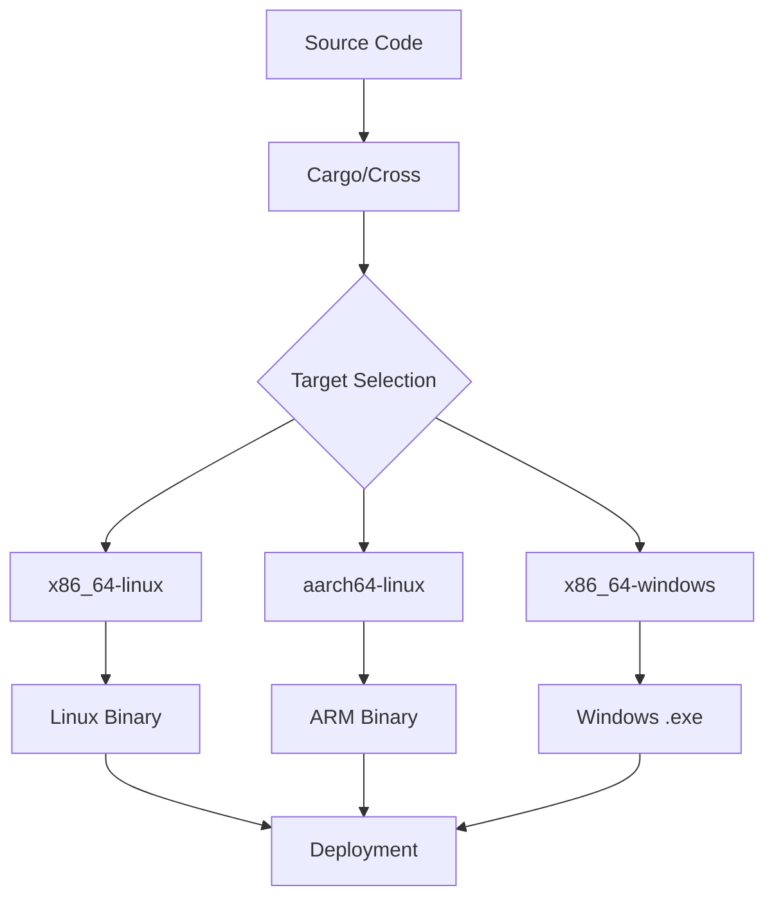

# Rust Cross Compilation

## Introduction

Cross compilation is the process of building code on one platform (your development machine) that will run on a different target platform. This is particularly useful when:

- Developing for embedded systems or IoT devices
- Building applications for multiple operating systems
- Creating binaries for platforms where compilation is difficult or slow
- Automating builds in CI/CD pipelines for various architectures

Rust's ecosystem provides excellent support for cross compilation through its toolchain manager, Cargo, and additional tools. In this guide, we'll explore how to set up and use cross compilation in Rust, from basic concepts to practical applications.

## Prerequisites

Before diving into cross compilation, make sure you have:

- [Rust and Cargo installed](https://www.rust-lang.org/tools/install)
- Basic familiarity with Rust programming
- A terminal or command prompt

## Understanding Rust Targets

Rust uses the concept of "targets" to specify the platform for which you're building. A target is represented as a triple in the format:

```
<architecture>-<vendor>-<system>-<abi>
```

For example:
- `x86_64-unknown-linux-gnu` (64-bit Linux)
- `aarch64-apple-darwin` (ARM64 macOS)
- `x86_64-pc-windows-msvc` (64-bit Windows using MSVC)

To see all available targets, run:

```bash
rustc --print target-list
```

Output (partial):
```
aarch64-apple-darwin
aarch64-apple-ios
aarch64-linux-android
...
x86_64-pc-windows-gnu
x86_64-pc-windows-msvc
x86_64-unknown-linux-gnu
...
```

## Basic Cross Compilation Setup

### Step 1: Install Target Toolchain

First, you need to add the target to your Rust installation:

```bash
rustup target add x86_64-unknown-linux-gnu
```

Output:
```
info: downloading component 'rust-std' for 'x86_64-unknown-linux-gnu'
info: installing component 'rust-std' for 'x86_64-unknown-linux-gnu'
```

### Step 2: Cross Compile a Simple Program

Let's create a simple Rust program and compile it for a different target.

Create a new project:

```bash
cargo new hello_cross
cd hello_cross
```

Edit `src/main.rs` with this simple program:

```rust
fn main() {
    println!("Hello from a cross-compiled Rust program!");
    println!("Running on: {}", std::env::consts::OS);
    println!("Architecture: {}", std::env::consts::ARCH);
}
```

Now compile it for your target platform:

```bash
cargo build --target x86_64-unknown-linux-gnu
```

The compiled binary will be in `target/x86_64-unknown-linux-gnu/debug/hello_cross`.

## Handling Dependencies and Linkers

Cross compilation becomes more complex when your project has dependencies that:

1. Need to be compiled natively
2. Rely on system libraries
3. Use platform-specific code

### Linker Configuration

Most cross compilation issues stem from linker problems. You'll need the appropriate linker for your target.

Add linker configuration to your `.cargo/config.toml` file:

```toml
[target.x86_64-unknown-linux-gnu]
linker = "x86_64-linux-gnu-gcc"

[target.aarch64-unknown-linux-gnu]
linker = "aarch64-linux-gnu-gcc"
```

On Ubuntu/Debian, you can install these linkers with:

```bash
sudo apt-get install gcc-x86-64-linux-gnu
sudo apt-get install gcc-aarch64-linux-gnu
```

## Using Cross: A Docker-based Solution

The [cross](https://github.com/cross-rs/cross) tool simplifies Rust cross compilation by using Docker containers with all the necessary tools pre-installed.

### Installing Cross

```bash
cargo install cross
```

### Using Cross to Build

Replace `cargo build` with `cross build`:

```bash
cross build --target x86_64-unknown-linux-gnu
```

Cross automatically uses a Docker container with the correct toolchain, eliminating the need to install platform-specific toolchains.

## Cross Compilation Workflow

Let's visualize the cross compilation workflow:



## Real-World Example: Cross Compiling for Raspberry Pi

Let's walk through a practical example of cross compiling a Rust program for Raspberry Pi.

### Step 1: Add the ARM target

```bash
rustup target add armv7-unknown-linux-gnueabihf
```

### Step 2: Create a simple GPIO project

Create a new project:

```bash
cargo new rpi_blink
cd rpi_blink
```

Add the `rppal` crate for Raspberry Pi GPIO:

```bash
cargo add rppal
```

Edit `src/main.rs`:

```rust
use rppal::gpio::Gpio;
use std::error::Error;
use std::thread;
use std::time::Duration;

fn main() -> Result<(), Box<dyn Error>> {
    // GPIO pin 17 (physical pin 11)
    let pin = 17;
    
    // Get a handle to the GPIO peripheral
    let gpio = Gpio::new()?;
    
    // Get a handle to GPIO pin 17, and configure it as an output
    let mut led = gpio.get(pin)?.into_output();
    
    println!("Blinking LED connected to GPIO pin {}", pin);
    
    // Blink the LED 5 times
    for _ in 0..5 {
        led.set_high();
        thread::sleep(Duration::from_millis(500));
        led.set_low();
        thread::sleep(Duration::from_millis(500));
    }
    
    Ok(())
}
```

### Step 3: Cross compile using Cross

```bash
cross build --target armv7-unknown-linux-gnueabihf --release
```

The compiled binary will be in `target/armv7-unknown-linux-gnueabihf/release/rpi_blink`.

### Step 4: Transfer and run on Raspberry Pi

```bash
scp target/armv7-unknown-linux-gnueabihf/release/rpi_blink pi@raspberrypi:~/
ssh pi@raspberrypi 'chmod +x ~/rpi_blink && ./rpi_blink'
```

## Advanced Cross Compilation Techniques

### 1. Target-specific Dependencies

Sometimes you need different dependencies for different targets. Use `cfg` attributes in your `Cargo.toml`:

```toml
[dependencies]
# Common dependencies
serde = "1.0"

[target.'cfg(windows)'.dependencies]
winapi = "0.3"

[target.'cfg(unix)'.dependencies]
libc = "0.2"
```

### 2. Conditional Compilation in Code

Use conditional compilation in your code to handle platform differences:

```rust
#[cfg(target_os = "linux")]
fn platform_specific() {
    println!("This runs only on Linux");
}

#[cfg(target_os = "windows")]
fn platform_specific() {
    println!("This runs only on Windows");
}

fn main() {
    platform_specific();
}
```

### 3. Cross-compiling Static Binaries

For maximum portability, you can create static binaries that don't rely on system libraries:

```bash
RUSTFLAGS='-C target-feature=+crt-static' cargo build --target x86_64-unknown-linux-gnu --release
```

## Troubleshooting Common Issues

### Missing Linker

**Problem:**
```
error: linker `aarch64-linux-gnu-gcc` not found
```

**Solution:** Install the appropriate cross-toolchain:
```bash
sudo apt install gcc-aarch64-linux-gnu
```

### Missing System Libraries

**Problem:**
```
error: failed to run custom build command for `openssl-sys v0.9.58`
```

**Solution:** Use the `cross` tool or install the libraries for your target:
```bash
sudo apt install libssl-dev:arm64
```

### Architecture-specific Code

**Problem:** Your code or dependencies use inline assembly or platform-specific features.

**Solution:** Use conditional compilation with `cfg` attributes and provide alternative implementations:

```rust
#[cfg(target_arch = "x86_64")]
use x86_64_specific_crate;

#[cfg(target_arch = "aarch64")]
use aarch64_specific_crate;
```

## CI/CD Integration

You can automate cross compilation in your CI/CD pipelines. Here's an example GitHub Actions workflow:

```yaml
name: Cross-compile

on:
  push:
    branches: [ main ]
  pull_request:
    branches: [ main ]

jobs:
  build:
    name: Build ${{ matrix.target }}
    runs-on: ubuntu-latest
    strategy:
      matrix:
        target: [x86_64-unknown-linux-gnu, aarch64-unknown-linux-gnu, x86_64-pc-windows-gnu]
    
    steps:
    - uses: actions/checkout@v2
    - name: Install Rust
      uses: actions-rs/toolchain@v1
      with:
        toolchain: stable
        target: ${{ matrix.target }}
        override: true
    
    - name: Install Cross
      run: cargo install cross
      
    - name: Build
      run: cross build --release --target ${{ matrix.target }}
      
    - name: Upload artifacts
      uses: actions/upload-artifact@v2
      with:
        name: binary-${{ matrix.target }}
        path: target/${{ matrix.target }}/release/your_program*
```

## Summary

Rust's cross compilation capabilities make it possible to develop on one platform and deploy to many others. In this guide, we've covered:

- The basics of Rust targets and cross compilation
- Setting up your environment with rustup
- Handling dependencies and linker issues
- Using the Cross tool for Docker-based cross compilation
- Creating a real-world application for Raspberry Pi
- Advanced techniques and troubleshooting common issues
- CI/CD integration for automated builds

Cross compilation is a powerful feature that makes Rust suitable for a wide range of platforms, from embedded devices to servers.

## Additional Resources

- [The Rust Programming Language Book](https://doc.rust-lang.org/book/)
- [Cross Repository](https://github.com/cross-rs/cross)
- [Rust Embedded Book](https://docs.rust-embedded.org/book/)
- [Rustup Documentation](https://rust-lang.github.io/rustup/cross-compilation.html)

## Exercises

1. **Beginner:** Cross compile a simple "Hello World" program for a different platform than your own.
2. **Intermediate:** Create a small CLI tool and cross compile it for Windows, macOS, and Linux.
3. **Advanced:** Build a Rust application for an embedded device like Raspberry Pi or Arduino and deploy it.
4. **Expert:** Set up a CI/CD pipeline that automatically cross compiles your Rust project for multiple targets when you push to your repository.