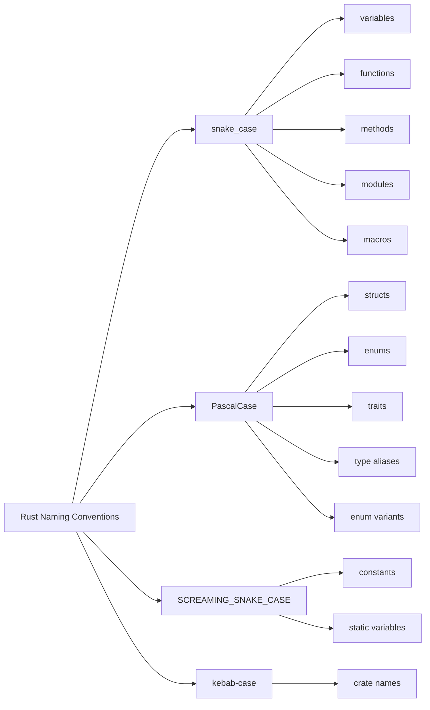

# Rust Naming Conventions

## Introduction

Naming conventions are a crucial aspect of writing clean, maintainable, and idiomatic Rust code. Following consistent naming patterns not only makes your code more readable but also helps other Rust developers understand your intentions more easily. This guide covers the standard naming conventions used in the Rust ecosystem, with examples to illustrate each convention.

## Why Are Naming Conventions Important?

Before diving into the specifics, let's understand why naming conventions matter:

- They improve code readability
- They convey semantic meaning (what a variable or function does)
- They help maintain consistency across projects
- They reduce cognitive load when reading code
- They align with Rust's standard library and ecosystem

## Variable and Function Names

In Rust, variables and functions follow the `snake_case` convention.

### Variable Names

Variables should be named using lowercase letters with underscores separating words:

```rust
// Good
let user_id = 42;
let file_name = "data.txt";
let items_count = get_items().len();

// Not idiomatic Rust
let UserId = 42;       // CamelCase
let fileName = "data.txt";  // camelCase
let items_Count = get_items().len();  // Mixed
```

### Function Names

Similar to variables, functions also use `snake_case`:

```rust
// Good
fn calculate_total(items: &[Item]) -> u32 {
    // implementation
}

fn read_file(path: &str) -> Result<String, io::Error> {
    // implementation
}

// Not idiomatic Rust
fn CalculateTotal(items: &[Item]) -> u32 {  // PascalCase
    // implementation
}

fn readFile(path: &str) -> Result<String, io::Error> {  // camelCase
    // implementation
}
```

## Type Names

For types, Rust uses `PascalCase` (also called `UpperCamelCase`).

### Structs, Enums, and Traits

```rust
// Structs
struct User {
    name: String,
    age: u32,
}

// Enums
enum ConnectionState {
    Connected,
    Disconnected,
    Connecting,
}

// Traits
trait DataProcessor {
    fn process(&self, data: &[u8]) -> Result<(), Error>;
}

// Not idiomatic Rust
struct user {  // snake_case
    name: String,
    age: u32,
}

enum connection_state {  // snake_case
    connected,
    disconnected,
    connecting,
}
```

## Constants and Static Variables

Constants and static variables should be named using `SCREAMING_SNAKE_CASE` (all uppercase with underscores):

```rust
const MAX_CONNECTIONS: u32 = 100;
const VERSION: &str = "1.0.0";

static GLOBAL_COUNTER: AtomicUsize = AtomicUsize::new(0);

// Not idiomatic Rust
const max_connections: u32 = 100;  // snake_case
const Version: &str = "1.0.0";  // PascalCase
```

## Enum Variants

Enum variants follow the same `PascalCase` convention as types:

```rust
enum Message {
    Quit,
    Move { x: i32, y: i32 },
    Write(String),
    ChangeColor(u8, u8, u8),
}

// Not idiomatic Rust
enum Message {
    quit,  // snake_case
    move_position { x: i32, y: i32 },  // snake_case
    WRITE(String),  // SCREAMING_SNAKE_CASE
}
```

## Modules

Module names should use `snake_case`:

```rust
mod network;
mod file_system;
mod user_authentication;

// Not idiomatic Rust
mod Network;  // PascalCase
mod FileSystem;  // PascalCase
```

## Type Aliases

Type aliases follow the `PascalCase` convention like other types:

```rust
type Result<T> = std::result::Result<T, Error>;
type UserId = u64;

// Not idiomatic Rust
type result<T> = std::result::Result<T, Error>;  // snake_case
type user_id = u64;  // snake_case
```

## Acronyms in Names

When using acronyms in names, treat them as single words:

```rust
// For types (PascalCase)
struct HttpRequest;  // Not HTTPRequest
struct TcpConnection;  // Not TCPConnection

// For variables/functions (snake_case)
let html_parser = Parser::new();  // Not html_Parser
fn parse_json(data: &str) -> Result<Value, Error> {
    // implementation
}
```

## Generic Parameters

Generic type parameters typically use single uppercase letters:

```rust
struct Queue<T> {
    items: Vec<T>,
}

fn map<T, U>(input: T, f: impl Fn(T) -> U) -> U {
    f(input)
}

// For more complex cases with multiple generic parameters,
// descriptive names are also acceptable
struct Cache<Key, Value> 
where 
    Key: Hash + Eq,
{
    items: HashMap<Key, Value>,
}
```

## Lifetimes

Lifetime parameters should be short, lowercase names, typically starting with `'a`, `'b`, etc.:

```rust
struct Reference<'a, T> {
    value: &'a T,
}

fn longest<'a>(x: &'a str, y: &'a str) -> &'a str {
    if x.len() > y.len() { x } else { y }
}

// For more descriptive lifetimes
struct Config<'system> {
    system_resources: &'system Resources,
}
```

## Associated Functions and Methods

Associated functions (including methods) follow the `snake_case` convention like regular functions:

```rust
impl Rectangle {
    // Associated function (constructor)
    fn new(width: u32, height: u32) -> Self {
        Self { width, height }
    }
    
    // Method
    fn calculate_area(&self) -> u32 {
        self.width * self.height
    }
}
```

## Crates

Crate names should use `kebab-case` (lowercase with hyphens) when published to crates.io:

```
my-awesome-crate
serde-json
tokio-core
```

However, when referring to the crate in Rust code, use `snake_case`:

```rust
use my_awesome_crate;
use serde_json;
use tokio_core;
```

## Macros

Macro names typically follow `snake_case` just like functions:

```rust
macro_rules! create_function {
    // implementation
}

// Some common macros in the standard library
println!("Hello");
vec![1, 2, 3];
format!("Name: {}", name);
```

## Real-world Example

Let's put it all together with a practical example that demonstrates many of these conventions:

```rust
use std::collections::HashMap;
use std::fs::{self, File};
use std::io::{self, Read};

const MAX_BUFFER_SIZE: usize = 1024;
static GLOBAL_CONFIG: once_cell::sync::Lazy<Config> = once_cell::sync::Lazy::new(|| {
    Config::from_env().unwrap_or_default()
});

struct Config {
    app_name: String,
    max_connections: u32,
}

impl Config {
    fn from_env() -> Option<Self> {
        // implementation
        Some(Self {
            app_name: std::env::var("APP_NAME").ok()?,
            max_connections: std::env::var("MAX_CONNECTIONS")
                .ok()?
                .parse()
                .ok()?,
        })
    }
    
    fn new(app_name: String, max_connections: u32) -> Self {
        Self { app_name, max_connections }
    }
}

enum ConnectionError {
    IoError(io::Error),
    Timeout,
    TooManyConnections,
}

trait DataProcessor<T> {
    fn process_data(&self, input: &T) -> Result<T, ConnectionError>;
}

struct FileProcessor {
    config: &'static Config,
}

impl<'a> DataProcessor<String> for FileProcessor {
    fn process_data(&self, input: &String) -> Result<String, ConnectionError> {
        let mut file = File::open(input).map_err(ConnectionError::IoError)?;
        
        if self.config.max_connections <= 0 {
            return Err(ConnectionError::TooManyConnections);
        }
        
        let mut buffer = String::new();
        file.read_to_string(&mut buffer).map_err(ConnectionError::IoError)?;
        
        Ok(format!("Processed: {}", buffer))
    }
}

fn main() {
    let file_path = "data.txt";
    let processor = FileProcessor { config: &GLOBAL_CONFIG };
    
    match processor.process_data(&file_path.to_string()) {
        Ok(result) => println!("Success: {}", result),
        Err(ConnectionError::IoError(e)) => eprintln!("IO error: {}", e),
        Err(ConnectionError::Timeout) => eprintln!("Connection timed out"),
        Err(ConnectionError::TooManyConnections) => eprintln!("Too many connections"),
    }
}
```

## Visual Naming Convention Summary



## Summary

Following Rust's naming conventions is essential for writing idiomatic Rust code. Here's a quick reference:

- `snake_case` for variables, functions, methods, modules, and macros
- `PascalCase` for types (structs, enums, traits) and type aliases
- `SCREAMING_SNAKE_CASE` for constants and static variables
- `kebab-case` for crate names (in Cargo.toml and on crates.io)
- Single uppercase letters for generic parameters (T, U, etc.)
- Short lowercase names for lifetimes ('a, 'b, etc.)

By adhering to these conventions, you make your code more readable and align with the broader Rust ecosystem, enhancing collaboration and maintenance.

## Additional Resources

- [The Rust Style Guide](https://github.com/rust-lang/rfcs/blob/master/style-guide/README.md)
- [Rust API Guidelines: Naming](https://rust-lang.github.io/api-guidelines/naming.html)
- [Rust By Example](https://doc.rust-lang.org/rust-by-example/)

## Exercises

1. Identify and fix naming convention issues in the following code snippet:
   ```rust
   struct userConfig {
       UserName: String,
       PASSWORD: String,
       max_login_attempts: u32,
   }
   
   fn Get_User_Data(CONFIG: &userConfig) -> Result<String, String> {
       // implementation
   }
   ```

2. Create a small Rust program that demonstrates proper naming conventions for at least one instance of each naming style.

3. Review an open-source Rust project on GitHub and identify examples of these naming conventions in practice.