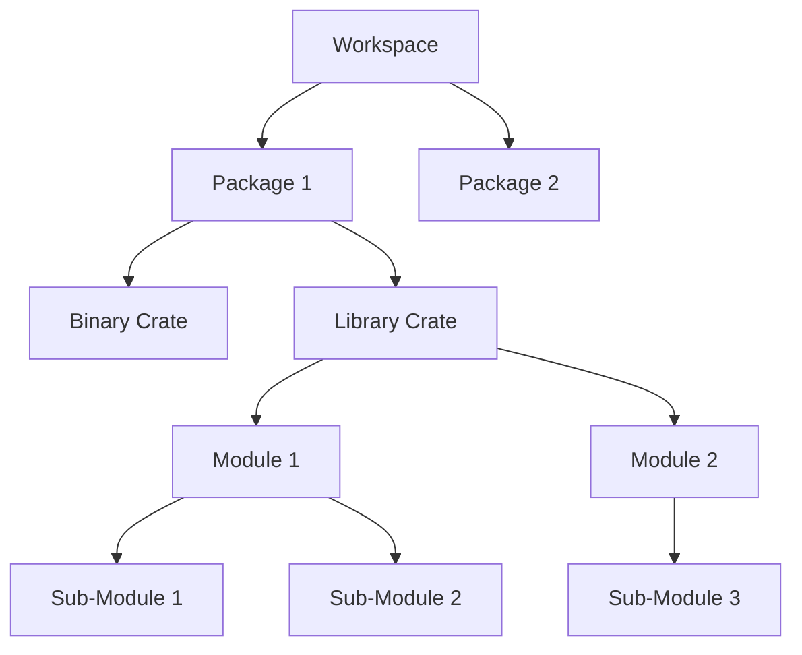

# Rust Code Organization

Organizing your Rust code properly is essential for maintaining readable, maintainable, and scalable projects. In this guide, we'll explore Rust's code organization features—modules, packages, crates, and workspaces—and learn how to use them effectively.

## Introduction

As your Rust projects grow, proper code organization becomes increasingly important. Rust provides several mechanisms to help structure your code:

- **Modules**: Group related code within a file or across files
- **Packages**: Bundle one or more crates with a Cargo.toml file
- **Crates**: Compilable units of code (libraries or executables)
- **Workspaces**: Organize multiple related packages

Understanding these concepts will help you build well-structured Rust projects that are easier to maintain and extend over time.

## Modules: Organizing Code Within a Crate

Modules help you organize code within a crate, control privacy (public vs. private items), and create clear namespaces.

### Basic Module Structure

Let's start with a simple example of module usage:

```rust
// Define a module
mod mathematics {
    // Private function (default)
    fn add(a: i32, b: i32) -> i32 {
        a + b
    }
    
    // Public function
    pub fn multiply(a: i32, b: i32) -> i32 {
        a * b
    }
    
    // Nested module
    pub mod advanced {
        pub fn power(base: i32, exponent: u32) -> i32 {
            let mut result = 1;
            for _ in 0..exponent {
                result *= base;
            }
            result
        }
    }
}

fn main() {
    // Access public functions from modules
    let product = mathematics::multiply(5, 6);
    println!("5 × 6 = {}", product);
    
    let power_result = mathematics::advanced::power(2, 8);
    println!("2^8 = {}", power_result);
    
    // This would not compile - 'add' is private:
    // let sum = mathematics::add(3, 4);
}
```

Output:
```
5 × 6 = 30
2^8 = 256
```

### Module Privacy Rules

Rust has a few key privacy rules:
- Items (functions, structs, etc.) are private by default
- Child modules can use private items from parent modules
- Parent modules cannot use private items from child modules

### Module Organization Across Files

For larger projects, you'll want to split modules across multiple files. There are two approaches:

#### Approach 1: Module Declarations with Files

```
src/
├── main.rs
├── mathematics.rs
└── mathematics/
    └── advanced.rs
```

**src/main.rs**:
```rust
// Declare the module - Rust will look for mathematics.rs
mod mathematics;

fn main() {
    let product = mathematics::multiply(5, 6);
    println!("5 × 6 = {}", product);
    
    let power_result = mathematics::advanced::power(2, 8);
    println!("2^8 = {}", power_result);
}
```

**src/mathematics.rs**:
```rust
pub fn multiply(a: i32, b: i32) -> i32 {
    a * b
}

// Declare the submodule - Rust will look for mathematics/advanced.rs
pub mod advanced;
```

**src/mathematics/advanced.rs**:
```rust
pub fn power(base: i32, exponent: u32) -> i32 {
    let mut result = 1;
    for _ in 0..exponent {
        result *= base;
    }
    result
}
```

#### Approach 2: Using mod.rs Files

```
src/
├── main.rs
└── mathematics/
    ├── mod.rs
    └── advanced.rs
```

**src/main.rs**:
```rust
mod mathematics;

fn main() {
    let product = mathematics::multiply(5, 6);
    println!("5 × 6 = {}", product);
    
    let power_result = mathematics::advanced::power(2, 8);
    println!("2^8 = {}", power_result);
}
```

**src/mathematics/mod.rs**:
```rust
pub fn multiply(a: i32, b: i32) -> i32 {
    a * b
}

pub mod advanced;
```

**src/mathematics/advanced.rs**:
```rust
pub fn power(base: i32, exponent: u32) -> i32 {
    let mut result = 1;
    for _ in 0..exponent {
        result *= base;
    }
    result
}
```

### The `use` Keyword

The `use` keyword brings items into scope to avoid typing long paths:

```rust
mod mathematics {
    pub fn multiply(a: i32, b: i32) -> i32 {
        a * b
    }
    
    pub mod advanced {
        pub fn power(base: i32, exponent: u32) -> i32 {
            let mut result = 1;
            for _ in 0..exponent {
                result *= base;
            }
            result
        }
    }
}

// Import specific functions
use mathematics::multiply;
use mathematics::advanced::power;

// Or import with shorter names
use mathematics::advanced::power as pow;

// Or import multiple items from the same module
use mathematics::{multiply, advanced::power};

fn main() {
    // Now we can call these functions directly
    let product = multiply(5, 6);
    println!("5 × 6 = {}", product);
    
    let power_result = power(2, 8);
    println!("2^8 = {}", power_result);
    
    let pow_result = pow(3, 4);
    println!("3^4 = {}", pow_result);
}
```

Output:
```
5 × 6 = 30
2^8 = 256
3^4 = 81
```

## Packages and Crates

A crate is a compilation unit in Rust. There are two types:
- **Binary crates**: Programs you can compile to an executable
- **Library crates**: Code intended to be used in other programs

A package is a bundle of one or more crates with a Cargo.toml file.

### Package Structure

A typical Rust package might look like this:

```
my_package/
├── Cargo.toml
├── src/
│   ├── main.rs      // Binary crate root
│   ├── lib.rs       // Library crate root
│   └── bin/
│       ├── tool1.rs // Additional binary
│       └── tool2.rs // Additional binary
```

The `Cargo.toml` file defines the package:

```toml
[package]
name = "my_package"
version = "0.1.0"
authors = ["Your Name <your.email@example.com>"]
edition = "2021"

[dependencies]
# External dependencies go here
rand = "0.8.5"
```

### Multiple Binaries in a Package

You can have multiple binary crates in a single package:

```
calculator/
├── Cargo.toml
└── src/
    ├── main.rs          # Default binary
    └── bin/
        ├── basic.rs     # Run with: cargo run --bin basic
        └── scientific.rs # Run with: cargo run --bin scientific
```

## Creating a Library and Binary Crate

Let's create a more practical example with both library and binary crates:

### Library Crate (src/lib.rs)

```rust
// src/lib.rs - Library crate root
pub mod shapes {
    pub struct Rectangle {
        pub width: f64,
        pub height: f64,
    }
    
    impl Rectangle {
        pub fn new(width: f64, height: f64) -> Self {
            Rectangle { width, height }
        }
        
        pub fn area(&self) -> f64 {
            self.width * self.height
        }
        
        pub fn perimeter(&self) -> f64 {
            2.0 * (self.width + self.height)
        }
    }
    
    pub struct Circle {
        pub radius: f64,
    }
    
    impl Circle {
        pub fn new(radius: f64) -> Self {
            Circle { radius }
        }
        
        pub fn area(&self) -> f64 {
            std::f64::consts::PI * self.radius * self.radius
        }
        
        pub fn circumference(&self) -> f64 {
            2.0 * std::f64::consts::PI * self.radius
        }
    }
}

pub mod utils {
    pub fn round_to_decimals(value: f64, decimals: usize) -> f64 {
        let factor = 10.0_f64.powi(decimals as i32);
        (value * factor).round() / factor
    }
}
```

### Binary Crate (src/main.rs)

```rust
// src/main.rs - Binary crate root
use geometry_calculator::shapes::{Rectangle, Circle};
use geometry_calculator::utils::round_to_decimals;

fn main() {
    let rect = Rectangle::new(5.0, 3.0);
    let circle = Circle::new(4.0);
    
    println!("Rectangle (5×3):");
    println!("  Area: {}", round_to_decimals(rect.area(), 2));
    println!("  Perimeter: {}", round_to_decimals(rect.perimeter(), 2));
    
    println!("
Circle (radius 4):");
    println!("  Area: {}", round_to_decimals(circle.area(), 2));
    println!("  Circumference: {}", round_to_decimals(circle.circumference(), 2));
}
```

Output:
```
Rectangle (5×3):
  Area: 15.00
  Perimeter: 16.00

Circle (radius 4):
  Area: 50.27
  Circumference: 25.13
```

## Using Workspaces

For larger projects, Rust offers workspaces to manage multiple related packages:

```
geometry_project/
├── Cargo.toml             # Workspace configuration
├── geometry_core/         # Core library package
│   ├── Cargo.toml
│   └── src/
│       └── lib.rs
├── geometry_2d/           # 2D shapes package
│   ├── Cargo.toml
│   └── src/
│       └── lib.rs
├── geometry_3d/           # 3D shapes package
│   ├── Cargo.toml
│   └── src/
│       └── lib.rs
└── geometry_cli/          # Command-line application
    ├── Cargo.toml
    └── src/
        └── main.rs
```

The workspace Cargo.toml:

```toml
[workspace]
members = [
    "geometry_core",
    "geometry_2d",
    "geometry_3d",
    "geometry_cli",
]
```

Package-specific Cargo.toml (e.g., geometry_2d/Cargo.toml):

```toml
[package]
name = "geometry_2d"
version = "0.1.0"
edition = "2021"

[dependencies]
geometry_core = { path = "../geometry_core" }
```

### Workspace Benefits

Workspaces provide several advantages:
- Share dependencies between packages
- Build all packages with a single command
- Make changes to multiple packages together
- Save disk space by sharing the target directory

## Module Organization Patterns

Here are some common patterns for organizing Rust code:

### Flat Structure (Small Projects)

```
src/
├── main.rs
└── lib.rs
```

### Feature-based Structure

```
src/
├── main.rs
├── authentication/
│   ├── mod.rs
│   ├── models.rs
│   └── utils.rs
├── users/
│   ├── mod.rs
│   ├── models.rs
│   └── handlers.rs
└── payments/
    ├── mod.rs
    ├── models.rs
    └── processors.rs
```

### Layer-based Structure

```
src/
├── main.rs
├── models/
│   ├── mod.rs
│   ├── user.rs
│   └── product.rs
├── repositories/
│   ├── mod.rs
│   ├── user_repository.rs
│   └── product_repository.rs
└── services/
    ├── mod.rs
    ├── user_service.rs
    └── product_service.rs
```

## Best Practices for Rust Code Organization

Here's a diagram showing Rust's module hierarchy:



Follow these best practices:

1. **Use meaningful module names** that reflect their purpose
2. **Keep modules focused** on a single responsibility
3. **Organize by feature** rather than by type when appropriate
4. **Use `pub use`** to re-export items for a cleaner public API:

```rust
// src/lib.rs
mod shapes;
mod utils;

// Re-export specific items for a cleaner API
pub use shapes::{Rectangle, Circle};
pub use utils::round_to_decimals;
```

5. **Document your module structure** with comments

6. **Follow the Rust convention** for file naming (snake_case)

7. **Be consistent** with your chosen organization pattern

## Real-World Example: Building a Todo Application

Let's put everything together with a practical example of a todo application structure:

```
todo_app/
├── Cargo.toml
└── src/
    ├── main.rs
    ├── lib.rs
    ├── models/
    │   ├── mod.rs
    │   └── todo.rs
    ├── storage/
    │   ├── mod.rs
    │   ├── file.rs
    │   └── memory.rs
    └── ui/
        ├── mod.rs
        ├── cli.rs
        └── tui.rs
```

**src/models/todo.rs**:
```rust
#[derive(Debug, Clone)]
pub struct Todo {
    pub id: usize,
    pub title: String,
    pub completed: bool,
}

impl Todo {
    pub fn new(id: usize, title: &str) -> Self {
        Todo {
            id,
            title: title.to_string(),
            completed: false,
        }
    }
    
    pub fn toggle_completed(&mut self) {
        self.completed = !self.completed;
    }
}
```

**src/models/mod.rs**:
```rust
mod todo;
pub use todo::Todo;
```

**src/storage/mod.rs**:
```rust
mod file;
mod memory;

pub use file::FileStorage;
pub use memory::MemoryStorage;

pub trait Storage {
    fn add_todo(&mut self, todo: crate::models::Todo) -> Result<(), String>;
    fn get_todos(&self) -> Vec<crate::models::Todo>;
    fn update_todo(&mut self, todo: crate::models::Todo) -> Result<(), String>;
    fn delete_todo(&mut self, id: usize) -> Result<(), String>;
}
```

**src/storage/memory.rs**:
```rust
use crate::models::Todo;
use super::Storage;

pub struct MemoryStorage {
    todos: Vec<Todo>,
}

impl MemoryStorage {
    pub fn new() -> Self {
        MemoryStorage { todos: Vec::new() }
    }
}

impl Storage for MemoryStorage {
    fn add_todo(&mut self, todo: Todo) -> Result<(), String> {
        // Check if a todo with this ID already exists
        if self.todos.iter().any(|t| t.id == todo.id) {
            return Err(format!("Todo with ID {} already exists", todo.id));
        }
        self.todos.push(todo);
        Ok(())
    }
    
    fn get_todos(&self) -> Vec<Todo> {
        self.todos.clone()
    }
    
    fn update_todo(&mut self, todo: Todo) -> Result<(), String> {
        if let Some(index) = self.todos.iter().position(|t| t.id == todo.id) {
            self.todos[index] = todo;
            Ok(())
        } else {
            Err(format!("Todo with ID {} not found", todo.id))
        }
    }
    
    fn delete_todo(&mut self, id: usize) -> Result<(), String> {
        if let Some(index) = self.todos.iter().position(|t| t.id == id) {
            self.todos.remove(index);
            Ok(())
        } else {
            Err(format!("Todo with ID {} not found", id))
        }
    }
}
```

**src/lib.rs**:
```rust
pub mod models;
pub mod storage;
pub mod ui;

// Re-export commonly used items
pub use models::Todo;
pub use storage::{Storage, MemoryStorage, FileStorage};
```

**src/main.rs**:
```rust
use todo_app::{MemoryStorage, Storage, Todo, ui};

fn main() {
    let mut storage = MemoryStorage::new();
    
    // Add some sample todos
    storage.add_todo(Todo::new(1, "Learn Rust modules")).unwrap();
    storage.add_todo(Todo::new(2, "Organize Rust code")).unwrap();
    storage.add_todo(Todo::new(3, "Build a todo app")).unwrap();
    
    // Mark one as completed
    let mut todo = storage.get_todos()[0].clone();
    todo.toggle_completed();
    storage.update_todo(todo).unwrap();
    
    // Display todos using CLI UI
    ui::cli::display_todos(&storage.get_todos());
}
```

**src/ui/cli.rs**:
```rust
use crate::models::Todo;

pub fn display_todos(todos: &[Todo]) {
    println!("Your Todo List:");
    println!("-----------------------------------------------------------------------------");
    
    if todos.is_empty() {
        println!("No todos found. Add one to get started!");
    } else {
        for todo in todos {
            let status = if todo.completed { "✓" } else { " " };
            println!("[{}] #{}: {}", status, todo.id, todo.title);
        }
    }
    
    println!("-----------------------------------------------------------------------------");
}
```

## Summary

Proper code organization is essential for maintaining and scaling Rust projects. In this guide, we've explored:

- **Modules**: For organizing code within crates and controlling privacy
- **Packages and Crates**: For bundling code into libraries and executables
- **Workspaces**: For managing multiple related packages
- **Organization Patterns**: Common approaches to structuring Rust code
- **Best Practices**: Guidelines for effective code organization

By applying these concepts, you can build well-structured Rust projects that are easier to understand, maintain, and extend.

## Additional Resources

- [The Rust Book: Packages and Crates](https://doc.rust-lang.org/book/ch07-01-packages-and-crates.html)
- [The Rust Book: Modules](https://doc.rust-lang.org/book/ch07-02-defining-modules-to-control-scope-and-privacy.html)
- [Rust By Example: Modules](https://doc.rust-lang.org/rust-by-example/mod.html)
- [The Cargo Book: Workspaces](https://doc.rust-lang.org/cargo/reference/workspaces.html)

## Exercises

1. **Module Organization**: Create a simple calculator library with modules for basic operations, scientific operations, and statistics.

2. **Public API Design**: Design a library for handling geometric shapes. Implement a clean public API using `pub use` to re-export necessary items.

3. **Workspace Creation**: Create a workspace with multiple packages for a blog platform (core, database, web server, CLI tool).

4. **Feature Organization**: Refactor an existing project to organize it by feature instead of by type.

5. **Test Organization**: Add comprehensive tests to your project, properly organized in test modules.