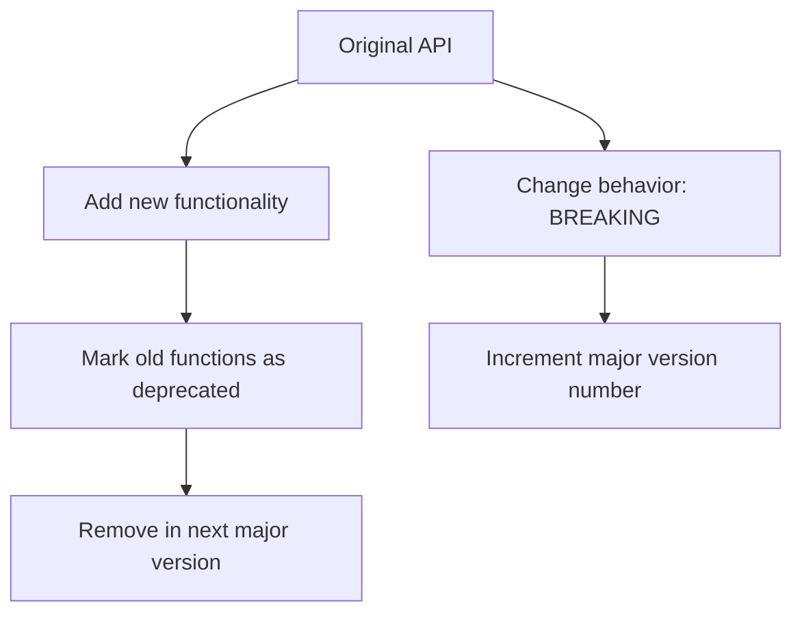

# Rust API Design

## Introduction

Designing good APIs (Application Programming Interfaces) is a crucial skill for Rust developers. A well-designed API makes your code more maintainable, easier to use correctly, and harder to use incorrectly. This guide will walk you through the key principles of Rust API design, helping you create interfaces that are both powerful and user-friendly.

In Rust, API design takes advantage of the language's unique features like ownership, traits, and type safety to create interfaces that are not only ergonomic but also prevent entire categories of bugs at compile time.

## Core Principles of Rust API Design

### 1. Follow Rust Idioms

Rust has established idioms and patterns that users expect. Following these makes your API feel natural to Rust developers.

```rust
// ❌ Non-idiomatic: Using out parameters like in C
fn get_dimensions(width: &mut i32, height: &mut i32) {
    *width = 800;
    *height = 600;
}

// ✅ Idiomatic: Return a tuple or struct
fn get_dimensions() -> (i32, i32) {
    (800, 600)
}

// Even better with a named struct
struct Dimensions {
    width: i32,
    height: i32,
}

fn get_dimensions() -> Dimensions {
    Dimensions {
        width: 800,
        height: 600,
    }
}
```

### 2. Leverage the Type System

Rust's rich type system can make invalid states unrepresentable.

```rust
// ❌ Poor design: Using raw strings that could be invalid
fn connect(url: &str) -> Result<Connection, Error> {
    // Validate URL here...
}

// ✅ Better design: Use a type that guarantees validity
use url::Url;

fn connect(url: Url) -> Result<Connection, Error> {
    // URL is already validated by the Url type
}
```

### 3. Make Illegal States Unrepresentable

Design your types so that if a value exists, it must be valid.

```rust
// ❌ Problematic: State can be invalid
struct User {
    id: Option<u64>,
    username: String,
}

// ✅ Better: Different types for different states
struct NewUser {
    username: String,
}

struct RegisteredUser {
    id: u64,
    username: String,
}
```

## Public API Design Patterns

### Builder Pattern

The Builder pattern is useful when constructing complex objects with many optional parameters.

```rust
// Example: A HTTP client builder
pub struct RequestBuilder {
    method: Method,
    url: Url,
    headers: Headers,
    body: Option<Body>,
    timeout: Option<Duration>,
}

impl RequestBuilder {
    pub fn new(method: Method, url: Url) -> Self {
        Self {
            method,
            url,
            headers: Headers::new(),
            body: None,
            timeout: None,
        }
    }
    
    pub fn header(mut self, name: &str, value: &str) -> Self {
        self.headers.insert(name, value);
        self
    }
    
    pub fn body(mut self, body: Body) -> Self {
        self.body = Some(body);
        self
    }
    
    pub fn timeout(mut self, timeout: Duration) -> Self {
        self.timeout = Some(timeout);
        self
    }
    
    pub fn send(self) -> Result<Response, Error> {
        // Send the request
        todo!()
    }
}

// Usage
let response = RequestBuilder::new(Method::GET, "https://example.com".parse().unwrap())
    .header("User-Agent", "My Client")
    .timeout(Duration::from_secs(30))
    .send()?;
```

### The Newtype Pattern

Use the newtype pattern to create a thin wrapper around an existing type, adding type safety.

```rust
// ❌ Using primitive types directly can lead to confusion
fn create_user(id: u64, age: u8) {
    // Easy to mix up parameters of the same type
}

// ✅ Newtype pattern adds type safety
struct UserId(u64);
struct UserAge(u8);

fn create_user(id: UserId, age: UserAge) {
    // Parameters can't be accidentally swapped
}
```

## Error Handling in APIs

### Using Result for Expected Failures

```rust
// Simple error handling
fn read_config(path: &Path) -> Result<Config, std::io::Error> {
    let content = std::fs::read_to_string(path)?;
    // Parse content into Config...
    todo!()
}
```

### Custom Error Types

For libraries, defining your own error type provides better error information to users.

```rust
#[derive(Debug)]
pub enum ConfigError {
    IoError(std::io::Error),
    ParseError { line: usize, message: String },
    MissingField(String),
}

impl From<std::io::Error> for ConfigError {
    fn from(err: std::io::Error) -> Self {
        ConfigError::IoError(err)
    }
}

impl std::fmt::Display for ConfigError {
    fn fmt(&self, f: &mut std::fmt::Formatter) -> std::fmt::Result {
        match self {
            ConfigError::IoError(err) => write!(f, "IO error: {}", err),
            ConfigError::ParseError { line, message } => {
                write!(f, "Parse error at line {}: {}", line, message)
            }
            ConfigError::MissingField(field) => {
                write!(f, "Missing required field: {}", field)
            }
        }
    }
}

impl std::error::Error for ConfigError {}

// Using the custom error type
fn read_config(path: &Path) -> Result<Config, ConfigError> {
    let content = std::fs::read_to_string(path)?;
    // Parse content into Config...
    todo!()
}
```

## Designing for Extensibility

### Using Traits for Abstraction

Traits allow your API to work with multiple types, improving flexibility.

```rust
// Define a trait
pub trait Storage {
    fn save(&self, key: &str, data: &[u8]) -> Result<(), Error>;
    fn load(&self, key: &str) -> Result<Vec<u8>, Error>;
}

// Implement for different storage backends
pub struct FileStorage {
    root_dir: PathBuf,
}

impl Storage for FileStorage {
    fn save(&self, key: &str, data: &[u8]) -> Result<(), Error> {
        // Save to file
        todo!()
    }
    
    fn load(&self, key: &str) -> Result<Vec<u8>, Error> {
        // Load from file
        todo!()
    }
}

pub struct MemoryStorage {
    data: HashMap<String, Vec<u8>>,
}

impl Storage for MemoryStorage {
    fn save(&self, key: &str, data: &[u8]) -> Result<(), Error> {
        // Save to memory
        todo!()
    }
    
    fn load(&self, key: &str) -> Result<Vec<u8>, Error> {
        // Load from memory
        todo!()
    }
}

// Functions can accept any type that implements Storage
fn backup_data(storage: &impl Storage, data: &[u8]) -> Result<(), Error> {
    storage.save("backup", data)
}
```

### Generic Associated Types (GATs)

For more advanced APIs, you might need generic associated types.

```rust
pub trait Iterator {
    type Item;
    
    fn next(&mut self) -> Option<Self::Item>;
}

// With GATs (available since Rust 1.65)
pub trait StreamingIterator {
    type Item<'a> where Self: 'a;
    
    fn next<'a>(&'a mut self) -> Option<Self::Item<'a>>;
}
```

## API Documentation

Good documentation is essential for a usable API.

```rust
/// Represents a user in the system.
///
/// # Examples
///
/// ```
/// let user = User::new("alice", "password123");
/// assert_eq!(user.username(), "alice");
/// ```
pub struct User {
    username: String,
    password_hash: String,
}

impl User {
    /// Creates a new user with the given username and password.
    ///
    /// The password will be hashed before storage.
    ///
    /// # Arguments
    ///
    /// * `username` - The user's username
    /// * `password` - The user's raw password, which will be hashed
    ///
    /// # Returns
    ///
    /// A new `User` instance
    pub fn new(username: &str, password: &str) -> Self {
        let password_hash = hash_password(password);
        Self {
            username: username.to_string(),
            password_hash,
        }
    }
    
    /// Returns the username of this user.
    pub fn username(&self) -> &str {
        &self.username
    }
}
```

## API Versioning

When making changes to your API, consider backward compatibility:



### Semantic Versioning

Follow semantic versioning (SemVer) for your APIs:
- **Major version (x.0.0)**: Breaking changes
- **Minor version (0.x.0)**: New features, backward compatible
- **Patch version (0.0.x)**: Bug fixes, backward compatible

## Real-world Example: Creating a Database Client API

Let's design a simple database client API that demonstrates the principles we've covered:

```rust
/// A client for connecting to and querying a database.
pub struct DbClient {
    connection: Connection,
}

impl DbClient {
    /// Creates a new database client builder.
    pub fn builder() -> DbClientBuilder {
        DbClientBuilder::new()
    }
    
    /// Executes a SQL query that returns no results.
    ///
    /// # Arguments
    ///
    /// * `query` - The SQL query to execute
    /// * `params` - The parameters to bind to the query
    ///
    /// # Returns
    ///
    /// The number of rows affected
    ///
    /// # Errors
    ///
    /// Returns a `DbError` if the query fails
    pub fn execute(&self, query: &str, params: &[&dyn ToSql]) -> Result<u64, DbError> {
        // Execute query
        todo!()
    }
    
    /// Executes a SQL query that returns rows.
    ///
    /// # Arguments
    ///
    /// * `query` - The SQL query to execute
    /// * `params` - The parameters to bind to the query
    ///
    /// # Returns
    ///
    /// A vector of rows, where each row is a vector of column values
    ///
    /// # Errors
    ///
    /// Returns a `DbError` if the query fails
    pub fn query(&self, query: &str, params: &[&dyn ToSql]) -> Result<Vec<Row>, DbError> {
        // Execute query and return rows
        todo!()
    }
    
    /// Executes a SQL query and maps each row to a struct.
    ///
    /// # Type Parameters
    ///
    /// * `T` - The type to map each row to, must implement `FromRow`
    ///
    /// # Arguments
    ///
    /// * `query` - The SQL query to execute
    /// * `params` - The parameters to bind to the query
    ///
    /// # Returns
    ///
    /// A vector of mapped rows
    ///
    /// # Errors
    ///
    /// Returns a `DbError` if the query fails or if a row cannot be mapped to `T`
    pub fn query_as<T: FromRow>(&self, query: &str, params: &[&dyn ToSql]) -> Result<Vec<T>, DbError> {
        let rows = self.query(query, params)?;
        rows.into_iter()
            .map(|row| T::from_row(&row).map_err(DbError::from))
            .collect()
    }
}

/// Builder for creating a database client.
pub struct DbClientBuilder {
    host: Option<String>,
    port: Option<u16>,
    username: Option<String>,
    password: Option<String>,
    database: Option<String>,
    max_connections: usize,
}

impl DbClientBuilder {
    /// Creates a new database client builder with default settings.
    pub fn new() -> Self {
        Self {
            host: None,
            port: None,
            username: None,
            password: None,
            database: None,
            max_connections: 10,
        }
    }
    
    /// Sets the host to connect to.
    pub fn host(mut self, host: impl Into<String>) -> Self {
        self.host = Some(host.into());
        self
    }
    
    /// Sets the port to connect to.
    pub fn port(mut self, port: u16) -> Self {
        self.port = Some(port);
        self
    }
    
    /// Sets the username to authenticate with.
    pub fn username(mut self, username: impl Into<String>) -> Self {
        self.username = Some(username.into());
        self
    }
    
    /// Sets the password to authenticate with.
    pub fn password(mut self, password: impl Into<String>) -> Self {
        self.password = Some(password.into());
        self
    }
    
    /// Sets the database to connect to.
    pub fn database(mut self, database: impl Into<String>) -> Self {
        self.database = Some(database.into());
        self
    }
    
    /// Sets the maximum number of connections in the pool.
    pub fn max_connections(mut self, max_connections: usize) -> Self {
        self.max_connections = max_connections;
        self
    }
    
    /// Builds the database client.
    ///
    /// # Returns
    ///
    /// A new `DbClient` instance
    ///
    /// # Errors
    ///
    /// Returns a `DbError` if the client cannot be created
    pub fn build(self) -> Result<DbClient, DbError> {
        let host = self.host.unwrap_or_else(|| "localhost".to_string());
        let port = self.port.unwrap_or(5432);
        let username = self.username.ok_or(DbError::ConfigError("Username is required"))?;
        let password = self.password.ok_or(DbError::ConfigError("Password is required"))?;
        let database = self.database.ok_or(DbError::ConfigError("Database is required"))?;
        
        // Create connection
        todo!()
    }
}

/// Trait for types that can be constructed from a database row.
pub trait FromRow: Sized {
    /// Converts a row into an instance of this type.
    ///
    /// # Arguments
    ///
    /// * `row` - The row to convert
    ///
    /// # Returns
    ///
    /// An instance of this type
    ///
    /// # Errors
    ///
    /// Returns a `RowError` if the row cannot be converted
    fn from_row(row: &Row) -> Result<Self, RowError>;
}

/// Example usage:
fn example() -> Result<(), DbError> {
    // Create a client
    let client = DbClient::builder()
        .host("localhost")
        .port(5432)
        .username("user")
        .password("password")
        .database("mydb")
        .max_connections(20)
        .build()?;
    
    // Execute a query
    let rows_affected = client.execute(
        "UPDATE users SET active = $1 WHERE last_login < $2",
        &[&false, &(Utc::now() - Duration::days(30))],
    )?;
    
    println!("Updated {} users", rows_affected);
    
    // Query data
    let active_users: Vec<User> = client.query_as(
        "SELECT id, username, email FROM users WHERE active = $1",
        &[&true],
    )?;
    
    for user in active_users {
        println!("Active user: {}", user.username);
    }
    
    Ok(())
}
```

## Summary

Designing good APIs in Rust involves leveraging the language's powerful type system and following established patterns. Key principles include:

1. **Follow Rust idioms** to make your API feel natural to Rust developers
2. **Leverage the type system** to prevent errors at compile time
3. **Make illegal states unrepresentable** through careful type design
4. **Use the Builder pattern** for complex object construction
5. **Implement custom error types** for better error messages
6. **Design for extensibility** using traits and generics
7. **Document thoroughly** so users understand how to use your API

Remember that good API design is iterative. Don't be afraid to refactor and improve your API based on feedback and how it's used in practice.

## Exercises

1. **Basic API Design**: Design a simple `Logger` API with multiple backends (console, file, network).
2. **Error Handling**: Create a custom error type for a file processing library that handles different types of errors.
3. **Builder Pattern**: Implement the Builder pattern for a complex configuration object.
4. **Traits for Abstraction**: Design a trait hierarchy for different payment methods in an e-commerce system.
5. **API Documentation**: Document an existing function using Rust's documentation comments.

## Additional Resources

- [The Rust Programming Language Book](https://doc.rust-lang.org/book/) - Chapters on error handling and traits
- [API Guidelines](https://rust-lang.github.io/api-guidelines/) - Official Rust API design guidelines
- [Rust By Example](https://doc.rust-lang.org/rust-by-example/) - Examples of idiomatic Rust code
- [Error Handling in Rust](https://blog.burntsushi.net/rust-error-handling/) - Detailed guide on error handling
- [Abstraction without overhead](https://blog.rust-lang.org/2015/05/11/traits.html) - Blog post about zero-cost abstractions in Rust