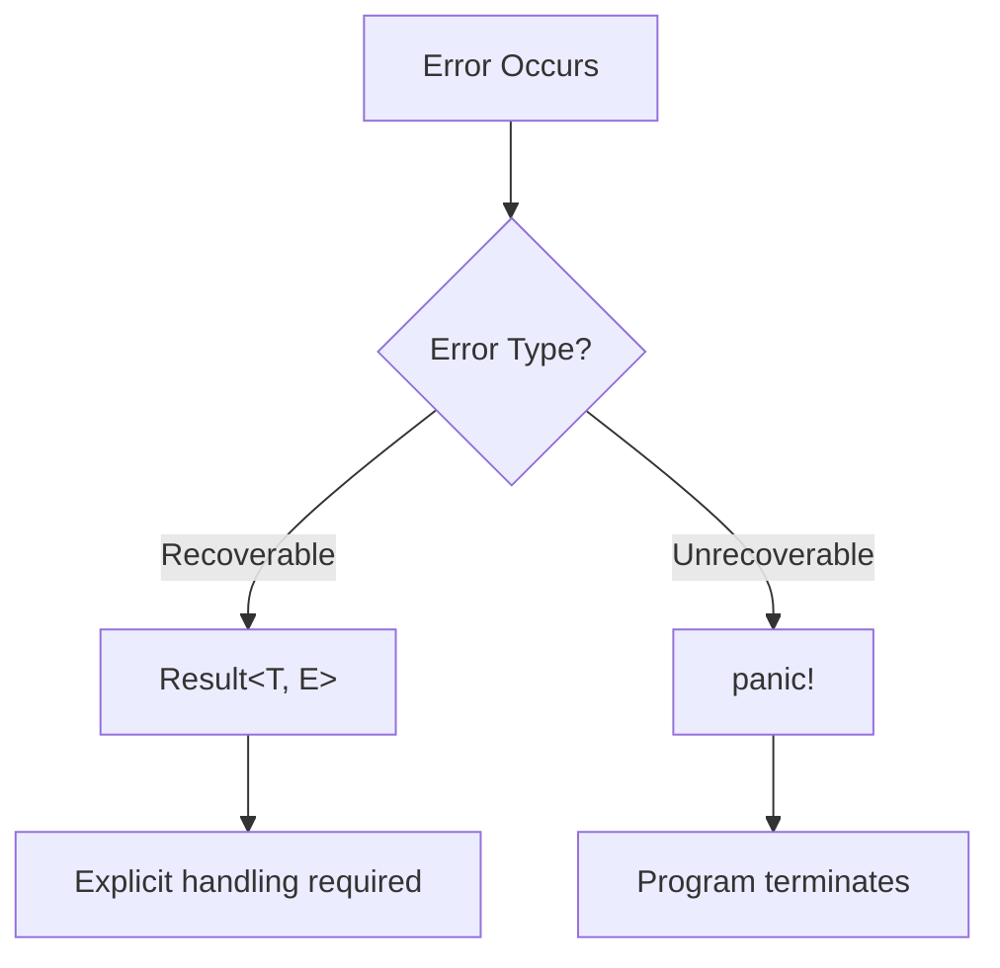
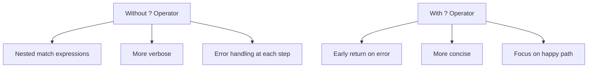

# Rust Error Handling Patterns

## Introduction

Error handling is a critical aspect of writing robust and reliable Rust programs. Unlike many programming languages that use exceptions, Rust takes a different approach with its Result and Option types, providing compile-time error checking that helps catch potential issues before your code ever runs.

In this guide, we'll explore various error handling patterns in Rust that will help you write cleaner, more maintainable, and more robust code. Whether you're dealing with file operations, network requests, or parsing data, these patterns will serve as valuable tools in your Rust programming journey.

## Understanding Rust's Error Philosophy

Before diving into specific patterns, let's understand Rust's philosophy toward errors:

1. **Explicit over implicit**: Errors are represented as values that must be explicitly handled
2. **No exceptions**: Rust doesn't use exception-based error handling
3. **Compile-time checking**: The type system ensures errors are addressed before running
4. **Distinguishing between recoverable and unrecoverable errors**

Let's visualize this approach:



## Basic Error Handling Types

### The Option Type

The `Option<T>` type represents a value that might be present or absent. It's defined as:

```rust
enum Option<T> {
    Some(T),
    None,
}
```

Here's a simple example of using Option:

```rust
fn find_user(id: u32) -> Option<String> {
    if id == 42 {
        Some(String::from("Alice"))
    } else {
        None
    }
}

// Example usage
fn main() {
    let user_id = 42;
    match find_user(user_id) {
        Some(name) => println!("User found: {}", name),
        None => println!("User not found"),
    }
    
    // Output:
    // User found: Alice
}
```

### The Result Type

The `Result<T, E>` type represents an operation that might succeed with a value of type `T` or fail with an error of type `E`:

```rust
enum Result<T, E> {
    Ok(T),
    Err(E),
}
```

Example using Result:

```rust
use std::fs::File;
use std::io::Error;

fn open_file(path: &str) -> Result<File, Error> {
    File::open(path)
}

fn main() {
    let file_path = "example.txt";
    match open_file(file_path) {
        Ok(file) => println!("File opened successfully: {:?}", file),
        Err(error) => println!("Failed to open file: {}", error),
    }
    
    // Possible output:
    // Failed to open file: No such file or directory (os error 2)
}
```

## Error Handling Patterns

### Pattern 1: Using `match` for Exhaustive Handling

The `match` expression provides comprehensive error handling by forcing you to handle all possible cases:

```rust
use std::fs::File;
use std::io::Read;

fn read_file_contents(path: &str) -> String {
    let file = match File::open(path) {
        Ok(mut file) => {
            let mut contents = String::new();
            match file.read_to_string(&mut contents) {
                Ok(_) => contents,
                Err(e) => format!("Error reading file: {}", e),
            }
        },
        Err(e) => format!("Error opening file: {}", e),
    };
    
    file
}

fn main() {
    let contents = read_file_contents("example.txt");
    println!("{}", contents);
    
    // Possible output:
    // Error opening file: No such file or directory (os error 2)
}
```

### Pattern 2: Using `if let` for Single Case Handling

When you only care about one specific case, `if let` provides a concise way to handle it:

```rust
fn process_user_id(id_str: &str) {
    if let Some(id) = id_str.parse::<u32>().ok() {
        println!("Valid ID: {}", id);
    } else {
        println!("Invalid ID format");
    }
}

fn main() {
    process_user_id("42");    // Valid ID: 42
    process_user_id("abc");   // Invalid ID format
}
```

### Pattern 3: Using the `?` Operator

The `?` operator simplifies error handling by automatically propagating errors, making your code more concise:

```rust
use std::fs::File;
use std::io::{self, Read};

fn read_file_contents(path: &str) -> Result<String, io::Error> {
    let mut file = File::open(path)?;
    let mut contents = String::new();
    file.read_to_string(&mut contents)?;
    Ok(contents)
}

fn main() {
    match read_file_contents("example.txt") {
        Ok(contents) => println!("File contents: {}", contents),
        Err(e) => println!("Error: {}", e),
    }
    
    // Possible output:
    // Error: No such file or directory (os error 2)
}
```

Let's see how this compares to the previous approach with a diagram:



### Pattern 4: The `unwrap` and `expect` Methods

These methods provide shortcuts when you expect success or when handling errors isn't critical:

```rust
fn main() {
    // unwrap() will panic if the result is an Err
    let file = File::open("config.txt").unwrap();
    
    // expect() lets you specify a custom panic message
    let config = std::fs::read_to_string("config.txt")
        .expect("Failed to read configuration file");
    
    // These should only be used when failure is unexpected or in prototyping
}
```

⚠️ **Warning**: Using `unwrap()` and `expect()` should be done carefully, as they can cause your program to crash if an error occurs!

### Pattern 5: Fallible Functions with Default Values

Sometimes, you want to provide a default value when an error occurs:

```rust
fn get_configuration() -> String {
    std::fs::read_to_string("config.txt").unwrap_or_default()
}

fn main() {
    let config = get_configuration();
    println!("Config: {}", config);
    
    // If config.txt doesn't exist, prints:
    // Config: 
    // (with an empty string as the default)
}
```

### Pattern 6: Custom Error Types

For larger applications, defining your own error types can make error handling more organized:

```rust
use std::fmt;
use std::error::Error;
use std::io;
use std::num::ParseIntError;

#[derive(Debug)]
enum AppError {
    IoError(io::Error),
    ParseError(ParseIntError),
    ConfigError(String),
}

impl fmt::Display for AppError {
    fn fmt(&self, f: &mut fmt::Formatter) -> fmt::Result {
        match self {
            AppError::IoError(e) => write!(f, "I/O error: {}", e),
            AppError::ParseError(e) => write!(f, "Parse error: {}", e),
            AppError::ConfigError(msg) => write!(f, "Configuration error: {}", msg),
        }
    }
}

impl Error for AppError {}

impl From<io::Error> for AppError {
    fn from(error: io::Error) -> Self {
        AppError::IoError(error)
    }
}

impl From<ParseIntError> for AppError {
    fn from(error: ParseIntError) -> Self {
        AppError::ParseError(error)
    }
}

fn read_config_value() -> Result<u32, AppError> {
    // Read the file
    let config_str = std::fs::read_to_string("config.txt")?;
    
    // Parse the value
    let value = config_str.trim().parse::<u32>()?;
    
    if value == 0 {
        return Err(AppError::ConfigError("Value cannot be zero".to_string()));
    }
    
    Ok(value)
}

fn main() {
    match read_config_value() {
        Ok(value) => println!("Configuration value: {}", value),
        Err(e) => println!("Error: {}", e),
    }
}
```

This pattern is particularly useful for libraries and larger applications where different error types need to be handled consistently.

## Real-World Applications

### Building a Simple Configuration Parser

Let's put these patterns to use in a practical example:

```rust
use std::fs::File;
use std::io::{self, BufRead, BufReader};
use std::collections::HashMap;
use std::path::Path;

#[derive(Debug)]
enum ConfigError {
    IoError(io::Error),
    ParseError(String),
    MissingValue(String),
}

impl From<io::Error> for ConfigError {
    fn from(error: io::Error) -> Self {
        ConfigError::IoError(error)
    }
}

impl std::fmt::Display for ConfigError {
    fn fmt(&self, f: &mut std::fmt::Formatter) -> std::fmt::Result {
        match self {
            ConfigError::IoError(e) => write!(f, "I/O error: {}", e),
            ConfigError::ParseError(msg) => write!(f, "Parse error: {}", msg),
            ConfigError::MissingValue(key) => write!(f, "Missing value for key: {}", key),
        }
    }
}

struct Config {
    values: HashMap<String, String>,
}

impl Config {
    fn load<P: AsRef<Path>>(path: P) -> Result<Self, ConfigError> {
        let file = File::open(path)?;
        let reader = BufReader::new(file);
        let mut values = HashMap::new();
        
        for line in reader.lines() {
            let line = line?;
            let line = line.trim();
            
            // Skip empty lines and comments
            if line.is_empty() || line.starts_with('#') {
                continue;
            }
            
            // Parse "key=value" format
            if let Some(index) = line.find('=') {
                let key = line[..index].trim().to_string();
                let value = line[index + 1..].trim().to_string();
                values.insert(key, value);
            } else {
                return Err(ConfigError::ParseError(
                    format!("Invalid line format: {}", line)
                ));
            }
        }
        
        Ok(Config { values })
    }
    
    fn get(&self, key: &str) -> Result<&str, ConfigError> {
        self.values.get(key)
            .map(|s| s.as_str())
            .ok_or_else(|| ConfigError::MissingValue(key.to_string()))
    }
    
    fn get_with_default(&self, key: &str, default: &str) -> &str {
        self.values.get(key).map(|s| s.as_str()).unwrap_or(default)
    }
}

fn main() {
    // Example usage
    match Config::load("settings.conf") {
        Ok(config) => {
            // Using ? operator pattern with early return
            if let Ok(port) = (|| -> Result<u16, ConfigError> {
                let port_str = config.get("port")?;
                port_str.parse::<u16>().map_err(|_| {
                    ConfigError::ParseError(format!("Invalid port number: {}", port_str))
                })
            })() {
                println!("Server port: {}", port);
            }
            
            // Using default value pattern
            let timeout = config.get_with_default("timeout", "30");
            println!("Timeout: {} seconds", timeout);
        },
        Err(e) => {
            println!("Failed to load configuration: {}", e);
            
            // Provide fallback configuration in case of error
            println!("Using default configuration");
        }
    }
}
```

**Sample input file (settings.conf):**
```
# Server configuration
port=8080
host=localhost
timeout=60
```

**Expected output:**
```
Server port: 8080
Timeout: 60 seconds
```

## Error Handling Best Practices

1. **Be explicit about which errors can occur** in your function signatures using the `Result` type
2. **Use custom error types** for libraries and larger applications
3. **Avoid using `unwrap()` and `expect()`** in production code unless you're absolutely certain a failure is impossible
4. **Use the `?` operator** to keep your code clean and focused on the happy path
5. **Add context to errors** when propagating them to help with debugging
6. **Document error conditions** in your function documentation

## Summary

Rust's approach to error handling provides many benefits:

- **Safety**: Errors are handled at compile time, preventing many runtime failures
- **Explicitness**: Error handling is visible in type signatures, making code more self-documenting
- **Flexibility**: Multiple patterns to handle different scenarios
- **Composability**: Errors can be easily transformed and combined

By mastering these error handling patterns, you'll write more robust Rust code that gracefully handles failure cases and provides better user experiences.

## Additional Resources

- [The Rust Programming Language](https://doc.rust-lang.org/book/ch09-00-error-handling.html) - Official book chapter on error handling
- [Rust By Example - Error Handling](https://doc.rust-lang.org/rust-by-example/error.html) - Practical examples of error handling
- [thiserror](https://github.com/dtolnay/thiserror) and [anyhow](https://github.com/dtolnay/anyhow) - Popular error handling crates

## Exercises

1. Extend the configuration parser example to support different data types (integers, booleans, lists)
2. Create a custom error type for a simple file processing application that handles at least three different error cases
3. Refactor code that uses multiple `unwrap()` calls to use proper error handling with the `?` operator
4. Implement a function that reads data from a file, processes it, and writes results to another file, with comprehensive error handling