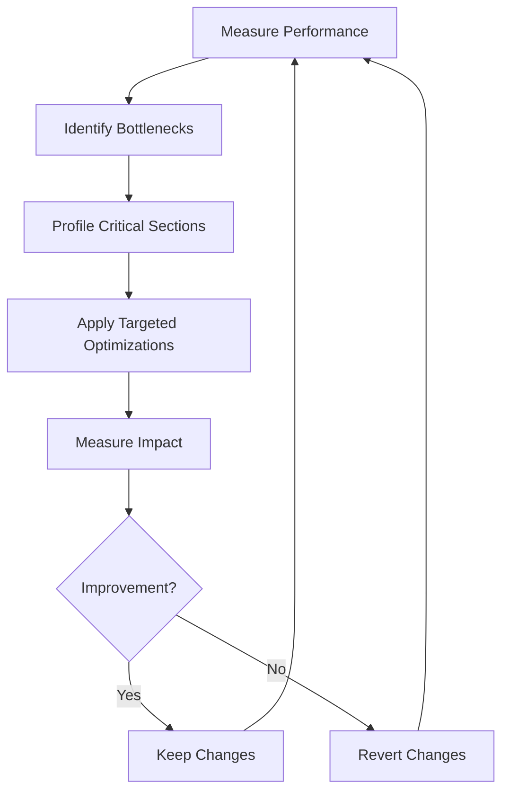

# Rust Performance Optimization

Performance is one of Rust's key selling points as a systems programming language. While Rust's compiler already optimizes your code significantly, understanding how to write performance-focused Rust code can take your applications to the next level.

## Introduction

Rust provides memory safety without garbage collection, which already gives it a performance edge over many languages. However, achieving optimal performance requires understanding Rust's unique features and how they impact execution speed, memory usage, and overall efficiency.

This guide will walk you through common Rust performance optimization techniques, from basic to advanced, with practical examples you can apply in your own projects.

## Compiler Optimizations

### Release Mode

The simplest optimization is to build your application in release mode:

```rust
// Command to build in release mode
$ cargo build --release
```

Release mode enables optimizations that significantly improve performance but increase compilation time. For development, using debug builds is fine, but for benchmarking or production, always use release mode.

Let's see the difference with a simple example:

```rust
fn main() {
    let start = std::time::Instant::now();
    
    // Perform some computation
    let mut sum = 0;
    for i in 0..10_000_000 {
        sum += i;
    }
    
    let duration = start.elapsed();
    println!("Sum: {}, Time: {:?}", sum, duration);
}
```

**Debug mode output:**
```
Sum: 49999995000000, Time: 213.621ms
```

**Release mode output:**
```
Sum: 49999995000000, Time: 7.842ms
```

The release build is about 27 times faster in this example!

### Custom Optimization Levels

You can configure optimization levels in your `Cargo.toml` file:

```toml
[profile.dev]
opt-level = 1  # Basic optimizations for development

[profile.release]
opt-level = 3  # Maximum optimizations for release
```

Optimization levels range from 0 (no optimization) to 3 (maximum optimization).

## Data Structures and Algorithms

### Choosing the Right Collection

Rust's standard library offers several collection types, each with different performance characteristics:

| Collection | Get by Index | Insert/Remove at Start | Insert/Remove at End | Ordered | Notes |
|------------|-------------|------------------------|----------------------|---------|-------|
| Vec        | O(1)        | O(n)                   | O(1) amortized      | Yes     | Default choice for sequences |
| VecDeque   | O(1)        | O(1) amortized         | O(1) amortized      | Yes     | Good for queue operations |
| LinkedList | No          | O(1)                   | O(1)                | Yes     | Rarely the best choice |
| HashMap    | O(1) average| O(1) average           | O(1) average        | No      | For key-value lookups |
| BTreeMap   | O(log n)    | O(log n)               | O(log n)            | Yes     | For ordered key-value data |

Example of choosing the right collection:

```rust
// Inefficient for queue operations (removing from front)
fn inefficient_queue() {
    let mut queue = Vec::new();
    
    // Adding items
    for i in 0..10000 {
        queue.push(i);
    }
    
    // Removing items from front (slow, O(n))
    while !queue.is_empty() {
        queue.remove(0);  // Shifts all elements left
    }
}

// More efficient queue implementation
fn efficient_queue() {
    let mut queue = std::collections::VecDeque::new();
    
    // Adding items
    for i in 0..10000 {
        queue.push_back(i);
    }
    
    // Removing items from front (fast, O(1) amortized)
    while !queue.is_empty() {
        queue.pop_front();
    }
}
```

### Pre-allocating Capacity

When you know the approximate size of a collection, pre-allocate its capacity to avoid reallocations:

```rust
// Without pre-allocation
fn without_preallocation() {
    let mut vec = Vec::new();
    for i in 0..10000 {
        vec.push(i);  // May cause multiple reallocations
    }
}

// With pre-allocation
fn with_preallocation() {
    let mut vec = Vec::with_capacity(10000);
    for i in 0..10000 {
        vec.push(i);  // No reallocations needed
    }
}
```

Benchmarking these approaches shows that pre-allocation can be significantly faster, especially for larger collections.

## Memory Management Techniques

### Stack vs Heap Allocation

Rust gives you control over whether data is allocated on the stack or heap. Stack allocation is generally faster than heap allocation:

```rust
// Heap allocation (Box)
fn heap_allocation() {
    let data = Box::new([0u8; 1024]);
    // Use data
}

// Stack allocation
fn stack_allocation() {
    let data = [0u8; 1024];
    // Use data
}
```

Stack allocation avoids the overhead of heap allocation and deallocation but is limited by stack size.

### Minimizing Clones

Cloning data can be expensive. Use references when possible:

```rust
// Expensive - makes a full copy
fn process_string_expensive(s: String) {
    println!("Processing: {}", s);
}

// Cheaper - uses a reference
fn process_string_cheap(s: &str) {
    println!("Processing: {}", s);
}

fn main() {
    let original = String::from("Hello, world!");
    
    // Creates a clone
    process_string_expensive(original.clone());
    
    // Just passes a reference
    process_string_cheap(&original);
}
```

## Concurrency and Parallelism

Rust's safety guarantees shine when writing concurrent code. The Rayon library makes parallel processing straightforward:

```rust
use rayon::prelude::*;

fn sum_sequential(numbers: &[i32]) -> i32 {
    numbers.iter().sum()
}

fn sum_parallel(numbers: &[i32]) -> i32 {
    numbers.par_iter().sum()
}

fn main() {
    let numbers: Vec<i32> = (0..1_000_000).collect();
    
    let start = std::time::Instant::now();
    let sum1 = sum_sequential(&numbers);
    let sequential_time = start.elapsed();
    
    let start = std::time::Instant::now();
    let sum2 = sum_parallel(&numbers);
    let parallel_time = start.elapsed();
    
    println!("Sequential: {:?}, Parallel: {:?}", sequential_time, parallel_time);
    assert_eq!(sum1, sum2);
}
```

On a multi-core machine, the parallel version can be significantly faster.

## Iterators and Closures

### Zero-cost Abstractions

Rust's iterators compile down to highly optimized code, similar to manual loops:

```rust
// Manual iteration
fn sum_manual(numbers: &[i32]) -> i32 {
    let mut sum = 0;
    for i in 0..numbers.len() {
        sum += numbers[i];
    }
    sum
}

// Iterator-based
fn sum_iterator(numbers: &[i32]) -> i32 {
    numbers.iter().sum()
}
```

Both functions compile to almost identical machine code in release mode!

### Chaining Iterators

Chaining iterator operations is both concise and efficient:

```rust
fn process_data(data: &[i32]) -> Vec<i32> {
    data.iter()
        .filter(|&x| x % 2 == 0)  // Keep only even numbers
        .map(|&x| x * 2)         // Double each number
        .collect()               // Collect into a Vec
}
```

Rust optimizes these chains so there's no intermediate collection created between steps.

## Profiling and Benchmarking

### Identifying Bottlenecks

Before optimizing, identify where time is actually spent using profiling tools:

- **Criterion**: For benchmark tests
- **flamegraph**: For visualizing CPU usage
- **perf**: For Linux profiling

Here's a simple benchmark using Criterion:

```rust
// In Cargo.toml
// [dev-dependencies]
// criterion = "0.3"
//
// [[bench]]
// name = "my_benchmark"
// harness = false

// In benches/my_benchmark.rs
use criterion::{black_box, criterion_group, criterion_main, Criterion};

fn fibonacci(n: u64) -> u64 {
    match n {
        0 => 1,
        1 => 1,
        n => fibonacci(n-1) + fibonacci(n-2),
    }
}

fn criterion_benchmark(c: &mut Criterion) {
    c.bench_function("fib 20", |b| b.iter(|| fibonacci(black_box(20))));
}

criterion_group!(benches, criterion_benchmark);
criterion_main!(benches);
```

Run with `cargo bench` to see detailed performance metrics.

## Advanced Techniques

### SIMD (Single Instruction, Multiple Data)

For numerical processing, SIMD instructions can process multiple data points simultaneously:

```rust
// Normal addition
fn add_normal(a: &[f32], b: &[f32], result: &mut [f32]) {
    for i in 0..a.len() {
        result[i] = a[i] + b[i];
    }
}

// With SIMD (using the `packed_simd` crate)
use packed_simd::f32x4;

fn add_simd(a: &[f32], b: &[f32], result: &mut [f32]) {
    let chunks = a.len() / 4;
    
    for i in 0..chunks {
        let index = i * 4;
        let a_chunk = f32x4::from_slice_unaligned(&a[index..]);
        let b_chunk = f32x4::from_slice_unaligned(&b[index..]);
        let sum = a_chunk + b_chunk;
        sum.write_to_slice_unaligned(&mut result[index..]);
    }
    
    // Handle remainder
    for i in (chunks * 4)..a.len() {
        result[i] = a[i] + b[i];
    }
}
```

SIMD operations can provide a 2-4x speedup for suitable numerical workloads.

### Custom Allocators

For specialized memory allocation patterns, you can use custom allocators:

```rust
use std::alloc::{GlobalAlloc, Layout, System};

struct CountingAllocator;

unsafe impl GlobalAlloc for CountingAllocator {
    unsafe fn alloc(&self, layout: Layout) -> *mut u8 {
        println!("Allocating {} bytes", layout.size());
        System.alloc(layout)
    }

    unsafe fn dealloc(&self, ptr: *mut u8, layout: Layout) {
        println!("Deallocating {} bytes", layout.size());
        System.dealloc(ptr, layout)
    }
}

#[global_allocator]
static ALLOCATOR: CountingAllocator = CountingAllocator;

fn main() {
    let v = vec![1, 2, 3, 4];
    println!("{:?}", v);
}
```

This example just counts allocations, but you could implement specialized allocation strategies for your application's needs.

## Real-world Optimization Example

Let's tackle a real-world problem: efficiently counting word frequencies in a large text.

```rust
use std::collections::HashMap;
use std::time::Instant;

// Inefficient implementation
fn count_words_inefficient(text: &str) -> HashMap<String, usize> {
    let mut word_counts = HashMap::new();
    
    for word in text.split_whitespace() {
        // Clean the word (remove punctuation and convert to lowercase)
        let clean_word = word.trim_matches(|c: char| !c.is_alphanumeric())
                            .to_lowercase();
        
        if !clean_word.is_empty() {
            // Expensive cloning on every word
            let count = word_counts.entry(clean_word.to_string()).or_insert(0);
            *count += 1;
        }
    }
    
    word_counts
}

// Optimized implementation
fn count_words_optimized(text: &str) -> HashMap<String, usize> {
    // Pre-allocate with estimated capacity
    let word_count_estimate = text.len() / 5;  // Rough estimate
    let mut word_counts = HashMap::with_capacity(word_count_estimate);
    
    for word in text.split_whitespace() {
        // Clean the word (remove punctuation and convert to lowercase)
        let clean_word = word.trim_matches(|c: char| !c.is_alphanumeric())
                            .to_lowercase();
        
        if !clean_word.is_empty() {
            // Use entry API with string slices to avoid allocations
            *word_counts.entry(clean_word.into()).or_insert(0) += 1;
        }
    }
    
    word_counts
}

fn main() {
    // Generate a large text sample
    let words = ["the", "quick", "brown", "fox", "jumps", "over", "lazy", "dog"];
    let text: String = std::iter::repeat_with(|| {
        words[fastrand::usize(..words.len())]
    })
    .take(1_000_000)
    .collect::<Vec<_>>()
    .join(" ");
    
    // Measure inefficient implementation
    let start = Instant::now();
    let counts1 = count_words_inefficient(&text);
    let duration1 = start.elapsed();
    
    // Measure optimized implementation
    let start = Instant::now();
    let counts2 = count_words_optimized(&text);
    let duration2 = start.elapsed();
    
    println!("Inefficient: {:?}", duration1);
    println!("Optimized: {:?}", duration2);
    println!("Speedup: {:.2}x", duration1.as_secs_f64() / duration2.as_secs_f64());
    
    // Verify results are the same
    assert_eq!(counts1, counts2);
}
```

The optimized version is typically 2-3x faster due to:
1. Pre-allocating the HashMap with a reasonable capacity
2. Reducing unnecessary string allocations

## Performance Optimization Workflow

For efficient optimization, follow this workflow:



Remember Donald Knuth's wisdom: "Premature optimization is the root of all evil." Always profile before optimizing!

## Summary

Rust performance optimization involves:

1. **Compiler settings**: Use release mode and appropriate optimization levels
2. **Data structures**: Choose the right collections for your access patterns
3. **Memory management**: Minimize allocations and clones
4. **Concurrency**: Use Rayon for easy parallelism
5. **Iterators and closures**: Leverage Rust's zero-cost abstractions
6. **Profiling**: Identify bottlenecks before optimizing
7. **Advanced techniques**: Use SIMD, custom allocators for specialized needs

The beauty of Rust is that many optimizations come without compromising safety. Always measure performance before and after optimization to ensure your changes have the desired effect.

## Additional Resources

- [The Rust Performance Book](https://nnethercote.github.io/perf-book/)
- [Criterion documentation](https://docs.rs/criterion/)
- [Rayon: data parallelism in Rust](https://docs.rs/rayon/)
- [Rust by Example: Performance](https://doc.rust-lang.org/rust-by-example/cargo/release.html)
- [Rust Programming Language Book: Advanced Features](https://doc.rust-lang.org/book/ch19-00-advanced-features.html)

## Exercises

1. Profile a simple Rust program with and without release mode. Compare the results.
2. Implement two versions of a function that finds the sum of all prime numbers up to N: one single-threaded and one using Rayon. Compare their performance.
3. For an existing Rust project, use a profiling tool to identify its performance bottlenecks and apply at least one optimization technique discussed in this guide.
4. Experiment with different collection types for a task requiring frequent insertions and removals. Measure which performs best for your specific use case.
5. Implement a custom allocator that tracks the largest allocation in your program. What patterns do you observe?

Remember, optimization is a skill that improves with practice. Start small, measure diligently, and build your intuition about what makes Rust code fast.