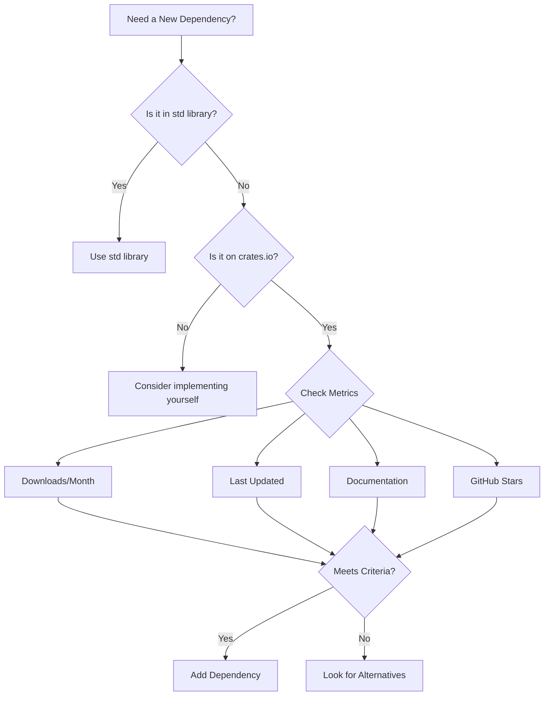

# Rust Common Mistakes

## Introduction

Welcome to our guide on common Rust mistakes! Rust's unique features like ownership, borrowing, and lifetimes provide powerful safety guarantees, but they can also lead to frustrating errors for beginners. This guide explores the most common mistakes Rust beginners make, explains why they happen, and shows you how to fix them. By understanding these common pitfalls, you'll be able to write more idiomatic Rust code and spend less time fighting the compiler.

## 1. Ownership and Borrowing Issues

### 1.1 Using a Value After Move

One of the most common mistakes in Rust is trying to use a value after it has been moved.

```rust
fn main() {
    let s1 = String::from("hello");
    let s2 = s1; // s1 is moved to s2
    
    println!("{}", s1); // Error: value used here after move
}
```

**Error Output:**
```
error[E0382]: use of moved value: `s1`
 --> src/main.rs:5:20
  |
3 |     let s2 = s1; // s1 is moved to s2
  |              -- value moved here
4 |     
5 |     println!("{}", s1); // Error: value used here after move
  |                    ^^ value used here after move
  |
  = note: move occurs because `s1` has type `String`, which does not implement the `Copy` trait
```

**Why this happens:** Rust prevents multiple ownership of data to ensure memory safety. When you assign `s1` to `s2`, the ownership is transferred (moved), and `s1` is no longer valid.

**Solution:** You have several options:
1. Use a clone if you need two independent copies:
```rust
let s1 = String::from("hello");
let s2 = s1.clone(); // Creates a deep copy

println!("{}", s1); // Works now!
println!("{}", s2);
```

2. Use references (borrowing) instead of moving:
```rust
let s1 = String::from("hello");
let s2 = &s1; // Borrows s1 instead of moving it

println!("{}", s1); // Both work!
println!("{}", s2);
```

### 1.2 Mutable Borrowing Conflicts

Another common mistake is trying to have multiple mutable references or combining mutable and immutable references.

```rust
fn main() {
    let mut x = 5;
    let r1 = &mut x;
    let r2 = &mut x; // Error: cannot borrow `x` as mutable more than once
    
    println!("{}, {}", r1, r2);
}
```

**Error Output:**
```
error[E0499]: cannot borrow `x` as mutable more than once at a time
 --> src/main.rs:4:14
  |
3 |     let r1 = &mut x;
  |              ------ first mutable borrow occurs here
4 |     let r2 = &mut x; // Error: cannot borrow `x` as mutable more than once
  |              ^^^^^^ second mutable borrow occurs here
5 |     
6 |     println!("{}, {}", r1, r2);
  |                        -- first borrow later used here
```

**Solution:** Rust's borrowing rules state:
1. You can have either one mutable reference or any number of immutable references
2. References must always be valid

To fix this, scope your mutable borrows appropriately:

```rust
fn main() {
    let mut x = 5;
    
    {
        let r1 = &mut x;
        *r1 += 1;
        println!("r1: {}", r1);
    } // r1 goes out of scope here
    
    // Now we can create a new mutable reference
    let r2 = &mut x;
    *r2 += 1;
    println!("r2: {}", r2);
}
```

## 2. Lifetime Errors

### 2.1 Returning References to Local Variables

Trying to return a reference to a local variable is a common mistake.

```rust
fn create_reference() -> &String {
    let s = String::from("hello");
    &s // Error: returns a reference to data owned by the current function
}

fn main() {
    let reference = create_reference();
    println!("Reference: {}", reference);
}
```

**Error Output:**
```
error[E0106]: missing lifetime specifier
 --> src/main.rs:1:26
  |
1 | fn create_reference() -> &String {
  |                          ^ expected named lifetime parameter
  |
  = help: this function's return type contains a borrowed value, but there is no value for it to be borrowed from
help: consider using the `'static` lifetime
  |
1 | fn create_reference() -> &'static String {
  |                           +++++++
```

**Why this happens:** The variable `s` is dropped when the function returns, so any reference to it would be dangling.

**Solution:** Return an owned value instead of a reference:

```rust
fn create_string() -> String {
    let s = String::from("hello");
    s // Return the String itself, not a reference
}

fn main() {
    let owned_string = create_string();
    println!("String: {}", owned_string);
}
```

### 2.2 Incorrect Lifetime Annotations

Beginners often struggle with lifetime annotations, especially in more complex structures.

```rust
struct Person<'a> {
    name: &'a str,
}

fn main() {
    let person;
    {
        let name = String::from("Alice");
        person = Person { name: &name }; // Error: `name` does not live long enough
    }
    println!("Person's name: {}", person.name);
}
```

**Error Output:**
```
error[E0597]: `name` does not live long enough
  --> src/main.rs:9:32
   |
9  |         person = Person { name: &name }; // Error: `name` does not live long enough
   |                                ^^^^^ borrowed value does not live long enough
10 |     }
   |     - `name` dropped here while still borrowed
11 |     println!("Person's name: {}", person.name);
   |                                   ----------- borrow later used here
```

**Solution:** Ensure the referenced data lives at least as long as the struct that holds the reference:

```rust
fn main() {
    let name = String::from("Alice");
    let person = Person { name: &name };
    println!("Person's name: {}", person.name);
}
```

## 3. Type System Errors

### 3.1 Using the Wrong String Type

Rust has multiple string types, and using the wrong one is a common mistake.

```rust
fn takes_string(s: String) {
    println!("Got a String: {}", s);
}

fn main() {
    let s: &str = "hello";
    takes_string(s); // Error: expected String, found &str
}
```

**Error Output:**
```
error[E0308]: mismatched types
  --> src/main.rs:7:17
   |
7  |     takes_string(s); // Error: expected String, found &str
   |                 ^ expected struct `String`, found `&str`
   |
help: try using `.to_string()` to convert the `&str` to a `String`
   |
7  |     takes_string(s.to_string()); // Error: expected String, found &str
   |                  +++++++++++
```

**Solution:** Convert between string types explicitly:

```rust
fn main() {
    let s: &str = "hello";
    
    // Convert &str to String
    takes_string(s.to_string()); // or String::from(s)
}
```

### 3.2 Missing Type Conversions

Rust doesn't do implicit type conversions, which can be surprising for beginners.

```rust
fn main() {
    let x: u32 = 5;
    let y: u64 = x; // Error: mismatched types
    
    println!("y: {}", y);
}
```

**Error Output:**
```
error[E0308]: mismatched types
 --> src/main.rs:3:18
  |
3 |     let y: u64 = x; // Error: mismatched types
  |            ---   ^ expected `u64`, found `u32`
  |            |
  |            expected due to this
  |
help: you can convert a `u32` to a `u64`
  |
3 |     let y: u64 = x.into(); // Error: mismatched types
  |                   +++++++
```

**Solution:** Use explicit type conversion:

```rust
fn main() {
    let x: u32 = 5;
    let y: u64 = x as u64; // Explicit cast
    // or
    let y: u64 = u64::from(x); // Type conversion
    
    println!("y: {}", y);
}
```

## 4. Error Handling Mistakes

### 4.1 Ignoring Error Results

Ignoring potential errors is a common mistake in Rust:

```rust
fn main() {
    let s = std::fs::read_to_string("file.txt");
    println!("File content: {}", s); // Error: `Result<String, std::io::Error>` doesn't implement `Display`
}
```

**Error Output:**
```
error[E0277]: `Result<String, std::io::Error>` doesn't implement `std::fmt::Display`
  --> src/main.rs:3:33
   |
3  |     println!("File content: {}", s);
   |                                 ^ `Result<String, std::io::Error>` cannot be formatted with the default formatter
   |
   = help: the trait `std::fmt::Display` is not implemented for `Result<String, std::io::Error>`
   = note: in format strings you may be able to use `{:?}` (or {:#?} for pretty-print) instead
```

**Solution:** Always handle the `Result` properly:

```rust
fn main() {
    // Using match
    match std::fs::read_to_string("file.txt") {
        Ok(content) => println!("File content: {}", content),
        Err(e) => println!("Error reading file: {}", e),
    }
    
    // Or using expect/unwrap (only for simple examples or prototyping)
    let content = std::fs::read_to_string("file.txt")
        .expect("Failed to read file");
    println!("File content: {}", content);
    
    // Or using the ? operator in functions that return Result
    // fn read_file() -> Result<(), std::io::Error> {
    //     let content = std::fs::read_to_string("file.txt")?;
    //     println!("File content: {}", content);
    //     Ok(())
    // }
}
```

### 4.2 Misusing `unwrap()` and `expect()`

Overusing `unwrap()` can lead to production crashes:

```rust
fn main() {
    let numbers = vec![1, 2, 3];
    let item = numbers.get(5).unwrap(); // Panics at runtime
    println!("Item: {}", item);
}
```

**Runtime Error:**
```
thread 'main' panicked at 'called `Option::unwrap()` on a `None` value', src/main.rs:3:33
```

**Solution:** Use pattern matching or more robust error handling:

```rust
fn main() {
    let numbers = vec![1, 2, 3];
    
    // Using match
    match numbers.get(5) {
        Some(item) => println!("Item: {}", item),
        None => println!("Index out of bounds"),
    }
    
    // Using if let
    if let Some(item) = numbers.get(5) {
        println!("Item: {}", item);
    } else {
        println!("Index out of bounds");
    }
    
    // Or provide a default with unwrap_or
    let item = numbers.get(5).unwrap_or(&0);
    println!("Item (with default): {}", item);
}
```

## 5. Concurrency Mistakes

### 5.1 Race Conditions with Shared State

Incorrect handling of shared state in concurrent code is a common issue:

```rust
use std::thread;

fn main() {
    let mut counter = 0;
    
    let handle = thread::spawn(move || {
        counter += 1; // Error: closure may outlive the current function, but it borrows `counter`
    });
    
    counter += 1;
    handle.join().unwrap();
    println!("Counter: {}", counter);
}
```

**Error Output:**
```
error[E0373]: closure may outlive the current function, but it borrows `counter`, which is owned by the current function
 --> src/main.rs:6:33
  |
6 |     let handle = thread::spawn(move || {
  |                                 ^^^^^^^ may outlive borrowed value `counter`
7 |         counter += 1; // Error: closure may outlive the current function, but it borrows `counter`
  |         ------- `counter` is borrowed here
  |
note: function requires argument type to outlive `'static`
 --> src/main.rs:6:18
  |
6 |     let handle = thread::spawn(move || {
  |                  ^^^^^^^^^^^^^^^^^^^^^
help: to force the closure to take ownership of `counter` (and any other referenced variables), use the `move` keyword
  |
6 |     let handle = thread::spawn(move || {
  |                                 ~~~~~~
```

**Solution:** Use proper synchronization primitives:

```rust
use std::sync::{Arc, Mutex};
use std::thread;

fn main() {
    let counter = Arc::new(Mutex::new(0));
    let counter_clone = Arc::clone(&counter);
    
    let handle = thread::spawn(move || {
        let mut num = counter_clone.lock().unwrap();
        *num += 1;
    });
    
    {
        let mut num = counter.lock().unwrap();
        *num += 1;
    }
    
    handle.join().unwrap();
    println!("Counter: {}", *counter.lock().unwrap());
}
```

### 5.2 Deadlocks

Deadlocks can occur when locks are acquired in the wrong order:

```rust
use std::sync::{Mutex, MutexGuard};
use std::thread;
use std::time::Duration;

fn main() {
    let resource_a = Mutex::new(1);
    let resource_b = Mutex::new(2);
    
    let thread_a = thread::spawn(move || {
        let a = resource_a.lock().unwrap();
        println!("Thread A acquired resource A");
        
        // Sleep to increase chance of deadlock
        thread::sleep(Duration::from_millis(100));
        
        let b = resource_b.lock().unwrap(); // May deadlock
        println!("Thread A acquired resource B");
    });
    
    let thread_b = thread::spawn(move || {
        let b = resource_b.lock().unwrap();
        println!("Thread B acquired resource B");
        
        // Sleep to increase chance of deadlock
        thread::sleep(Duration::from_millis(100));
        
        let a = resource_a.lock().unwrap(); // May deadlock
        println!("Thread B acquired resource A");
    });
    
    thread_a.join().unwrap();
    thread_b.join().unwrap();
}
```

This code has a compilation error because we're trying to move both resources into different threads. But even if we fixed that with `Arc`, it would still demonstrate a potential deadlock at runtime.

**Solution:** Always acquire locks in a consistent order:

```rust
use std::sync::{Arc, Mutex};
use std::thread;

fn main() {
    let resource_a = Arc::new(Mutex::new(1));
    let resource_b = Arc::new(Mutex::new(2));
    
    let ra1 = Arc::clone(&resource_a);
    let rb1 = Arc::clone(&resource_b);
    let thread_a = thread::spawn(move || {
        // Always acquire locks in the same order (A then B)
        let a = ra1.lock().unwrap();
        println!("Thread A acquired resource A");
        
        let b = rb1.lock().unwrap();
        println!("Thread A acquired resource B");
    });
    
    let ra2 = Arc::clone(&resource_a);
    let rb2 = Arc::clone(&resource_b);
    let thread_b = thread::spawn(move || {
        // Same order here too (A then B)
        let a = ra2.lock().unwrap();
        println!("Thread B acquired resource A");
        
        let b = rb2.lock().unwrap();
        println!("Thread B acquired resource B");
    });
    
    thread_a.join().unwrap();
    thread_b.join().unwrap();
}
```

## 6. API Design Mistakes

### 6.1 Returning References Instead of Smart Pointers

```rust
struct Database {
    data: Vec<String>,
}

impl Database {
    fn new() -> Database {
        Database { data: Vec::new() }
    }
    
    fn get_entry(&self, index: usize) -> &String {
        &self.data[index] // Will panic if index is out of bounds
    }
}

fn main() {
    let db = Database::new();
    let entry = db.get_entry(0); // Panics at runtime
    println!("Entry: {}", entry);
}
```

**Runtime Error:**
```
thread 'main' panicked at 'index out of bounds: the len is 0 but the index is 0', src/main.rs:11:9
```

**Solution:** Return an `Option` or `Result` type:

```rust
impl Database {
    fn get_entry(&self, index: usize) -> Option<&String> {
        self.data.get(index)
    }
}

fn main() {
    let db = Database::new();
    
    match db.get_entry(0) {
        Some(entry) => println!("Entry: {}", entry),
        None => println!("Entry not found"),
    }
}
```

### 6.2 Using Inefficient String Operations

Inefficient string operations can significantly impact performance:

```rust
fn main() {
    let mut result = String::new();
    for i in 0..1000 {
        result += &i.to_string(); // Inefficient: allocates a new String for each iteration
    }
    println!("Result length: {}", result.len());
}
```

**Solution:** Use `String::push_str` or a `String` builder pattern:

```rust
fn main() {
    // Using push_str
    let mut result = String::new();
    for i in 0..1000 {
        result.push_str(&i.to_string());
    }
    
    // Or even better, using String builder pattern with capacity
    let mut result = String::with_capacity(4000); // Pre-allocate approximate size
    for i in 0..1000 {
        result.push_str(&i.to_string());
    }
    
    println!("Result length: {}", result.len());
}
```

## 7. Understanding the Ecosystem

### 7.1 Choosing the Wrong Dependencies

Using outdated, unmaintained, or inappropriate crates is a common issue.

**Mistake Example:** Using multiple incompatible logging frameworks or choosing outdated crates.

**Solution:** Here's a visual guide to help you choose the right crates:



Guidelines for selecting crates:
- Check download counts on crates.io
- Look at last update date
- Examine documentation quality
- Check GitHub stars and open issues
- Consider maintenance status

### 7.2 Not Using Cargo Features

Not leveraging Cargo features for conditional compilation is a missed opportunity.

**Mistake Example:** Compiling all features even when not needed.

**Solution:** Use feature flags to conditionally include functionality:

```toml
# Cargo.toml
[dependencies]
serde = { version = "1.0", features = ["derive"], optional = true }

[features]
default = ["std"]
std = ["serde"]
```

```rust
// In your code
#[cfg(feature = "serde")]
use serde::{Serialize, Deserialize};

#[cfg_attr(feature = "serde", derive(Serialize, Deserialize))]
struct User {
    name: String,
    age: u32,
}
```

## Summary

In this guide, we've covered the most common mistakes Rust beginners make:

1. **Ownership and Borrowing Issues**
   - Using values after move
   - Mutable borrowing conflicts

2. **Lifetime Errors**
   - Returning references to local variables
   - Incorrect lifetime annotations

3. **Type System Errors**
   - Using the wrong string type
   - Missing type conversions

4. **Error Handling Mistakes**
   - Ignoring error results
   - Misusing `unwrap()` and `expect()`

5. **Concurrency Mistakes**
   - Race conditions with shared state
   - Deadlocks

6. **API Design Mistakes**
   - Returning references instead of smart pointers
   - Using inefficient string operations

7. **Understanding the Ecosystem**
   - Choosing the wrong dependencies
   - Not using Cargo features

By understanding these common pitfalls, you'll be able to write more idiomatic Rust code and spend less time fighting the compiler.

## Additional Resources

- [The Rust Book](https://doc.rust-lang.org/book/) - The official guide to the Rust programming language
- [Rust By Example](https://doc.rust-lang.org/rust-by-example/) - Learn Rust with annotated examples
- [Rustlings](https://github.com/rust-lang/rustlings) - Small exercises to get you used to reading and writing Rust code
- [Rust Playground](https://play.rust-lang.org/) - Try Rust code online without installing anything
- [Clippy](https://github.com/rust-lang/rust-clippy) - A collection of lints to catch common mistakes and improve your Rust code

## Exercises

1. **Fix the Move Error**: Fix the following code that attempts to use a value after it's been moved:
   ```rust
   fn main() {
       let original = String::from("hello");
       let moved = original;
       println!("Original: {}", original);
   }
   ```

2. **Fix the Borrowing Issue**: Fix this code with conflicting mutable borrows:
   ```rust
   fn main() {
       let mut v = vec![1, 2, 3];
       let first = &mut v[0];
       let second = &mut v[1];
       *first += 1;
       *second += 1;
       println!("Vector: {:?}", v);
   }
   ```

3. **Error Handling Challenge**: Rewrite this function to properly handle errors:
   ```rust
   fn read_config() -> String {
       let config = std::fs::read_to_string("config.txt").unwrap();
       config
   }
   ```

4. **Lifetime Challenge**: Fix the lifetime issues in this code:
   ```rust
   fn longest_string(a: &str, b: &str) -> &str {
       if a.len() > b.len() { a } else { b }
   }
   ```

5. **Concurrency Challenge**: Modify this code to safely share data between threads:
   ```rust
   fn main() {
       let counter = 0;
       
       let handle = std::thread::spawn(|| {
           println!("Counter in thread: {}", counter);
       });
       
       println!("Counter in main: {}", counter);
       handle.join().unwrap();
   }
   ```

Good luck with your Rust journey! Remember, making mistakes is part of the learning process. The Rust compiler is strict but fair—it's trying to help you write safer, more efficient code.