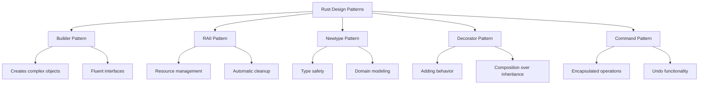

# Rust Design Patterns

## Introduction

Design patterns are reusable solutions to common problems that arise during software development. They provide tested, proven approaches to structuring code in a way that improves readability, maintainability, and often performance. While many design patterns come from object-oriented programming traditions, Rust's unique combination of safety, performance, and expressiveness brings its own flavor to these patterns.

In this guide, we'll explore several design patterns that are particularly well-suited to Rust's paradigm. Whether you're coming from another language or are new to programming entirely, understanding these patterns will help you write more idiomatic, efficient, and maintainable Rust code.

## Common Rust Design Patterns

### 1. Builder Pattern

#### What is the Builder Pattern?

The Builder pattern allows you to construct complex objects step by step. It's particularly useful when an object might have many configuration options, some optional.

#### Why use it in Rust?

Rust doesn't have method overloading or optional parameters like some languages, so the Builder pattern provides a clean alternative for constructing objects with many possible configurations.

#### Implementation

```rust
// A pizza with many optional toppings
struct Pizza {
    dough: String,
    cheese: Option<String>,
    pepperoni: bool,
    mushrooms: bool,
    vegetables: Vec<String>,
}

// The builder for our Pizza
struct PizzaBuilder {
    dough: String,
    cheese: Option<String>,
    pepperoni: bool,
    mushrooms: bool,
    vegetables: Vec<String>,
}

impl PizzaBuilder {
    // Create a new builder with required fields
    fn new(dough: String) -> PizzaBuilder {
        PizzaBuilder {
            dough,
            cheese: None,
            pepperoni: false,
            mushrooms: false,
            vegetables: Vec::new(),
        }
    }
    
    // Optional method to add cheese
    fn cheese(mut self, cheese: String) -> PizzaBuilder {
        self.cheese = Some(cheese);
        self
    }
    
    // Optional method to add pepperoni
    fn pepperoni(mut self) -> PizzaBuilder {
        self.pepperoni = true;
        self
    }
    
    // Optional method to add mushrooms
    fn mushrooms(mut self) -> PizzaBuilder {
        self.mushrooms = true;
        self
    }
    
    // Optional method to add vegetables
    fn vegetables(mut self, vegetables: Vec<String>) -> PizzaBuilder {
        self.vegetables = vegetables;
        self
    }
    
    // Final build method that creates the Pizza
    fn build(self) -> Pizza {
        Pizza {
            dough: self.dough,
            cheese: self.cheese,
            pepperoni: self.pepperoni,
            mushrooms: self.mushrooms,
            vegetables: self.vegetables,
        }
    }
}

// Example usage
fn main() {
    let pizza = PizzaBuilder::new(String::from("Thick crust"))
        .cheese(String::from("Mozzarella"))
        .pepperoni()
        .vegetables(vec![String::from("Tomato"), String::from("Onion")])
        .build();
    
    println!("Pizza ready with {} dough!", pizza.dough);
    if let Some(cheese) = &pizza.cheese {
        println!("Cheese: {}", cheese);
    }
    
    // Output:
    // Pizza ready with Thick crust dough!
    // Cheese: Mozzarella
}
```

#### Real-world Application

The Builder pattern appears frequently in Rust libraries. For example, when configuring HTTP clients, web servers, or database connections where many options exist but sensible defaults are provided.

### 2. RAII (Resource Acquisition Is Initialization)

#### What is RAII?

RAII is a pattern where resource management is tied to object lifetime. Resources are acquired during initialization and released when the object goes out of scope.

#### Why use it in Rust?

This pattern is fundamental to Rust's ownership model. Rust's compiler enforces that resources are properly cleaned up when values go out of scope, preventing memory leaks and other resource management bugs.

#### Implementation

```rust
struct DatabaseConnection {
    connection_string: String,
}

impl DatabaseConnection {
    fn new(server: &str) -> DatabaseConnection {
        println!("Connecting to database server: {}", server);
        // In a real implementation, this would establish an actual connection
        DatabaseConnection {
            connection_string: server.to_string(),
        }
    }
    
    fn query(&self, query: &str) -> Vec<String> {
        println!("Executing query '{}' on connection {}", query, self.connection_string);
        // Simulate fetching data
        vec![String::from("Result 1"), String::from("Result 2")]
    }
}

impl Drop for DatabaseConnection {
    fn drop(&mut self) {
        // This is automatically called when the object goes out of scope
        println!("Closing database connection: {}", self.connection_string);
        // In a real implementation, this would close the connection
    }
}

fn main() {
    {
        // Create a new scope
        let conn = DatabaseConnection::new("database.example.com");
        let results = conn.query("SELECT * FROM users");
        println!("Got {} results", results.len());
        // conn will automatically be dropped at the end of this scope
    }
    println!("Connection is now closed");
    
    // Output:
    // Connecting to database server: database.example.com
    // Executing query 'SELECT * FROM users' on connection database.example.com
    // Got 2 results
    // Closing database connection: database.example.com
    // Connection is now closed
}
```

#### Real-world Application

RAII is used extensively in Rust, for everything from file handling with `File` objects to thread synchronization with `Mutex`. Network connections, database connections, and other resources that need explicit cleanup benefit from this pattern.

### 3. Newtype Pattern

#### What is the Newtype Pattern?

The Newtype pattern involves creating a new type that wraps a single field. This provides type safety and abstraction.

#### Why use it in Rust?

Rust's type system lets us create zero-cost abstractions with the Newtype pattern. It can be used to enhance type safety, hide implementation details, and implement traits for types from external crates.

#### Implementation

```rust
// Newtype for an ID to prevent mixing up different types of IDs
struct UserId(u64);
struct ProductId(u64);

fn process_user(user_id: UserId) {
    println!("Processing user: {}", user_id.0);
}

fn main() {
    let user = UserId(123);
    let product = ProductId(456);
    
    process_user(user);
    
    // This would fail to compile:
    // process_user(product);
    // The error would indicate that expected UserId but got ProductId
    
    // Output:
    // Processing user: 123
}
```

For a more practical example, imagine creating a validated email type:

```rust
struct Email(String);

impl Email {
    fn new(email: &str) -> Result<Email, &'static str> {
        if !email.contains('@') {
            return Err("Invalid email: missing @ symbol");
        }
        Ok(Email(email.to_string()))
    }
    
    fn value(&self) -> &str {
        &self.0
    }
}

fn send_welcome_email(email: Email) {
    println!("Sending welcome email to: {}", email.value());
}

fn main() {
    match Email::new("user@example.com") {
        Ok(email) => send_welcome_email(email),
        Err(e) => println!("Error: {}", e),
    }
    
    match Email::new("invalid-email") {
        Ok(email) => send_welcome_email(email),
        Err(e) => println!("Error: {}", e),
    }
    
    // Output:
    // Sending welcome email to: user@example.com
    // Error: Invalid email: missing @ symbol
}
```

#### Real-world Application

The Newtype pattern is commonly used in Rust libraries to create type-safe APIs. For example, many web frameworks use newtypes to represent HTML-escaped strings or database query parameters to prevent injection attacks.

### 4. Decorator Pattern

#### What is the Decorator Pattern?

The Decorator pattern allows behavior to be added to individual objects dynamically without affecting the behavior of other objects from the same class.

#### Why use it in Rust?

In Rust, we can implement this pattern using traits and composition to extend functionality.

#### Implementation

```rust
trait Logger {
    fn log(&self, message: &str);
}

struct ConsoleLogger;

impl Logger for ConsoleLogger {
    fn log(&self, message: &str) {
        println!("Log: {}", message);
    }
}

struct TimestampDecorator<T: Logger> {
    logger: T,
}

impl<T: Logger> TimestampDecorator<T> {
    fn new(logger: T) -> Self {
        TimestampDecorator { logger }
    }
}

impl<T: Logger> Logger for TimestampDecorator<T> {
    fn log(&self, message: &str) {
        use std::time::{SystemTime, UNIX_EPOCH};
        let timestamp = SystemTime::now()
            .duration_since(UNIX_EPOCH)
            .unwrap()
            .as_secs();
        self.logger.log(&format!("[{}] {}", timestamp, message));
    }
}

struct PriorityDecorator<T: Logger> {
    logger: T,
    priority: String,
}

impl<T: Logger> PriorityDecorator<T> {
    fn new(logger: T, priority: &str) -> Self {
        PriorityDecorator {
            logger,
            priority: priority.to_string(),
        }
    }
}

impl<T: Logger> Logger for PriorityDecorator<T> {
    fn log(&self, message: &str) {
        self.logger.log(&format!("[{}] {}", self.priority, message));
    }
}

fn main() {
    let simple_logger = ConsoleLogger;
    simple_logger.log("This is a simple log message");
    
    let timestamp_logger = TimestampDecorator::new(ConsoleLogger);
    timestamp_logger.log("This message has a timestamp");
    
    let priority_timestamp_logger = PriorityDecorator::new(
        TimestampDecorator::new(ConsoleLogger),
        "HIGH"
    );
    priority_timestamp_logger.log("This is an important message");
    
    // Output might look like:
    // Log: This is a simple log message
    // Log: [1621234567] This message has a timestamp
    // Log: [1621234567] [HIGH] This is an important message
}
```

#### Real-world Application

The Decorator pattern is useful for layering functionality in a flexible way. For example, in web applications, you might use it to add authentication, logging, or caching layers to request handlers.

### 5. Command Pattern

#### What is the Command Pattern?

The Command pattern encapsulates a request as an object, allowing for parameterization of clients with different requests, queuing of requests, and supporting undoable operations.

#### Why use it in Rust?

Rust's closures and traits make the Command pattern particularly elegant. It can be useful for implementing undo functionality, job queues, or transaction systems.

#### Implementation

```rust
trait Command {
    fn execute(&self);
    fn undo(&self);
}

struct TextEditor {
    content: String,
}

impl TextEditor {
    fn new() -> Self {
        TextEditor {
            content: String::new(),
        }
    }
    
    fn add_text(&mut self, text: &str) {
        self.content.push_str(text);
    }
    
    fn delete_text(&mut self, start: usize, end: usize) {
        if start < end && end <= self.content.len() {
            self.content.replace_range(start..end, "");
        }
    }
    
    fn content(&self) -> &str {
        &self.content
    }
}

struct AddTextCommand {
    editor: std::rc::Rc<std::cell::RefCell<TextEditor>>,
    text: String,
    position: usize,
}

impl AddTextCommand {
    fn new(editor: std::rc::Rc<std::cell::RefCell<TextEditor>>, text: &str) -> Self {
        let position = editor.borrow().content.len();
        AddTextCommand {
            editor,
            text: text.to_string(),
            position,
        }
    }
}

impl Command for AddTextCommand {
    fn execute(&self) {
        self.editor.borrow_mut().add_text(&self.text);
    }
    
    fn undo(&self) {
        let end = self.position + self.text.len();
        self.editor.borrow_mut().delete_text(self.position, end);
    }
}

fn main() {
    let editor = std::rc::Rc::new(std::cell::RefCell::new(TextEditor::new()));
    
    let command1 = AddTextCommand::new(editor.clone(), "Hello, ");
    let command2 = AddTextCommand::new(editor.clone(), "Rust!");
    
    // Execute commands
    command1.execute();
    println!("After command1: '{}'", editor.borrow().content());
    
    command2.execute();
    println!("After command2: '{}'", editor.borrow().content());
    
    // Undo commands
    command2.undo();
    println!("After undoing command2: '{}'", editor.borrow().content());
    
    command1.undo();
    println!("After undoing command1: '{}'", editor.borrow().content());
    
    // Output:
    // After command1: 'Hello, '
    // After command2: 'Hello, Rust!'
    // After undoing command2: 'Hello, '
    // After undoing command1: ''
}
```

#### Real-world Application

The Command pattern is useful in text editors, graphic applications, and anywhere you need to support undo/redo functionality. It's also useful for implementing job queues or transaction systems.

## Design Pattern Visualization

Here's a diagram showing how these patterns relate to each other:



## Other Important Rust Patterns

While we've covered several key design patterns, here are a few more Rust-specific patterns that are worth mentioning:

### Visitor Pattern

Useful for operations across heterogeneous object structures, especially with Rust's enum types.

### Type State Pattern

Encodes state machines in the type system, ensuring operations are only valid in specific states.

### Façade Pattern

Provides a simplified interface to a complex subsystem, which is particularly useful when working with multiple crates.

## Summary

Design patterns in Rust leverage the language's unique features like ownership, traits, and enums to create safe, efficient, and maintainable code. While some traditional patterns translate directly to Rust, others need adaptation to fit Rust's paradigm.

The patterns we've explored include:

1. **Builder Pattern**: For constructing complex objects step by step
2. **RAII Pattern**: For resource management tied to object lifetimes
3. **Newtype Pattern**: For type safety and abstraction
4. **Decorator Pattern**: For adding behavior to objects dynamically
5. **Command Pattern**: For encapsulating operations as objects

By understanding and applying these patterns, you'll write more idiomatic Rust code that takes advantage of the language's strengths while avoiding common pitfalls.

## Additional Resources

- [Rust Design Patterns Book](https://rust-unofficial.github.io/patterns/)
- [The Rust Programming Language Book](https://doc.rust-lang.org/book/)
- [Rust by Example](https://doc.rust-lang.org/rust-by-example/)

## Exercises

1. Implement a Builder pattern for a configuration object with at least 5 optional settings.
2. Create a resource type that implements the Drop trait to demonstrate RAII.
3. Use the Newtype pattern to create a validated username type that enforces specific rules.
4. Implement a simple logger using the Decorator pattern with at least two decorators.
5. Build a simple drawing application that uses the Command pattern to support undo/redo functionality.

By completing these exercises, you'll gain hands-on experience with these design patterns and develop a deeper understanding of how they work in Rust.