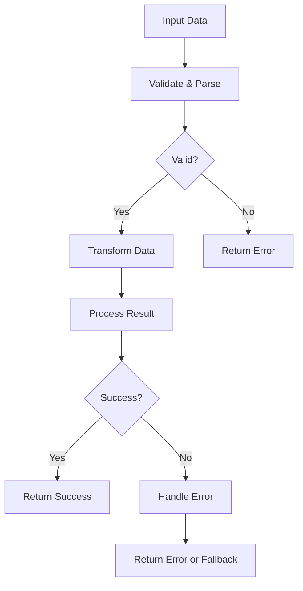

# Rust Idiomatic Code

## Introduction

Writing idiomatic Rust code means following the language's established patterns and practices that leverage Rust's unique features effectively. Idiomatic code is not just about making your programs work—it's about writing code that is maintainable, performant, and aligns with the Rust community's expectations.

In this guide, we'll explore the key aspects of writing idiomatic Rust code, from basic syntax conventions to more advanced patterns. By following these practices, you'll write code that is more readable to other Rust developers and takes full advantage of the language's safety and performance features.

## Naming Conventions

Rust has established naming conventions that help maintain consistency across codebases:

### Variable and Function Names

Use `snake_case` for variables, functions, and module names:

```rust
// Good
let user_count = 10;
fn calculate_total_price(items: &[Item]) -> f64 { /* ... */ }

// Not idiomatic
let UserCount = 10;
fn CalculateTotalPrice(items: &[Item]) -> f64 { /* ... */ }
```

### Type Names

Use `PascalCase` for types, traits, and enums:

```rust
// Good
struct UserProfile {
    username: String,
    email: String,
}

trait DataProcessor {
    fn process_data(&self, data: &[u8]) -> Result<Vec<u8>, Error>;
}

enum ConnectionState {
    Connected,
    Disconnected,
    Pending,
}

// Not idiomatic
struct user_profile {
    username: String,
    email: String,
}
```

### Constants and Statics

Use `SCREAMING_SNAKE_CASE` for constants and static variables:

```rust
// Good
const MAX_CONNECTIONS: u32 = 100;
static DEFAULT_TIMEOUT_MS: u64 = 30_000;

// Not idiomatic
const max_connections: u32 = 100;
static DefaultTimeoutMs: u64 = 30_000;
```

## Effective Use of Option and Result

One of the most distinctive features of Rust is its approach to handling optional values and errors using `Option` and `Result` types.

### Using Option

`Option` represents a value that might be absent. Use it instead of null pointers:

```rust
fn find_user(id: u64) -> Option<User> {
    if id == 0 {
        return None; // No user found
    }
    // User found, return Some(user)
    Some(User { id, name: "John".to_string() })
}

// Using the Option result
let user_id = 42;
match find_user(user_id) {
    Some(user) => println!("Found user: {}", user.name),
    None => println!("User not found"),
}

// More concise handling with if let
if let Some(user) = find_user(user_id) {
    println!("Found user: {}", user.name);
}
```

### Using Result for Error Handling

`Result` represents an operation that might fail. It's Rust's primary error handling mechanism:

```rust
fn parse_config(config_str: &str) -> Result<Config, ConfigError> {
    if config_str.is_empty() {
        return Err(ConfigError::Empty);
    }
    // Parse configuration...
    Ok(Config { /* ... */ })
}

// Using the Result
let config_text = read_config_file()?;
match parse_config(&config_text) {
    Ok(config) => {
        println!("Configuration loaded successfully");
        use_config(config);
    },
    Err(e) => println!("Failed to parse config: {:?}", e),
}
```

### Chaining Operations with Combinators

Rust's functional-style combinators make working with `Option` and `Result` more elegant:

```rust
// Using map, and_then, filter, etc.
let user_name = find_user(user_id)
    .map(|user| user.name)
    .unwrap_or_else(|| "Anonymous".to_string());

// Processing a Result with combinators
let parsed_data = parse_config(&config_text)
    .map_err(|e| {
        eprintln!("Configuration error: {:?}", e);
        e
    })
    .and_then(|config| process_data_with_config(data, config));
```

## Smart Use of Ownership and Borrowing

Rust's ownership system is a key feature that ensures memory safety without garbage collection.

### Prefer Borrowing Over Ownership When Possible

```rust
// Not ideal - takes ownership unnecessarily
fn print_message(message: String) {
    println!("{}", message);
}

// Better - borrows the string
fn print_message(message: &str) {
    println!("{}", message);
}
```

### Using Proper String Types

```rust
// Use &str for string slices (borrowed strings)
fn process_name(name: &str) {
    println!("Processing name: {}", name);
}

// Use String when you need to own or modify the string
fn get_greeting(name: &str) -> String {
    format!("Hello, {}!", name)
}
```

## Effective Iterators

Rust's iterators are powerful, expressive, and efficient. Using them idiomatically makes your code more readable and often more performant.

### Iterator Chains

```rust
// Not idiomatic: using loops and intermediate collections
let mut numbers = vec![1, 2, 3, 4, 5];
let mut squared_even_numbers = Vec::new();
for num in numbers {
    if num % 2 == 0 {
        squared_even_numbers.push(num * num);
    }
}

// Idiomatic: using iterator chains
let squared_even_numbers: Vec<i32> = vec![1, 2, 3, 4, 5]
    .into_iter()
    .filter(|&n| n % 2 == 0)
    .map(|n| n * n)
    .collect();

// Output: [4, 16]
```

### In-place Iteration

```rust
// Not idiomatic
for i in 0..names.len() {
    println!("Name {}: {}", i, names[i]);
}

// Idiomatic: iterate over references
for name in &names {
    println!("Name: {}", name);
}

// Idiomatic: when you need the index too
for (i, name) in names.iter().enumerate() {
    println!("Name {}: {}", i, name);
}
```

## Pattern Matching

Rust's pattern matching is more powerful than simple switch statements in other languages.

### Comprehensive Match Statements

```rust
enum PaymentMethod {
    CreditCard(String),
    PayPal(String),
    BankTransfer { account: String, routing: String },
}

fn process_payment(amount: f64, method: PaymentMethod) {
    match method {
        PaymentMethod::CreditCard(number) => {
            println!("Processing ${} via credit card ending in {}", 
                     amount, &number[number.len()-4..]);
        },
        PaymentMethod::PayPal(email) => {
            println!("Processing ${} via PayPal account {}", amount, email);
        },
        PaymentMethod::BankTransfer { account, routing } => {
            println!("Processing ${} via bank transfer from account {} (routing: {})", 
                     amount, account, routing);
        },
    }
}

// Example usage:
let payment = PaymentMethod::CreditCard("1234567890123456".to_string());
process_payment(99.99, payment);
// Output: Processing $99.99 via credit card ending in 3456
```

### If-let and While-let

For when you only care about one pattern:

```rust
// Instead of:
match user_preference {
    Some(pref) => {
        apply_preference(pref);
    },
    None => {},
}

// Use:
if let Some(pref) = user_preference {
    apply_preference(pref);
}

// Similarly, while let is useful for iterating through values that produce an Option or Result
while let Some(item) = iterator.next() {
    process_item(item);
}
```

## Effective Error Handling

Good error handling is a crucial part of idiomatic Rust code.

### The `?` Operator

The `?` operator simplifies error propagation:

```rust
// Without ? operator
fn read_username_from_file() -> Result<String, io::Error> {
    let file_result = File::open("username.txt");
    let mut file = match file_result {
        Ok(file) => file,
        Err(e) => return Err(e),
    };
    
    let mut username = String::new();
    match file.read_to_string(&mut username) {
        Ok(_) => Ok(username),
        Err(e) => Err(e),
    }
}

// With ? operator - much cleaner!
fn read_username_from_file() -> Result<String, io::Error> {
    let mut file = File::open("username.txt")?;
    let mut username = String::new();
    file.read_to_string(&mut username)?;
    Ok(username)
}

// Even more concise with method chaining
fn read_username_from_file() -> Result<String, io::Error> {
    let mut username = String::new();
    File::open("username.txt")?.read_to_string(&mut username)?;
    Ok(username)
}
```

### Custom Error Types

For libraries and larger applications, create custom error types:

```rust
use std::fmt;
use std::error::Error;

#[derive(Debug)]
enum AppError {
    ConfigError(String),
    NetworkError(String),
    DatabaseError(String),
}

impl fmt::Display for AppError {
    fn fmt(&self, f: &mut fmt::Formatter) -> fmt::Result {
        match self {
            AppError::ConfigError(msg) => write!(f, "Configuration error: {}", msg),
            AppError::NetworkError(msg) => write!(f, "Network error: {}", msg),
            AppError::DatabaseError(msg) => write!(f, "Database error: {}", msg),
        }
    }
}

impl Error for AppError {}
```

## Modules and Organization

Organize your code in a way that follows Rust's module system idioms.

```rust
// In lib.rs or main.rs
mod config;      // Loads from config.rs or config/mod.rs
mod database;    // Loads from database.rs or database/mod.rs
mod utils;       // Loads from utils.rs or utils/mod.rs

// Reexporting for a cleaner API
pub use config::Config;
pub use database::{Connection, Query};

// In a module file (e.g., database.rs)
// Private function
fn initialize_connection_pool() -> ConnectionPool {
    // ...
}

// Public items that should be part of your API
pub struct Connection {
    // ...
}

pub struct Query {
    // ...
}

pub fn execute_query(conn: &Connection, query: &Query) -> Result<QueryResult, QueryError> {
    // ...
}
```

## Using Builder Pattern

The Builder pattern is idiomatic for constructing complex objects:

```rust
#[derive(Default)]
pub struct ServerConfig {
    host: String,
    port: u16,
    max_connections: usize,
    timeout: Duration,
    tls_enabled: bool,
}

impl ServerConfig {
    pub fn new() -> Self {
        Self::default()
    }
    
    pub fn host(mut self, host: impl Into<String>) -> Self {
        self.host = host.into();
        self
    }
    
    pub fn port(mut self, port: u16) -> Self {
        self.port = port;
        self
    }
    
    pub fn max_connections(mut self, max_connections: usize) -> Self {
        self.max_connections = max_connections;
        self
    }
    
    pub fn timeout(mut self, timeout: Duration) -> Self {
        self.timeout = timeout;
        self
    }
    
    pub fn tls_enabled(mut self, tls_enabled: bool) -> Self {
        self.tls_enabled = tls_enabled;
        self
    }
    
    pub fn build(self) -> Server {
        Server::with_config(self)
    }
}

// Usage:
let server = ServerConfig::new()
    .host("127.0.0.1")
    .port(8080)
    .max_connections(1000)
    .timeout(Duration::from_secs(30))
    .tls_enabled(true)
    .build();
```

## Visualizing Data Flow in Idiomatic Rust

Here's a diagram showing the typical flow of data in idiomatic Rust code:



## Real-World Example: A Command Line Parser

Let's put these idioms together in a practical example:

```rust
use std::path::PathBuf;
use std::time::Duration;
use std::str::FromStr;

struct AppConfig {
    input_file: PathBuf,
    output_dir: PathBuf,
    verbosity: usize,
    timeout: Duration,
    dry_run: bool,
}

#[derive(Debug)]
enum ConfigError {
    MissingRequiredArg(String),
    InvalidValue(String),
    IoError(std::io::Error),
}

impl std::fmt::Display for ConfigError {
    fn fmt(&self, f: &mut std::fmt::Formatter) -> std::fmt::Result {
        match self {
            ConfigError::MissingRequiredArg(arg) => write!(f, "Missing required argument: {}", arg),
            ConfigError::InvalidValue(msg) => write!(f, "Invalid value: {}", msg),
            ConfigError::IoError(e) => write!(f, "I/O error: {}", e),
        }
    }
}

impl std::error::Error for ConfigError {}

impl From<std::io::Error> for ConfigError {
    fn from(error: std::io::Error) -> Self {
        ConfigError::IoError(error)
    }
}

impl AppConfig {
    fn from_args(args: &[String]) -> Result<Self, ConfigError> {
        let mut input_file = None;
        let mut output_dir = None;
        let mut verbosity = 0;
        let mut timeout = Duration::from_secs(30); // Default timeout
        let mut dry_run = false;
        
        let mut i = 1; // Skip program name
        while i < args.len() {
            match args[i].as_str() {
                "-i" | "--input" => {
                    i += 1;
                    if i >= args.len() {
                        return Err(ConfigError::MissingRequiredArg("input file".to_string()));
                    }
                    input_file = Some(PathBuf::from(&args[i]));
                },
                "-o" | "--output" => {
                    i += 1;
                    if i >= args.len() {
                        return Err(ConfigError::MissingRequiredArg("output directory".to_string()));
                    }
                    output_dir = Some(PathBuf::from(&args[i]));
                },
                "-v" | "--verbose" => {
                    verbosity += 1;
                },
                "-t" | "--timeout" => {
                    i += 1;
                    if i >= args.len() {
                        return Err(ConfigError::MissingRequiredArg("timeout value".to_string()));
                    }
                    let secs = u64::from_str(&args[i])
                        .map_err(|_| ConfigError::InvalidValue(format!("Invalid timeout: {}", args[i])))?;
                    timeout = Duration::from_secs(secs);
                },
                "--dry-run" => {
                    dry_run = true;
                },
                _ => {
                    return Err(ConfigError::InvalidValue(format!("Unknown argument: {}", args[i])));
                }
            }
            i += 1;
        }
        
        // Validate required arguments
        let input_file = input_file.ok_or_else(|| ConfigError::MissingRequiredArg("input file".to_string()))?;
        
        // Set default output dir if not specified
        let output_dir = output_dir.unwrap_or_else(|| PathBuf::from("./output"));
        
        // Create output directory if it doesn't exist
        if !output_dir.exists() && !dry_run {
            std::fs::create_dir_all(&output_dir)?;
        }
        
        Ok(AppConfig {
            input_file,
            output_dir,
            verbosity,
            timeout,
            dry_run,
        })
    }
    
    fn run(&self) -> Result<(), Box<dyn std::error::Error>> {
        // Here we would actually run the application
        if self.verbosity > 0 {
            println!("Input file: {:?}", self.input_file);
            println!("Output directory: {:?}", self.output_dir);
            println!("Timeout: {:?}", self.timeout);
            println!("Dry run: {}", self.dry_run);
        }
        
        if self.dry_run {
            println!("Dry run complete. No actions were taken.");
            return Ok(());
        }
        
        // Actual processing would happen here
        println!("Processing complete!");
        Ok(())
    }
}

fn main() -> Result<(), Box<dyn std::error::Error>> {
    let args: Vec<String> = std::env::args().collect();
    
    let config = match AppConfig::from_args(&args) {
        Ok(config) => config,
        Err(e) => {
            eprintln!("Error: {}", e);
            eprintln!("Usage: program -i INPUT_FILE [-o OUTPUT_DIR] [-v] [-t TIMEOUT] [--dry-run]");
            return Err(Box::new(e));
        }
    };
    
    config.run()
}
```

## Summary

Writing idiomatic Rust code involves following established community patterns that leverage the language's unique features effectively. By following these practices, you make your code more readable, maintainable, and often more performant.

Key takeaways:
- Use Rust's naming conventions consistently
- Embrace `Option` and `Result` for proper handling of optional values and errors
- Respect the ownership and borrowing system
- Use iterators and functional-style operations for data processing
- Take advantage of pattern matching for cleaner code
- Structure error handling using the `?` operator and custom error types
- Organize your code into logical modules
- Use builder patterns for complex object construction

Writing idiomatic Rust is not just about following rules; it's about adopting a mindset that values clarity, safety, and performance—the core values that make Rust a unique and powerful language.

## Additional Resources

- [The Rust Programming Language Book](https://doc.rust-lang.org/book/)
- [Rust by Example](https://doc.rust-lang.org/rust-by-example/)
- [Rust Design Patterns](https://rust-unofficial.github.io/patterns/)
- [The Cargo Book](https://doc.rust-lang.org/cargo/)
- [Effective Rust](https://www.lurklurk.org/effective-rust/)

## Exercises

1. **Refactoring Practice**: Take a non-idiomatic Rust function and refactor it to follow the idioms discussed in this guide.
   
   ```rust
   // Non-idiomatic function to refactor:
   fn find_max_value(values: Vec<i32>) -> i32 {
       let mut max_value = -9999999;
       for i in 0..values.len() {
           if values[i] > max_value {
               max_value = values[i];
           }
       }
       return max_value;
   }
   ```

2. **Error Handling Improvement**: Convert a function that uses `panic!` for error handling to use proper `Result` types instead.

3. **Iterator Challenge**: Implement a function that takes a vector of strings and returns a new vector containing only the strings that are palindromes, using iterator methods only.

4. **Custom Error Type**: Design a custom error type for a library that could encounter validation errors, I/O errors, and parsing errors.

5. **Builder Pattern**: Implement a builder pattern for a complex data structure of your choice.