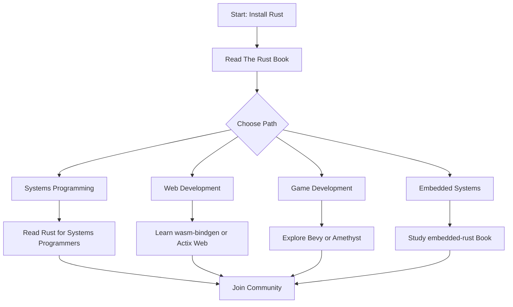

# Rust Community Resources

## Introduction

One of Rust's greatest strengths is its vibrant, welcoming community. As a beginner, knowing where to find help, documentation, and fellow Rust enthusiasts can significantly accelerate your learning journey. This guide explores the various community resources available to Rust developers of all skill levels, with a special focus on those particularly helpful for newcomers.

The Rust community follows a set of [values](https://www.rust-lang.org/policies/code-of-conduct) that emphasize being respectful, kind, and helpful. This makes it an excellent environment for beginners to ask questions and grow their skills.

## Official Resources

### The Rust Website

The [official Rust website](https://www.rust-lang.org/) is your starting point for all things Rust. Here you'll find:

- Installation instructions
- News about the language
- Documentation links
- Community information

### Documentation

Rust is known for its excellent documentation:

1. **[The Rust Book](https://doc.rust-lang.org/book/)** - The primary learning resource for Rust, covering all language fundamentals.

2. **[Rust by Example](https://doc.rust-lang.org/rust-by-example/)** - Learn Rust through annotated examples.

3. **[Rustlings](https://github.com/rust-lang/rustlings/)** - Small exercises to get you used to reading and writing Rust code.

4. **[Standard Library Documentation](https://doc.rust-lang.org/std/)** - Comprehensive documentation of Rust's standard library.

Let's see how you might use the standard library documentation to solve a problem:

```rust
// Problem: How do I convert a String to lowercase?
// Step 1: Look up String in the standard library documentation
// Step 2: Find the to_lowercase() method

fn main() {
    let original = String::from("Hello, RUST!");
    let lowercase = original.to_lowercase();
    
    println!("Original: {}", original);
    println!("Lowercase: {}", lowercase);
}

// Output:
// Original: Hello, RUST!
// Lowercase: hello, rust!
```

## Community Forums and Q&A

### Rust Forum

The [official Rust forum](https://users.rust-lang.org/) is an excellent place to ask questions, share projects, and discuss language changes. It's organized into categories like:

- Beginner Questions
- Help
- Show and Tell
- Announcements

### Stack Overflow

[Stack Overflow](https://stackoverflow.com/questions/tagged/rust) has a very active Rust tag with over 100,000 questions and answers. This is particularly helpful for specific technical problems.

### Reddit

The [r/rust](https://www.reddit.com/r/rust/) subreddit has over 200,000 members discussing Rust news, projects, and questions. There's also [r/learnrust](https://www.reddit.com/r/learnrust/) specifically for beginners.

## Real-Time Communication

### Discord

The [Rust Discord server](https://discord.gg/rust-lang) has over 100,000 members and channels dedicated to beginners, specific topics, and general discussion.

### Matrix/Element

Many Rust contributors use [Matrix](https://matrix.to/#/#rust:matrix.org) for communication, which you can access via clients like Element.

## Code Sharing and Exploration

### Rust Playground

The [Rust Playground](https://play.rust-lang.org/) lets you compile and run Rust code in your browser. This is perfect for:

- Testing small code snippets
- Sharing code with others for help
- Experimenting with new concepts

Here's how to use it:

1. Visit [play.rust-lang.org](https://play.rust-lang.org/)
2. Write or paste your code
3. Click "Run" to compile and execute
4. Share your code via the "Share" button

### GitHub

Many Rust projects are open-source on GitHub. Here are some repos worth exploring:

- [Rust Language](https://github.com/rust-lang/rust) - The main Rust repository
- [Awesome Rust](https://github.com/rust-unofficial/awesome-rust) - A curated list of Rust resources
- [Rust Learning](https://github.com/ctjhoa/rust-learning) - A collection of learning resources

## Learning Pathways

The Rust community provides several structured learning paths:



## Practical Community Engagement Example

Let's look at a practical example of how you might use community resources to solve a problem:

**Problem:** You're trying to read a file in Rust, but getting an error.

**Solution Path:**

```rust
// Your code with an error
fn main() {
    let content = std::fs::read_to_string("myfile.txt");
    println!("File content: {}", content);
}

// Error: 
// error[E0277]: `std::result::Result<std::string::String, std::io::Error>` doesn't implement `std::fmt::Display`
```

**Community Help Process:**

1. **Check documentation** - Look up `std::fs::read_to_string` in the standard library docs to understand it returns a `Result<String, Error>`.

2. **Ask on forum** - Post your code on users.rust-lang.org with the error message.

3. **Get community answer** - Learn you need to handle the Result using `unwrap()`, `?`, or a match statement.

```rust
// Corrected code after community help
fn main() -> Result<(), std::io::Error> {
    let content = std::fs::read_to_string("myfile.txt")?;
    println!("File content: {}", content);
    Ok(())
}
```

## Regular Community Events

The Rust community hosts several regular events:

1. **RustConf** - Annual conference for Rust developers
2. **Rust Meetups** - Local gatherings in many cities worldwide
3. **Rust Hackathons** - Coding events for building projects together
4. **Rust Game Development Workgroup** - Monthly meetings for Rust game developers

## Contributing Back to the Community

As you grow in your Rust knowledge, consider contributing back to the community:

1. **Answer questions** - Help other beginners on forums and Discord
2. **Report bugs** - File issues for the compiler or documentation
3. **Contribute to documentation** - Fix typos or add examples
4. **Create libraries** - Build and share useful crates on crates.io

## Learning Projects

Here are some beginner-friendly projects to practice your Rust skills while engaging with the community:

1. **Command-line weather app** - Fetch weather data from an API
2. **Simple web server** - Use the `warp` or `rocket` frameworks
3. **File encryption tool** - Learn about Rust's cryptography libraries
4. **Contribute to Rustlings** - Help improve the exercises for other beginners

## Summary

The Rust community offers a wealth of resources for developers at all levels. As a beginner, you have access to:

- Comprehensive documentation and tutorials
- Active forums and chat platforms for real-time help
- Tools like the Rust Playground for experimentation
- Structured learning paths for different specializations
- Regular events and meetups to connect with other Rustaceans

Remember that everyone in the Rust community was once a beginner. Don't hesitate to ask questions and share your learning journey with others.

## Additional Resources

- [This Week in Rust](https://this-week-in-rust.org/) - Weekly newsletter covering Rust developments
- [crates.io](https://crates.io/) - The Rust package registry
- [Are We Web Yet?](https://www.arewewebyet.org/) - Status of Rust's web ecosystem
- [Rust Quiz](https://dtolnay.github.io/rust-quiz/) - Test your Rust knowledge
- [Exercism's Rust Track](https://exercism.org/tracks/rust) - Guided exercises with mentorship

## Exercises for Practice

1. Create an account on the Rust forum and introduce yourself in the introductions thread.
2. Find three different Stack Overflow questions about a Rust topic you're interested in.
3. Fork a beginner-friendly Rust project on GitHub and run it locally.
4. Join the Rust Discord server and ask a question in the beginners channel.
5. Use the Rust Playground to experiment with a concept from The Rust Book and share it with a friend.