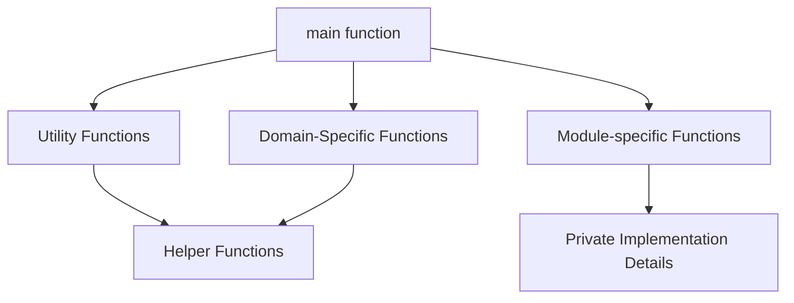

# Rust Functions Basics

## Introduction

Functions are the building blocks of readable, maintainable, and reusable code. In Rust, functions play a crucial role in organizing code and implementing the language's powerful features. This guide will introduce you to the basics of Rust functions, from simple definitions to practical applications.

A function is a block of organized, reusable code that performs a specific task. By breaking your code into functions, you make it more modular, easier to debug, and simpler to maintain.

## Defining Your First Function

Let's start with the simplest function definition in Rust:

```rust
fn say_hello() {
    println!("Hello, world!");
}

fn main() {
    say_hello(); // Calling our function
}
```

**Output:**
```
Hello, world!
```

The syntax for defining a function in Rust is:
- `fn` keyword to declare a function
- Function name (using snake_case by convention)
- Parentheses `()` for parameters (empty in this case)
- Curly braces `{}` to enclose the function body

## Function Parameters

Functions become more useful when they can accept inputs. In Rust, we call these inputs "parameters":

```rust
fn greet(name: &str) {
    println!("Hello, {}!", name);
}

fn main() {
    greet("Alice");
    greet("Bob");
}
```

**Output:**
```
Hello, Alice!
Hello, Bob!
```

Notice how we declared a parameter `name` of type `&str` (string slice). Rust requires explicit type annotations for all function parameters.

### Multiple Parameters

You can define functions with multiple parameters:

```rust
fn describe_person(name: &str, age: u32) {
    println!("{} is {} years old.", name, age);
}

fn main() {
    describe_person("Carol", 28);
    describe_person("Dave", 35);
}
```

**Output:**
```
Carol is 28 years old.
Dave is 35 years old.
```

## Return Values

Functions can also return values. In Rust, the return type is specified after an arrow `->`:

```rust
fn add(a: i32, b: i32) -> i32 {
    a + b  // Note: no semicolon here!
}

fn main() {
    let sum = add(5, 3);
    println!("The sum is: {}", sum);
}
```

**Output:**
```
The sum is: 8
```

### Important Note About Returns

In Rust, the last expression in a function is implicitly returned if it doesn't end with a semicolon. This is why we wrote `a + b` without a semicolon in the `add` function.

If you prefer to be explicit, you can use the `return` keyword:

```rust
fn add(a: i32, b: i32) -> i32 {
    return a + b;  // Explicit return with semicolon
}
```

## Early Returns

Sometimes, you might want to return early from a function based on certain conditions:

```rust
fn divide(a: f64, b: f64) -> Option<f64> {
    if b == 0.0 {
        return None;  // Early return for division by zero
    }
    
    Some(a / b)  // Normal return
}

fn main() {
    match divide(10.0, 2.0) {
        Some(result) => println!("10 ÷ 2 = {}", result),
        None => println!("Cannot divide by zero!"),
    }
    
    match divide(10.0, 0.0) {
        Some(result) => println!("10 ÷ 0 = {}", result),
        None => println!("Cannot divide by zero!"),
    }
}
```

**Output:**
```
10 ÷ 2 = 5
Cannot divide by zero!
```

This example demonstrates not only early returns but also the use of Rust's `Option` type for handling potential failure cases.

## Functions as Expressions vs. Statements

In Rust, functions themselves are expressions, not statements. This means you can use them in ways that might surprise you if you're coming from other languages:

```rust
fn get_greeting() -> &'static str {
    "Hello, Rust programmer!"
}

fn main() {
    let greeting = get_greeting();
    println!("{}", greeting);
}
```

**Output:**
```
Hello, Rust programmer!
```

## Function Scope and Lifetime

Variables defined inside a function are only accessible within that function:

```rust
fn main() {
    let outside_variable = 10;
    
    {
        // This is a new scope
        let inside_variable = 20;
        println!("Inside: can access outside_variable: {}", outside_variable);
        println!("Inside: can access inside_variable: {}", inside_variable);
    }
    
    println!("Outside: can access outside_variable: {}", outside_variable);
    // This would cause a compilation error:
    // println!("Outside: cannot access inside_variable: {}", inside_variable);
}
```

**Output:**
```
Inside: can access outside_variable: 10
Inside: can access inside_variable: 20
Outside: can access outside_variable: 10
```

## Practical Examples

### Example 1: Temperature Converter

```rust
fn celsius_to_fahrenheit(celsius: f64) -> f64 {
    (celsius * 9.0 / 5.0) + 32.0
}

fn fahrenheit_to_celsius(fahrenheit: f64) -> f64 {
    (fahrenheit - 32.0) * 5.0 / 9.0
}

fn main() {
    let celsius = 25.0;
    let fahrenheit = celsius_to_fahrenheit(celsius);
    println!("{:.1}°C = {:.1}°F", celsius, fahrenheit);
    
    let fahrenheit = 98.6;
    let celsius = fahrenheit_to_celsius(fahrenheit);
    println!("{:.1}°F = {:.1}°C", fahrenheit, celsius);
}
```

**Output:**
```
25.0°C = 77.0°F
98.6°F = 37.0°C
```

### Example 2: Simple Calculator

```rust
fn calculator(a: f64, b: f64, operation: char) -> Option<f64> {
    match operation {
        '+' => Some(a + b),
        '-' => Some(a - b),
        '*' => Some(a * b),
        '/' => {
            if b == 0.0 {
                None  // Cannot divide by zero
            } else {
                Some(a / b)
            }
        },
        _ => None,  // Invalid operation
    }
}

fn main() {
    let operations = [(5.0, 3.0, '+'), (10.0, 2.0, '/'), (7.0, 0.0, '/'), (4.0, 3.0, '^')];
    
    for (a, b, op) in operations {
        match calculator(a, b, op) {
            Some(result) => println!("{} {} {} = {}", a, op, b, result),
            None => println!("{} {} {} = Error", a, op, b),
        }
    }
}
```

**Output:**
```
5 + 3 = 8
10 / 2 = 5
7 / 0 = Error
4 ^ 3 = Error
```

## Function Organization in Rust Programs

As your programs grow, organizing functions becomes important. Here's a diagram showing how functions are typically organized in Rust programs:



## Summary

In this guide, we've covered the fundamentals of Rust functions:

- Basic function syntax using the `fn` keyword
- Parameters and type annotations
- Return values and implicit returns
- Early returns and conditional logic
- Function scope and variable visibility
- Practical examples showing functions in action

Functions are a fundamental building block in Rust, and mastering them is essential for writing clean, efficient, and maintainable code.

## Exercises

1. Write a function that calculates the area of a rectangle given its width and height.
2. Create a function that takes a string and returns whether it's a palindrome (reads the same forward and backward).
3. Implement a simple interest calculator function that takes principal amount, rate, and time as parameters.
4. Write a function that accepts an array of integers and returns the sum, average, minimum, and maximum values.

## Additional Resources

- [The Rust Programming Language Book - Functions Chapter](https://doc.rust-lang.org/book/ch03-03-how-functions-work.html)
- [Rust By Example - Functions](https://doc.rust-lang.org/rust-by-example/fn.html)
- [Rustlings Exercises](https://github.com/rust-lang/rustlings) - Practice exercises for Rust beginners