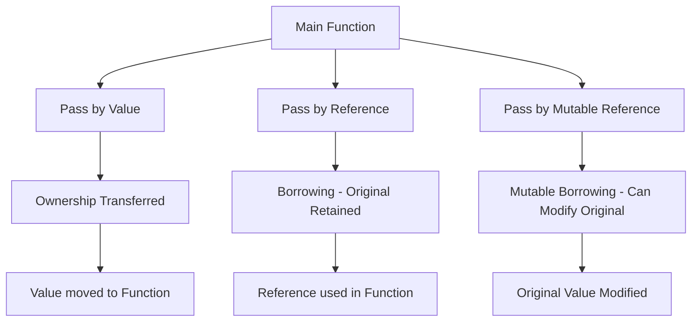

# Rust Function Parameters

Functions are the building blocks of any programming language, and understanding how to work with function parameters is essential for writing effective Rust code. This guide will walk you through everything you need to know about Rust function parameters, from the basics to more advanced concepts.

## Introduction to Function Parameters

In Rust, function parameters (also called arguments) are the values that you provide to a function when you call it. These parameters allow you to pass data into functions, making them more flexible and reusable.

Let's start with a simple example:

```rust
fn greet(name: &str) {
    println!("Hello, {}!", name);
}

fn main() {
    greet("Rustacean"); // Outputs: Hello, Rustacean!
}
```

In this example, `name` is a parameter of the `greet` function. When we call the function with `greet("Rustacean")`, we're passing the string `"Rustacean"` as an argument to the function.

## Parameter Types in Rust

In Rust, you must explicitly declare the type of each parameter. This is one of the ways Rust ensures type safety at compile time.

```rust
fn add(a: i32, b: i32) -> i32 {
    a + b
}

fn main() {
    let sum = add(5, 3); // sum = 8
    println!("Sum: {}", sum);
}
```

In this function, both `a` and `b` are parameters of type `i32` (32-bit integer). The function returns their sum, also as an `i32`.

## Multiple Parameters

Functions can have multiple parameters, separated by commas:

```rust
fn calculate_rectangle_area(width: f64, height: f64) -> f64 {
    width * height
}

fn main() {
    let area = calculate_rectangle_area(5.0, 3.0); // area = 15.0
    println!("The rectangle area is: {}", area);
}
```

## Passing by Value vs. Reference

In Rust, parameters can be passed by value or by reference. This is important to understand because of Rust's ownership system.

### Passing by Value

When you pass a parameter by value, ownership of the value is transferred to the function:

```rust
fn take_ownership(s: String) {
    println!("I now own: {}", s);
    // s is dropped when this function ends
}

fn main() {
    let my_string = String::from("hello");
    take_ownership(my_string);
    // my_string is no longer valid here because ownership was transferred
    // Uncommenting the next line would cause a compile error:
    // println!("{}", my_string);
}
```

### Passing by Reference

To avoid transferring ownership, you can pass a reference to a value:

```rust
fn borrow_string(s: &String) {
    println!("I'm just borrowing: {}", s);
    // s remains valid after this function ends
}

fn main() {
    let my_string = String::from("hello");
    borrow_string(&my_string);
    // my_string is still valid here
    println!("I can still use: {}", my_string);
}
```

## Mutable Parameters

If you need to modify a parameter inside a function, you can pass a mutable reference:

```rust
fn increase_by_one(number: &mut i32) {
    *number += 1;
}

fn main() {
    let mut x = 5;
    increase_by_one(&mut x);
    println!("x is now: {}", x); // Outputs: x is now: 6
}
```

Note the use of the asterisk (`*`) to dereference the mutable reference before modifying its value.

## Parameter Patterns

Rust supports various parameter patterns that can make your code more expressive and concise.

### Pattern Matching in Parameters

You can use pattern matching directly in function parameters:

```rust
fn describe_point((x, y): (i32, i32)) {
    println!("The point is at ({}, {})", x, y);
}

fn main() {
    let point = (3, 4);
    describe_point(point);
}
```

### Accepting Slices

For functions that need to work with arrays or parts of arrays without taking ownership, you can use slices:

```rust
fn sum_slice(numbers: &[i32]) -> i32 {
    let mut total = 0;
    for n in numbers {
        total += n;
    }
    total
}

fn main() {
    let numbers = [1, 2, 3, 4, 5];
    let sum = sum_slice(&numbers[1..4]); // Pass a slice from index 1 to 3
    println!("Sum of the slice: {}", sum); // Outputs: Sum of the slice: 9 (2+3+4)
}
```

## Function Parameters with Generic Types

Rust's powerful type system allows for generic functions that can work with different types:

```rust
fn print_value<T: std::fmt::Display>(value: T) {
    println!("Value: {}", value);
}

fn main() {
    print_value(42);       // Works with integers
    print_value("hello");  // Works with strings
    print_value(3.14);     // Works with floating-point numbers
}
```

The `<T: std::fmt::Display>` syntax means that the generic type `T` must implement the `Display` trait, which allows values to be formatted as text.

## Optional Parameters and Default Values

Rust doesn't have built-in support for default parameter values like some other languages, but there are several ways to achieve similar functionality:

### Option Type

You can use Rust's `Option` type to make a parameter optional:

```rust
fn greet_with_title(name: &str, title: Option<&str>) {
    match title {
        Some(t) => println!("Hello, {} {}!", t, name),
        None => println!("Hello, {}!", name),
    }
}

fn main() {
    greet_with_title("Smith", Some("Dr.")); // Outputs: Hello, Dr. Smith!
    greet_with_title("Jones", None);         // Outputs: Hello, Jones!
}
```

### Builder Pattern

For functions with many optional parameters, the builder pattern is a common Rust idiom:

```rust
struct GreetingConfig<'a> {
    name: &'a str,
    title: Option<&'a str>,
    salutation: Option<&'a str>,
}

impl<'a> GreetingConfig<'a> {
    fn new(name: &'a str) -> Self {
        GreetingConfig {
            name,
            title: None,
            salutation: None,
        }
    }
    
    fn with_title(mut self, title: &'a str) -> Self {
        self.title = Some(title);
        self
    }
    
    fn with_salutation(mut self, salutation: &'a str) -> Self {
        self.salutation = Some(salutation);
        self
    }
    
    fn greet(&self) {
        let salutation = self.salutation.unwrap_or("Hello");
        match self.title {
            Some(title) => println!("{}, {} {}!", salutation, title, self.name),
            None => println!("{}, {}!", salutation, self.name),
        }
    }
}

fn main() {
    // Basic greeting
    GreetingConfig::new("Smith").greet();
    // With title
    GreetingConfig::new("Johnson").with_title("Prof.").greet();
    // With title and custom salutation
    GreetingConfig::new("Williams")
        .with_title("Dr.")
        .with_salutation("Good morning")
        .greet();
}
```

## Named Parameters

Rust doesn't have built-in named parameters like some languages do, but you can simulate them using structs:

```rust
struct RectangleParams {
    width: f64,
    height: f64,
}

fn calculate_area(params: RectangleParams) -> f64 {
    params.width * params.height
}

fn main() {
    let area = calculate_area(RectangleParams {
        width: 5.0,
        height: 3.0,
    });
    println!("The area is: {}", area);
}
```

This approach makes function calls more self-documenting, especially when there are many parameters.

## Variable Number of Parameters

For functions that need to accept a variable number of arguments, you can use slices or the `std::fmt::Arguments` macro (similar to how `println!` works):

```rust
fn sum_all(numbers: &[i32]) -> i32 {
    numbers.iter().sum()
}

fn main() {
    let result1 = sum_all(&[1, 2, 3]);
    let result2 = sum_all(&[10, 20, 30, 40, 50]);
    
    println!("Sum of first array: {}", result1);
    println!("Sum of second array: {}", result2);
}
```

## Destructuring in Parameters

Rust allows destructuring complex data structures directly in function parameters:

```rust
struct Point {
    x: f64,
    y: f64,
}

fn calculate_distance(Point { x: x1, y: y1 }: Point, Point { x: x2, y: y2 }: Point) -> f64 {
    ((x2 - x1).powi(2) + (y2 - y1).powi(2)).sqrt()
}

fn main() {
    let point1 = Point { x: 0.0, y: 0.0 };
    let point2 = Point { x: 3.0, y: 4.0 };
    
    let distance = calculate_distance(point1, point2);
    println!("Distance between points: {}", distance); // Outputs: Distance between points: 5
}
```

## Real-world Example: Command-line Argument Parsing

Let's see how function parameters can be used in a more practical context. This example shows a simple command-line calculator:

```rust
use std::env;

fn calculate(a: f64, b: f64, operation: &str) -> Result<f64, String> {
    match operation {
        "add" => Ok(a + b),
        "subtract" => Ok(a - b),
        "multiply" => Ok(a * b),
        "divide" => {
            if b == 0.0 {
                Err("Division by zero is not allowed".to_string())
            } else {
                Ok(a / b)
            }
        },
        _ => Err(format!("Unknown operation: {}", operation)),
    }
}

fn main() {
    let args: Vec<String> = env::args().collect();
    
    if args.len() != 4 {
        println!("Usage: {} <number> <operation> <number>", args[0]);
        return;
    }
    
    let a = match args[1].parse::<f64>() {
        Ok(num) => num,
        Err(_) => {
            println!("Error: First argument must be a number");
            return;
        }
    };
    
    let operation = &args[2];
    
    let b = match args[3].parse::<f64>() {
        Ok(num) => num,
        Err(_) => {
            println!("Error: Third argument must be a number");
            return;
        }
    };
    
    match calculate(a, b, operation) {
        Ok(result) => println!("Result: {}", result),
        Err(error) => println!("Error: {}", error),
    }
}
```

This program takes three command-line arguments: two numbers and an operation name. The `calculate` function uses pattern matching to perform different operations based on the provided operation name.

## Best Practices for Function Parameters

Here are some guidelines to follow when working with function parameters in Rust:

1. **Be explicit about types**: Always specify the types of your parameters to make your code more readable and prevent potential bugs.

2. **Pass by reference when possible**: To avoid unnecessary copying and ownership transfers, pass large data structures by reference.

3. **Use pattern matching**: Take advantage of Rust's pattern matching capabilities to make your function parameters more expressive.

4. **Document your parameters**: Use doc comments (`///`) to explain what each parameter does and any constraints it might have.

5. **Consider using structs for many parameters**: If a function has more than 3-4 parameters, consider grouping them in a struct for better readability.

6. **Be mindful of ownership**: Understand whether your function needs to take ownership of a parameter or just borrow it.

Here's an example of a well-documented function:

```rust
/// Calculates the area of a triangle using Heron's formula.
///
/// # Parameters
///
/// * `a` - The length of the first side of the triangle.
/// * `b` - The length of the second side of the triangle.
/// * `c` - The length of the third side of the triangle.
///
/// # Returns
///
/// The area of the triangle or an error if the sides cannot form a valid triangle.
///
/// # Examples
///
/// ```
/// let area = calculate_triangle_area(3.0, 4.0, 5.0);
/// assert_eq!(area, Ok(6.0));
/// ```
fn calculate_triangle_area(a: f64, b: f64, c: f64) -> Result<f64, String> {
    // Check if sides can form a triangle
    if a <= 0.0 || b <= 0.0 || c <= 0.0 || a + b <= c || a + c <= b || b + c <= a {
        return Err("Invalid triangle dimensions".to_string());
    }
    
    // Calculate semi-perimeter
    let s = (a + b + c) / 2.0;
    
    // Heron's formula
    let area = (s * (s - a) * (s - b) * (s - c)).sqrt();
    
    Ok(area)
}
```

## Visual Representation of Parameter Passing

Here's a diagram showing how different types of parameters are passed in Rust:



## Summary

In this guide, we've covered:

- The basics of function parameters in Rust
- How to specify parameter types
- Passing parameters by value and by reference
- Working with mutable parameters
- Advanced parameter patterns like generics and destructuring
- Techniques for simulating optional and named parameters
- Best practices for working with function parameters

Understanding how to effectively use function parameters is crucial for writing clean, maintainable Rust code. By leveraging Rust's powerful type system and ownership model, you can create functions that are both safe and expressive.

## Exercises

To reinforce your understanding of Rust function parameters, try these exercises:

1. Write a function that takes a string slice and returns a new string with all vowels removed.

2. Create a function that accepts an array of integers and returns the sum, minimum, and maximum values.

3. Implement a function that takes a closure as a parameter and applies it to each element of an array.

4. Write a generic function that swaps the values of two variables of the same type.

5. Create a function that simulates named parameters using a struct, for a function that calculates the monthly payment of a loan given the principal, interest rate, and term in years.

## Additional Resources

- [The Rust Programming Language Book - Functions Chapter](https://doc.rust-lang.org/book/ch03-03-how-functions-work.html)
- [Rust By Example - Functions](https://doc.rust-lang.org/rust-by-example/fn.html)
- [Rust Standard Library Documentation](https://doc.rust-lang.org/std/)
- [Rust Design Patterns - Official Repository](https://github.com/rust-unofficial/patterns)