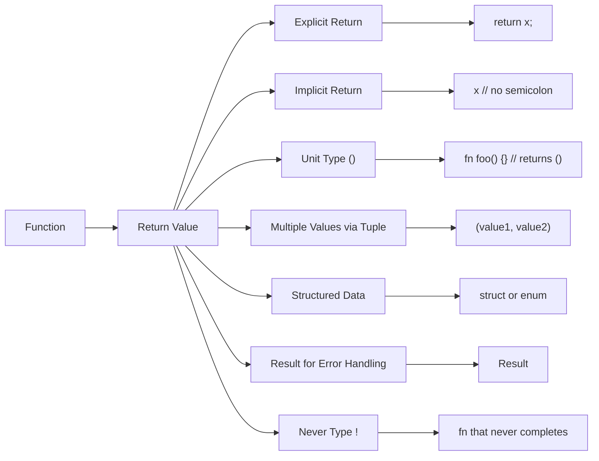

# Rust Return Values

## Introduction

In Rust, functions are not just about executing a series of operations—they're also about computing and returning values that can be used elsewhere in your program. Understanding how return values work in Rust is essential for writing effective code and leveraging the full power of Rust's type system.

In this guide, we'll explore how functions return values in Rust, different ways to express returns, and common patterns you'll encounter in Rust codebases.

## Function Return Basics

In Rust, every function has a return type, which is specified after an arrow (`->`) in the function signature.

```rust
fn add(a: i32, b: i32) -> i32 {
    a + b
}

fn main() {
    let sum = add(5, 3);
    println!("The sum is: {}", sum);
}
```

**Output:**
```
The sum is: 8
```

In this example, the `add` function takes two `i32` parameters and returns an `i32` value. The return type is explicitly declared with `-> i32`.

## Implicit and Explicit Returns

Rust offers two ways to return values from a function:

### Implicit Returns

In Rust, the last expression in a function body is implicitly returned. An expression doesn't end with a semicolon.

```rust
fn multiply(a: i32, b: i32) -> i32 {
    a * b  // No semicolon here! This is an expression, not a statement
}

fn main() {
    let product = multiply(4, 7);
    println!("The product is: {}", product);
}
```

**Output:**
```
The product is: 28
```

### Explicit Returns

You can also use the `return` keyword to explicitly return a value from anywhere in the function:

```rust
fn absolute_value(x: i32) -> i32 {
    if x >= 0 {
        return x;  // Early return for positive numbers
    }
    
    -x  // Implicit return for negative numbers
}

fn main() {
    println!("Absolute of 5: {}", absolute_value(5));
    println!("Absolute of -3: {}", absolute_value(-3));
}
```

**Output:**
```
Absolute of 5: 5
Absolute of -3: 3
```

The `return` keyword is especially useful for early returns, like in error handling or in conditional logic.

## Returning Nothing with the Unit Type

If a function doesn't return a value, it implicitly returns the unit type, written as `()`. This is similar to `void` in languages like C or Java.

```rust
fn greet(name: &str) {
    println!("Hello, {}!", name);
    // This function returns (), the unit type
}

fn main() {
    greet("Rust Beginner");
    
    // You can even assign the unit type to a variable
    let nothing = greet("Rust Programmer");
    println!("The value of nothing is: {:?}", nothing);
}
```

**Output:**
```
Hello, Rust Beginner!
Hello, Rust Programmer!
The value of nothing is: ()
```

You can explicitly define a function that returns the unit type, though it's usually omitted:

```rust
fn do_nothing() -> () {
    // Function body
}
```

## Returning Multiple Values

Rust doesn't directly support returning multiple values from a function, but you can achieve this effect using tuples:

```rust
fn calculate_statistics(numbers: &[i32]) -> (i32, i32, f64) {
    let sum: i32 = numbers.iter().sum();
    let max: i32 = *numbers.iter().max().unwrap_or(&0);
    let average: f64 = sum as f64 / numbers.len() as f64;
    
    (sum, max, average)  // Return a tuple with multiple values
}

fn main() {
    let numbers = [4, 9, 2, 7, 5];
    
    // Destructure the returned tuple
    let (sum, max, avg) = calculate_statistics(&numbers);
    
    println!("Sum: {}", sum);
    println!("Maximum: {}", max);
    println!("Average: {:.2}", avg);
}
```

**Output:**
```
Sum: 27
Maximum: 9
Average: 5.40
```

This is a common pattern in Rust for functions that need to return multiple related values.

## Using Structs for Named Returns

When a function needs to return multiple values, using a tuple can sometimes be unclear. For better readability, consider defining and returning a struct:

```rust
struct Rectangle {
    width: u32,
    height: u32,
    area: u32,
    perimeter: u32,
}

fn analyze_rectangle(width: u32, height: u32) -> Rectangle {
    let area = width * height;
    let perimeter = 2 * (width + height);
    
    Rectangle {
        width,
        height,
        area,
        perimeter,
    }
}

fn main() {
    let rect = analyze_rectangle(5, 10);
    
    println!("Rectangle dimensions: {} x {}", rect.width, rect.height);
    println!("Area: {}", rect.area);
    println!("Perimeter: {}", rect.perimeter);
}
```

**Output:**
```
Rectangle dimensions: 5 x 10
Area: 50
Perimeter: 30
```

## Error Handling in Return Values

In Rust, error handling is often done through return values using the `Result` enum:

```rust
fn divide(a: f64, b: f64) -> Result<f64, String> {
    if b == 0.0 {
        return Err(String::from("Division by zero!"));
    }
    
    Ok(a / b)
}

fn main() {
    let result1 = divide(10.0, 2.0);
    let result2 = divide(5.0, 0.0);
    
    match result1 {
        Ok(value) => println!("Result of first division: {}", value),
        Err(error) => println!("Error: {}", error),
    }
    
    match result2 {
        Ok(value) => println!("Result of second division: {}", value),
        Err(error) => println!("Error: {}", error),
    }
}
```

**Output:**
```
Result of first division: 5
Error: Division by zero!
```

This pattern is fundamental in Rust and provides a type-safe way to handle errors without exceptions.

## The ? Operator for Error Propagation

When working with functions that return `Result` or `Option` types, Rust offers the `?` operator to simplify error handling and propagation:

```rust
fn read_file_first_line(path: &str) -> Result<String, std::io::Error> {
    use std::fs::File;
    use std::io::{self, BufRead};
    
    let file = File::open(path)?;  // The ? will return the error if opening fails
    let mut lines = io::BufReader::new(file).lines();
    
    if let Some(line_result) = lines.next() {
        line_result  // This also returns a Result that will be propagated with ?
    } else {
        Ok(String::new())  // Return empty string if file is empty
    }
}

fn main() {
    match read_file_first_line("example.txt") {
        Ok(line) => println!("First line: {}", line),
        Err(error) => println!("Error reading file: {}", error),
    }
}
```

The `?` operator is a concise way to propagate errors up the call stack, making your code cleaner and more readable.

## Understanding the Never Type (`!`)

Rust has a special return type called the "never type" (`!`) for functions that never return:

```rust
fn exit_program(code: i32) -> ! {
    std::process::exit(code)
}

// This function will panic and thus never return normally
fn always_panic() -> ! {
    panic!("This function never returns!");
}
```

The never type is useful for functions that end execution like `exit`, `panic`, or infinite loops.

## Visualizing Function Returns

Here's a diagram showing the different ways functions can return values in Rust:



## Practical Example: A Temperature Converter

Let's create a practical example that utilizes different return value patterns:

```rust
enum Temperature {
    Celsius(f64),
    Fahrenheit(f64),
}

enum ConversionError {
    BelowAbsoluteZero,
    InvalidInput,
}

fn convert_temperature(temp: Temperature) -> Result<f64, ConversionError> {
    match temp {
        Temperature::Celsius(c) => {
            if c < -273.15 {
                return Err(ConversionError::BelowAbsoluteZero);
            }
            
            // Convert Celsius to Fahrenheit
            Ok(c * 9.0 / 5.0 + 32.0)
        },
        Temperature::Fahrenheit(f) => {
            if f < -459.67 {
                return Err(ConversionError::BelowAbsoluteZero);
            }
            
            // Convert Fahrenheit to Celsius
            Ok((f - 32.0) * 5.0 / 9.0)
        }
    }
}

fn main() {
    let celsius = Temperature::Celsius(25.0);
    let fahrenheit = Temperature::Fahrenheit(98.6);
    let invalid = Temperature::Celsius(-300.0);  // Below absolute zero
    
    match convert_temperature(celsius) {
        Ok(temp) => println!("25°C in Fahrenheit: {:.1}°F", temp),
        Err(ConversionError::BelowAbsoluteZero) => println!("Temperature below absolute zero!"),
        Err(ConversionError::InvalidInput) => println!("Invalid input!"),
    }
    
    match convert_temperature(fahrenheit) {
        Ok(temp) => println!("98.6°F in Celsius: {:.1}°C", temp),
        Err(_) => println!("Conversion error!"),
    }
    
    match convert_temperature(invalid) {
        Ok(temp) => println!("Converted temperature: {:.1}", temp),
        Err(ConversionError::BelowAbsoluteZero) => println!("Temperature below absolute zero!"),
        Err(_) => println!("Other error!"),
    }
}
```

**Output:**
```
25°C in Fahrenheit: 77.0°F
98.6°F in Celsius: 37.0°C
Temperature below absolute zero!
```

This example demonstrates:
- Using enums for structured input and error types
- Returning `Result` for proper error handling
- Pattern matching on the returned results
- Early returns for error conditions

## Summary

In this guide, we've explored the various ways Rust handles function return values:

1. **Basic returns** - Using the `->` syntax to specify a return type
2. **Implicit returns** - The last expression in a function body
3. **Explicit returns** - Using the `return` keyword for early returns
4. **Unit type** - Functions that don't return meaningful values
5. **Multiple returns** - Using tuples and structs to return multiple values
6. **Error handling** - Using `Result` and the `?` operator
7. **Never type** - For functions that don't return normally

Understanding these patterns will help you write more idiomatic Rust code and take full advantage of Rust's powerful type system and safety guarantees.

## Exercises

To reinforce your understanding of Rust return values, try these exercises:

1. Write a function that takes an array of integers and returns both the minimum and maximum values.
2. Create a function that parses a string as an integer and returns a `Result` type.
3. Implement a function that calculates the roots of a quadratic equation (ax² + bx + c = 0) and returns a custom enum that represents the different possible outcomes (two real roots, one real root, or complex roots).
4. Write a recursive function that calculates factorial and returns a `Result` to handle potential overflow.

## Additional Resources

- [Rust Book: Functions](https://doc.rust-lang.org/book/ch03-03-how-functions-work.html)
- [Rust By Example: Functions](https://doc.rust-lang.org/rust-by-example/fn.html)
- [Rust Book: Error Handling](https://doc.rust-lang.org/book/ch09-00-error-handling.html)
- [Never Type Documentation](https://doc.rust-lang.org/std/primitive.never.html)