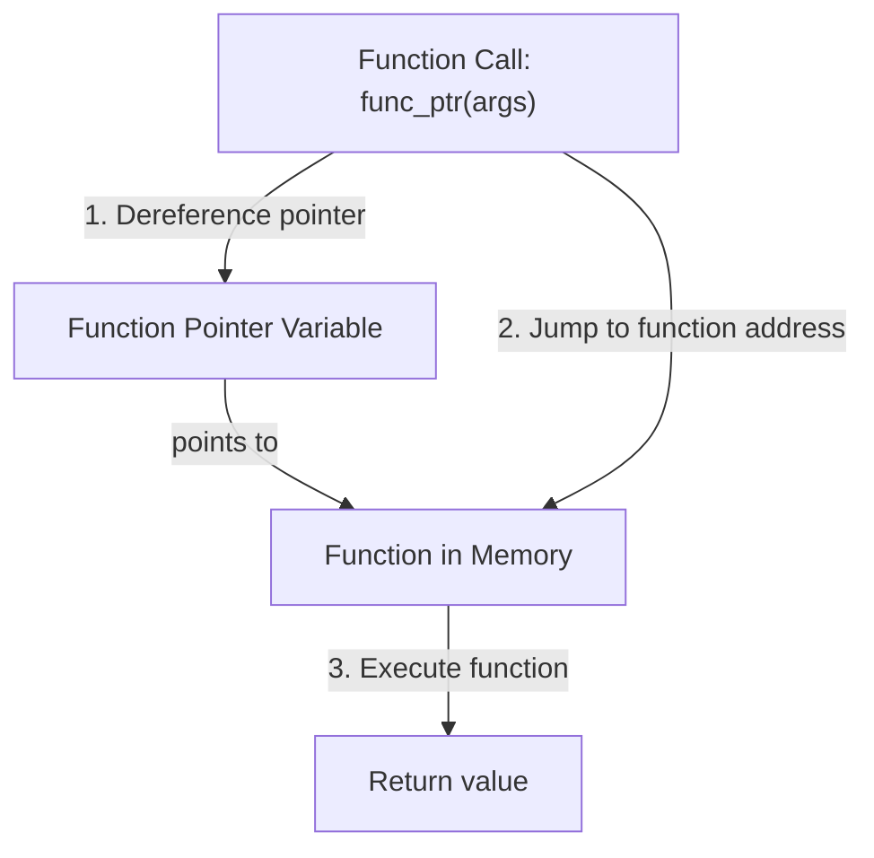

# Rust Function Pointers

## Introduction

Function pointers are a powerful feature in Rust that allow you to store references to functions and pass them as arguments to other functions. Unlike closures, which can capture their environment, function pointers are simply pointers to functions with a specific signature. They're particularly useful when you need to choose between different behaviors at runtime or when you're interfacing with C code.

In this guide, we'll explore:
- What function pointers are in Rust
- How to define and use them
- The differences between function pointers and closures
- Practical examples and use cases

## Understanding Function Pointers

A function pointer is a variable that stores the memory address of a function. In Rust, function pointers are represented by the `fn` type (lowercase, unlike the `Fn` trait used for closures).

### Basic Syntax

Here's the basic syntax for defining a function pointer in Rust:

```rust
fn add(a: i32, b: i32) -> i32 {
    a + b
}

fn main() {
    // Declare a function pointer
    let func_ptr: fn(i32, i32) -> i32 = add;
    
    // Use the function pointer to call the function
    let result = func_ptr(5, 3);
    println!("Result: {}", result);
}
```

**Output:**
```
Result: 8
```

In this example, `func_ptr` is a function pointer that points to the `add` function. The type annotation `fn(i32, i32) -> i32` specifies that the function takes two `i32` parameters and returns an `i32`.

## Function Pointers vs. Closures

Before diving deeper, it's important to understand the difference between function pointers and closures in Rust:

| Feature | Function Pointers | Closures |
|---------|------------------|----------|
| Syntax | `fn(T) -> U` | `Fn(T) -> U`, `FnMut(T) -> U`, or `FnOnce(T) -> U` |
| Environment Capture | Cannot capture environment | Can capture environment variables |
| Memory Representation | Simple pointer (thin) | May include captured variables (fat) |
| Use Case | Static dispatch, C FFI | When environment capture is needed |

## Passing Function Pointers as Arguments

One common use case for function pointers is passing them as arguments to other functions:

```rust
fn apply_operation(a: i32, b: i32, operation: fn(i32, i32) -> i32) -> i32 {
    operation(a, b)
}

fn add(a: i32, b: i32) -> i32 {
    a + b
}

fn multiply(a: i32, b: i32) -> i32 {
    a * b
}

fn main() {
    let result1 = apply_operation(5, 3, add);
    let result2 = apply_operation(5, 3, multiply);
    
    println!("Addition result: {}", result1);
    println!("Multiplication result: {}", result2);
}
```

**Output:**
```
Addition result: 8
Multiplication result: 15
```

In this example, we pass different functions (`add` and `multiply`) to `apply_operation` to achieve different behaviors.

## Function Pointer Type Aliases

For complex function signatures, it can be helpful to create type aliases:

```rust
type MathOperation = fn(i32, i32) -> i32;

fn apply_operation(a: i32, b: i32, operation: MathOperation) -> i32 {
    operation(a, b)
}

fn main() {
    let add: MathOperation = |a, b| a + b;
    let result = apply_operation(10, 5, add);
    println!("Result: {}", result);
}
```

**Output:**
```
Result: 15
```

## Function Pointers in Arrays and Collections

You can store function pointers in arrays or other collections:

```rust
fn main() {
    // Array of function pointers
    let operations: [fn(i32, i32) -> i32; 4] = [
        |a, b| a + b,    // Addition
        |a, b| a - b,    // Subtraction
        |a, b| a * b,    // Multiplication
        |a, b| a / b     // Division
    ];
    
    let a = 10;
    let b = 5;
    
    for (i, &operation) in operations.iter().enumerate() {
        let result = operation(a, b);
        let op_name = match i {
            0 => "Addition",
            1 => "Subtraction",
            2 => "Multiplication",
            3 => "Division",
            _ => "Unknown"
        };
        println!("{}: {} ", op_name, result);
    }
}
```

**Output:**
```
Addition: 15 
Subtraction: 5 
Multiplication: 50 
Division: 2 
```

This pattern is particularly useful for implementing strategy patterns or command patterns in Rust.

## Using Function Pointers with Higher-Order Functions

Rust's standard library includes many higher-order functions that accept function pointers:

```rust
fn main() {
    let numbers = vec![1, 2, 3, 4, 5];
    
    // Using a named function
    let squares: Vec<i32> = numbers.iter().map(square).collect();
    println!("Squares: {:?}", squares);
    
    // Using a function pointer directly
    let function_ptr: fn(&i32) -> i32 = square;
    let more_squares: Vec<i32> = numbers.iter().map(function_ptr).collect();
    println!("More squares: {:?}", more_squares);
}

fn square(x: &i32) -> i32 {
    x * x
}
```

**Output:**
```
Squares: [1, 4, 9, 16, 25]
More squares: [1, 4, 9, 16, 25]
```

## Real-World Example: A Simple Plugin System

Function pointers can be used to implement a simple plugin system:

```rust
struct Plugin {
    name: String,
    execute: fn() -> (),
}

fn plugin_one() {
    println!("Executing plugin one!");
}

fn plugin_two() {
    println!("Executing plugin two!");
}

fn main() {
    let plugins = vec![
        Plugin { name: "Plugin 1".to_string(), execute: plugin_one },
        Plugin { name: "Plugin 2".to_string(), execute: plugin_two },
    ];
    
    for plugin in plugins {
        println!("Running {}...", plugin.name);
        (plugin.execute)();
    }
}
```

**Output:**
```
Running Plugin 1...
Executing plugin one!
Running Plugin 2...
Executing plugin two!
```

This pattern is commonly used in applications that need to support plugins or extensibility.

## Function Pointers in FFI (Foreign Function Interface)

Function pointers are crucial when interfacing with C code:

```rust
// Define a C-compatible function type
type CCallback = extern "C" fn(i32) -> i32;

// A Rust function with a C-compatible signature
extern "C" fn rust_callback(x: i32) -> i32 {
    println!("Called from C with value: {}", x);
    x * 2
}

// A function that would be implemented in C
fn simulate_c_function(callback: CCallback, value: i32) -> i32 {
    println!("C function calling Rust callback...");
    callback(value)
}

fn main() {
    let result = simulate_c_function(rust_callback, 42);
    println!("Result: {}", result);
}
```

**Output:**
```
C function calling Rust callback...
Called from C with value: 42
Result: 84
```

This is a simulation, but in real FFI scenarios, function pointers allow Rust and C code to call each other's functions.

## Visual Representation of Function Pointers

Here's a simple diagram showing how function pointers work in memory:



## Limitations of Function Pointers

While powerful, function pointers in Rust have some limitations:

1. **No Environment Capture**: Unlike closures, function pointers cannot capture variables from their environment.
2. **Static Dispatch**: Function pointers use static dispatch, which means the function to call is determined at compile time.
3. **Fixed Signature**: All functions pointed to must have exactly the same signature.

If you need more flexibility, consider using trait objects or closures.

## Comparing Different Function Types in Rust

Let's compare the different ways to work with functions in Rust:

```rust
fn main() {
    // 1. Function pointer
    let fn_ptr: fn(i32) -> i32 = double;
    
    // 2. Closure (capturing nothing)
    let closure = |x: i32| x * 2;
    
    // 3. Closure (capturing a value)
    let factor = 3;
    let capturing_closure = |x: i32| x * factor;
    
    println!("Function pointer result: {}", fn_ptr(5));
    println!("Simple closure result: {}", closure(5));
    println!("Capturing closure result: {}", capturing_closure(5));
}

fn double(x: i32) -> i32 {
    x * 2
}
```

**Output:**
```
Function pointer result: 10
Simple closure result: 10
Capturing closure result: 15
```

## Summary

Function pointers in Rust provide a way to store references to functions with specific signatures. They're useful for:

- Implementing callback mechanisms
- Creating configurable behaviors
- Interfacing with C code through FFI
- Implementing simple plugin systems
- Selecting algorithms at runtime

While function pointers don't have the flexibility of closures or trait objects, they provide a lightweight and efficient way to work with functions as first-class values in Rust.

## Additional Resources

- [Rust Book: Function Pointers](https://doc.rust-lang.org/book/ch19-05-advanced-functions-and-closures.html)
- [Rust Reference: Function Types](https://doc.rust-lang.org/reference/types/function.html)
- [Rust FFI Guide](https://michael-f-bryan.github.io/rust-ffi-guide/)

## Exercises

1. Create a calculator program that uses function pointers to perform different operations.
2. Implement a simple command pattern using function pointers.
3. Create a sorting function that takes a comparison function as a parameter.
4. Try to implement a plugin system that loads functions dynamically at runtime.
5. Compare the performance of function pointers versus trait objects for a simple task.