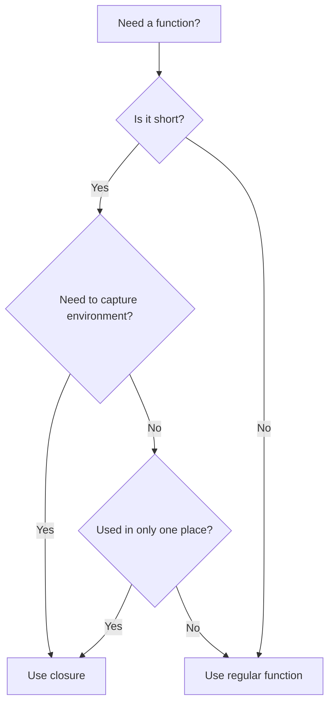

# Rust Closures

## Introduction

Closures are one of Rust's most powerful features, allowing you to create anonymous functions that can capture values from their surrounding environment. Think of closures as flexible, inline functions that you can pass around in your code. They're particularly useful for functional programming patterns and when working with iterators.

In this guide, we'll explore how closures work in Rust, their syntax, capture mechanics, and practical applications that will help you write more concise and expressive code.

## What Are Closures?

A closure is an anonymous function that can capture variables from the scope where it's defined. Unlike regular functions, closures can be defined inline and can access variables from their surrounding context.

Here's a simple comparison between a regular function and a closure:

```rust
// Regular function
fn add_one(x: i32) -> i32 {
    x + 1
}

fn main() {
    // Closure equivalent
    let add_one = |x: i32| -> i32 { x + 1 };
    
    // Using both
    println!("Function result: {}", add_one(5));  // Output: Function result: 6
    println!("Closure result: {}", add_one(5));   // Output: Closure result: 6
}
```

## Closure Syntax

Rust closures have a concise syntax that makes them easy to use:

```rust
let closure_name = |parameters| -> return_type { body };
```

The syntax uses vertical bars (`|...|`) instead of parentheses for parameters. The return type and curly braces are optional in many cases due to Rust's type inference.

### Type Inference in Closures

Rust can often infer the types in closures, allowing for even more concise code:

```rust
fn main() {
    // Verbose syntax with explicit types
    let sum_verbose = |x: i32, y: i32| -> i32 { x + y };
    
    // Concise syntax with inferred types
    let sum_concise = |x, y| x + y;
    
    println!("Verbose: {}", sum_verbose(5, 10));  // Output: Verbose: 15
    println!("Concise: {}", sum_concise(5, 10));  // Output: Concise: 15
}
```

In the concise example, Rust infers types based on how the closure is used. Also note that when the closure body is a single expression, you can omit the curly braces.

## Capturing the Environment

The real power of closures comes from their ability to capture variables from their surrounding environment. Rust closures can capture variables in three ways:

1. **Borrowing immutably** (`&T`)
2. **Borrowing mutably** (`&mut T`)
3. **Taking ownership** (`T`)

Rust automatically determines the capture method based on how the variable is used in the closure.

### Immutable Borrowing

```rust
fn main() {
    let message = String::from("Hello");
    
    // The closure borrows 'message' immutably
    let greet = || println!("{}", message);
    
    // We can still use 'message' here because it was only borrowed
    println!("Original: {}", message);  // Output: Original: Hello
    
    greet();  // Output: Hello
}
```

### Mutable Borrowing

```rust
fn main() {
    let mut counter = 0;
    
    // The closure borrows 'counter' mutably
    let mut increment = || {
        counter += 1;
        println!("Counter: {}", counter);
    };
    
    increment();  // Output: Counter: 1
    increment();  // Output: Counter: 2
    
    // After the closure is done, we can use 'counter' again
    println!("Final count: {}", counter);  // Output: Final count: 2
}
```

### Taking Ownership with `move`

The `move` keyword forces a closure to take ownership of the variables it uses:

```rust
fn main() {
    let message = String::from("Hello");
    
    // The closure takes ownership of 'message'
    let greet = move || println!("{}", message);
    
    // This would cause an error if uncommented, as ownership was transferred
    // println!("Original: {}", message);
    
    greet();  // Output: Hello
}
```

The `move` keyword is particularly useful when using closures with threads or when the closure needs to live longer than the variables it references.

## Closures as Function Parameters

Rust provides three main traits that define how closures can be used as function parameters:

1. `Fn`: Takes a reference to captured variables
2. `FnMut`: Takes a mutable reference to captured variables
3. `FnOnce`: Takes ownership of captured variables and can only be called once

Here's an example showing how to define functions that take closures as parameters:

```rust
fn execute_fn<F>(closure: F)
    where F: Fn() -> ()
{
    closure();
}

fn execute_fn_mut<F>(mut closure: F)
    where F: FnMut()
{
    closure();
}

fn execute_fn_once<F>(closure: F)
    where F: FnOnce()
{
    closure();
}

fn main() {
    let message = String::from("Hello");

    // Using Fn
    execute_fn(|| println!("Fn: {}", message));
    
    // Using FnMut with a mutable capture
    let mut counter = 0;
    execute_fn_mut(|| {
        counter += 1;
        println!("FnMut: counter = {}", counter);
    });
    
    // Using FnOnce with move
    execute_fn_once(move || println!("FnOnce: {}", message));
    
    // message is no longer accessible here
}
```

## Practical Applications

Let's explore some common use cases for closures in Rust.

### Working with Iterators

Closures are frequently used with iterators to process collections:

```rust
fn main() {
    let numbers = vec![1, 2, 3, 4, 5];
    
    // Using map with a closure to double each number
    let doubled: Vec<i32> = numbers
        .iter()
        .map(|x| x * 2)
        .collect();
    
    println!("Doubled: {:?}", doubled);  // Output: Doubled: [2, 4, 6, 8, 10]
    
    // Using filter with a closure to keep only even numbers
    let evens: Vec<&i32> = numbers
        .iter()
        .filter(|x| *x % 2 == 0)
        .collect();
    
    println!("Evens: {:?}", evens);  // Output: Evens: [2, 4]
}
```

### Creating Custom Sorting Logic

Closures can be used to define custom sorting behavior:

```rust
fn main() {
    let mut people = vec![
        ("Alice", 25),
        ("Bob", 30),
        ("Charlie", 20),
    ];
    
    // Sort by age using a closure
    people.sort_by(|a, b| a.1.cmp(&b.1));
    
    println!("Sorted by age: {:?}", people);
    // Output: Sorted by age: [("Charlie", 20), ("Alice", 25), ("Bob", 30)]
}
```

### Implementing Callbacks

Closures are ideal for callback functions:

```rust
fn process_data<F>(data: Vec<i32>, callback: F) -> Vec<i32>
    where F: Fn(i32) -> i32
{
    data.iter().map(|&x| callback(x)).collect()
}

fn main() {
    let numbers = vec![1, 2, 3, 4, 5];
    
    // Define different processing strategies using closures
    let squares = process_data(numbers.clone(), |x| x * x);
    let doubles = process_data(numbers.clone(), |x| x * 2);
    let incremented = process_data(numbers.clone(), |x| x + 1);
    
    println!("Original: {:?}", numbers);    // Output: Original: [1, 2, 3, 4, 5]
    println!("Squares: {:?}", squares);     // Output: Squares: [1, 4, 9, 16, 25]
    println!("Doubles: {:?}", doubles);     // Output: Doubles: [2, 4, 6, 8, 10]
    println!("Incremented: {:?}", incremented); // Output: Incremented: [2, 3, 4, 5, 6]
}
```

### Building a Simple Event System

Closures can be used to create event handlers:

```rust
struct EventSystem {
    handlers: Vec<Box<dyn Fn(&str)>>,
}

impl EventSystem {
    fn new() -> Self {
        EventSystem { handlers: Vec::new() }
    }
    
    fn add_handler<F>(&mut self, handler: F)
        where F: Fn(&str) + 'static
    {
        self.handlers.push(Box::new(handler));
    }
    
    fn emit_event(&self, event: &str) {
        for handler in &self.handlers {
            handler(event);
        }
    }
}

fn main() {
    let mut system = EventSystem::new();
    
    // Add handlers as closures
    system.add_handler(|event| println!("Handler 1 received: {}", event));
    system.add_handler(|event| println!("Handler 2 received: {}", event));
    
    // Emit an event
    system.emit_event("User logged in");
    
    /* Output:
    Handler 1 received: User logged in
    Handler 2 received: User logged in
    */
}
```

## Closure Lifetimes and `move`

Understanding closure lifetimes is crucial when working with Rust's ownership system. The `move` keyword becomes particularly important when closures need to outlive the context where they're created:

```rust
fn create_greeter() -> impl Fn() {
    let message = String::from("Hello, world!");
    
    // Use 'move' to transfer ownership of message into the closure
    move || println!("{}", message)
}

fn main() {
    let greeter = create_greeter();
    
    // We can use the closure even though the original scope is gone
    greeter();  // Output: Hello, world!
}
```

Without the `move` keyword, this code wouldn't compile because `message` would be dropped when `create_greeter` returns.

## Rust Closures vs Functions

Let's compare closures with regular functions to understand when to use each:



### When to Use Closures

- For short, inline functions
- When you need to capture values from the environment
- For callbacks and event handlers
- When working with iterators and functional programming patterns

### When to Use Regular Functions

- For reusable code used in multiple places
- For complex logic that would make closures hard to read
- When you don't need to capture environment variables
- When defining your public API

## Summary

Rust closures are a powerful feature that enables functional programming patterns and more concise code. They allow you to:

- Create anonymous functions inline
- Capture variables from their surrounding environment
- Use a concise syntax with type inference
- Pass behavior as parameters to other functions
- Work effectively with iterators and collections

By understanding how closures capture variables (by reference, mutable reference, or ownership) and how to use the appropriate traits (`Fn`, `FnMut`, `FnOnce`), you can leverage closures to write more expressive and maintainable Rust code.

## Additional Resources and Exercises

### Further Reading

- [The Rust Book: Closures](https://doc.rust-lang.org/book/ch13-01-closures.html)
- [Rust By Example: Closures](https://doc.rust-lang.org/rust-by-example/fn/closures.html)

### Exercises

1. **Iterator Chain**: Create a function that takes a vector of integers and returns a new vector containing only the squares of even numbers.

2. **Custom Sorter**: Write a program that sorts a list of strings by their length, and then alphabetically for strings of the same length.

3. **Callback System**: Implement a simple callback system that allows registering multiple callbacks and executing them in sequence.

4. **Memoization**: Create a function that takes another function as an input and returns a memoized version of that function (caching results for repeated inputs).

5. **Event Handlers**: Build a simple event system where you can register handlers for different event types and trigger events.

Happy coding with Rust closures!