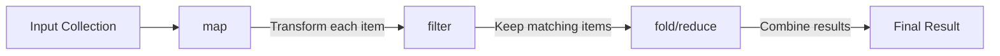

# Rust Higher Order Functions

## Introduction

Higher-order functions are a powerful concept in functional programming that Rust fully embraces. A higher-order function is a function that does at least one of the following:
- Takes one or more functions as arguments
- Returns a function as its result

These functions enable more abstract, concise, and readable code by allowing you to separate common behavior patterns from specific implementations. In this guide, we'll explore how Rust implements higher-order functions and how you can leverage them in your own code.

## Prerequisites

Before diving into higher-order functions, you should have a basic understanding of:
- Rust fundamentals
- Basic function syntax in Rust
- Rust closures (anonymous functions)

## Understanding Higher-Order Functions

### Taking Functions as Parameters

Let's start with a simple example of a higher-order function that takes another function as an argument:

```rust
fn apply_function<F>(f: F, value: i32) -> i32
where
    F: Fn(i32) -> i32,
{
    f(value)
}

fn main() {
    // Define a simple function
    fn add_one(x: i32) -> i32 {
        x + 1
    }
    
    // Use our higher-order function
    let result = apply_function(add_one, 5);
    println!("Result: {}", result); // Output: Result: 6
}
```

In this example, `apply_function` is a higher-order function that takes:
1. A function `f` that accepts an `i32` and returns an `i32`
2. An `i32` value
3. It then applies the provided function to the value and returns the result

### Using Closures with Higher-Order Functions

Closures (anonymous functions) work particularly well with higher-order functions:

```rust
fn main() {
    let result = apply_function(|x| x * x, 5);
    println!("Result: {}", result); // Output: Result: 25
}
```

Here, we've passed a closure that squares its input rather than defining a separate named function.

## Iterator Methods as Higher-Order Functions

Rust's iterators provide many higher-order functions that transform, filter, or process collections. These are some of the most common higher-order functions you'll use in Rust.

### The `map` Function

The `map` function transforms each element in a collection by applying a function to it:

```rust
fn main() {
    let numbers = vec![1, 2, 3, 4, 5];
    
    let squared: Vec<i32> = numbers.iter()
        .map(|x| x * x)
        .collect();
    
    println!("Squared numbers: {:?}", squared);
    // Output: Squared numbers: [1, 4, 9, 16, 25]
}
```

### The `filter` Function

The `filter` function creates a new collection containing only the elements that satisfy a predicate:

```rust
fn main() {
    let numbers = vec![1, 2, 3, 4, 5, 6];
    
    let even_numbers: Vec<&i32> = numbers.iter()
        .filter(|x| *x % 2 == 0)
        .collect();
    
    println!("Even numbers: {:?}", even_numbers);
    // Output: Even numbers: [2, 4, 6]
}
```

### The `fold` Function

The `fold` function combines all elements in a collection using a function:

```rust
fn main() {
    let numbers = vec![1, 2, 3, 4, 5];
    
    let sum = numbers.iter()
        .fold(0, |acc, x| acc + x);
    
    println!("Sum: {}", sum);
    // Output: Sum: 15
}
```

## Returning Functions from Functions

A higher-order function can also return another function. In Rust, we use the `Box<dyn Fn(...)>` syntax to return functions:

```rust
fn create_multiplier(factor: i32) -> Box<dyn Fn(i32) -> i32> {
    Box::new(move |x| x * factor)
}

fn main() {
    let double = create_multiplier(2);
    let triple = create_multiplier(3);
    
    println!("Double 5: {}", double(5)); // Output: Double 5: 10
    println!("Triple 5: {}", triple(5)); // Output: Triple 5: 15
}
```

In this example, `create_multiplier` is a higher-order function that returns a function that multiplies its input by a specified factor.

## Function Composition

Higher-order functions allow for elegant function composition. Here's an example of creating a composed function:

```rust
fn compose<F, G, T>(f: F, g: G) -> impl Fn(T) -> T
where
    F: Fn(T) -> T,
    G: Fn(T) -> T,
    T: Copy,
{
    move |x| f(g(x))
}

fn main() {
    let add_one = |x| x + 1;
    let double = |x| x * 2;
    
    // Compose the functions: first double, then add one
    let double_then_add_one = compose(add_one, double);
    
    println!("Result: {}", double_then_add_one(5)); // Output: Result: 11
}
```

## Practical Example: Data Processing Pipeline

Let's look at a real-world example of using higher-order functions to process data:

```rust
#[derive(Debug)]
struct Student {
    name: String,
    age: u32,
    grades: Vec<u32>,
}

fn main() {
    let students = vec![
        Student {
            name: String::from("Alice"),
            age: 22,
            grades: vec![95, 88, 92, 78],
        },
        Student {
            name: String::from("Bob"),
            age: 20,
            grades: vec![80, 85, 90, 88],
        },
        Student {
            name: String::from("Charlie"),
            age: 23,
            grades: vec![70, 65, 68, 72],
        },
    ];
    
    // Calculate the average grade for each student
    let avg_grades: Vec<(String, f64)> = students.iter()
        .map(|student| {
            let avg = student.grades.iter()
                .sum::<u32>() as f64 / student.grades.len() as f64;
            (student.name.clone(), avg)
        })
        .collect();
    
    // Filter students with average grade above 80
    let high_performers: Vec<&(String, f64)> = avg_grades.iter()
        .filter(|(_, avg)| *avg >= 80.0)
        .collect();
    
    println!("All students' average grades:");
    for (name, avg) in &avg_grades {
        println!("{}: {:.2}", name, avg);
    }
    
    println!("
High performers (avg >= 80):");
    for (name, avg) in high_performers {
        println!("{}: {:.2}", name, avg);
    }
}
```

Output:
```
All students' average grades:
Alice: 88.25
Bob: 85.75
Charlie: 68.75

High performers (avg >= 80):
Alice: 88.25
Bob: 85.75
```

This example demonstrates how higher-order functions like `map` and `filter` can be combined to create a data processing pipeline.

## Common Higher-Order Functions in the Standard Library

Rust's standard library provides many higher-order functions beyond the iterator methods:

### `Option::map` and `Result::map`

These functions apply a transformation to the contained value if it exists:

```rust
fn main() {
    let maybe_value = Some(42);
    let mapped = maybe_value.map(|x| x.to_string());
    println!("Mapped: {:?}", mapped); // Output: Mapped: Some("42")
    
    let error_case: Option<i32> = None;
    let mapped_error = error_case.map(|x| x.to_string());
    println!("Mapped error: {:?}", mapped_error); // Output: Mapped error: None
}
```

### Functional Error Handling with `and_then` and `or_else`

```rust
fn main() {
    let success = Some(42);
    let failure: Option<i32> = None;
    
    let result1 = success
        .and_then(|value| Some(value * 2))
        .or_else(|| Some(0));
    
    let result2 = failure
        .and_then(|value| Some(value * 2))
        .or_else(|| Some(0));
    
    println!("Result 1: {:?}", result1); // Output: Result 1: Some(84)
    println!("Result 2: {:?}", result2); // Output: Result 2: Some(0)
}
```

## Visualizing Higher-Order Function Flow

Let's visualize how higher-order functions can be chained together:



## Advanced Usage: Partial Application

Partial application is a technique where you use a higher-order function to create a new function by fixing some of the arguments:

```rust
fn partial_apply<F, A, B, C>(f: F, a: A) -> impl Fn(B) -> C
where
    F: Fn(A, B) -> C,
    A: Copy,
{
    move |b| f(a, b)
}

fn add(a: i32, b: i32) -> i32 {
    a + b
}

fn main() {
    // Create a function that adds 5 to its argument
    let add_5 = partial_apply(add, 5);
    
    println!("5 + 10 = {}", add_5(10)); // Output: 5 + 10 = 15
    println!("5 + 7 = {}", add_5(7));   // Output: 5 + 7 = 12
}
```

## Benefits of Higher-Order Functions

1. **Code Reusability**: Extract common patterns into reusable functions
2. **Abstraction**: Focus on what you want to accomplish rather than how
3. **Composability**: Build complex behaviors by combining simple functions
4. **Readability**: Express intentions more clearly with functional patterns
5. **Conciseness**: Reduce boilerplate code

## Common Challenges and Solutions

### Challenge: Lifetime Issues

Sometimes you might encounter lifetime issues when working with higher-order functions:

```rust
// This won't compile because of lifetime issues
fn returns_closure() -> Fn(i32) -> i32 {
    |x| x + 1
}
```

**Solution**: Use `Box<dyn Fn(...)>` or `impl Fn(...)` return types:

```rust
fn returns_closure() -> Box<dyn Fn(i32) -> i32> {
    Box::new(|x| x + 1)
}

// Or with impl Trait (Rust 2018+)
fn returns_closure_impl() -> impl Fn(i32) -> i32 {
    |x| x + 1
}
```

### Challenge: Moving Values into Closures

When passing closures to higher-order functions, you might need to move values:

```rust
fn main() {
    let factor = 5;
    
    let numbers = vec![1, 2, 3, 4, 5];
    let multiplied: Vec<i32> = numbers.iter()
        .map(|&x| x * factor)
        .collect();
    
    println!("Multiplied: {:?}", multiplied);
    // We can still use factor here because i32 implements Copy
    println!("Factor: {}", factor);
}
```

If `factor` didn't implement `Copy`, we would need to use `move` or clone it:

```rust
fn main() {
    let data = String::from("Hello");
    
    let closure = move |x: i32| {
        println!("{} {}", data, x);
        x + 1
    };
    
    // data is moved into the closure and no longer accessible here
    // println!("Data: {}", data); // Error!
    
    println!("Result: {}", closure(5));
}
```

## Summary

Higher-order functions are a cornerstone of functional programming in Rust. They allow you to:

- Pass functions as arguments to other functions
- Return functions from functions
- Create more abstract and reusable code
- Build expressive data processing pipelines

By mastering higher-order functions, you can write more concise, maintainable, and elegant Rust code. The standard library's iterator methods and other functional combinators provide a rich toolkit for functional programming patterns.

## Exercises

1. Write a function `compose_many` that takes a vector of functions and composes them all together.
2. Implement a simple map-reduce framework using higher-order functions.
3. Create a function that returns different mathematical operations based on a string parameter.
4. Implement your own version of the `filter_map` function that both filters and maps in one operation.
5. Use higher-order functions to process a collection of strings, converting them to uppercase and filtering out any that are shorter than 5 characters.

## Additional Resources

- [The Rust Programming Language Book - Closures](https://doc.rust-lang.org/book/ch13-01-closures.html)
- [The Rust Programming Language Book - Iterators](https://doc.rust-lang.org/book/ch13-02-iterators.html)
- [Rust by Example - Higher Order Functions](https://doc.rust-lang.org/rust-by-example/fn/hof.html)
- [Rust Standard Library Documentation - Iterator trait](https://doc.rust-lang.org/std/iter/trait.Iterator.html)
- [Functional Programming in Rust](https://github.com/JasonShin/fp-core.rs) - A collection of functional programming abstractions in Rust