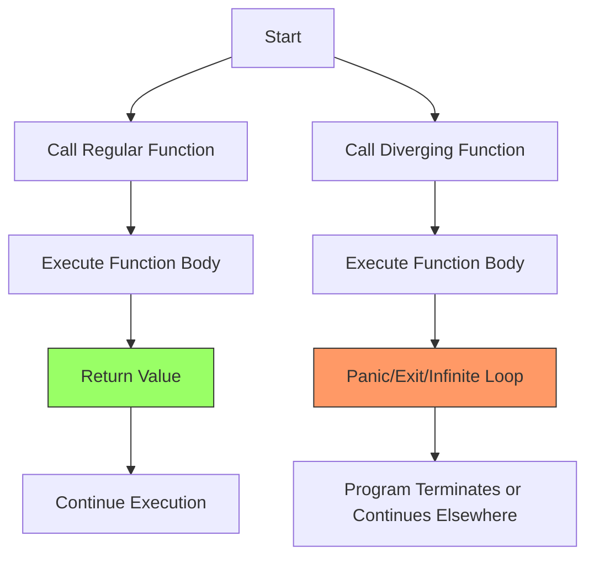

# Rust Diverging Functions

## Introduction

In most programming languages, functions are expected to return a value or complete their execution. However, Rust has a special concept called **diverging functions** - functions that never return to their caller. Instead of returning normally, these functions either:

- Cause the program to terminate
- Enter an infinite loop
- Transfer control to another part of the program without returning

Diverging functions in Rust are marked with the special return type `!`, known as the "never type." This indicates to the compiler that the function will never return control to the caller.

## The Never Type (`!`)

The never type (`!`) is a special type in Rust that represents a computation that never completes. When a function is marked with `!` as its return type, it tells the compiler that the function will never return normally.

```rust
fn forever() -> ! {
    loop {
        println!("I'll run forever!");
        // This function never returns
    }
}
```

The function above contains an infinite loop with no `break` statement, ensuring it will never complete and return to its caller.

## When to Use Diverging Functions

Diverging functions are useful in several scenarios:

1. **Program termination**: When you need to exit the program with an error message
2. **Infinite processes**: For processes designed to run continuously until forcibly terminated
3. **Panic situations**: When the program reaches an unrecoverable state
4. **Type system benefits**: For better type-checking in certain control flow situations

Let's explore each of these use cases with examples.

## Common Examples of Diverging Functions

### 1. The `panic!` Macro

The most common diverging function in Rust is the `panic!` macro. When called, `panic!` prints an error message, unwinds the stack, and then exits the program:

```rust
fn main() {
    println!("About to panic...");
    panic!("This is a panic situation!");
    // The code below will never execute
    println!("This line will never be printed");
}
```

Output:
```
About to panic...
thread 'main' panicked at 'This is a panic situation!', src/main.rs:3:5
note: run with `RUST_BACKTRACE=1` environment variable to display a backtrace
```

### 2. Implementing Infinite Processes

Diverging functions are perfect for implementing daemon processes or services that should run indefinitely:

```rust
fn run_server() -> ! {
    println!("Server starting...");
    
    loop {
        // Accept connections
        println!("Waiting for connections...");
        // Process requests
        std::thread::sleep(std::time::Duration::from_secs(2));
        println!("Processing request...");
        // Server logic here
    }
}

fn main() {
    run_server(); // This call never returns
    // The code below will never execute
    println!("Server stopped");
}
```

Output:
```
Server starting...
Waiting for connections...
Processing request...
Waiting for connections...
Processing request...
// Continues indefinitely
```

### 3. Exit Functions

Standard library functions that terminate the program are also diverging functions:

```rust
use std::process;

fn terminate_with_error(error_code: i32) -> ! {
    println!("Terminating with error code: {}", error_code);
    process::exit(error_code);
}

fn main() {
    if let Err(e) = perform_critical_operation() {
        terminate_with_error(1);
    }
    println!("Operation successful");
}

fn perform_critical_operation() -> Result<(), String> {
    // Simulate a failure
    Err("Critical operation failed".to_string())
}
```

Output:
```
Terminating with error code: 1
```

## Diverging Functions and Control Flow

One interesting property of diverging functions is how they interact with Rust's type system. Since a diverging function never returns, it can be used in contexts where a value of any type is expected.

### The Empty Type and Type Coercion

The never type (`!`) is special because it can be coerced to any other type. This is useful in various control flow situations:

```rust
fn get_username() -> String {
    let username = match get_user_data() {
        Some(data) => data.username,
        None => panic!("No user data available!") // This returns `!` but works in a `String` context
    };
    
    username
}

fn get_user_data() -> Option<UserData> {
    // Just for demonstration
    None
}

struct UserData {
    username: String,
}

fn main() {
    let username = get_username();
    println!("Username: {}", username);
}
```

In this example, the `panic!` call in the `None` branch returns `!`, but Rust allows it because `!` can be coerced to any type, including `String`.

### Using Diverging Functions in `match` Arms

Another common use case is in `match` arms where you need to handle an error case by terminating execution:

```rust
fn process_positive_number(x: i32) -> String {
    match x {
        n if n > 0 => format!("Processing positive number: {}", n),
        0 => String::from("Zero is neither positive nor negative"),
        _ => unreachable!("This function should only be called with positive numbers")
    }
}

fn main() {
    println!("{}", process_positive_number(5));
    println!("{}", process_positive_number(0));
    // The following would panic:
    // println!("{}", process_positive_number(-5));
}
```

Output:
```
Processing positive number: 5
Zero is neither positive nor negative
```

The `unreachable!` macro is a diverging function used to indicate code paths that should never be executed.

## Creating Your Own Diverging Functions

You can create your own diverging functions when needed:

```rust
fn report_and_exit(error_message: &str) -> ! {
    eprintln!("ERROR: {}", error_message);
    std::process::exit(1);
}

fn main() {
    let config_file = "config.txt";
    
    if !std::path::Path::new(config_file).exists() {
        report_and_exit(&format!("Config file '{}' not found", config_file));
    }
    
    println!("Config file found, continuing...");
}
```

If the config file doesn't exist, the program will print an error message and exit, never returning from the `report_and_exit` function.

## Diverging Functions vs. Result for Error Handling

While diverging functions can be used for error handling, Rust generally encourages using the `Result` type for recoverable errors and reserving diverging functions for truly unrecoverable situations:

```rust
// Using Result for recoverable errors
fn parse_settings(config: &str) -> Result<Settings, String> {
    if config.is_empty() {
        return Err("Config string is empty".to_string());
    }
    
    // Parse config and return settings
    Ok(Settings { /* parsed settings */ })
}

// Using a diverging function for unrecoverable errors
fn initialize_critical_system() -> ! {
    println!("Attempting to initialize critical system...");
    
    if !is_hardware_available() {
        panic!("Critical hardware components not found!");
    }
    
    loop {
        // Run critical system forever
        println!("Critical system running...");
        std::thread::sleep(std::time::Duration::from_secs(1));
    }
}

fn is_hardware_available() -> bool {
    // Just for demonstration
    true
}

struct Settings {}

fn main() {
    // Handle recoverable error with Result
    match parse_settings("") {
        Ok(settings) => println!("Settings parsed successfully"),
        Err(e) => println!("Failed to parse settings: {}", e)
    }
    
    // This will run forever (or panic if hardware isn't available)
    initialize_critical_system();
}
```

## Visualizing Diverging Functions

Here's a diagram showing the flow of control with regular functions vs. diverging functions:



## Real-world Applications

### 1. Command-Line Utilities

Diverging functions are commonly used in command-line utilities to handle fatal errors:

```rust
fn main() {
    let args: Vec<String> = std::env::args().collect();
    
    if args.len() < 2 {
        print_usage_and_exit();
    }
    
    let filename = &args[1];
    process_file(filename);
}

fn print_usage_and_exit() -> ! {
    eprintln!("Error: Missing required arguments");
    eprintln!("Usage: program <filename>");
    std::process::exit(1);
}

fn process_file(filename: &str) {
    println!("Processing file: {}", filename);
    // File processing logic would go here
}
```

### 2. Embedded Systems

In embedded systems programming with Rust, diverging functions are used for system initialization and main loops:

```rust
fn initialize_hardware() -> Result<(), &'static str> {
    println!("Initializing hardware...");
    Ok(())
}

fn main_loop() -> ! {
    loop {
        // Read sensors
        let sensor_data = read_sensors();
        
        // Process data
        process_data(sensor_data);
        
        // Control actuators
        update_actuators();
        
        // Sleep to control timing
        std::thread::sleep(std::time::Duration::from_millis(100));
    }
}

fn main() {
    match initialize_hardware() {
        Ok(()) => {
            println!("Hardware initialized successfully.");
            main_loop(); // Never returns
        }
        Err(e) => {
            eprintln!("Failed to initialize hardware: {}", e);
            std::process::exit(1);
        }
    }
}

fn read_sensors() -> u32 {
    // Simulate reading sensor data
    42
}

fn process_data(data: u32) {
    // Process sensor data
    println!("Processing data: {}", data);
}

fn update_actuators() {
    // Update actuators based on processed data
    println!("Updating actuators");
}
```

## Summary

Diverging functions are a powerful feature in Rust that represent computations that never complete normally. They are marked with the never type (`!`) and are particularly useful for:

- Program termination and error handling
- Implementing infinite processes
- Handling unreachable code paths
- Working with Rust's type system

While diverging functions can simplify error handling in some cases, Rust generally encourages using the `Result` type for recoverable errors and reserving diverging functions for truly unrecoverable situations.

## Exercises

1. Create a diverging function called `fail_with_message` that prints a custom error message and exits with a specific error code.

2. Implement a simple command-line calculator that uses a diverging function to handle division by zero.

3. Create a function that processes a list of positive numbers and uses the `unreachable!` macro to handle negative numbers.

4. Write a program that simulates a simple state machine with an "error state" that, once entered, uses a diverging function to terminate the program.

5. Implement a function that parses a configuration file and uses a diverging function to handle critical configuration errors.

## Additional Resources

- [Rust Documentation on Never Type](https://doc.rust-lang.org/std/primitive.never.html)
- [Rust by Example: Diverging Functions](https://doc.rust-lang.org/rust-by-example/fn/diverging.html)
- [The Rust Programming Language: Panic! Macro](https://doc.rust-lang.org/book/ch09-01-unrecoverable-errors-with-panic.html)
- [RFC 1216: Never Type](https://github.com/rust-lang/rfcs/blob/master/text/1216-bang-type.md)