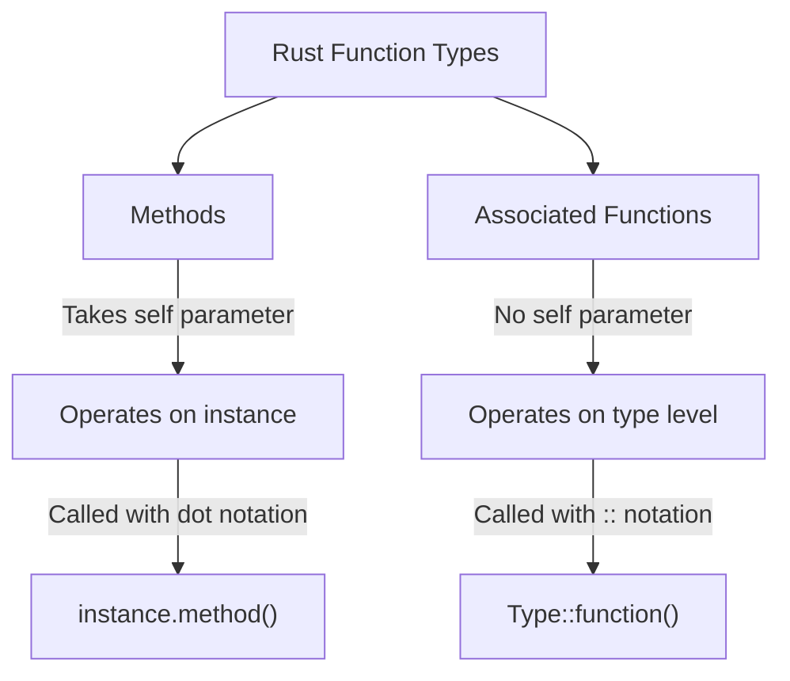

# Rust Associated Functions

## Introduction

In Rust, **associated functions** are functions that are associated with a type rather than with an instance of the type. They're similar to what other programming languages call "static methods" or "class methods." Associated functions provide a way to organize code that belongs conceptually to a type without requiring an instance of that type.

Associated functions are particularly useful for implementing constructors, utility functions, and other operations that conceptually belong to a type but don't need to operate on a specific instance.

## Understanding Associated Functions

### Basics of Associated Functions

In Rust, associated functions are defined within an `impl` block, just like methods. The key difference is that associated functions don't take `self` as their first parameter, meaning they don't operate on a specific instance of the type.

Here's a simple example:

```rust
struct Rectangle {
    width: u32,
    height: u32,
}

impl Rectangle {
    // This is an associated function
    fn new(width: u32, height: u32) -> Rectangle {
        Rectangle { width, height }
    }
    
    // This is a method (not an associated function)
    fn area(&self) -> u32 {
        self.width * self.height
    }
}

fn main() {
    // Calling an associated function using the :: syntax
    let rect = Rectangle::new(10, 5);
    
    // Calling a method using the . syntax
    println!("Area: {}", rect.area());
}
```

Output:
```
Area: 50
```

In this example, `new` is an associated function that creates and returns a new `Rectangle`, while `area` is a method that calculates the area of a specific `Rectangle` instance.

### Syntax for Defining Associated Functions

Associated functions are defined within `impl` blocks. The general syntax is:

```rust
struct TypeName {
    // Fields
}

impl TypeName {
    fn function_name(parameters) -> return_type {
        // Function body
    }
}
```

The key characteristic of an associated function is that it doesn't take `self`, `&self`, or `&mut self` as its first parameter.

## Common Use Cases for Associated Functions

### Constructors

The most common use case for associated functions is implementing constructors. By convention, the primary constructor is often named `new`:

```rust
struct Point {
    x: f64,
    y: f64,
}

impl Point {
    fn new(x: f64, y: f64) -> Point {
        Point { x, y }
    }
    
    // Alternative constructors
    fn origin() -> Point {
        Point { x: 0.0, y: 0.0 }
    }
    
    fn from_tuple(coords: (f64, f64)) -> Point {
        Point { x: coords.0, y: coords.1 }
    }
}

fn main() {
    let point1 = Point::new(5.0, 7.0);
    let point2 = Point::origin();
    let point3 = Point::from_tuple((3.0, 4.0));
    
    println!("Point 1: ({}, {})", point1.x, point1.y);
    println!("Point 2: ({}, {})", point2.x, point2.y);
    println!("Point 3: ({}, {})", point3.x, point3.y);
}
```

Output:
```
Point 1: (5, 7)
Point 2: (0, 0)
Point 3: (3, 4)
```

### Utility Functions

Associated functions can also be used for utility functions that perform operations related to a type but don't need a specific instance:

```rust
struct Number {
    value: i32,
}

impl Number {
    // Utility function to find the maximum of two numbers
    fn max(a: i32, b: i32) -> i32 {
        if a > b { a } else { b }
    }
    
    // Instance method
    fn get_value(&self) -> i32 {
        self.value
    }
}

fn main() {
    // Using the utility function without creating an instance
    let max_value = Number::max(10, 25);
    println!("Maximum value: {}", max_value);
    
    // Creating an instance and using a method
    let num = Number { value: 42 };
    println!("Number value: {}", num.get_value());
}
```

Output:
```
Maximum value: 25
Number value: 42
```

In this example, `max` is an associated function that finds the maximum of two integers. It's related to the `Number` type conceptually but doesn't need to operate on an instance.

## Associated Functions vs. Methods

Let's clarify the difference between associated functions and methods:



Here's a code example that shows both:

```rust
struct Circle {
    radius: f64,
}

impl Circle {
    // Associated function (constructor)
    fn new(radius: f64) -> Circle {
        Circle { radius }
    }
    
    // Associated function (utility)
    fn pi() -> f64 {
        3.14159
    }
    
    // Method (requires an instance)
    fn area(&self) -> f64 {
        Self::pi() * self.radius * self.radius
    }
    
    // Method (modifies the instance)
    fn scale(&mut self, factor: f64) {
        self.radius *= factor;
    }
}

fn main() {
    // Using associated functions
    let mut circle = Circle::new(5.0);
    println!("Pi is approximately: {}", Circle::pi());
    
    // Using methods
    println!("Circle area: {:.2}", circle.area());
    
    circle.scale(2.0);
    println!("Scaled circle area: {:.2}", circle.area());
}
```

Output:
```
Pi is approximately: 3.14159
Circle area: 78.54
Scaled circle area: 314.16
```

Key differences:
- Methods take `self`, `&self`, or `&mut self` as their first parameter
- Associated functions don't have a `self` parameter
- Methods are called with dot notation: `instance.method()`
- Associated functions are called with double colon notation: `Type::function()`

## Practical Examples and Applications

### Example 1: A Simple Vector Library

```rust
struct Vector2D {
    x: f64,
    y: f64,
}

impl Vector2D {
    // Associated function (constructor)
    fn new(x: f64, y: f64) -> Vector2D {
        Vector2D { x, y }
    }
    
    // Associated function (utility)
    fn zero() -> Vector2D {
        Vector2D { x: 0.0, y: 0.0 }
    }
    
    // Associated function (utility)
    fn dot_product(v1: &Vector2D, v2: &Vector2D) -> f64 {
        v1.x * v2.x + v1.y * v2.y
    }
    
    // Method
    fn length(&self) -> f64 {
        (self.x * self.x + self.y * self.y).sqrt()
    }
    
    // Method
    fn normalize(&mut self) {
        let len = self.length();
        if len != 0.0 {
            self.x /= len;
            self.y /= len;
        }
    }
}

fn main() {
    let v1 = Vector2D::new(3.0, 4.0);
    let mut v2 = Vector2D::new(1.0, 2.0);
    
    println!("Length of v1: {}", v1.length());
    
    v2.normalize();
    println!("Normalized v2: ({:.2}, {:.2})", v2.x, v2.y);
    
    let dot = Vector2D::dot_product(&v1, &v2);
    println!("Dot product: {:.2}", dot);
}
```

Output:
```
Length of v1: 5
Normalized v2: (0.45, 0.89)
Dot product: 4.91
```

This example shows a simple vector library that uses both associated functions and methods for different purposes.

### Example 2: A Configuration Manager

```rust
struct Config {
    debug_mode: bool,
    log_level: String,
    max_connections: u32,
}

impl Config {
    // Default constructor
    fn default() -> Config {
        Config {
            debug_mode: false,
            log_level: String::from("info"),
            max_connections: 100,
        }
    }
    
    // Custom constructor for development
    fn development() -> Config {
        Config {
            debug_mode: true,
            log_level: String::from("debug"),
            max_connections: 10,
        }
    }
    
    // Custom constructor for production
    fn production() -> Config {
        Config {
            debug_mode: false,
            log_level: String::from("warn"),
            max_connections: 1000,
        }
    }
    
    // Method to display configuration
    fn display(&self) {
        println!("Configuration:");
        println!("  Debug Mode: {}", self.debug_mode);
        println!("  Log Level: {}", self.log_level);
        println!("  Max Connections: {}", self.max_connections);
    }
}

fn main() {
    let default_config = Config::default();
    let dev_config = Config::development();
    let prod_config = Config::production();
    
    println!("Default configuration:");
    default_config.display();
    
    println!("
Development configuration:");
    dev_config.display();
    
    println!("
Production configuration:");
    prod_config.display();
}
```

Output:
```
Default configuration:
Configuration:
  Debug Mode: false
  Log Level: info
  Max Connections: 100

Development configuration:
Configuration:
  Debug Mode: true
  Log Level: debug
  Max Connections: 10

Production configuration:
Configuration:
  Debug Mode: false
  Log Level: warn
  Max Connections: 1000
```

This example demonstrates how associated functions can be used to create different types of configurations for different environments.

## Associated Functions in Standard Library Types

Many standard library types in Rust use associated functions:

```rust
fn main() {
    // String associated functions
    let s1 = String::new();
    let s2 = String::from("Hello, Rust!");
    
    // Vec associated functions
    let v1 = Vec::<i32>::new();
    let v2 = vec![1, 2, 3, 4, 5];  // Uses the vec! macro, but illustrates the concept
    
    // Option associated functions
    let o1 = Option::<i32>::None;
    let o2 = Some(42);
    
    println!("String examples: {} and {}", s1, s2);
    println!("Vec len: {} and {}", v1.len(), v2.len());
    println!("Option is_some: {} and {}", o1.is_some(), o2.is_some());
}
```

Output:
```
String examples:  and Hello, Rust!
Vec len: 0 and 5
Option is_some: false and true
```

## Best Practices

Here are some best practices to follow when using associated functions:

1. **Use `new` for the primary constructor**: By convention, the main constructor is typically named `new`.

2. **Descriptive names for alternative constructors**: If you provide multiple ways to create an instance, use descriptive names like `from_str`, `with_capacity`, etc.

3. **Use associated functions for operations that don't need an instance**: If a function conceptually belongs to a type but doesn't operate on a specific instance, make it an associated function.

4. **Use methods for operations on instances**: If a function needs to access or modify a specific instance, make it a method.

5. **Use `Self` for return types**: Within an `impl` block, you can use `Self` as an alias for the type name:

```rust
impl Rectangle {
    fn square(size: u32) -> Self {
        Self {
            width: size,
            height: size,
        }
    }
}
```

## Summary

Associated functions in Rust provide a way to organize code that belongs conceptually to a type but doesn't operate on a specific instance. They are particularly useful for constructors, utility functions, and other type-level operations.

Key points to remember:

1. Associated functions are defined within `impl` blocks but don't take `self` as a parameter
2. They are called using the `::` syntax: `Type::function()`
3. Common use cases include constructors and utility functions
4. The primary constructor is conventionally named `new`
5. Methods operate on instances, while associated functions operate at the type level

Associated functions help create well-structured, intuitive APIs that make code more readable and maintainable.

## Exercises

1. **Basic Exercise**: Create a `Temperature` struct with associated functions to convert between Celsius and Fahrenheit.

2. **Intermediate Exercise**: Implement a `BankAccount` struct with associated functions for creating different types of accounts (savings, checking) and methods for deposit and withdrawal.

3. **Advanced Exercise**: Build a `Matrix` struct with associated functions for creating identity and zero matrices, as well as methods for matrix operations like addition and multiplication.

## Additional Resources

- [The Rust Programming Language Book - Methods](https://doc.rust-lang.org/book/ch05-03-method-syntax.html)
- [Rust By Example - Methods](https://doc.rust-lang.org/rust-by-example/fn/methods.html)
- [Rust Standard Library Documentation](https://doc.rust-lang.org/std/)