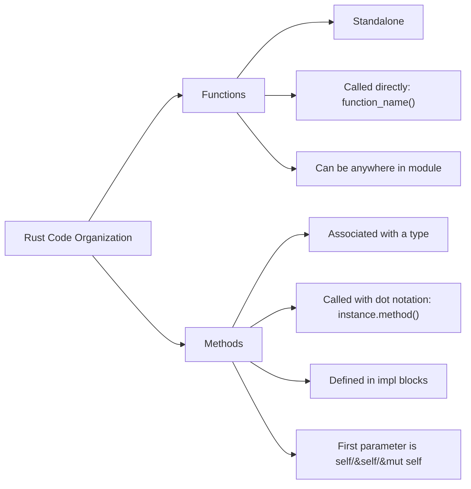

# Rust Method Syntax

## Introduction

Methods in Rust are similar to functions but are associated with a specific data type. They provide a way to organize code, improve readability, and implement behavior specific to a particular type. If you're familiar with object-oriented programming languages, you'll find some similarities in how Rust implements methods, although with Rust's unique approach to ownership and borrowing.

In this guide, we'll explore how to define and use methods in Rust, understand their relationship with functions, and discover practical applications of methods in real-world Rust programming.

## What Are Methods in Rust?

Methods are functions that are associated with a particular type, often called the "receiver" type. Unlike standalone functions, methods:

1. Are defined within the context of a type (like a struct or enum)
2. Always take `self` (in some form) as their first parameter
3. Are called using dot notation (`instance.method()`)

Methods help organize code by grouping functionality that belongs to a specific type, making your code more modular and easier to understand.

## Defining Methods in Rust

In Rust, methods are defined within an `impl` (implementation) block. Here's the basic syntax:

```rust
struct Rectangle {
    width: u32,
    height: u32,
}

impl Rectangle {
    // Method that calculates area
    fn area(&self) -> u32 {
        self.width * self.height
    }
}

fn main() {
    let rect = Rectangle { width: 30, height: 50 };
    
    println!("The area of the rectangle is {} square pixels.", rect.area());
}
```

**Output:**
```
The area of the rectangle is 1500 square pixels.
```

Let's break down what's happening here:

1. We define a `Rectangle` struct with `width` and `height` fields
2. We create an `impl` block for the `Rectangle` type
3. Inside the block, we define the `area` method that calculates and returns the rectangle's area
4. In `main()`, we create a rectangle instance and call the `area` method using dot notation

## Understanding `self`, `&self`, and `&mut self`

The first parameter of a method is always related to `self`, which represents the instance of the type the method is being called on. There are three main variations:

1. `self` - Takes ownership of the instance (rare)
2. `&self` - Borrows the instance immutably (most common)
3. `&mut self` - Borrows the instance mutably

Here's an example showing all three:

```rust
struct Counter {
    count: u32,
}

impl Counter {
    // Constructor (not a method, but an associated function)
    fn new() -> Counter {
        Counter { count: 0 }
    }
    
    // Immutable borrow - just reads data
    fn get_count(&self) -> u32 {
        self.count
    }
    
    // Mutable borrow - modifies data
    fn increment(&mut self) {
        self.count += 1;
    }
    
    // Takes ownership - consumes the instance
    fn reset(self) -> Counter {
        Counter { count: 0 }
    }
}

fn main() {
    // Create a new Counter
    let mut counter = Counter::new();
    
    // Use the increment method
    counter.increment();
    counter.increment();
    
    // Read the current count
    println!("Current count: {}", counter.get_count());
    
    // Reset the counter (this consumes the original counter)
    let counter = counter.reset();
    
    println!("Count after reset: {}", counter.get_count());
}
```

**Output:**
```
Current count: 2
Count after reset: 0
```

### When to Use Each Type of `self`

- Use `&self` when you only need to read data from the instance
- Use `&mut self` when you need to modify data in the instance
- Use `self` when the method consumes the instance (typically for transformations that return a new value)

## Associated Functions

In addition to methods that operate on an instance of a type, Rust allows you to define "associated functions" that don't take `self` as a parameter. These are still defined in an `impl` block but are called using the `::` syntax instead of dot notation.

The most common example is the `new` function used as a constructor:

```rust
struct Point {
    x: f64,
    y: f64,
}

impl Point {
    // Associated function (not a method)
    fn new(x: f64, y: f64) -> Point {
        Point { x, y }
    }
    
    // Method that calculates distance from origin
    fn distance_from_origin(&self) -> f64 {
        (self.x.powi(2) + self.y.powi(2)).sqrt()
    }
}

fn main() {
    // Using the associated function
    let point = Point::new(3.0, 4.0);
    
    // Using a method
    println!("Distance from origin: {}", point.distance_from_origin());
}
```

**Output:**
```
Distance from origin: 5
```

Associated functions are often used for constructors or utility functions related to the type but that don't operate on a specific instance.

## Method Chaining

One powerful pattern in Rust is method chaining, where methods return `self` to allow multiple method calls in sequence:

```rust
struct Builder {
    value: String,
}

impl Builder {
    fn new() -> Self {
        Builder { value: String::new() }
    }
    
    fn add_part(&mut self, part: &str) -> &mut Self {
        self.value.push_str(part);
        self
    }
    
    fn build(&self) -> String {
        self.value.clone()
    }
}

fn main() {
    let result = Builder::new()
        .add_part("Hello, ")
        .add_part("Rust ")
        .add_part("methods!")
        .build();
    
    println!("Built string: {}", result);
}
```

**Output:**
```
Built string: Hello, Rust methods!
```

This pattern is commonly seen in Rust's standard library and many Rust crates, as it provides a concise and readable way to perform multiple operations in sequence.

## Methods on Enums

Methods can be implemented for enums just as they can for structs:

```rust
enum Message {
    Quit,
    Move { x: i32, y: i32 },
    Write(String),
    ChangeColor(i32, i32, i32),
}

impl Message {
    fn call(&self) {
        match self {
            Message::Quit => println!("Quitting"),
            Message::Move { x, y } => println!("Moving to position ({}, {})", x, y),
            Message::Write(text) => println!("Writing message: {}", text),
            Message::ChangeColor(r, g, b) => println!("Changing color to RGB({}, {}, {})", r, g, b),
        }
    }
}

fn main() {
    let messages = [
        Message::Quit,
        Message::Move { x: 10, y: 20 },
        Message::Write(String::from("Hello")),
        Message::ChangeColor(255, 0, 0),
    ];
    
    for message in &messages {
        message.call();
    }
}
```

**Output:**
```
Quitting
Moving to position (10, 20)
Writing message: Hello
Changing color to RGB(255, 0, 0)
```

## Visual Representation of Methods vs Functions

Here's a diagram that illustrates the difference between methods and functions in Rust:



## Real-World Example: Custom String Type

Let's create a practical example of a custom string type with methods for common operations:

```rust
struct MyString {
    content: String,
}

impl MyString {
    fn new(s: &str) -> MyString {
        MyString { content: s.to_string() }
    }
    
    fn len(&self) -> usize {
        self.content.len()
    }
    
    fn is_empty(&self) -> bool {
        self.content.is_empty()
    }
    
    fn to_uppercase(&self) -> MyString {
        MyString { content: self.content.to_uppercase() }
    }
    
    fn append(&mut self, s: &str) -> &mut Self {
        self.content.push_str(s);
        self
    }
    
    fn clear(&mut self) {
        self.content.clear();
    }
    
    fn as_str(&self) -> &str {
        &self.content
    }
}

fn main() {
    // Create a new MyString
    let mut s = MyString::new("Hello");
    
    // Use various methods
    println!("Original string: {}", s.as_str());
    println!("Length: {}", s.len());
    println!("Is empty? {}", s.is_empty());
    
    // Chain method calls
    s.append(", ").append("World!");
    println!("After appending: {}", s.as_str());
    
    // Create a new string by transformation
    let upper = s.to_uppercase();
    println!("Uppercase: {}", upper.as_str());
    
    // Modify the original string
    s.clear();
    println!("After clearing: '{}' (length: {})", s.as_str(), s.len());
}
```

**Output:**
```
Original string: Hello
Length: 5
Is empty? false
After appending: Hello, World!
Uppercase: HELLO, WORLD!
After clearing: '' (length: 0)
```

This example demonstrates many common patterns for implementing methods in Rust, including:
- A constructor (`new`)
- Methods that borrow immutably (`len`, `is_empty`, etc.)
- Methods that borrow mutably (`append`, `clear`)
- Methods that transform the data and return a new instance (`to_uppercase`)
- Method chaining (`append`)

## Methods vs Functions: When to Use Each

While methods and functions in Rust serve similar purposes, choosing between them depends on your specific needs:

| Use Methods When | Use Functions When |
|------------------|-------------------|
| Functionality is tied to a specific type | Functionality is generic or independent |
| You want to use dot notation | The operation spans multiple types |
| You're implementing behavior for your own types | You're writing utility functions |
| You want to take advantage of method chaining | The function doesn't conceptually belong to any type |

## Summary

Rust's method syntax provides a powerful way to organize code around data types while respecting Rust's ownership and borrowing rules. Methods help create more readable, modular, and maintainable code by grouping related functionality together.

Key points to remember:
- Methods are defined in `impl` blocks and associated with a specific type
- The first parameter is always related to `self` (`self`, `&self`, or `&mut self`)
- Associated functions don't take `self` and are called using `::` notation
- Method chaining allows for fluent APIs
- Methods can be defined on any type, including structs and enums

## Exercises

1. Create a `Circle` struct with a radius field and implement methods to calculate its area and circumference.

2. Implement a `Stack<T>` struct with methods `push`, `pop`, and `peek`.

3. Define an enum `Shape` with variants for `Circle`, `Rectangle`, and `Triangle`, then implement a method to calculate the area of any shape.

4. Create a `Calculator` struct that maintains a running total and implements methods for addition, subtraction, multiplication, and division, using method chaining.

5. Implement a simple `StringBuilder` with methods for adding strings and converting to a final string, optimizing for multiple string concatenations.

## Additional Resources

- [Rust Book: Method Syntax](https://doc.rust-lang.org/book/ch05-03-method-syntax.html)
- [Rust by Example: Methods](https://doc.rust-lang.org/rust-by-example/fn/methods.html)
- [The Rustonomicon](https://doc.rust-lang.org/nomicon/) - For advanced understanding of Rust
- [Rust Standard Library Documentation](https://doc.rust-lang.org/std/) - To see methods in action