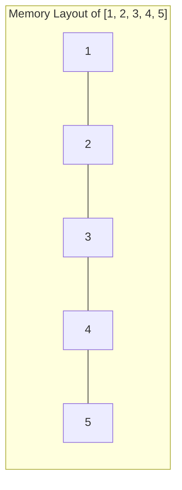

# Rust Arrays

## Introduction

Arrays are one of the most fundamental compound data types in Rust. An array is a fixed-size collection of elements, all having the same data type. Unlike dynamic collections like vectors, the size of an array must be known at compile time and cannot change during program execution.

Arrays are useful when you need a collection with a specific, unchanging number of elements, such as representing the days of the week, months in a year, or coordinates in a fixed-dimensional space.

## Array Basics

### Creating Arrays

In Rust, you can create an array by enclosing elements in square brackets `[ ]`:

```rust
// An array of 5 integers
let numbers = [1, 2, 3, 4, 5];

// An array of 3 strings
let fruits = ["apple", "banana", "cherry"];
```

You can also explicitly specify the type and size of an array using the syntax `[type; size]`:

```rust
// An array of 5 integers (i32)
let numbers: [i32; 5] = [1, 2, 3, 4, 5];

// An array of 3 strings (&str)
let fruits: [&str; 3] = ["apple", "banana", "cherry"];
```

### Creating Arrays with Default Values

Rust provides a convenient syntax for creating arrays filled with the same value:

```rust
// Create an array of 5 elements, all initialized to 0
let zeros = [0; 5]; // [0, 0, 0, 0, 0]

// Create an array of 3 elements, all initialized to "unknown"
let unknowns = ["unknown"; 3]; // ["unknown", "unknown", "unknown"]
```

## Accessing Array Elements

### Array Indexing

You can access individual elements in an array using the index notation `array[index]`. Remember that array indices in Rust start at 0:

```rust
let numbers = [10, 20, 30, 40, 50];

let first = numbers[0]; // 10
let third = numbers[2]; // 30

println!("First number: {}", first);
println!("Third number: {}", third);
```

Output:
```
First number: 10
Third number: 30
```

### Bounds Checking

Rust performs bounds checking at runtime when you access array elements. If you try to access an index that is out of bounds, the program will panic:

```rust
let numbers = [1, 2, 3, 4, 5];

// This will compile but panic at runtime
// let beyond_bounds = numbers[10]; // panic: index out of bounds
```

### Using `get` Method

For safer access, you can use the `get` method which returns an `Option<&T>` instead of panicking:

```rust
let numbers = [1, 2, 3, 4, 5];

match numbers.get(2) {
    Some(value) => println!("Element at index 2: {}", value),
    None => println!("Index out of bounds"),
}

match numbers.get(10) {
    Some(value) => println!("Element at index 10: {}", value),
    None => println!("Index out of bounds"),
}
```

Output:
```
Element at index 2: 3
Index out of bounds
```

## Array Properties

### Array Length

You can find the length of an array using the `len()` method:

```rust
let numbers = [1, 2, 3, 4, 5];
println!("Array length: {}", numbers.len());
```

Output:
```
Array length: 5
```

### Array Type Notation

The type of an array is written as `[T; N]` where `T` is the element type and `N` is the length:

```rust
// Type annotation for an array of 5 i32 values
let numbers: [i32; 5] = [1, 2, 3, 4, 5];

// Function that takes an array of 3 f64 values
fn process_coordinates(coords: [f64; 3]) {
    // Function body
}
```

## Iterating Over Arrays

### Using a for Loop

You can iterate through all elements of an array using a `for` loop:

```rust
let numbers = [10, 20, 30, 40, 50];

println!("Array elements:");
for number in numbers {
    println!("{}", number);
}
```

Output:
```
Array elements:
10
20
30
40
50
```

### Iterating with Indices

If you need both the index and value during iteration, you can use the `enumerate()` method:

```rust
let fruits = ["apple", "banana", "cherry"];

println!("Fruits with indices:");
for (index, fruit) in fruits.iter().enumerate() {
    println!("{}. {}", index + 1, fruit);
}
```

Output:
```
Fruits with indices:
1. apple
2. banana
3. cherry
```

## Modifying Arrays

### Mutability

By default, arrays in Rust are immutable. To modify an array after creation, you need to declare it as mutable using the `mut` keyword:

```rust
let mut scores = [0, 0, 0, 0, 0];

scores[0] = 10;
scores[1] = 20;
scores[2] = 30;

println!("Updated scores: {:?}", scores);
```

Output:
```
Updated scores: [10, 20, 30, 0, 0]
```

### Updating Multiple Elements

You can update multiple elements using various methods:

```rust
let mut values = [1, 2, 3, 4, 5];

// Update using iteration
for value in &mut values[2..4] {
    *value *= 10;
}

println!("After update: {:?}", values);
```

Output:
```
After update: [1, 2, 30, 40, 5]
```

## Arrays and Functions

### Passing Arrays to Functions

You can pass arrays to functions. The function receives a copy of the array (if the array type implements the `Copy` trait) or a reference to it:

```rust
fn sum_array(arr: [i32; 5]) -> i32 {
    let mut sum = 0;
    for value in arr {
        sum += value;
    }
    sum
}

fn print_array(arr: &[i32; 5]) {
    println!("Array elements: {:?}", arr);
}

fn main() {
    let numbers = [1, 2, 3, 4, 5];
    
    println!("Sum of array: {}", sum_array(numbers));
    print_array(&numbers);
}
```

Output:
```
Sum of array: 15
Array elements: [1, 2, 3, 4, 5]
```

### Returning Arrays from Functions

Functions can also return arrays:

```rust
fn create_countdown() -> [i32; 5] {
    [5, 4, 3, 2, 1]
}

fn main() {
    let countdown = create_countdown();
    println!("Countdown: {:?}", countdown);
}
```

Output:
```
Countdown: [5, 4, 3, 2, 1]
```

## Array Slices

Arrays and slices are closely related in Rust. A slice is a view into a contiguous sequence of elements in a collection, like an array:

```rust
let numbers = [1, 2, 3, 4, 5];

// Create a slice referencing a portion of the array
let slice = &numbers[1..4];

println!("Slice: {:?}", slice);
```

Output:
```
Slice: [2, 3, 4]
```

Slices are particularly useful for functions that need to operate on portions of arrays or different sized arrays:

```rust
// This function works with slices of any size
fn sum_slice(slice: &[i32]) -> i32 {
    let mut sum = 0;
    for &value in slice {
        sum += value;
    }
    sum
}

fn main() {
    let numbers = [1, 2, 3, 4, 5];
    
    println!("Sum of entire array: {}", sum_slice(&numbers));
    println!("Sum of first three elements: {}", sum_slice(&numbers[0..3]));
    println!("Sum of last two elements: {}", sum_slice(&numbers[3..]));
}
```

Output:
```
Sum of entire array: 15
Sum of first three elements: 6
Sum of last two elements: 9
```

## Memory Layout

Arrays in Rust are stored in contiguous memory, which makes them efficient for accessing elements. Each element occupies the same amount of memory based on its data type.



This contiguous layout means:
1. Accessing any element takes constant time (O(1))
2. Elements are stored next to each other in memory
3. The entire array can be efficiently passed to and from functions

## Practical Examples

### Example 1: Temperature Tracking

Let's create a program that tracks daily temperatures for a week:

```rust
fn main() {
    let week_days = ["Monday", "Tuesday", "Wednesday", "Thursday", "Friday", "Saturday", "Sunday"];
    let temperatures = [22.5, 23.0, 21.8, 20.5, 24.2, 25.0, 23.8];
    
    println!("Weekly Temperature Report:");
    
    // Calculate average temperature
    let mut sum = 0.0;
    for &temp in &temperatures {
        sum += temp;
    }
    let average = sum / temperatures.len() as f64;
    
    // Find highest and lowest temperatures
    let mut highest = temperatures[0];
    let mut lowest = temperatures[0];
    let mut highest_day = week_days[0];
    let mut lowest_day = week_days[0];
    
    for i in 1..temperatures.len() {
        if temperatures[i] > highest {
            highest = temperatures[i];
            highest_day = week_days[i];
        }
        if temperatures[i] < lowest {
            lowest = temperatures[i];
            lowest_day = week_days[i];
        }
    }
    
    // Print report
    for i in 0..week_days.len() {
        println!("{}: {:.1}°C", week_days[i], temperatures[i]);
    }
    
    println!("
Summary:");
    println!("Average temperature: {:.1}°C", average);
    println!("Highest temperature: {:.1}°C on {}", highest, highest_day);
    println!("Lowest temperature: {:.1}°C on {}", lowest, lowest_day);
}
```

Output:
```
Weekly Temperature Report:
Monday: 22.5°C
Tuesday: 23.0°C
Wednesday: 21.8°C
Thursday: 20.5°C
Friday: 24.2°C
Saturday: 25.0°C
Sunday: 23.8°C

Summary:
Average temperature: 23.0°C
Highest temperature: 25.0°C on Saturday
Lowest temperature: 20.5°C on Thursday
```

### Example 2: Simple Game Board

Let's implement a simple tic-tac-toe board using a 2D array:

```rust
fn main() {
    // Create a 3x3 tic-tac-toe board
    // ' ' for empty, 'X' for player 1, 'O' for player 2
    let mut board = [[' '; 3]; 3];
    
    // Make some moves
    board[0][0] = 'X';
    board[1][1] = 'X';
    board[0][2] = 'O';
    board[2][0] = 'O';
    
    // Print the board
    println!("Current board state:");
    print_board(&board);
}

fn print_board(board: &[[char; 3]; 3]) {
    println!("  0 1 2");
    for (i, row) in board.iter().enumerate() {
        print!("{} ", i);
        for cell in row {
            print!("{} ", cell);
        }
        println!();
    }
}
```

Output:
```
Current board state:
  0 1 2
0 X   O 
1   X   
2 O     
```

## Arrays vs. Vectors

While arrays are fixed-size collections, vectors (`Vec<T>`) are dynamic collections whose size can change during runtime. Here's a quick comparison:

| Feature | Arrays | Vectors |
|---------|--------|---------|
| Size | Fixed at compile time | Dynamic, can grow or shrink |
| Declaration | `let arr: [T; N] = [...]` | `let vec: Vec<T> = vec![...]` |
| Memory | Stack (small arrays) | Heap |
| Performance | Slightly faster | Slightly more overhead |
| Use case | When size is known and fixed | When size might change |

Choose arrays when you know the exact number of elements you need and that number won't change. Use vectors when the collection size might change or isn't known at compile time.

## Summary

Arrays in Rust provide a powerful way to work with fixed-size collections of elements. They offer several advantages:

- Efficient, contiguous memory layout
- Compile-time size checking
- Type safety for all elements
- Direct, constant-time access to any element

Key points to remember:
1. Arrays have a fixed size that must be known at compile time
2. All elements must be of the same type
3. Array indices start at 0
4. Rust performs bounds checking to prevent memory access errors
5. Arrays can be passed to and returned from functions
6. Use array slices when you need to work with portions of arrays

## Exercises

1. **Basic Array Operations**
   Create an array of 10 integers, fill it with the first 10 square numbers (1, 4, 9, ...), then calculate and print their sum.

2. **Temperature Converter**
   Create an array of Celsius temperatures, then write a function that converts it to an array of Fahrenheit temperatures.

3. **Matrix Operations**
   Implement a function that adds two 3x3 matrices (represented as arrays of arrays) and returns the result.

4. **Array Filtering**
   Write a function that takes an array of integers and returns a new array containing only the even numbers.

5. **Data Analysis**
   Given an array of test scores (0-100), write a program that calculates the average, median, and standard deviation.

## Additional Resources

- [Rust Book - Arrays and Slices](https://doc.rust-lang.org/book/ch04-03-slices.html)
- [Rust by Example - Arrays](https://doc.rust-lang.org/rust-by-example/primitives/array.html)
- [Rust Standard Library - Array Documentation](https://doc.rust-lang.org/std/primitive.array.html)
- [Rust Playground](https://play.rust-lang.org/) - Test your array code online