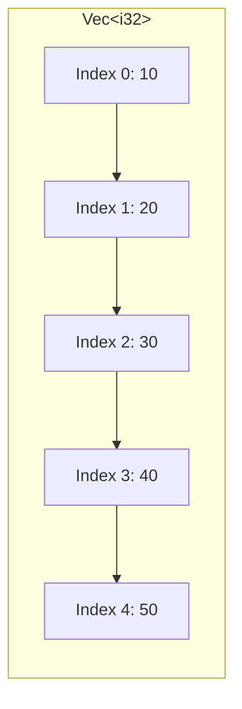

# Rust Vectors

## Introduction

A vector in Rust, represented by the `Vec<T>` type, is one of the most versatile and commonly used collection types in the language. Vectors allow you to store multiple values of the same type in a single data structure that can grow or shrink in size during program execution.

Unlike arrays, which have a fixed size determined at compile time, vectors can dynamically adjust their capacity as elements are added or removed. This flexibility makes vectors an essential tool in many Rust programs.

In this tutorial, we'll explore what vectors are, how to create and manipulate them, and examine some practical use cases where vectors shine.

## What is a Vector?

A vector is a resizable array-like collection that stores elements of the same type contiguously in memory. The key characteristics of vectors are:

- **Dynamic sizing**: Can grow or shrink at runtime
- **Contiguous memory**: All elements are stored next to each other in memory
- **Same-type elements**: All elements must be of the same type
- **Heap allocation**: Vectors are stored on the heap, not the stack
- **Index-based access**: Elements can be accessed by their numeric index (starting from 0)

Here's a visual representation of a vector:



## Creating Vectors

There are multiple ways to create vectors in Rust:

### Using the `Vec::new()` method

```rust
// Create an empty vector that can hold integers
let v: Vec<i32> = Vec::new();
```

When using `Vec::new()`, you often need to provide a type annotation (as shown above) because Rust can't determine what type of elements the vector will hold until you add values.

### Using the `vec!` macro

The `vec!` macro offers a more concise way to create vectors with initial values:

```rust
// Create a vector with initial values
let v = vec![1, 2, 3, 4, 5];
```

With the `vec!` macro, the type annotation is usually optional because Rust can infer the element type from the provided values.

### Example

```rust
fn main() {
    // Empty vector that will store integers
    let mut v1: Vec<i32> = Vec::new();
    
    // Vector initialized with values
    let v2 = vec![1, 2, 3];
    
    println!("v1: {:?}", v1);
    println!("v2: {:?}", v2);
    
    // Add elements to v1
    v1.push(10);
    v1.push(20);
    v1.push(30);
    
    println!("v1 after adding elements: {:?}", v1);
}
```

Output:
```
v1: []
v2: [1, 2, 3]
v1 after adding elements: [10, 20, 30]
```

## Modifying Vectors

Vectors provide several methods to add, remove, and modify elements:

### Adding elements

To add elements to a vector, you need to declare it as mutable using the `mut` keyword:

```rust
fn main() {
    let mut v = Vec::new();
    
    // Add elements one at a time
    v.push(5);
    v.push(6);
    v.push(7);
    v.push(8);
    
    println!("Vector after pushing: {:?}", v);
}
```

Output:
```
Vector after pushing: [5, 6, 7, 8]
```

### Removing elements

You can remove elements from a vector using methods like `pop()` or `remove()`:

```rust
fn main() {
    let mut v = vec![1, 2, 3, 4, 5];
    
    // Remove and return the last element
    let last = v.pop();
    println!("Popped value: {:?}", last);
    println!("Vector after pop: {:?}", v);
    
    // Remove element at index 1
    let second = v.remove(1);
    println!("Removed value at index 1: {}", second);
    println!("Vector after remove: {:?}", v);
}
```

Output:
```
Popped value: Some(5)
Vector after pop: [1, 2, 3, 4]
Removed value at index 1: 2
Vector after remove: [1, 3, 4]
```

## Accessing Vector Elements

You can access vector elements in two primary ways:

### Using indexing syntax

```rust
fn main() {
    let v = vec![10, 20, 30, 40, 50];
    
    // Access using index (will panic if index is out of bounds)
    let third_element = &v[2];
    println!("The third element is {}", third_element);
    
    // This would cause a panic (uncomment to see):
    // let does_not_exist = &v[100];
}
```

Output:
```
The third element is 30
```

### Using the `get` method

The `get` method returns an `Option<&T>`, which handles out-of-bounds access more gracefully:

```rust
fn main() {
    let v = vec![10, 20, 30, 40, 50];
    
    // Access using get method (returns Option)
    match v.get(2) {
        Some(element) => println!("The third element is {}", element),
        None => println!("There is no third element."),
    }
    
    // Safer way to handle non-existent elements
    match v.get(100) {
        Some(element) => println!("Element at index 100 is {}", element),
        None => println!("There is no element at index 100."),
    }
}
```

Output:
```
The third element is 30
There is no element at index 100.
```

## Iterating Over Vectors

Vectors can be iterated over in various ways:

### Immutable iteration

```rust
fn main() {
    let v = vec![100, 200, 300];
    
    // Iterate over immutable references
    for element in &v {
        println!("Element: {}", element);
    }
}
```

Output:
```
Element: 100
Element: 200
Element: 300
```

### Mutable iteration

```rust
fn main() {
    let mut v = vec![100, 200, 300];
    
    // Iterate over mutable references
    for element in &mut v {
        *element += 50; // Dereference to modify the actual value
    }
    
    println!("Modified vector: {:?}", v);
}
```

Output:
```
Modified vector: [150, 250, 350]
```

### With enumeration

```rust
fn main() {
    let v = vec!["apple", "banana", "cherry"];
    
    // Iterate with indices
    for (index, fruit) in v.iter().enumerate() {
        println!("Fruit {} is at index {}", fruit, index);
    }
}
```

Output:
```
Fruit apple is at index 0
Fruit banana is at index 1
Fruit cherry is at index 2
```

## Vectors with Different Types

Vectors can only store elements of the same type, but we can use enums to store different types in a single vector:

```rust
fn main() {
    enum SpreadsheetCell {
        Int(i32),
        Float(f64),
        Text(String),
    }
    
    let row = vec![
        SpreadsheetCell::Int(3),
        SpreadsheetCell::Text(String::from("blue")),
        SpreadsheetCell::Float(10.12),
    ];
    
    // Process different types using match
    for cell in &row {
        match cell {
            SpreadsheetCell::Int(i) => println!("Integer: {}", i),
            SpreadsheetCell::Float(f) => println!("Float: {}", f),
            SpreadsheetCell::Text(s) => println!("Text: {}", s),
        }
    }
}
```

Output:
```
Integer: 3
Text: blue
Float: 10.12
```

## Vectors and Ownership

Understanding how vectors interact with Rust's ownership system is crucial:

```rust
fn main() {
    let mut v = vec![1, 2, 3, 4, 5];
    
    // Reference to the first element
    let first = &v[0];
    
    // This would cause a compile-time error:
    // v.push(6);
    // println!("First element: {}", first);
    
    // Because we can't have mutable and immutable references at the same time
    println!("First element: {}", first);
    
    // Now it's safe to modify the vector
    v.push(6);
    println!("Vector after push: {:?}", v);
}
```

Output:
```
First element: 1
Vector after push: [1, 2, 3, 4, 5, 6]
```

## Practical Examples

### Example 1: Calculating Statistics

```rust
fn main() {
    let numbers = vec![43, 67, 32, 98, 51, 28, 75];
    
    // Calculate sum
    let sum: i32 = numbers.iter().sum();
    
    // Calculate average
    let average = sum as f64 / numbers.len() as f64;
    
    // Find minimum and maximum
    let min = numbers.iter().min().unwrap();
    let max = numbers.iter().max().unwrap();
    
    println!("Numbers: {:?}", numbers);
    println!("Sum: {}", sum);
    println!("Average: {:.2}", average);
    println!("Minimum: {}", min);
    println!("Maximum: {}", max);
}
```

Output:
```
Numbers: [43, 67, 32, 98, 51, 28, 75]
Sum: 394
Average: 56.29
Minimum: 28
Maximum: 98
```

### Example 2: Text Processing

```rust
fn main() {
    let text = "Rust is a fast and reliable programming language";
    
    // Split into words and collect into a vector
    let words: Vec<&str> = text.split_whitespace().collect();
    
    println!("Words in text: {:?}", words);
    println!("Number of words: {}", words.len());
    
    // Filter words longer than 4 characters
    let long_words: Vec<&&str> = words.iter()
        .filter(|word| word.len() > 4)
        .collect();
    
    println!("Words longer than 4 characters: {:?}", long_words);
    
    // Sort words by length
    let mut word_lengths: Vec<(&str, usize)> = words.iter()
        .map(|&word| (word, word.len()))
        .collect();
    
    word_lengths.sort_by_key(|&(_, length)| length);
    
    println!("Words sorted by length:");
    for (word, length) in word_lengths {
        println!("{}: {} characters", word, length);
    }
}
```

Output:
```
Words in text: ["Rust", "is", "a", "fast", "and", "reliable", "programming", "language"]
Number of words: 8
Words longer than 4 characters: ["reliable", "programming", "language"]
Words sorted by length:
a: 1 characters
is: 2 characters
and: 3 characters
Rust: 4 characters
fast: 4 characters
language: 8 characters
reliable: 8 characters
programming: 11 characters
```

## Vector Performance Considerations

When working with vectors, it's important to understand how they manage memory:

- **Capacity vs. Length**: A vector's capacity is how much memory it has allocated, while its length is how many elements it currently contains.
- **Reallocation**: When a vector's length exceeds its capacity, it allocates a new, larger chunk of memory, copies all elements over, and frees the old memory.
- **Pre-allocation**: For better performance, you can pre-allocate capacity using `Vec::with_capacity()`.

```rust
fn main() {
    // Vector without pre-allocation
    let mut v1 = Vec::new();
    
    // Vector with pre-allocation
    let mut v2 = Vec::with_capacity(10);
    
    // Add elements
    for i in 0..10 {
        v1.push(i);
        v2.push(i);
    }
    
    println!("v1 length: {}, capacity: {}", v1.len(), v1.capacity());
    println!("v2 length: {}, capacity: {}", v2.len(), v2.capacity());
}
```

Output:
```
v1 length: 10, capacity: 16
v2 length: 10, capacity: 10
```

## Summary

Vectors are an essential collection type in Rust that provide flexible, dynamically-sized storage for elements of the same type. Key points to remember:

- Vectors can grow or shrink at runtime, unlike arrays which have fixed sizes
- All elements in a vector must be of the same type
- Vectors provide methods for adding, removing, and accessing elements
- Rust's ownership and borrowing rules apply to vectors
- Vectors can be iterated over using various techniques
- Understanding vector memory management helps write more efficient code

With their flexibility and ease of use, vectors are one of the most commonly used data structures in Rust programming. They provide a good balance between performance and flexibility, making them suitable for a wide range of applications.

## Exercises

1. Create a function that takes a vector of integers and returns a new vector containing only the even numbers.
2. Write a program that reads a text file and counts the frequency of each word, storing the results in a vector of tuples.
3. Implement a simple to-do list application that stores tasks in a vector and allows adding, removing, and marking tasks as complete.
4. Create a function that takes two sorted vectors and merges them into a single sorted vector.
5. Write a program that uses vectors to implement a simple stack data structure with push and pop operations.

## Additional Resources

- [Rust Book: Vectors](https://doc.rust-lang.org/book/ch08-01-vectors.html)
- [Rust Standard Library: Vec](https://doc.rust-lang.org/std/vec/struct.Vec.html)
- [Rust By Example: Vectors](https://doc.rust-lang.org/rust-by-example/std/vec.html)