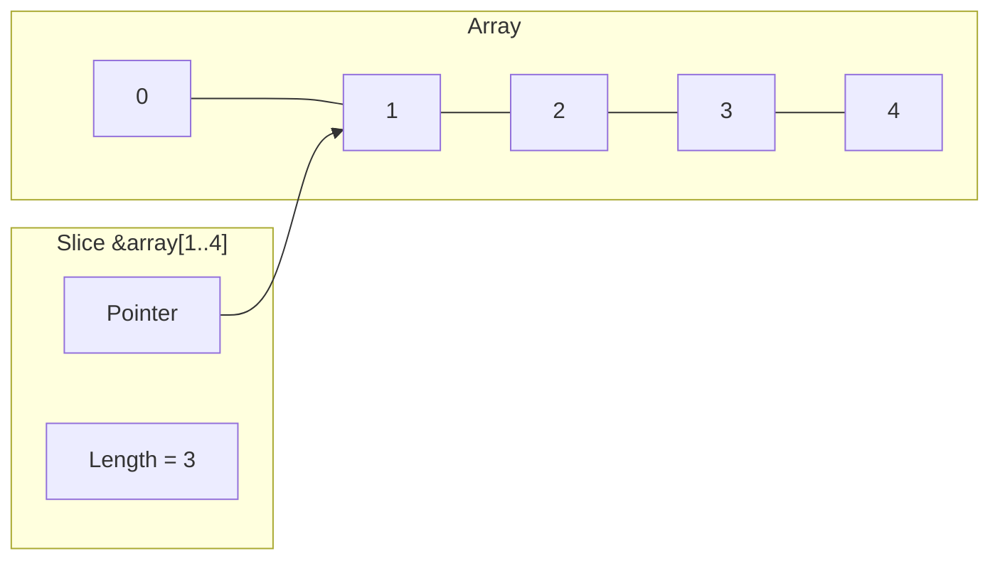

# Rust Slices

## Introduction

In Rust, a **slice** is a reference to a contiguous sequence of elements in a collection, such as an array or a string. Slices are incredibly useful because they allow you to reference a section of a collection without taking ownership of it. Think of a slice as a "view" into your data.

Slices are one of Rust's most powerful features because they help prevent bugs related to bounds checking (accessing elements outside the valid range) while providing efficient access to parts of collections.

## Understanding Slices

A slice is represented by a pointer to the start of the slice and a length. This is why slices are sometimes described using the notation `&[T]` where `T` is the type of the elements in the slice.



### Key Characteristics of Slices

1. **Non-ownership**: Slices don't own the data they point to
2. **Immutability by default**: Like all references in Rust, slices are immutable by default
3. **Runtime safety**: Rust checks slice bounds at runtime to prevent memory safety issues
4. **Fat pointers**: Slices are implemented as "fat pointers" containing both a pointer to the data and the length of the slice

## Creating and Using Slices

Let's see how to create and use slices in Rust:

```rust
fn main() {
    // Creating an array
    let numbers = [1, 2, 3, 4, 5];
    
    // Creating a slice that references the entire array
    let all_numbers = &numbers[..];
    println!("All numbers: {:?}", all_numbers);
    
    // Creating a slice for part of the array
    let middle = &numbers[1..4];
    println!("Middle: {:?}", middle);
}
```

**Output:**
```
All numbers: [1, 2, 3, 4, 5]
Middle: [2, 3, 4]
```

### Slice Syntax

The syntax for creating a slice is:

```rust
&collection[start_index..end_index]
```

Where:
- `start_index` is inclusive (the element at this index is included in the slice)
- `end_index` is exclusive (the element at this index is NOT included in the slice)

### Shorthand Notation

Rust provides convenient shorthand notation for slices:

```rust
fn main() {
    let numbers = [1, 2, 3, 4, 5];
    
    // From beginning to index 3 (exclusive)
    let beginning = &numbers[..3];
    println!("Beginning: {:?}", beginning);  // [1, 2, 3]
    
    // From index 2 to the end
    let end = &numbers[2..];
    println!("End: {:?}", end);  // [3, 4, 5]
    
    // The entire array
    let all = &numbers[..];
    println!("All: {:?}", all);  // [1, 2, 3, 4, 5]
}
```

## String Slices

One of the most common types of slices in Rust is the string slice, written as `&str`. String slices are references to parts of a `String`.

```rust
fn main() {
    let message = String::from("Hello, world!");
    
    // Creating a string slice
    let hello = &message[0..5];
    println!("Slice: {}", hello);  // "Hello"
    
    // Alternative slice syntax
    let world = &message[7..12];
    println!("Slice: {}", world);  // "world"
    
    // String literals are already slices
    let greeting: &str = "Good morning";
    println!("Greeting: {}", greeting);  // "Good morning"
}
```

**Output:**
```
Slice: Hello
Slice: world
Greeting: Good morning
```

### Important Note About UTF-8

Since Rust strings are UTF-8 encoded, you need to be careful when slicing strings as indices represent bytes, not characters. Slicing in the middle of a multi-byte character will cause your program to panic at runtime.

```rust
fn main() {
    let hello = "Здравствуйте";  // Russian greeting
    
    // This works because we're slicing at character boundaries
    let first_letter = &hello[0..2];  // The first letter 'З' takes 2 bytes
    println!("First letter: {}", first_letter);
    
    // Uncommenting the line below would cause a panic at runtime
    // let invalid_slice = &hello[0..1];  // This slices in the middle of a character!
}
```

## Function Parameters as Slices

Slices are particularly useful as function parameters because they allow functions to work with arrays of any size:

```rust
fn main() {
    // We can use the same function for arrays of different sizes
    let numbers1 = [1, 2, 3, 4, 5];
    let numbers2 = [6, 7, 8];
    
    println!("Sum of numbers1: {}", sum(&numbers1[..]));
    println!("Sum of numbers2: {}", sum(&numbers2[..]));
    
    // We can also pass a slice of an array
    println!("Sum of a slice: {}", sum(&numbers1[1..4]));
}

// Function that takes a slice of integers and returns their sum
fn sum(slice: &[i32]) -> i32 {
    let mut total = 0;
    for &number in slice {
        total += number;
    }
    total
}
```

**Output:**
```
Sum of numbers1: 15
Sum of numbers2: 21
Sum of a slice: 9
```

## Mutable Slices

While slices are immutable by default, you can also create mutable slices to modify the underlying data:

```rust
fn main() {
    let mut numbers = [1, 2, 3, 4, 5];
    
    // Creating a mutable slice
    let middle = &mut numbers[1..4];
    
    // Modifying elements through the mutable slice
    middle[0] = 10;  // This will change numbers[1]
    middle[1] = 20;  // This will change numbers[2]
    
    println!("Modified array: {:?}", numbers);  // [1, 10, 20, 4, 5]
}
```

**Output:**
```
Modified array: [1, 10, 20, 4, 5]
```

## Real-World Example: Text Processing

Let's look at a practical example of using slices for simple text processing:

```rust
fn main() {
    let text = "Rust is a systems programming language that runs blazingly fast,\
                prevents segfaults, and guarantees thread safety.";
    
    // Split the text into words
    let words = split_words(text);
    
    println!("Number of words: {}", words.len());
    println!("First 5 words: {:?}", &words[..5]);
    
    // Find words longer than 5 characters
    let long_words = find_long_words(text, 5);
    println!("Words longer than 5 characters: {:?}", long_words);
}

fn split_words(text: &str) -> Vec<&str> {
    text.split_whitespace().collect()
}

fn find_long_words<'a>(text: &'a str, min_length: usize) -> Vec<&'a str> {
    text.split_whitespace()
        .filter(|word| word.len() > min_length)
        .collect()
}
```

**Output:**
```
Number of words: 16
First 5 words: ["Rust", "is", "a", "systems", "programming"]
Words longer than 5 characters: ["systems", "programming", "language", "blazingly", "prevents", "segfaults,", "guarantees", "thread", "safety."]
```

## Slices vs. Vectors vs. Arrays

To better understand slices, it's helpful to compare them with arrays and vectors:

| Collection Type | Ownership | Size | Description |
|-----------------|-----------|------|-------------|
| Array `[T; N]`  | Owned     | Fixed at compile time | Fixed-size collection |
| Vector `Vec<T>` | Owned     | Dynamic | Growable collection |
| Slice `&[T]`    | Borrowed  | Dynamic | View into an array or vector |

```rust
fn main() {
    // Array - fixed size, stack allocated
    let array: [i32; 5] = [1, 2, 3, 4, 5];
    
    // Vector - dynamic size, heap allocated
    let vector: Vec<i32> = vec![1, 2, 3, 4, 5];
    
    // Slices - references to arrays or vectors
    let array_slice: &[i32] = &array[1..4];
    let vector_slice: &[i32] = &vector[1..4];
    
    println!("Array slice: {:?}", array_slice);      // [2, 3, 4]
    println!("Vector slice: {:?}", vector_slice);    // [2, 3, 4]
    
    // Both array_slice and vector_slice are the same type: &[i32]
}
```

## Summary

Rust slices provide a powerful way to reference contiguous sequences of elements in collections without taking ownership. Key points to remember:

- Slices are references to a contiguous sequence of elements in a collection
- They don't own the data they reference
- String slices (`&str`) are references to parts of a string
- Slices provide bounds checking to prevent memory errors
- The slice syntax is `&collection[start_index..end_index]`
- Slices are perfect for functions that should work with collections of different sizes

Mastering slices is an important step in your Rust journey, as they're fundamental to writing safe, efficient, and flexible code.

## Exercises

1. Create a function that takes a string slice and returns the number of vowels it contains.
2. Write a function that reverses a slice of integers in place.
3. Implement a function that returns the longest word in a text using string slices.
4. Create a program that uses slices to check if a word is a palindrome.
5. Write a function that takes a slice of integers and returns a new vector containing only the even numbers.

## Additional Resources

- [The Rust Programming Language Book: Slices](https://doc.rust-lang.org/book/ch04-03-slices.html)
- [Rust By Example: Slices](https://doc.rust-lang.org/rust-by-example/primitives/array.html)
- [Rust API Documentation: Slices](https://doc.rust-lang.org/std/primitive.slice.html)
- [The Rust Reference: Array and Slice Types](https://doc.rust-lang.org/reference/types/array.html)