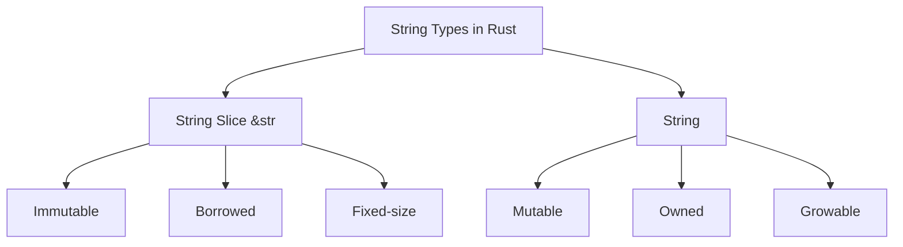

# Rust String Manipulation

## Introduction

Strings are a fundamental part of almost every program. In Rust, string handling is both powerful and different from many other programming languages. Rust offers two main string types: the primitive `&str` (string slice) and the more complex `String` type from the standard library. Understanding how to work with both effectively is essential for Rust programming.

This guide will walk you through string creation, manipulation, and common operations in Rust, with practical examples to reinforce your learning.

## String Types in Rust

Rust has two primary string types:

1. **String Slices (`&str`)**: Immutable, fixed-length string references that point to UTF-8 encoded string data stored elsewhere
2. **String (`String`)**: A growable, mutable, owned UTF-8 encoded string type

Let's visualize the relationship between these types:



## Creating Strings

### String Literals and String Slices

String literals in Rust are of type `&str`:

```rust
// Creating a string slice using a string literal
let greeting: &str = "Hello, Rust!";
println!("{}", greeting);

// Output: Hello, Rust!
```

### Creating a String

To create a `String`, you have several options:

```rust
// Creating an empty String
let empty_string = String::new();
println!("Empty string: '{}'", empty_string);

// Converting from a string literal using from()
let from_literal = String::from("Hello, from string literal!");
println!("{}", from_literal);

// Using to_string() method
let to_string_example = "Converting to String".to_string();
println!("{}", to_string_example);

// Output:
// Empty string: ''
// Hello, from string literal!
// Converting to String
```

## Basic String Operations

### String Length

```rust
let text = "Rust programming";
println!("Length of '{}': {} characters", text, text.len());

let text_string = String::from("Rust programming");
println!("Length of '{}': {} characters", text_string, text_string.len());

// Output:
// Length of 'Rust programming': 16 characters
// Length of 'Rust programming': 16 characters
```

Note: `len()` returns the number of bytes, not characters. For UTF-8 strings with non-ASCII characters, this distinction matters:

```rust
let unicode_string = "こんにちは"; // Japanese "Hello"
println!("'{}' has {} bytes but {} characters", 
    unicode_string, 
    unicode_string.len(),
    unicode_string.chars().count());

// Output: 'こんにちは' has 15 bytes but 5 characters
```

### String Concatenation

Rust provides several ways to concatenate strings:

```rust
// Using + operator (requires String on the left, &str on the right)
let s1 = String::from("Hello, ");
let s2 = "world!";
let s3 = s1 + s2;  // Note: s1 is moved here and can't be used anymore
println!("{}", s3);

// Using format! macro (doesn't take ownership)
let s1 = String::from("Hello");
let s2 = String::from("Rust");
let s3 = format!("{}, {}!", s1, s2);
println!("{}", s3);
// s1 and s2 are still valid here

// Output:
// Hello, world!
// Hello, Rust!
```

## String Modification

### Pushing to Strings

You can add characters or strings to existing `String` objects:

```rust
// Push a single character
let mut s = String::from("Rust ");
s.push('i');
s.push('s');
println!("{}", s);

// Push a string slice
s.push_str(" amazing!");
println!("{}", s);

// Output:
// Rust is
// Rust is amazing!
```

### Replacing Content

```rust
let mut s = String::from("Rust is hard");
let new_s = s.replace("hard", "fun");
println!("Original: {}", s);
println!("Modified: {}", new_s);

// Output:
// Original: Rust is hard
// Modified: Rust is fun
```

## String Slicing and Indexing

Unlike many languages, Rust doesn't allow indexing into strings with syntax like `s[0]`. This is because a character in UTF-8 can be multiple bytes.

However, you can slice strings to get string slices:

```rust
let s = String::from("Hello, world!");
let hello = &s[0..5];
let world = &s[7..12];
println!("{} {}", hello, world);

// Output: Hello world
```

⚠️ **Warning**: Be careful when slicing strings! If you slice in the middle of a UTF-8 character, your program will panic at runtime.

```rust
let s = "こんにちは"; // Japanese "Hello"
// This would cause a panic because we're cutting in the middle of a UTF-8 character
// let oops = &s[0..2];
```

## String Iteration

To safely work with individual characters, use the `chars()` method:

```rust
let text = "Héllo";
println!("Characters in '{}': ", text);
for (i, c) in text.chars().enumerate() {
    println!("Character {} at position {}", c, i);
}

// Output:
// Characters in 'Héllo': 
// Character H at position 0
// Character é at position 1
// Character l at position 2
// Character l at position 3
// Character o at position 4
```

## Common String Methods

Rust provides many useful methods for working with strings:

```rust
let text = String::from("   Rust Programming Language   ");

// Trimming whitespace
let trimmed = text.trim();
println!("Trimmed: '{}'", trimmed);

// Checking if string starts/ends with specific text
println!("Starts with 'Rust': {}", trimmed.starts_with("Rust"));
println!("Ends with 'age': {}", trimmed.ends_with("age"));

// Converting case
println!("Uppercase: {}", trimmed.to_uppercase());
println!("Lowercase: {}", trimmed.to_lowercase());

// Splitting
let parts: Vec<&str> = trimmed.split_whitespace().collect();
println!("Words: {:?}", parts);

// Output:
// Trimmed: 'Rust Programming Language'
// Starts with 'Rust': true
// Ends with 'age': true
// Uppercase: RUST PROGRAMMING LANGUAGE
// Lowercase: rust programming language
// Words: ["Rust", "Programming", "Language"]
```

## Real-World Examples

### Example 1: Processing User Input

```rust
fn main() {
    use std::io;
    
    println!("Enter your name:");
    let mut input = String::new();
    
    io::stdin()
        .read_line(&mut input)
        .expect("Failed to read line");
    
    // Trim the newline character and any whitespace
    let name = input.trim();
    
    let greeting = format!("Hello, {}! Nice to meet you.", name);
    println!("{}", greeting);
}

// Example Output (if user enters "John"):
// Enter your name:
// John
// Hello, John! Nice to meet you.
```

### Example 2: Building a Simple Template System

```rust
fn fill_template(template: &str, values: &[(&str, &str)]) -> String {
    let mut result = template.to_string();
    
    for (key, value) in values {
        let placeholder = format!("{{{}}}", key);
        result = result.replace(&placeholder, value);
    }
    
    result
}

fn main() {
    let template = "Dear {name}, Thank you for your purchase of {product}. Your total is ${amount}.";
    
    let values = [
        ("name", "Alice"),
        ("product", "Rust Programming Book"),
        ("amount", "29.99"),
    ];
    
    let message = fill_template(template, &values);
    println!("{}", message);
}

// Output:
// Dear Alice, Thank you for your purchase of Rust Programming Book. Your total is $29.99.
```

## String Performance Considerations

When working with strings in Rust, keep these performance considerations in mind:

1. **String vs &str**: Use `&str` when you only need to read string data. Use `String` when you need to own or modify the data.

2. **Repeated concatenation**: Avoid repeatedly using the `+` operator in loops, as it creates multiple intermediate strings. Instead, use `format!` or a `String` builder pattern:

```rust
// Inefficient
let mut result = String::new();
for i in 1..5 {
    result = result + &i.to_string();
}

// More efficient
let mut result = String::new();
for i in 1..5 {
    result.push_str(&i.to_string());
}

// Also efficient
let result: String = (1..5).map(|i| i.to_string()).collect();
```

## Summary

In this guide, we've explored Rust's approach to string handling:

- Rust has two main string types: `&str` (string slices) and `String`
- String slices (`&str`) are immutable views into string data
- `String` is a growable, heap-allocated data structure
- Rust ensures memory safety and prevents common string manipulation errors
- String operations include concatenation, modification, and iteration
- Rust's UTF-8 encoding requires special handling for character-based operations

Mastering string manipulation in Rust is crucial for effective programming. The examples provided in this guide should help you understand the basic concepts and apply them in your own Rust programs.

## Exercises

1. Write a function that counts the occurrences of a specific character in a string.
2. Create a program that takes a sentence as input and outputs the same sentence with each word reversed.
3. Implement a simple Caesar cipher encryption and decryption function using Rust's string handling.
4. Write a function that validates whether a string is a palindrome, ignoring spaces and case.

## Additional Resources

- [The Rust Programming Language Book - Chapter on Strings](https://doc.rust-lang.org/book/ch08-02-strings.html)
- [Rust Standard Library Documentation for String](https://doc.rust-lang.org/std/string/struct.String.html)
- [Rust By Example - Strings](https://doc.rust-lang.org/rust-by-example/std/str.html)