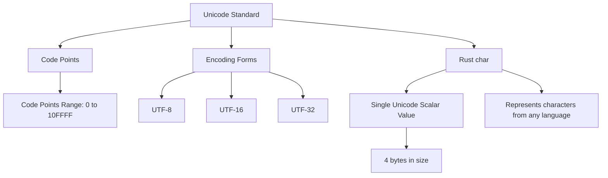

# Rust Char Type

## Introduction

The `char` type is one of Rust's primitive types, but it's also considered part of Rust's compound types due to how it's implemented. Unlike characters in some other programming languages that only support ASCII, Rust's `char` type represents a Unicode Scalar Value, which means it can represent a much wider range of characters from various languages and symbol sets around the world.

In Rust, a `char` is always 4 bytes in size, regardless of which character it represents. This is because a Unicode Scalar Value can be any value between `0x0000` and `0x10FFFF`, which requires 21 bits to represent, so Rust allocates a full 32 bits (4 bytes) for each character.

## Basic Usage

### Declaring Char Variables

In Rust, `char` literals are specified with single quotes (`'`), while string literals use double quotes (`"`).

```rust
fn main() {
    let c1 = 'a';    // lowercase letter
    let c2 = 'A';    // uppercase letter
    let c3 = '1';    // numeric character (not a number!)
    let c4 = '🦀';   // emoji (Rust crab!)
    
    println!("Characters: {}, {}, {}, {}", c1, c2, c3, c4);
}
```

Output:
```
Characters: a, A, 1, 🦀
```

### Char vs String

It's important to understand the difference between a `char` and a `String` or string slice (`&str`). A `char` represents a single Unicode character, while strings are sequences of Unicode characters.

```rust
fn main() {
    let single_char = 'a';      // This is a char
    let string_slice = "a";     // This is a string slice (&str) containing one character
    
    println!("Size of char: {} bytes", std::mem::size_of_val(&single_char));
    println!("Size of &str: {} bytes", std::mem::size_of_val(&string_slice));
}
```

Output:
```
Size of char: 4 bytes
Size of &str: 16 bytes
```

## Working with Chars

### Character Conversion

You can convert between `char` and its numeric Unicode representation:

```rust
fn main() {
    // Convert integer to char
    let char_from_number = char::from_u32(97).unwrap();
    println!("Character from code point 97: {}", char_from_number);
    
    // Convert char to integer
    let code_point = 'a' as u32;
    println!("Code point for 'a': {}", code_point);
    
    // Another way to get the code point
    let unicode_point = 'β' as u32;
    println!("Unicode point for 'β': {} (hex: {:X})", unicode_point, unicode_point);
}
```

Output:
```
Character from code point 97: a
Code point for 'a': 97
Unicode point for 'β': 946 (hex: 3B2)
```

### Checking Character Properties

Rust provides several methods to check properties of characters:

```rust
fn main() {
    let c1 = 'A';
    let c2 = '9';
    let c3 = ' ';
    let c4 = '😊';
    
    println!("'{}' is alphabetic: {}", c1, c1.is_alphabetic());
    println!("'{}' is numeric: {}", c2, c2.is_numeric());
    println!("'{}' is whitespace: {}", c3, c3.is_whitespace());
    println!("'{}' is control character: {}", c3, c3.is_control());
    println!("'{}' is ASCII: {}", c1, c1.is_ascii());
    println!("'{}' is ASCII: {}", c4, c4.is_ascii());
}
```

Output:
```
'A' is alphabetic: true
'9' is numeric: true
' ' is whitespace: true
' ' is control character: false
'A' is ASCII: true
'😊' is ASCII: false
```

### Case Conversion

You can convert characters between uppercase and lowercase:

```rust
fn main() {
    let lowercase = 'a';
    let uppercase = 'A';
    
    println!("'{}' to uppercase: {}", lowercase, lowercase.to_uppercase());
    println!("'{}' to lowercase: {}", uppercase, uppercase.to_lowercase());
    
    // Note: to_uppercase() and to_lowercase() return an iterator as some characters 
    // can expand to multiple characters when changing case
}
```

Output:
```
'a' to uppercase: A
'A' to lowercase: a
```

## Unicode and Rust

Rust's support for Unicode makes it powerful for international applications, but it also introduces some complexity.

### Unicode Concepts Visualization



### Character Width and Display

Different Unicode characters can have different visual widths:

```rust
fn main() {
    let narrow = 'i';
    let wide = '漢';
    let emoji = '🎮';
    
    // Display each character with its Unicode value
    println!("'{}' (U+{:04X})", narrow, narrow as u32);
    println!("'{}' (U+{:04X})", wide, wide as u32);
    println!("'{}' (U+{:04X})", emoji, emoji as u32);
}
```

Output:
```
'i' (U+0069)
'漢' (U+6F22)
'🎮' (U+1F3AE)
```

## Special Characters and Escapes

Rust supports various escape sequences for representing special characters:

```rust
fn main() {
    // Common escape sequences
    let newline = '
';
    let tab = '\t';
    let backslash = '\\';
    let single_quote = '\'';
    
    println!("Newline: {:?}", newline);
    println!("Tab: {:?}", tab);
    println!("Backslash: {}", backslash);
    println!("Single quote: {}", single_quote);
    
    // Unicode escape sequences
    let unicode_escape = '\u{1F980}'; // 🦀 crab emoji
    println!("Unicode escape: {}", unicode_escape);
}
```

Output:
```
Newline: '
'
Tab: '\t'
Backslash: \
Single quote: '
Unicode escape: 🦀
```

## Practical Applications

### Parsing User Input

You can extract individual characters from user input:

```rust
fn main() {
    let input = "Hello, World!";
    
    // Get the first character
    if let Some(first_char) = input.chars().next() {
        println!("First character: {}", first_char);
    }
    
    // Count characters (not bytes!)
    println!("Number of characters: {}", input.chars().count());
    
    // Find a specific character
    if input.chars().any(|c| c == ',') {
        println!("Input contains a comma!");
    }
}
```

Output:
```
First character: H
Number of characters: 13
Input contains a comma!
```

### Building a Simple Character Analyzer

Here's a small utility that analyzes properties of a character:

```rust
fn analyze_char(c: char) {
    println!("Analysis of character '{}':", c);
    println!("  Unicode code point: U+{:04X}", c as u32);
    println!("  Category:");
    println!("    Alphabetic: {}", c.is_alphabetic());
    println!("    Numeric: {}", c.is_numeric());
    println!("    Alphanumeric: {}", c.is_alphanumeric());
    println!("    Whitespace: {}", c.is_whitespace());
    println!("    Control char: {}", c.is_control());
    println!("  ASCII: {}", c.is_ascii());
    
    if c.is_ascii() {
        println!("  ASCII value: {}", c as u8);
    }
}

fn main() {
    analyze_char('A');
    println!("");
    analyze_char('5');
    println!("");
    analyze_char('π');
}
```

Output:
```
Analysis of character 'A':
  Unicode code point: U+0041
  Category:
    Alphabetic: true
    Numeric: false
    Alphanumeric: true
    Whitespace: false
    Control char: false
  ASCII: true
  ASCII value: 65

Analysis of character '5':
  Unicode code point: U+0035
  Category:
    Alphabetic: false
    Numeric: true
    Alphanumeric: true
    Whitespace: false
    Control char: false
  ASCII: true
  ASCII value: 53

Analysis of character 'π':
  Unicode code point: U+03C0
  Category:
    Alphabetic: true
    Numeric: false
    Alphanumeric: true
    Whitespace: false
    Control char: false
  ASCII: false
```

## Summary

The `char` type in Rust is a powerful and flexible way to represent individual Unicode characters. Unlike character types in some other languages, Rust's `char`:

- Is always 4 bytes in size
- Represents a single Unicode scalar value
- Can handle characters from any language, including emojis
- Provides methods for character analysis and manipulation

Understanding how to work with `char` values is essential for text processing in Rust, especially when dealing with international text or when precise character-by-character processing is needed.

## Additional Resources

- [Rust Documentation on the char type](https://doc.rust-lang.org/std/primitive.char.html)
- [Unicode Standard](https://www.unicode.org/standard/standard.html)
- [Rust By Example: Chars section](https://doc.rust-lang.org/rust-by-example/std/char.html)

## Exercises

1. Write a function that counts the number of alphabetic characters in a string.
2. Create a function that converts a string to title case (capitalizing the first letter of each word).
3. Write a program that identifies all non-ASCII characters in a string and prints their Unicode code points.
4. Implement a simple character frequency counter that shows how many times each character appears in a text.
5. Create a function that validates if a string contains only alphanumeric characters and spaces.