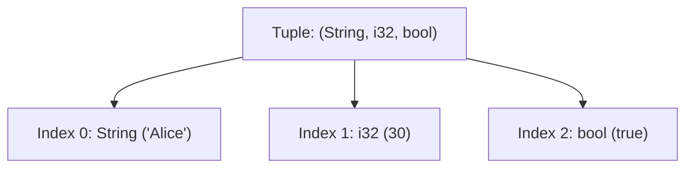

# Rust Tuples

## Introduction

Tuples are one of Rust's compound data types that allow you to group together multiple values with potentially different types into a single unit. Unlike arrays (which require all elements to be of the same type), tuples can store elements of various types, making them incredibly versatile for passing around related pieces of data.

In this tutorial, you'll learn how to create tuples, access their elements, and use them effectively in your Rust programs.

## What are Tuples?

A tuple is a fixed-length collection that can hold values of different types. Once declared, tuples have a fixed size and cannot grow or shrink. They are particularly useful when you want to return multiple values from a function or group related data together.

Think of tuples as a way to pack multiple pieces of information into a single package.

## Creating Tuples

You can create a tuple by writing a comma-separated list of values inside parentheses:

```rust
// A tuple with three elements of different types
let person: (String, i32, bool) = (String::from("Alice"), 30, true);

// Type annotations are optional - Rust can infer the types
let coordinates = (10.5, 20.7);

// A tuple can also be empty (called a unit tuple)
let empty = ();
```

The empty tuple `()` is known as the "unit type" in Rust and represents an empty value or a void return type. Functions that don't explicitly return a value automatically return the unit type.

## Accessing Tuple Elements

There are two primary ways to access tuple elements:

### 1. Using Index Notation

You can access individual elements of a tuple using a period (`.`) followed by the index of the element you want to access:

```rust
fn main() {
    let person = ("Bob", 25, true);
    
    println!("Name: {}", person.0);
    println!("Age: {}", person.1);
    println!("Employed: {}", person.2);
}
```

Output:
```
Name: Bob
Age: 25
Employed: true
```

Note that tuple indexing is zero-based, meaning the first element is at index 0.

### 2. Using Destructuring

You can also "destructure" a tuple into separate variables:

```rust
fn main() {
    let coordinates = (10.5, 20.7);
    
    // Destructuring the tuple into individual variables
    let (x, y) = coordinates;
    
    println!("X coordinate: {}", x);
    println!("Y coordinate: {}", y);
}
```

Output:
```
X coordinate: 10.5
Y coordinate: 20.7
```

Destructuring is particularly useful when you want to extract specific elements from a tuple without having to reference the entire tuple each time.

## Tuple Type Annotations

When you want to specify the type of a tuple, you list the types of each element inside parentheses:

```rust
// Explicitly typed tuple
let student: (String, i32, f64) = (String::from("Charlie"), 22, 3.8);
```

## Nested Tuples

Tuples can contain other tuples as elements:

```rust
fn main() {
    // A tuple containing another tuple
    let complex_data = ("Coordinates", (10.5, 20.7, 30.2));
    
    println!("Label: {}", complex_data.0);
    println!("X: {}", complex_data.1.0);
    println!("Y: {}", complex_data.1.1);
    println!("Z: {}", complex_data.1.2);
}
```

Output:
```
Label: Coordinates
X: 10.5
Y: 20.7
Z: 30.2
```

## Practical Examples

Let's explore some practical applications of tuples in Rust:

### Example 1: Returning Multiple Values from a Function

Tuples allow functions to return multiple values conveniently:

```rust
fn calculate_statistics(numbers: &[i32]) -> (i32, i32, f64) {
    let min = *numbers.iter().min().unwrap_or(&0);
    let max = *numbers.iter().max().unwrap_or(&0);
    
    let sum: i32 = numbers.iter().sum();
    let average = if numbers.len() > 0 {
        sum as f64 / numbers.len() as f64
    } else {
        0.0
    };
    
    (min, max, average)
}

fn main() {
    let data = [42, 17, 8, 99, 33, 24];
    
    let (min_value, max_value, avg) = calculate_statistics(&data);
    
    println!("Minimum: {}", min_value);
    println!("Maximum: {}", max_value);
    println!("Average: {:.2}", avg);
}
```

Output:
```
Minimum: 8
Maximum: 99
Average: 37.17
```

### Example 2: Representing a Point in 2D Space

Tuples are perfect for representing coordinates:

```rust
fn distance_from_origin(point: (f64, f64)) -> f64 {
    let (x, y) = point;
    (x.powi(2) + y.powi(2)).sqrt()
}

fn main() {
    let points = [(3.0, 4.0), (5.0, 12.0), (8.0, 15.0)];
    
    for (index, point) in points.iter().enumerate() {
        let distance = distance_from_origin(*point);
        println!("Point {} at {:?} is {:.2} units from origin", 
                 index + 1, point, distance);
    }
}
```

Output:
```
Point 1 at (3.0, 4.0) is 5.00 units from origin
Point 2 at (5.0, 12.0) is 13.00 units from origin
Point 3 at (8.0, 15.0) is 17.00 units from origin
```

### Example 3: Storing Configuration Settings

Tuples can store related configuration settings:

```rust
fn create_database_connection(config: (String, u16, String, String)) -> String {
    let (host, port, username, database) = config;
    format!("Connected to {} on {}:{} with user {}", 
            database, host, port, username)
}

fn main() {
    let dev_config = (
        String::from("localhost"), 
        5432, 
        String::from("dev_user"), 
        String::from("development_db")
    );
    
    let prod_config = (
        String::from("db.example.com"), 
        5432, 
        String::from("prod_user"), 
        String::from("production_db")
    );
    
    // Using the development configuration
    let connection_string = create_database_connection(dev_config);
    println!("{}", connection_string);
}
```

Output:
```
Connected to development_db on localhost:5432 with user dev_user
```

## Tuple Size Limitations

It's worth noting that tuples have a practical size limit in Rust. While the language doesn't impose a specific limit, the standard library implements traits like `Debug`, `Clone`, etc., for tuples with up to 12 elements. For larger collections, you should consider using structs, arrays, or other data structures.

## Comparing Tuples

Tuples can be compared if all their elements can be compared:

```rust
fn main() {
    let tuple1 = (1, "hello", true);
    let tuple2 = (1, "hello", true);
    let tuple3 = (2, "hello", true);
    
    println!("tuple1 == tuple2: {}", tuple1 == tuple2);
    println!("tuple1 == tuple3: {}", tuple1 == tuple3);
    
    // Tuples are compared lexicographically (element by element)
    let a = (1, 2, 3);
    let b = (1, 3, 0);
    println!("a < b: {}", a < b);  // true because 1 == 1, but 2 < 3
}
```

Output:
```
tuple1 == tuple2: true
tuple1 == tuple3: false
a < b: true
```

## Visualizing Tuples

Let's visualize how tuples store different types:



## Summary

Tuples in Rust are a powerful and flexible way to group related data of different types into a single unit. Key points to remember:

- Tuples have a fixed length and can hold elements of different types
- You can access tuple elements using dot notation (`tuple.0`) or destructuring
- Tuples are useful for returning multiple values from functions
- You can nest tuples inside other tuples for more complex data structures
- Practical usage includes representing coordinates, configurations, and returning multiple values

Tuples are one of the fundamental building blocks for creating more complex data structures in Rust. While they're simpler than structs, they provide a quick and convenient way to group related values together.

## Exercises

1. Write a function that takes a list of numbers and returns both the sum and product in a tuple.
2. Create a function that converts RGB color values (0-255 for each component) to HSV using tuples for both input and output.
3. Implement a simple address book entry that uses a tuple to store a name, phone number, and email address.
4. Write a function that splits a name into first name and last name, returning them as a tuple.
5. Create a function that returns a tuple containing the minimum, maximum, and median values from a vector of integers.

## Additional Resources

- [The Rust Programming Language Book: Tuple Section](https://doc.rust-lang.org/book/ch03-02-data-types.html#the-tuple-type)
- [Rust By Example: Tuples](https://doc.rust-lang.org/rust-by-example/primitives/tuples.html)
- [Rust Standard Library Documentation](https://doc.rust-lang.org/std/primitive.tuple.html)